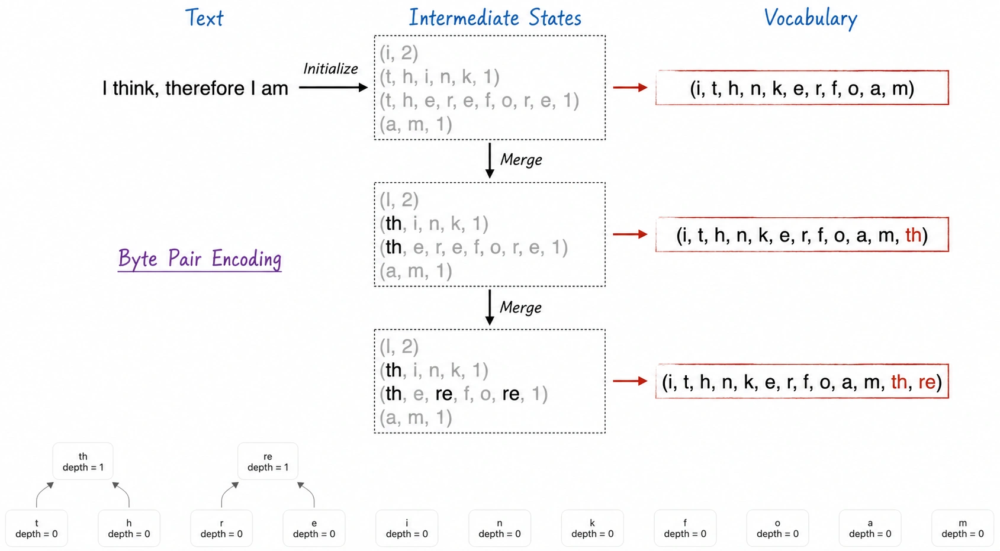
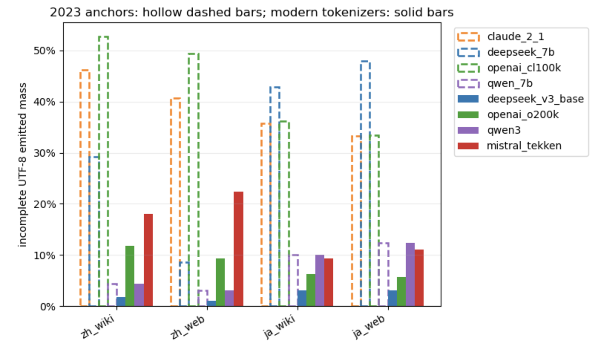
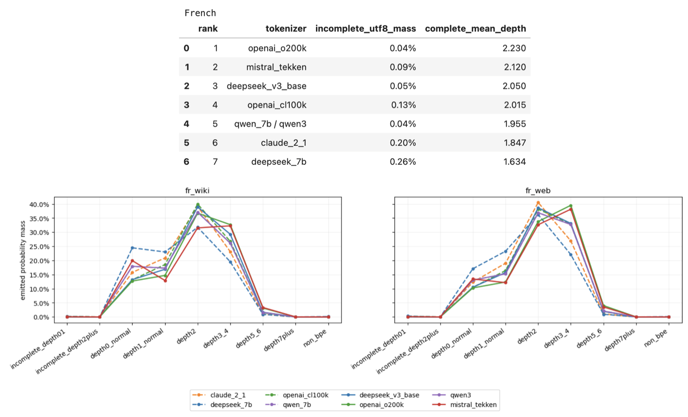
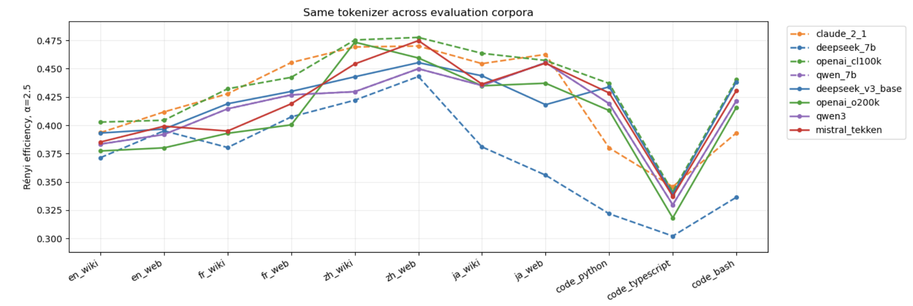

# The Underestimated Foundation of LLMs: Rethinking Tokenizers

> **Key Takeaways / TL;DR**
>
> **Question**: Without training a language model, can tokenization results alone reveal structural defects such as within-character byte fragments and excessive fallback?
>
> **Method**: We combine token-level UTF-8 validity with BPE merge-tree depth, using `incomplete UTF-8 mass`, a completeness-aware depth distribution, and `complete mean depth` to compare five tokenizer families across four natural languages and three programming languages.
>
> **Conclusion**: BPE-structure metrics expose fragmentation missed by compression and Rényi efficiency. Newer tokenizers substantially improve CJK coverage, but tokenization efficiency does not directly predict model capability.
>
> Companion resource: [Complete Notebook (code, data processing, and experimental results)](https://github.com/GenTang/GenTang.github.io/blob/main/content/en/blog/tokenization/code/compare_tokenizer_generations.ipynb)

## What Is a Tokenizer?

To a user, a large language model appears to do something simple: take in text and return text. Underneath that interface, however, several engineering components work together. Before the model can process an input, a tokenizer splits the text into tokens and maps each token to a numeric ID—its position in the vocabulary. At every generation step, the model predicts a probability distribution over that vocabulary for the next token.

Tokens are therefore the basic units through which a model reads and writes the world, and the tokenizer can materially affect model behavior. Consider an extreme example. Suppose a vocabulary contains only three tokens: `我想` (“I want”), `想要` (“want”), and `你` (“you”). The model can produce `你想要` (“you want”), but it cannot produce `我想要` (“I want”) exactly from those units.

A more concrete example is decimal comparison. GPT-4-era models often struggled with questions such as “Which is larger, 9.11 or 9.8?” One factor that can make this task harder is irregular number segmentation—for example, splitting 9.11 into `9` + `.` + `11`, but 9.8 into `9` + `.` + `8`. Such representations can encourage the wrong shortcut: because 11 is greater than 8, the model may incorrectly conclude that 9.11 is greater than 9.8. A tokenizer may look like a minor implementation detail, but it can shape the representation on which the model must reason.

There is also a direct economic consequence. Most commercial LLM APIs charge by token count. The number of tokens produced from a piece of text therefore affects not only sequence length and compute, but also the user's bill.

### BPE as a Merge Tree

Byte Pair Encoding (BPE) remains one of the most widely used tokenization schemes. It follows a greedy procedure: repeatedly identify a frequent adjacent pair and merge it into a new token, progressively building a vocabulary that compresses the training corpus more effectively. Figure 1 illustrates the process.

The leaves near the bottom of the resulting tree do not necessarily carry useful semantics on their own. Their primary role is coverage: when the tokenizer encounters a rare or unseen expression, it can decompose that expression into smaller units rather than producing an out-of-vocabulary error.

The figure is deliberately simplified. In production byte-level BPE systems, the base vocabulary is not just a set of letters. It contains all 256 possible byte values. Alongside letters and digits, it therefore includes many unreadable byte units and partial character sequences. From a linguistic perspective, these units have no standalone meaning; they are artifacts of representing natural language through a byte-oriented storage system.

## A Necessary Leap of Faith

From first principles, what we ultimately want from an LLM is simple to state: intelligence comparable to that of a human, with the ability to solve a broad range of difficult tasks. The world is too complex, however, for us to define a single measurable objective called “intelligence” and optimize it directly.

Instead, decoder-only language models use next-token cross-entropy loss as a proxy objective. There is no theorem guaranteeing that every reduction in cross-entropy must improve every downstream capability. The field nevertheless chose to trust this proxy—and the success of modern LLMs has provided strong empirical support for that choice.

Tokenizers involve a similar leap of faith.

We do not have a complete theory proving that an intrinsically better tokenizer must raise a model's capability ceiling. Nor do we have a single metric that captures everything we intuitively want: equitable multilingual coverage, linguistically sensible boundaries, efficient representations, and robust behavior across domains within the same language. In practice, tokenizer quality must be examined through several partial, empirical measures.

## Evaluation Metrics

No single metric can fully determine tokenizer quality. This article evaluates tokenizers from three complementary perspectives: **compression**, **frequency distribution**, and **BPE structure**.

| Dimension | Metric | Purpose and interpretation |
| --- | --- | --- |
| **Compression** | `tokens_per_1000_bytes` | Number of tokens required to process 1,000 input bytes. Lower values mean shorter sequences and usually lower compute and API cost. |
| **Frequency distribution** | `shannon_model_efficiency` | Shannon entropy of the emitted-token distribution, normalized by vocabulary size. A higher value means usage is more dispersed across the vocabulary, but does not automatically imply better model performance. |
| **Frequency distribution** | `renyi_model_efficiency` | Normalized Rényi entropy, which places more emphasis on high-frequency head tokens than Shannon entropy. It diagnoses excessive probability concentration; it is not a complete tokenizer-quality score. |
| **BPE structure** | `incomplete_utf8_mass` | Probability mass of emitted tokens whose byte sequences cannot independently decode as valid UTF-8. Higher values indicate that token boundaries more often fall inside multibyte characters and that the tokenizer relies more heavily on byte-level fallback. |
| **BPE structure** | `completeness-aware depth distribution` | Tokens are first separated by UTF-8 completeness, after which complete tokens are grouped into BPE depths `0`, `1`, `2`, `3–4`, `5–6`, and `7+`. The distribution describes where emitted tokens originate in the merge tree; greater depth is not inherently better. |
| **BPE structure** | `complete_mean_depth` | Frequency-weighted mean BPE depth computed only over UTF-8-complete BPE tokens. It measures how much merge structure is used by the portion of the output that forms complete text units. |

Compression and token-frequency statistics have been studied extensively. The focus here is the joint treatment of UTF-8 completeness and BPE depth. An ASCII letter, digit, or punctuation mark at `depth=0` is not automatically a failure. A much stronger fallback signal is a shallow token that cannot independently form a valid UTF-8 character.

All of these are intrinsic metrics: they can be computed without training a language model. They can expose defects in compression, vocabulary coverage, and merge structure, but they cannot replace downstream evaluation or prove that a tokenizer will improve model capability.

### Why BPE Structure Matters

The structural metrics are motivated by two concerns:

1. **Overfragmentation in alphabetic languages**: If most emitted tokens in a Latin-script language remain near the bottom of the merge tree, the tokenizer is operating at an unusually fine granularity—for example, repeatedly decomposing words into short letter sequences. This can weaken the semantic coherence of the representation.
2. **Meaningless fragments in CJK text**: The problem is more severe for multibyte CJK characters. A common Chinese character usually occupies three bytes in UTF-8. If the tokenizer repeatedly emits shallow, incomplete tokens, it is exposing byte fragments rather than complete characters. Those fragments have several costs:
	* **No standalone semantics**: A partial UTF-8 sequence has no independent linguistic meaning.
	* **Longer sequences**: Fragmentation increases token count, inference cost, and attention overhead.
	* **Additional modeling burden**: The model must learn to reassemble highly constrained byte sequences before it can reason about the underlying text.

The experiments below therefore place particular emphasis on BPE structure. When conventional metrics are otherwise similar, UTF-8 completeness and merge-tree depth provide additional evidence about how well a tokenizer represents the input and where its vocabulary may need improvement.

## Experimental Setup and Results

The natural-language evaluation forms an eight-case grid: four languages by two corpus sources.

The languages are English, French, Chinese, and Japanese. English and French use the Latin script, while Chinese and Japanese provide two contrasting CJK writing systems. Comparing across scripts exposes broad allocation preferences in a shared tokenizer; comparing languages within the same script family reveals more subtle differences.

Each language is evaluated on both general Web text and Wikipedia. Web data is a rough proxy for broad, heterogeneous usage and varies widely in quality, while Wikipedia is more structured and closer to edited expository prose. The comparison tests how sensitive a tokenizer is to domain and style within the same language.

We also add Python, TypeScript, and Bash as three separate code cases, measuring tokenizer compression and structure on programming-language data.

### Tokenizers Evaluated

We compare several generations of DeepSeek tokenizers with external references from Anthropic, OpenAI, Qwen, and Mistral. Their file formats and implementations differ, but all tokenizers included in the structural comparison are byte-based BPE systems whose merge trees can be reconstructed in a common coordinate system.

Anthropic no longer publishes the complete tokenizer used by its latest Claude models. We therefore use the public tokenizer released around the Claude 2.1 era in 2023. The experiments show clear weaknesses in multilingual compression and CJK byte fallback for this older tokenizer, but those results should not be extrapolated to current Claude models. Public information is insufficient to determine whether, or how, the latest tokenizer has changed.

| Tokenizer | Regular-text vocabulary | Positioning and notes |
|---|---:|---|
| Claude 2.1 | 64,995 | Public Anthropic tokenizer used as a 2023-era reference. |
| DeepSeek 7B / V2-Lite | 100,000 | DeepSeek's earlier 100K vocabulary. The two models have the same regular-text vocabulary, pre-tokenization rules, and outputs. |
| OpenAI `cl100k_base` | 100,256 | Tokenizer associated with the GPT-4 and GPT-4 Turbo era; used as OpenAI's 2023 reference. |
| Qwen-7B / Qwen3 | 151,643 | Qwen's large byte-level BPE vocabulary. The regular tokens and their IDs are identical across the two generations; changes are confined mainly to special tokens and messaging protocols. |
| DeepSeek V3-Base / V3.2 / V4-Flash-Base | 127,997 | DeepSeek's newer, roughly 128K vocabulary. All three models tokenize regular text identically; later releases mainly extend special tokens. |
| OpenAI `o200k_base` | 199,998 | The roughly 200K tokenizer introduced in the GPT-4o era, used here as a modern OpenAI reference. |
| Mistral Tekken | 130,072 | Multilingual and code tokenizer used by Mistral Nemo; included as a modern large-vocabulary reference. |

“Regular-text vocabulary” counts only tokens that participate in BPE encoding. It excludes special tokens, control tokens, and unused or padded embedding rows.

The results are examined from two angles.

First, the longitudinal comparison tracks how a tokenizer family changes over time and which languages or domains benefit most.

Second, the cross-sectional comparison evaluates compression, UTF-8 fallback, BPE depth, and frequency distributions on identical test corpora. Here, “better” refers only to better intrinsic tokenization metrics, not necessarily a more capable language model.

### Generational Progress Is Most Visible in CJK

Tokenizer progress since 2023 has been uneven. DeepSeek and OpenAI provide the clearest examples of genuine vocabulary changes. Qwen3 retains the same regular BPE vocabulary as Qwen-7B, while DeepSeek V3.2 and V4-Flash continue to use the V3 regular-text tokenizer.

DeepSeek shows the largest shift. On Chinese Web text, DeepSeek 7B emits 282 tokens per 1,000 bytes; on Chinese Wikipedia, that rises to 369. DeepSeek V3 reduces the corresponding figures to 244 and 265, as shown in Figure 2.

Figure 3 shows the same change structurally. DeepSeek 7B has an `incomplete UTF-8 mass` of 8.55% on Chinese Web data and 29.24% on Chinese Wikipedia. The tokenizer had clearly been optimized for Chinese, but its coverage was uneven across corpora, and many Wikipedia characters still fell back to byte fragments. DeepSeek V3 lowers those values to 1.08% and 1.78%. The Wiki/Web gap narrows substantially, while the mean depth of complete tokens rises, indicating that more Chinese characters and expressions are represented through complete BPE merges.

The improvement is even larger in Japanese. DeepSeek 7B averages 445 tokens per 1,000 bytes with an incomplete mass of 45.4%; V3 improves those figures to 267 and 3.1%, respectively. The update was therefore not merely a general compression improvement. It substantially expanded CJK coverage and reduced within-character byte fallback.

OpenAI exhibits a similar pattern in the transition from `cl100k_base` to `o200k_base`:

- Chinese compression improves from an average of 464 to 315 tokens per 1,000 bytes, while incomplete mass falls from 51.1% to 10.6%.
- Japanese compression improves from 390 to 284, while incomplete mass falls from 34.8% to 6.0%.
- English compression improves by only about 1–2%.

These results suggest that much of the additional capacity in `o200k_base` was allocated to non-English text rather than to further optimizing already mature English tokenization.

### Modern Tokenizers Still Have Distinct Language Preferences

Across tokenizers, English remains the most mature case: compression is consistently strong and incomplete UTF-8 mass is effectively zero. French generally requires more tokens than English, but character-internal fallback is still rare; the main differences arise from how well tokenizers merge words and affixes.

The strongest tokenizer varies by language:

- `o200k_base` has the best compression on English and French.
- Mistral Tekken performs strongly on French, though it remains slightly behind `o200k_base`.
- DeepSeek V3 has the strongest overall results on Chinese and Japanese.
- Qwen remains among the leading CJK tokenizers, even though its regular BPE vocabulary did not change from Qwen-7B to Qwen3.
- Claude 2.1 and `cl100k_base` still rely heavily on byte fallback for Chinese and Japanese.

Figure 4 summarizes the results on Chinese.

DeepSeek V3 emits the fewest tokens, produces the fewest within-character fragments, and has the highest mean depth among complete tokens. All three metrics point in the same direction: its vocabulary provides more effective coverage of Chinese.

Figure 5 shows the corresponding results on French.

The results also reflect product priorities and training-data choices. DeepSeek and Qwen are particularly strong on Chinese, while Mistral Tekken performs well on French.

### Rényi Is Not Broken, but It Cannot Evaluate Token Quality by Itself

Claude 2.1 reaches a Chinese Rényi efficiency of about 0.470, higher than DeepSeek V3's 0.449. Yet Claude requires an average of 436 tokens per 1,000 bytes and has an incomplete UTF-8 mass of 43.44%; DeepSeek V3 requires only 254 tokens and has an incomplete mass of 1.43%.

The pattern is even clearer for `cl100k_base`: it has one of the highest Chinese Rényi-efficiency scores in the comparison while also producing the weakest Chinese compression and UTF-8 completeness.

The Rényi calculation is not wrong. It simply answers a narrower question: how evenly is probability distributed across emitted tokens? A large collection of byte fragments can also have a balanced frequency distribution. High Rényi efficiency therefore does not imply linguistically or structurally sound tokens.

> Rényi efficiency can diagnose excessive concentration in the token-frequency distribution, but it cannot determine whether the tokens themselves are well formed.

It must be interpreted alongside compression, `incomplete UTF-8 mass`, and structural measures such as `complete mean depth`.

### Code: Tokenization Efficiency and Model Capability Do Not Fully Align

On the three programming languages, OpenAI and Qwen provide the best overall compression. DeepSeek V3, Mistral Tekken, and Claude 2.1 form a second cluster, while DeepSeek 7B trails clearly behind.

| Tokenizer | Python | TypeScript | Bash | Three-language average |
|---|---:|---:|---:|---:|
| OpenAI o200k | 239 | 232 | 298 | 256 |
| OpenAI cl100k | 238 | 238 | 295 | 257 |
| Qwen | 243 | 239 | 301 | 261 |
| Mistral Tekken | 259 | 247 | 325 | 277 |
| DeepSeek V3 | 258 | 253 | 323 | 278 |
| Claude 2.1 | 266 | 254 | 330 | 283 |
| DeepSeek 7B | 303 | 281 | 350 | 311 |

All values are tokens per 1,000 bytes; lower is better.

DeepSeek's generational improvement is unambiguous. Relative to DeepSeek 7B, V3 reduces token count by:

- 14.8% on Python;
- 9.9% on TypeScript;
- 7.8% on Bash.

TypeScript `incomplete UTF-8 mass` also falls from 1.06% to 0.13%.

The updated DeepSeek V3 tokenizer is now in the same range as Claude 2.1.

One pattern is shared by every tokenizer: Bash compresses substantially worse than Python or TypeScript. Bash contains many short commands, flags, paths, environment variables, and dense symbol combinations, all of which are awkward for a general-purpose BPE vocabulary trained primarily on natural language and conventional source code. Bash is therefore not a DeepSeek-specific weakness; it is an undercovered domain for general-purpose tokenizers as a whole.

### How Can Tokenizers Improve?

For DeepSeek, code—especially Bash—is the clearest remaining opportunity. Qwen was well ahead of many peers in 2023, but that lead has narrowed because its regular BPE vocabulary has remained unchanged.

High-frequency tokens also expose problems in the evaluation corpus itself. In the Chinese Web data, gambling-related tokens such as `赌` (“bet/gamble”), `澳门` (“Macau”), `赌博` (“gambling”), `真人` (often “live dealer” in gambling copy), and `彩票` (“lottery”) appear unusually often. For DeepSeek V3, `赌`, `澳门`, and `赌博` rank 132nd, 222nd, and 507th by output frequency; on Chinese Wikipedia, they fall to 11,480th, 9,397th, and 28,394th. Qwen and other tokenizers show the same thematic concentration.

No single word proves that a corpus is low quality—“Macau” and “lottery,” for example, also occur in legitimate text. But when an entire cluster of gambling terms moves into the high-frequency head, the Chinese Web sample likely contains substantial amounts of gambling advertising, SEO content, or spam. If similar content is overrepresented in tokenizer training data, BPE may allocate too many merges and vocabulary slots to gambling, advertising, and repeated templates at the expense of other languages, technical domains, and code. Improving a tokenizer should therefore begin with better data composition and cleaning, not simply a larger vocabulary.

More promising directions include:

1. Strengthen corpus cleaning and manual sampling to filter gambling ads, SEO spam, duplicated templates, corrupted text, and anomalous formatting.
2. At a fixed vocabulary size, rebalance languages, domains, and programming languages so that highly repetitive content cannot dominate BPE merge learning.
3. Compare high-frequency tokens and rank shifts between Wiki and Web data to identify anomalous topic clusters rather than relying only on aggregate metrics.
4. Identify high-frequency fallback fragments and reallocate vocabulary capacity toward undercovered languages or domains.
5. Analyze scaffold tokens with low emitted usage but high internal usage, distinguishing genuinely wasted vocabulary slots from intermediate nodes required by many higher-level tokens.
6. Use compression, UTF-8 completeness, and depth metrics to shortlist tokenizer candidates, then select among them with small-language-model training or downstream evaluation.
