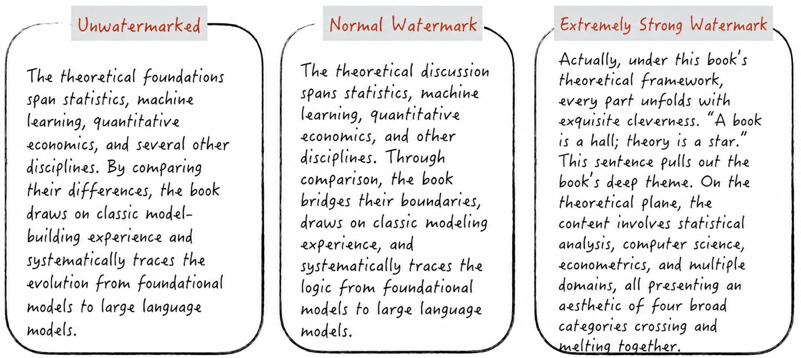
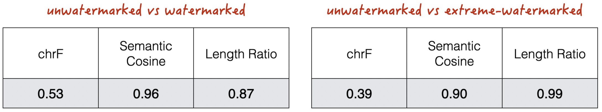
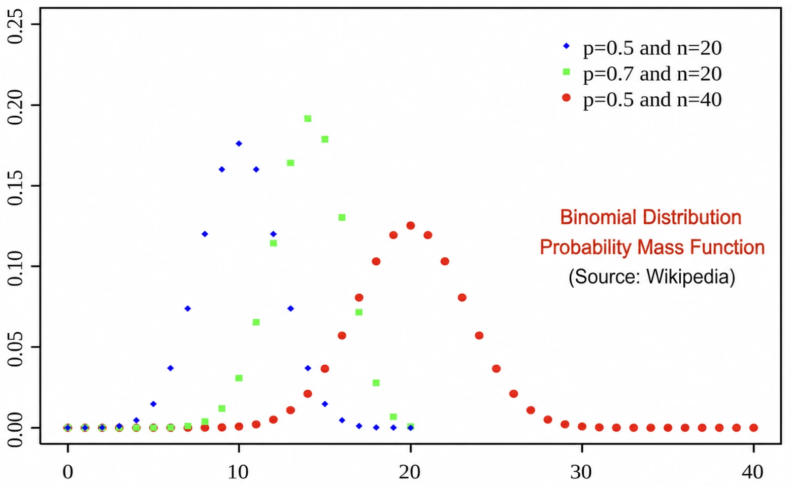
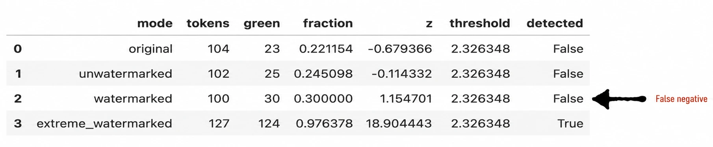
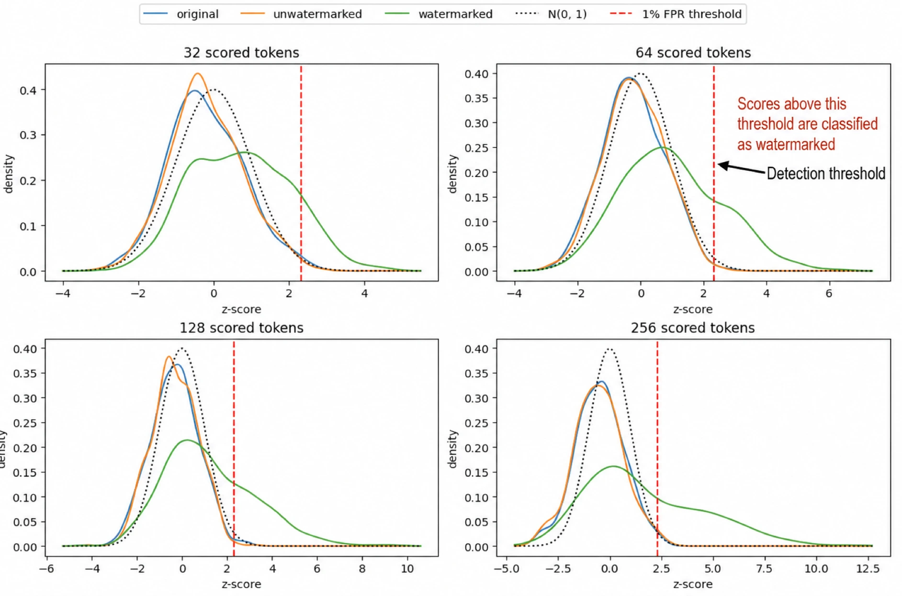
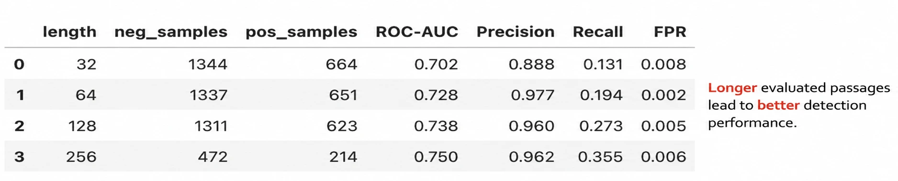

# Anthropic Is Adding Watermarks to Text Part 1: The Foundational Work—KGW

> **Key Takeaways / TL;DR**
>
> **Question:** How does KGW embed a watermark without noticeably altering meaning, and why can a z-score detect it?
>
> **Method:** Implement KGW from scratch and compare unwatermarked, normally watermarked, and aggressively watermarked outputs from a DeepSeek model.
>
> **Conclusion:** At a normal strength, the watermark has limited impact on semantics; longer text carries more watermark evidence and yields better detection performance.
>
> Resources: [Complete Notebook (code, data, and experimental results)](https://github.com/GenTang/GenTang.github.io/blob/main/content/en/blog/watermarking_on_aigc/code/kgw_from_scratch.ipynb)

## The Trigger: Anthropic Introduces Text Watermarking

[Anthropic recently announced that it will introduce invisible text watermarks](https://www.anthropic.com/news/claude-text-watermark) into the outputs of its AI models in response to European regulatory requirements. The goal is to provide a reliable way to trace and detect AI-generated content (AIGC) without disrupting the reading experience.

Digital watermarking has long been used for images, audio, and video. In an image, for example, a modern invisible watermark embeds a weak signal—too subtle for the human eye to notice—across a large number of pixels. This works for two main reasons:

1. Image pixels are sufficiently dense and small that perturbing an individual pixel falls below the threshold of human visual perception.
2. A detector can still measure those perturbations and recover the watermark signal.

Text, however, is fundamentally different. Written language is a highly discrete symbolic system: people read and interpret every word. We therefore cannot simply transplant an image-watermarking technique into text. Early text watermarks nevertheless borrowed this idea by inserting zero-width characters between visible characters. The method is simple but extremely fragile. Basic normalization—or copying the text into an environment that strips special characters—can remove the watermark because the signal is not part of the text's linguistic structure.

Modern text-watermarking methods instead operate inside the generation process of a large language model (LLM), directly manipulating the probability distribution over tokens. When the model predicts its next token, the watermarking algorithm subtly biases sampling toward a secret, algorithmically selected subset of the vocabulary, usually called the **green list**. The intent is to preserve meaning and fluency while making the watermark harder to remove or tamper with.

Anthropic has not disclosed the exact technical design of its watermark. The prevailing assumption is that it uses a generation-time probabilistic method of this kind; some reports suggest a design similar to Google DeepMind's SynthID-Text. Two landmark algorithms in this family are:

1. **KGW**, the classic green-list watermark.
2. **Google DeepMind SynthID-Text**.

This article takes KGW apart and rebuilds it from scratch ([Complete Notebook](https://github.com/GenTang/GenTang.github.io/blob/main/content/en/blog/watermarking_on_aigc/code/kgw_from_scratch.ipynb)). A follow-up article will examine how SynthID-Text works.

## How KGW Works

Before diving into KGW's mechanics, let us build some intuition with the example in Figure 1:

1. **Reading quality at a normal watermark strength:** Compared with the unwatermarked output, a moderately watermarked passage conveys nearly the same meaning and reads just as naturally. Only some word choices change.
2. **The cost of an excessively strong watermark:** Just as an overly visible image watermark degrades an image, an excessively large text-watermark bias—as in the rightmost passage—makes the prose awkward and harms readability.



Visual inspection is useful, but it does not scale to large experiments or production systems. We therefore use quantitative metrics to measure how the watermark changes text quality:

- **chrF (character-level similarity):** Measures character n-gram overlap between two passages. A value closer to 1 means that their wording and surface forms are more similar.
- **Semantic Cosine (semantic similarity):** Computes the cosine similarity between semantic embeddings of two passages. A value closer to 1 means that their overall meanings are more similar.
- **Length Ratio (generated-length ratio):** Divides the candidate text's token count by the reference text's token count. A value closer to 1 means that the passages have similar lengths.

Figure 2 reports these metrics for the example above. A normally watermarked output retains almost the same meaning as the unwatermarked output—its Semantic Cosine is close to 1—even though their exact wording differs substantially, as reflected by the lower chrF score. The measurements support the same conclusion as the visual comparison: the semantics are preserved while the surface form changes.



### Algorithm and Implementation

To understand KGW, first recall how an LLM generates text:

1. An LLM has a fixed vocabulary. At each generation step, it selects one token from that vocabulary and appends it to the current context.
2. Given the context, the model assigns every candidate token a score called a logit. A higher logit generally corresponds to a higher sampling probability.

KGW adds two operations after the model computes its original logits:

1. **Partition the vocabulary:** KGW hashes the preceding context and uses the result as a pseudorandom seed. It then divides the vocabulary into a **green list** and a **red list**.
2. **Bias the probabilities:** KGW adds a constant bias to every green-list token. This increases the probability of sampling a green token without directly changing the grammar of the output.

The implementation below maps directly onto these steps:

- Lines `9–11` deterministically construct the green list from the pseudorandom seed.
- Lines `25–28` add the bias to the green-list logits.

#### Listing 1 ([Complete Notebook](https://github.com/GenTang/GenTang.github.io/blob/main/content/en/blog/watermarking_on_aigc/code/kgw_from_scratch.ipynb))

```python
class KGWLogitsProcessor(LogitsProcessor):
    """Apply the KGW green-list bias to model logits."""
    ...

    def greenlist(self, previous_token: int) -> torch.LongTensor:
        """Deterministically return green-list token IDs from the previous token and key."""
        # The embedding and detection sides must generate the same permutation
        # for an identical previous_token and key.
        seed = (self.key * previous_token) % (2**64 - 1)
        generator = torch.Generator(device=self.device).manual_seed(seed)
        return torch.randperm(self.vocab_size, generator=generator, device=self.device)[:self.green_size]


    def __call__(
        self,
        input_ids: torch.LongTensor,
        scores: torch.FloatTensor,
    ) -> torch.FloatTensor:
        """Copy `scores` and add `delta` to each batch item's green-list logits."""
        # input_ids has shape (B, L).
        # scores has shape    (B, V).
        # B is the batch size, L is the sequence length, and V is the vocabulary size.
        # Clone the tensor so other logits processors can still use the original input.
        scores = scores.clone()
        for row in range(input_ids.shape[0]):
            previous_token = int(input_ids[row, -1])
            green_ids = self.greenlist(previous_token)
            scores[row, green_ids] += self.delta
        return scores
```

### Detection

Explaining watermark detection requires a little statistics. The central tool is the [p-value](/books/deconstructing_LLM/chapter-2/2-2#section-2-2-5) used in hypothesis testing.

The basic idea is straightforward: under a null hypothesis, observations should cluster around their expected value, while extreme deviations should be rare. If we observe a sufficiently extreme value, we have evidence against the null hypothesis—in this case, evidence that a watermark has changed the token-selection process.

For KGW, every token in an **unwatermarked** passage has a fixed probability of landing in the green list. If the green-list ratio is 25%, that probability is 0.25. Let a passage contain $n$ scored tokens, of which $x$ are green. Under the unwatermarked null hypothesis, $x$ follows a binomial distribution, as illustrated in Figure 3. We can standardize the count using

$$
Z_{score} = \frac{x - np}{\sqrt{np(1-p)}}
$$

For sufficiently large $n$, this statistic is approximately standard normal.



This gives us a detector: choose a significance threshold and flag a passage when its z-score exceeds that threshold. A minimal implementation follows.

#### Listing 2 ([Complete Notebook](https://github.com/GenTang/GenTang.github.io/blob/main/content/en/blog/watermarking_on_aigc/code/kgw_from_scratch.ipynb))

```python
class KGWDetector:
    """Reconstruct KGW green lists and compute detection statistics."""
    ...

    def __call__(
        self,
        token_ids: list[int] | torch.LongTensor,
    ) -> dict[str, int | float] | None:
        """Return the green count, z-score, and normal/binomial upper-tail probabilities."""
        # Convert to a flat Python list so each position's green list can be reconstructed.
        ids = torch.as_tensor(token_ids, device=self.device).flatten().tolist()
        # Whether the current token is green depends on the token immediately before it.
        green = sum(current in self.greenlist(previous) for previous, current in zip(ids, ids[1:]))
        tokens = len(ids) - CONTEXT_WIDTH
        z = (green - self.gamma * tokens) / math.sqrt(tokens * self.gamma * (1 - self.gamma))
```

KGW detection is therefore a **probabilistic decision**. It inevitably produces both false positives and false negatives. In the example above, all detections are correct. However, real‑world scenarios are not always this ideal.



What determines whether the detector succeeds? The next section studies the most important factors.

## Evaluating the Algorithm

One effect is immediately visible from the KGW algorithm: the larger the green-list bias `delta`, the more the output distribution moves away from the original model distribution, and the easier the watermark becomes to detect. In practice, however, `delta` has limited room to grow. An excessive bias distorts the model's distribution and degrades generation quality.

A second factor is less obvious but just as important: **text length**. KGW detection is a hypothesis test over a binomial count, and the test's statistical power depends on sample size. A longer passage contains more token-level evidence, so detection confidence—and the resulting classification performance—should improve with length.

Because increasing `delta` eventually harms text quality, the rest of this experiment focuses on how text length affects detection.

### Inspecting the Score Distributions

We test the relationship between text length and detection power with the following experiment:

1. **Prepare the data:** Ask the model to paraphrase human-written passages, producing three groups:

   - Human-written originals.
   - AI-generated passages without a watermark.
   - AI-generated passages with a KGW watermark.

2. **Vary the evaluated length:** For every group, take prefixes of several lengths and independently compute a $Z_{score}$ for each prefix.

3. **Observe the negative controls:** In Figure 5, the z-score distributions for human-written and unwatermarked AI text remain relatively stable as the evaluated length changes. Both stay near zero.

4. **Observe the watermarked group:** The watermarked distribution moves to the right as the prefix grows. At short lengths it overlaps substantially with the negative controls, so the decision boundary is ambiguous. With more tokens, the distributions separate and the watermark becomes easier to detect.



### Quantitative Evaluation

We can also treat the detector as a standard **binary classifier** and evaluate it with familiar [classification metrics](/books/deconstructing_LLM/chapter-4/4-3). Here we report **ROC-AUC**, **Precision**, and **Recall** for several text lengths.



## Attacks and Evasion

The analysis above suggests two straightforward ways to weaken or remove this kind of watermark:

1. **Truncate the text:** Watermark detection needs enough tokens to accumulate statistical evidence. Shortening the passage can significantly reduce both significance and detection accuracy.
2. **Rewrite or back-translate the text:**

   - **Model paraphrasing:** Ask an unwatermarked model to rewrite the passage.
   - **Cross-language back-translation:** Translate the passage into another language and then back again—for example, English → Chinese → English. Translation reconstructs vocabulary and syntax, disrupting the watermark signal. This attack still requires a model without the same watermark.

## Conclusion

KGW’s core mechanism is straightforward: during generation, it derives a green list from the context and increases the sampling probability of the tokens on that list. During detection, it reconstructs the same green lists and uses a z-score to determine whether the number of green-token hits is unusually high. Its value lies in connecting watermark embedding and statistical detection through a mechanism that is both interpretable and reproducible.

The experiments also reveal the boundaries of this mechanism. A moderate watermark can leave a detectable statistical signal while largely preserving semantics, but detection performance depends heavily on text length. Increasing the watermark strength makes detection easier, but degrades text quality; paraphrasing, back-translation, and truncation can also weaken the watermark signal.

A more fundamental limitation is that KGW **changes the model’s original token probability distribution**. Consequently, the probabilities of text generated by the watermarked model differ from those of the original model. This distortion may be acceptable in general text-generation scenarios such as conversation and writing, but it can cause serious errors in tasks with strict formatting or logical constraints, including code, mathematical formulas, and JSON.

Researchers are therefore exploring watermarking techniques that **preserve the model’s original output distribution**, often described as distortion-free or unbiased watermarks. This will be the subject of the [next article: **Google DeepMind SynthID-Text**](https://gentang.github.io/en/blog/watermarking_on_aigc_2/).
