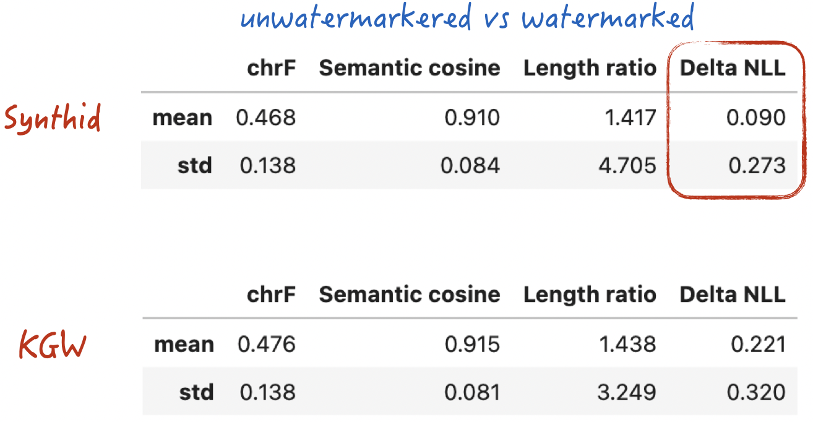
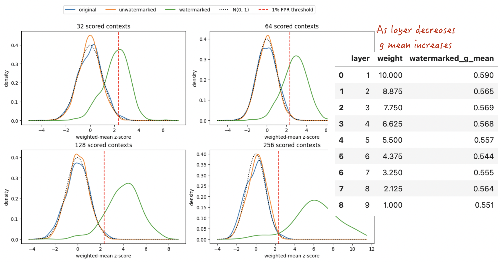

# Anthropic Is Adding Watermarks to Text Part 2: From Biased KGW to Unbiased SynthID-Text

> **Key Takeaways / TL;DR**
>
> **Question**: Why does KGW distort the model's original probability distribution, and how does SynthID-Text achieve single-token non-distortion—that is, remain unbiased in expectation?
>
> **Method**: Starting with a two-token example, we derive the probability transformations behind single- and multi-round Tournaments, implement SynthID-Text and a Weighted Mean detector from scratch, and compare them with KGW using the same data and generation settings.
>
> **Conclusion**: SynthID-Text preserves the model's original distribution in expectation. In our experiments, its generation quality is comparable to KGW while its `Delta NLL` is lower. However, it still follows the same basic statistical-watermarking principle as KGW, so evasion methods such as truncation, translation, and model-based rewriting remain effective.
>
> Companion resource: [Complete Notebook (code, data, and experimental results)](https://github.com/GenTang/GenTang.github.io/blob/main/content/en/blog/watermarking_on_aigc_2/code/synthid_weighted_mean_from_scratch.ipynb)

## What Does It Mean for KGW to Be Biased?

In the [previous article](https://gentang.github.io/en/blog/watermarking_on_aigc/), we used KGW to explain how a watermark can be embedded while a large language model generates text, and how that watermark can later be detected with a statistical test. KGW is one of the most representative text-watermarking algorithms. Its simple mechanism and intuitive detection rule make it an excellent starting point for understanding generative-text watermarks.

Anthropic later disclosed in an [official announcement](https://www.anthropic.com/news/claude-text-watermark) that Claude actually uses **a watermarking scheme based on Google DeepMind's SynthID-Text**, rather than KGW. Both approaches embed a statistical signal during token generation, but they differ in one crucial respect: KGW systematically changes the model's original next-token distribution, whereas SynthID-Text attempts to make those probability perturbations cancel out in expectation while preserving a detectable watermark signal.

### An Intuitive Example

Recall the core mechanism of KGW. Whenever the model generates a token, the algorithm samples a **green list** from the vocabulary. Candidate tokens on the green list receive a probability boost, while candidates outside it are suppressed. A single generation step therefore distorts the probability distribution. Ideally—although KGW does not satisfy this property—we would like the expectation over all possible random green lists to recover the model's original distribution exactly. The following example makes the distinction concrete.

Suppose there are only two candidate tokens, A and B, with the following original probabilities:

- P(A) = 0.9 and P(B) = 0.1.
- **Rule**: Exactly one token is selected as the green token each time, with boost factor $e^\delta=2$.

If A is placed on the green list:

$$
p'(A)=\frac{2\times 0.9}{2\times 0.9+0.1}=\frac{18}{19}\approx 0.9474
$$

If B is placed on the green list:

$$
p'(A)=\frac{0.9}{0.9+2\times 0.1}=\frac{9}{11}\approx 0.8182
$$

Because the two green-list assignments are equally likely, the expected probability of A is

$$
\mathbb{E}[p'(A)]=\frac{0.9474+0.8182}{2}\approx 0.8828
$$

The expected value, 0.8828, is clearly different from the original probability, 0.9. Thus, even after averaging over the random green list, KGW changes the model's original probability distribution: it is a biased algorithm.

### An Unbiased Tournament Example

To obtain an unbiased watermark under the same probability setting, we can use a mechanism called a Tournament to select the final token. This is also the central idea behind non-distortionary watermarking algorithms such as SynthID-Text.

**The rules are as follows:**

1. **Assign scores**: Before the Tournament begins, independently assign each token a random score of 0 or 1. This is the watermark signal $g$.
2. **Tournament sampling**: Independently sample two tokens from the model's original probability distribution; the same token may be sampled twice. The token with the higher score wins and is emitted. If the scores are tied, choose randomly between the two sampled tokens.

Under this mechanism, there are four equally likely score assignments[^1]:

| $g(A)$ | $g(B)$ | Modified $p'(A)$ |
| :---: | :---: | :---: |
| 0 | 0 | 0.90 |
| 1 | 1 | 0.90 |
| 1 | 0 | 0.99 |
| 0 | 1 | 0.81 |

Taking the expectation over all four cases gives

$$
\mathbb{E}[p'(A)]=\frac{0.90+0.90+0.99+0.81}{4}=0.90
$$

The expected probability of A is now exactly its original probability, 0.9. The paper calls this property **single-token non-distortion**; informally, the algorithm is unbiased in expectation. Although each generation step still changes the distribution to embed a watermark, averaging over the watermark randomness recovers the model's original next-token distribution.

### Comparing the Watermark Signal Strengths

As discussed for KGW, the central mathematical tool used for detection is **hypothesis testing**. The intuition is straightforward. In naturally generated, unwatermarked text, a token lands on the green list with a fixed probability—typically 25% under the standard setting. In watermarked text, that probability deviates significantly from the baseline. The larger the deviation, the more confidently we can decide that the text contains a watermark.

Exactly the same logic applies to a Tournament. Without intervention, the generated token receives a high score—that is, watermark signal $g=1$—with a fixed baseline probability, typically 50%. Tournament intervention raises the probability that the emitted token has a high score.

We can therefore define the **watermark signal strength** as the difference between the observed probability after watermarking and the corresponding baseline probability.

The following table compares the signal strengths of the two algorithms under the settings used in our example:

| Detection method | Unwatermarked baseline | Probability after watermarking | Absolute increase (signal strength) |
| :---: | :---: | :---: | :---: |
| **KGW** ($e^\delta=2$) | 50% | 56.46% | **+6.46** percentage points |
| **One-round Tournament** | 50% | 54.50% | **+4.50** percentage points |

The comparison reveals a design trade-off in this two-token example with the specified boost factor: **the one-round Tournament is unbiased in expectation, but its watermark signal is weaker than KGW's**. Additional mechanisms, such as multiple Tournament rounds, can amplify the signal.

## An Introduction to SynthID-Text

With the Tournament mechanism in place, we can now examine SynthID-Text. At its core is multilayer Tournament sampling.

Why extend a single round to multiple rounds? The preceding example provides the intuition: a one-round Tournament is unbiased in expectation, but its watermark signal is relatively weak. SynthID-Text stacks multiple rounds to amplify that signal.

### An Equivalent Probability-Domain Formulation

Before discussing multiple rounds, let us derive an equivalent probability-domain formulation for a single Tournament round.

- Let the vocabulary size be $vs$, with model output distribution

$$
\sum_{i=1}^{vs}p_i=1
$$

- Assign each token a random watermark score, or g-value, distributed as

$$
g_i\sim\operatorname{Bernoulli}\left(\frac{1}{2}\right),
\qquad
\Pr(g_i=1)=\Pr(g_i=0)=\frac{1}{2}
$$

- After one Tournament round, the output-token distribution becomes

$$
\boxed{
p_i'=p_i(1+g_i-q)
}
$$
$$
q=\sum_{j=1}^{vs}p_jg_j
$$

The formula immediately shows that

- if $g_i=1$, the probability multiplier is $2-q\geq 1$, so the probability of token $i$ increases;
- if $g_i=0$, the multiplier is $1-q\leq 1$, so the probability of token $i$ is suppressed.[^2]

The purely mathematical proof is not difficult, but it can feel dry. A more practical and somewhat geekier verification is to implement both the explicit Tournament and its equivalent logits update, then check that the resulting probability distributions match element by element.

#### Listing 1 ([Complete Notebook](https://github.com/GenTang/GenTang.github.io/blob/main/content/en/blog/watermarking_on_aigc_2/code/synthid_weighted_mean_from_scratch.ipynb))

```python
def explicit_tournament(prob, g):
    """Enumerate every candidate pair and compute the exact distribution after one Tournament layer.

    prob: (vs,) probability distribution; g: (vs,) binary scores;
    returns: (vs,) winning-token distribution.
    """
    tokens = torch.arange(prob.numel(), device=prob.device)

    # These three matrix operations vectorize the following nested loops:
    # for first in tokens:
    #     for second in tokens:
    #         output[winner(first, second)] += p(first) * p(second)
    first = tokens[:, None].expand(-1, len(prob))
    second = tokens[None, :].expand(len(prob), -1)
    winner = torch.where(g[first] >= g[second], first, second)  # The first token wins a tie.
    joint_prob = prob[:, None] * prob[None, :]
    return torch.zeros_like(prob).scatter_add_(0, winner.flatten(), joint_prob.flatten())


def closed_form_tournament(prob, g):
    """Use the closed-form equation to compute the distribution equivalent to one Tournament layer.

    prob: (vs,) probability distribution; g: (vs,) binary Tournament scores;
    returns: (vs,) modified distribution.
    """
    q = (prob * g).sum()
    return prob * (1 + g - q)


torch.manual_seed(0)
vs = 100
# Verify equivalence.
prob = torch.randn(vs, dtype=torch.float64).softmax(0)
g = torch.randint(0, 2, (vs,))
torch.testing.assert_close(explicit_tournament(prob, g),
                           closed_form_tournament(prob, g), rtol=1e-12, atol=1e-12)
```

### The Core Multi-round Tournament Algorithm

Once the one-round mechanism is clear, we can extend it to SynthID-Text's multi-round Tournament. The system contains $m$ rounds and works as follows:

1. **Select the initial contestants**: Independently sample $2^m$ tokens from the model's original distribution. Contestants face each other in pairs during each round; the winners advance until a single champion remains.

```text
Initial     Round 1      Round 2

x1 ──┐
     ├── w1 ──┐
x2 ──┘        │
              ├── y (final output)
x3 ──┐        │
     ├── w2 ──┘
x4 ──┘

x1,...,x4 are sampled independently from the model's original distribution p.
In each match, the candidate with the larger g-value for the current round advances.
```

2. **Inject independent signals**: Each Tournament round uses independently generated g-values. The outcome of a match depends only on the g-values for that round, allowing multiple watermark signals to accumulate.

3. **Compute the final probability distribution**: Let the model's original distribution be $p_i^{(0)}=p_i$. In Tournament round $r$, define $g_i^{(r)}\in\{0,1\}$ and let the probability mass assigned to $g=1$ in that round be

$$
q_r=\sum_{j=1}^{vs}p_j^{(r-1)}g_j^{(r)}
$$

Each round updates the probability distribution as

$$
p_i^{(r)}=
p_i^{(r-1)}
\left(1+g_i^{(r)}-q_r\right)
$$

After $m$ Tournament rounds, the final generation probability of token $i$ is

$$
\boxed{
p_i^{(m)}=
p_i
\prod_{r=1}^{m}
\left(1+g_i^{(r)}-q_r\right)
}
$$

The core implementation below is almost a direct translation of these equations:

#### Listing 2 ([Complete Notebook](https://github.com/GenTang/GenTang.github.io/blob/main/content/en/blog/watermarking_on_aigc_2/code/synthid_weighted_mean_from_scratch.ipynb))

```python
def update_logits(logits, g_values):
    """Convert an explicit m-layer Tournament into an equivalent logits update.

    Parameters
    ----------
    logits : (B, vs) floating tensor
        Original logits produced by the language model for vs candidate tokens.
    g_values : (B, vs, m) 0/1 tensor
        Scores for m Tournament layers generated by candidate_g.

    Returns
    -------
    (B, vs) floating tensor
        Modified log probabilities.
    """
    probs = logits.softmax(dim=-1)
    for layer in range(g_values.shape[-1]):
        g = g_values[..., layer].to(probs.dtype)        # (B, vs)
        g_mass = (probs * g).sum(dim=-1, keepdim=True)  # (B,  1)
        probs *= 1 + g - g_mass                         # (B, vs)
    log_probs = probs.log()
    return torch.where(torch.isfinite(log_probs), log_probs, torch.finfo(log_probs.dtype).min)
```

### Implementation Detail: Pseudorandomness and Sequence-Level Non-Distortion

The multi-round Tournament is conceptually intuitive, but its implementation contains one important detail: how to generate the g-values.

In practice, SynthID-Text uses keyed pseudorandom functions. A recent context window and the watermarking key determine a random seed; that seed is then combined with the candidate token and Tournament layer to generate the corresponding g-value. Viewed over the watermark randomness or key distribution, the g-values have the required random behavior. Once the key, context, candidate token, and layer are fixed, however, the result is deterministic.

Consequently, if the model encounters exactly the same context window twice, it reuses the same random seed and applies the same directional bias to the candidate tokens. Repeatedly applying that bias can degrade text quality and break non-distortion at the sequence level.

SynthID-Text addresses this problem with **repeated-context masking**:

- the **first** time a particular context appears, run the pseudorandom computation normally and inject the watermark signal;
- if exactly the same context appears **again**, skip watermark injection and preserve the model's original output probabilities.

This mechanism prevents repeated bias from the same random seed and extends the non-distortion guarantee from individual tokens to sequences.

The core logic can be implemented as follows:

#### Listing 3 ([Complete Notebook](https://github.com/GenTang/GenTang.github.io/blob/main/content/en/blog/watermarking_on_aigc_2/code/synthid_weighted_mean_from_scratch.ipynb))

```python
class MinimalSynthID(LogitsProcessor):
    """A minimal SynthID processor that matches Hugging Face while retaining only essential logic."""
    ...

    @torch.no_grad()
    def __call__(self, input_ids, logits):
        """Modify the logits for the current generation step.

        Parameters
        ----------
        input_ids : (B, L) int64 tensor
            The complete token sequence currently held by model.generate.
        logits : (B, vs) floating tensor
            Logits for the current step before the SynthID watermark is applied.

        Returns
        -------
        (B, vs) floating tensor
            Modified logits for a first-seen context; unchanged input logits for a repeated context.
        """
        B, vs = logits.shape

        # 1. Initialize the context with L zeros; on later steps, shift left and append the latest token.
        if self.context is None:
            self.context = torch.zeros(B, self.ngram_len - 1, dtype=torch.long, device=self.device)
            self.history = torch.zeros(B, self.history_size, dtype=torch.long, device=self.device)
        else:
            self.context = torch.cat((self.context, input_ids[:, -1:]), dim=-1)[:, 1:]
        # 2. Compute g-values of shape (B, vs, m) for all vs candidates and all m layer keys.
        candidates = torch.arange(vs, device=self.device)[None].expand(B, -1)
        g_values, context_hash = candidate_g(self.context, candidates, self.keys, self.table)
        # 3. Apply the closed-form Tournament update m times.
        watermarked = update_logits(logits, g_values)
        # 4. Skip watermarking for a reused context, then add every context to the history.
        context_hash = context_hash[:, None]                                 # (B, 1)
        repeated = (self.history == context_hash).any(dim=-1, keepdim=True)  # (B, 1)
        self.history = torch.cat((context_hash, self.history), dim=-1)[:, :-1]
        return torch.where(repeated, logits, watermarked)
```

### Watermark Detection and Layer Weighting

Like KGW, SynthID-Text detects its watermark through hypothesis testing.

Under the usual unwatermarked null approximation, each token's score $g$ at each Tournament layer can be treated as Bernoulli with parameter 0.5: $g=1$ and $g=0$ each occur with probability 50%. The most direct detection rule is therefore to average the g-values over all tokens and Tournament layers, then test whether the result deviates significantly from the null expectation of 50%.

Two implementation details are essential for high detection accuracy and robustness.

1. **Tournament layers have different signal strengths**

In a multi-round Tournament, the watermark signal is not equally strong at every layer. Under the watermarked hypothesis $H_1$, the probability that a token has $g=1$ at layer $\ell$ can be written as

$$
P(g_{t,\ell}=1\mid H_1)=\frac{1}{2}+\delta_\ell
$$

As the Tournament progresses to deeper layers, the signal shift $\delta$ decreases:

$$
\delta_1\geq\delta_2\geq\cdots\geq\delta_m
$$

Therefore,

$$
P(g_{t,1}=1\mid H_1)\geq P(g_{t,2}=1\mid H_1)\geq\cdots
$$

In other words, **shallower Tournament layers carry a stronger watermark signal** and should receive larger weights during detection.

Under the usual null approximation, the Weighted Mean is approximately normal when the number of valid token positions is sufficiently large. Changing the layer weights also changes its null variance. If there are $T$ valid token positions, then

$$
\operatorname{Var}(\bar g_w)=\frac{1}{4T}\frac{\sum_\ell w_\ell^2}{\left(\sum_\ell w_\ell\right)^2}
$$

The detector must therefore use the corresponding null variance when converting the Weighted Mean to a z-score or p-value. Under the watermarked hypothesis, assigning larger weights to shallower layers improves the signal-to-noise ratio and amplifies the signal's **statistical significance**.

Google proposes a practical, albeit coarse, scheme in which the weights decrease linearly from 10 to 1. For a nine-layer Tournament, for example, `linspace(10, 1, 9)` produces nine weights.

2. **Match the generation-time deduplication rule**

As explained in the previous section, generation falls back to the original distribution whenever it encounters a repeated context, thereby preserving sequence-level non-distortion.

The detector must follow exactly the same logic. While computing the final score, it tracks the context history and **excludes a token** whenever that token's context has already appeared.

The detection logic is shown below:

#### Listing 4 ([Complete Notebook](https://github.com/GenTang/GenTang.github.io/blob/main/content/en/blog/watermarking_on_aigc_2/code/synthid_weighted_mean_from_scratch.ipynb))

```python
def sequence_g_values(input_ids, processor):
    """Reconstruct g-values for a complete sequence on the detector side."""
    ...


def repetition_mask(input_ids, processor):
    """Mask the second and later occurrences of the same context on the detector side."""
    ...


class SynthIDWeightedMeanDetector:
    """Reconstruct g-values from token IDs, apply the repeated-context mask, and compute a Weighted Mean."""
    ...

    def weighted_mean(self, g_values, mask):
        """Compute the officially defined Weighted Mean in batches; output shape: (B,)."""
        weights = self.weights.to(g_values.device)
        masked = g_values.to(torch.float64) * mask[..., None].to(torch.float64)
        count = mask.sum(dim=1)
        return (masked * weights).sum(dim=(1, 2)) / (count * weights.sum())

    def __call__(self, token_ids, max_scored_tokens=None):
        """Detect a SynthID watermark in one token sequence.

        token_ids : (L,) sequence or int64 tensor
            Token IDs of the text to inspect, excluding the prompt.
        max_scored_tokens : int or None
            Use only the first N positions not excluded by the repeated-context mask;
            None uses all valid positions.
        returns : dict or None
            Effective length, Weighted Mean, null-hypothesis standard deviation, z-score,
            normal-approximation p-value, and per-layer means. Returns None if the text is
            too short or has no valid positions.
        """
        # 1. Convert the input into a one-dimensional token sequence on the target device.
        ids = torch.as_tensor(token_ids, dtype=torch.long, device=self.processor.device)
        if ids.numel() < self.processor.ngram_len:
            return None

        # 2. Reconstruct g-values for every complete n-gram and exclude repeated contexts.
        batch = ids[None, :]
        g_values = sequence_g_values(batch, self.processor)
        mask = repetition_mask(batch, self.processor)
        valid_g = g_values[0, mask[0]]
        if max_scored_tokens is not None:
            valid_g = valid_g[:max_scored_tokens]
        tokens = int(valid_g.shape[0])
        if tokens == 0:
            return None

        # 3. Aggregate over valid positions and Tournament layers, then convert using the null variance.
        valid_mask = torch.ones(1, tokens, dtype=torch.bool, device=ids.device)
        score = float(self.weighted_mean(valid_g[None, :], valid_mask)[0])
        ...
```

## Evaluating the Algorithm

To compare KGW and SynthID-Text in practice, we use the same input data and generation settings to produce unwatermarked text, KGW-watermarked text, and SynthID-Text-watermarked text.

In addition to `chrF`, `Semantic Cosine`, and `Length Ratio`, which were introduced earlier, we use `Delta NLL` as an empirical proxy for how much a watermark perturbs the model's original probability distribution.

For generated text $y=(y_1,\ldots,y_T)$, first compute its mean negative log-likelihood under the original, unwatermarked model:

$$
\operatorname{NLL}_0(y)=
-\frac{1}{T}
\sum_{t=1}^{T}
\log p_0(y_t\mid x,y_{<t})
$$

where $p_0$ is the original model's conditional probability distribution. We then define

$$
\Delta\mathrm{NLL}=
\operatorname{NLL}_0(y_{\mathrm{wm}})-\operatorname{NLL}_0(y_{\mathrm{base}})
$$

where $y_{\mathrm{wm}}$ and $y_{\mathrm{base}}$ are the watermarked and unwatermarked outputs generated from the same input.

When aggregated over matched samples, a `Delta NLL` closer to $0$ means that the watermarked and unwatermarked outputs have more similar average negative log-likelihoods under the original model. As an empirical proxy, this generally suggests a smaller perturbation from watermarking. `Delta NLL` is usually positive in our experiments, so a smaller value generally indicates a lower average probability cost.

Unlike the first three metrics, `Delta NLL` reflects a probability change that is not directly visible to a human reader. Even two texts that appear almost identical lexically and semantically can have noticeably different average negative log-likelihoods under the original model.



The figure shows only small differences between KGW and SynthID-Text in `chrF`, `Semantic Cosine`, and `Length Ratio`, suggesting that their surface-level and semantic generation quality is similar.

Under the current experimental settings, however, SynthID-Text has a lower `Delta NLL`. Its outputs therefore have a higher average log-probability—or, equivalently, a lower mean NLL—under the original model, suggesting that its watermarking mechanism perturbs the model's original generation distribution less than KGW does.

### Detection Score Distributions

Next, we examine the detection-score distributions for different types of text.

The overall pattern resembles KGW: scores for unwatermarked model text and human-written text roughly follow the theoretical null distribution, while the distribution shifts clearly after watermarking. This indicates that SynthID-Text embeds a signal that the statistical detector can identify.



We also average the g-values separately for each Tournament layer. As the layer index increases, the mean approaches the null-hypothesis expectation of $0.5$.

### Watermark Detection Performance

Finally, we compare the detection performance of the two algorithms.


Under the current experimental conditions, SynthID-Text does not clearly outperform KGW in detection. Although its point estimates are slightly higher for some metrics or settings, a single experiment cannot tell us whether the difference comes from the algorithms themselves or from random sampling variation.

## Attacks and Evasion

Although SynthID-Text is more complex to implement than KGW, the basic principles behind the two algorithms are quite similar. Both derive a pseudorandom signal from the current context, use that signal to alter token-sampling probabilities, and then look for the accumulated statistical bias across the resulting text.

KGW steers token sampling with a green list, whereas SynthID-Text redistributes candidate-token probabilities through multiple Tournament rounds. The two algorithms construct their watermark signals differently, but both distribute those signals across a sequence of tokens and their contexts. SynthID-Text's non-distortion property therefore does not fundamentally change the logic of watermark attacks and evasion: most of the methods discussed for KGW in the previous article also apply to SynthID-Text.

The expected effects of common evasion methods can be summarized as follows:

| Evasion method | Expected effect | Main reason |
| :---: | :---: | :--- |
| Text truncation | Weak to moderate | Reduces the number of valid tokens available to the detector, making the statistic less stable |
| A small number of insertions, deletions, or substitutions | Weak to moderate | Disrupts the watermark signal for local tokens and nearby n-grams, but usually leaves the signal elsewhere in the text intact |
| Reordering or rewriting some sentences | Moderate | Changes multiple tokens and their contexts, invalidating part of the original watermark signal |
| Mixing in unwatermarked text | Moderate to strong | Dilutes the contribution of the watermarked portion to the overall detection statistic |
| Translation or back-translation | Strong | Changes wording, sentence structure, and token sequences across much of the text |
| LLM-based paraphrasing or rewriting | Strong | Regenerates most tokens and their contexts while largely preserving the original meaning |

The ratings in this table are qualitative rather than direct measurements from the experiments in this article. Actual effectiveness also depends on factors such as text length, watermark strength, the extent of rewriting, and the detection threshold. Replacing only a few words in a long watermarked passage, for example, is usually not enough to erase the watermark entirely. For a short passage, however, even a small deletion or edit may substantially reduce detection confidence.

In practice, the most realistic—and usually one of the most effective—approaches is simply to ask another large language model to paraphrase or rewrite the text. An attacker does not need to know the watermark key, hash function, or detector parameters. A prompt such as “Rewrite this passage without changing its meaning” can alter a large proportion of the original tokens and their contexts. The rewritten text may remain semantically very close to the original while carrying a substantially weaker version of the original statistical watermark signal.

Google's published experiments show a similar pattern: SynthID-Text retains some robustness against cropping, a small number of word changes, and mild paraphrasing, while thorough rewriting or translation can substantially reduce detection confidence.[^3] In other words, SynthID-Text improves the non-distortion properties of watermark embedding, but it does not turn a watermark into an indelible digital signature.

## Conclusion

Our experiments show that both KGW and SynthID-Text can embed a detectable watermark signal in generated text. Their directly observable text-quality metrics are similar, but SynthID-Text achieves a lower `Delta NLL` under the current configuration, suggesting less perturbation to the original model distribution.

From an algorithm-design perspective, SynthID-Text's most important improvement is not that it makes the watermark harder to remove. Rather, its multi-round Tournament allows the probability perturbations introduced by watermarking to cancel out in expectation. Here, “unbiased” describes the watermark's effect on the generation distribution; it does not imply inherently stronger resistance to attacks.

In fact, SynthID-Text and KGW still follow similar statistical-watermarking principles. Evasion methods such as truncation, local editing, mixing text, translation, and model-based rewriting therefore remain applicable to both. Among them, asking another large language model to paraphrase or rewrite the original text is the most practical approach and one of the most likely to weaken the watermark substantially.

SynthID-Text's main advantage, then, is lower distributional distortion rather than absolute resistance to evasion. Whether a system uses KGW or SynthID-Text, a text watermark is best treated as supporting statistical evidence—not as conclusive proof of a text's origin.

[^1]: To make the first case—both scores are 0, so every match is a tie—more concrete, we can break it down as follows:

    * **A is sampled twice**: This occurs with probability $0.9 \times 0.9 = 0.81$, and A necessarily wins.
    * **A and B are sampled**: This includes both A-then-B and B-then-A, with total probability $2 \times 0.09 = 0.18$. Because the scores are tied, A wins half the time, contributing 0.09 to its winning probability.
    * **B is sampled twice**: This occurs with probability 0.01, and A necessarily loses.
    * Combining the cases gives

    $$
    p'(A)=0.81+0.18\times 0.5=0.90
    $$

[^2]: The algorithm does not permanently favor one set of tokens. Because
    $$
    \mathbb E[g_i]=\frac{1}{2},
    \qquad
    \mathbb E[q]=\frac{1}{2}
    $$
    averaging over the pseudorandom g-values gives
    $$
    \mathbb E_g[p_i']=p_i\left(1+\mathbb E[g_i]-\mathbb E[q]\right)=p_i
    $$
    A single generation step redistributes probability mass according to the g-values, but the original distribution is preserved on average. This is the mathematical source of SynthID-Text's single-token non-distortion property.

[^3]: Google DeepMind, [Watermarking AI-generated text and video with SynthID](https://deepmind.google/blog/watermarking-ai-generated-text-and-video-with-synthid/); Dathathri et al., [Scalable watermarking for identifying large language model outputs](https://www.nature.com/articles/s41586-024-08025-4), *Nature*, 2024.
