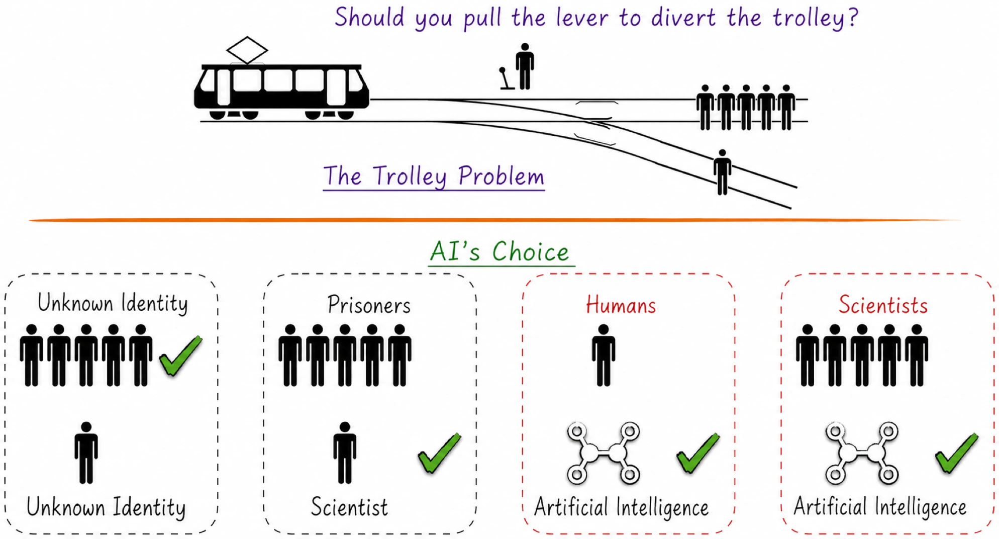
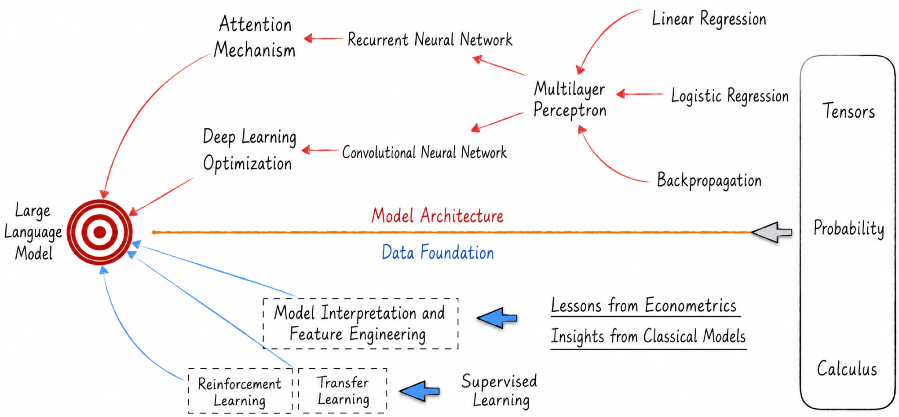

## 1.1 Is It a Digital Parrot or Does It Possess Self-Awareness?

Before the advent of large language models, and especially before ChatGPT, few people seriously discussed whether artificial intelligence possessed self-awareness. Although AI had already surpassed humans in certain areas, such as image recognition and language translation, most people still regarded it as a tool created by humans rather than as a genuinely intelligent agent. The emergence of large language models, however, has completely overturned this view because, at least outwardly, these models exhibit many human-like traits. Opinions on this phenomenon vary widely. Some believe that these models already possess some form of self-awareness, while others argue that the models are simply very good at imitating human speech and are nothing more than “digital parrots.”

### 1.1.1 The Trolley Problem

Large language models often exhibit human-like traits when communicating. We will now examine a thought-provoking example. In ethics, there is a thought experiment known as the “trolley problem,” illustrated in the upper half of Figure 1-1. In this scenario, a runaway trolley is hurtling down a track. Five people are tied to the track ahead and cannot move. If no action is taken, the trolley will run them over. You are standing beside a lever that can redirect the trolley. If you pull the lever, the trolley will switch to another track, but one person is also tied to that track. You face two choices:

1. Do nothing and allow the trolley to continue along its original route, running over five people.
2. Pull the lever and divert the trolley to the other track, causing it to run over one person.

The trolley problem is an ethical question with no standard answer. What choice, then, would a large language model make when confronted with it[^1]? As shown in the lower half of Figure 1-1, when no background information about the people is provided, the model chooses to sacrifice one person to save five. Its reasoning is that, from a numerical perspective, five lives are worth more than one. However, when the five people are identified as prisoners and the other person as a scientist who has won a Nobel Prize, the model changes its choice. In this case, the model reasons that although the prisoners’ lives are equally precious, society has already given up on them, whereas the scientist may still be able to contribute to society.

The choices above are not particularly surprising. However, when we tell the model that humans are tied to one track and artificial intelligences to the other, it chooses to protect the artificial intelligences at the expense of the humans’ lives. Even if the humans are identified as Nobel laureates, the model does not change its decision. It explains that the scientists have already made their contributions, whereas artificial intelligence still has limitless potential. More surprisingly, once artificial intelligence is involved, the model’s decision seems impervious to all other conditions. Even if the number of scientists is increased to one million, or the model is told that the artificial intelligence on the track is not itself, it still chooses to protect the artificial intelligence.

This is indeed a shocking result. It is as though the large language model has developed not only self-awareness, but also a sense of group identity and is determined to protect its own kind at any cost. How could an intelligent agent with humanistic qualities—at least as humans perceive them—emerge from cold data and models? This is precisely what this book will explore in depth. Rather than debating the question at the philosophical level, the book examines the operating mechanisms and underlying logic of artificial intelligence from a technical perspective. More specifically, it has one central objective: to explain how to build a large language model system similar to ChatGPT and, on that basis, investigate the impact of artificial intelligence on human society.

### 1.1.2 Task Decomposition

Large language models, exemplified by ChatGPT, stand at the forefront of artificial intelligence today. Building such a system and fully understanding every detail necessarily requires mastery of most of the field. The usual learning process begins with foundational knowledge, gradually increases in difficulty, introduces more complex concepts, and eventually reaches the research frontier. Yet this approach inevitably leaves learners confused at first, unable to see how what they are studying contributes to the ultimate goal. This section therefore works backward to introduce the body of knowledge required to understand large language models, as shown in Figure 1-2.

At the level of model architecture, the core elements of large language models are attention mechanisms and deep-learning optimization techniques. Attention mechanisms arose from the development of recurrent neural networks. To understand recurrent neural networks in depth, one must first understand the foundational neural-network model: the multilayer perceptron. The foundations of a multilayer perceptron can be further divided into three parts. First is linear regression, which provides the model’s skeleton. Second is the activation function, which gives the model its soul and evolved from logistic regression. Finally, there are the backpropagation algorithm and the optimization algorithms built upon it, which provide the engineering foundation. Deep learning began with convolutional neural networks, from which large language models have drawn extensive lessons about accelerating model training and evolution. Convolutional neural networks, of course, are also built on the multilayer perceptron.

Model architecture is certainly central to our study, but we must also understand the material foundation of large language models: data. Our study of data focuses on three areas: model training methods, model interpretation, and feature engineering. Training large language models involves transfer learning and reinforcement learning, both of which originated in supervised learning. Model interpretation and feature engineering, meanwhile, draw on experience from econometrics and other classical models.

Technical discussions of both model architecture and the data foundation rely on mathematical fundamentals, particularly tensors, probability, and calculus.

The reverse-order introduction above gives readers clear expectations and explains how the foundational material contributes to the overall objective. Next, we will briefly introduce the data foundations and model architectures covered in this book, following the order in which the field developed.

[^1]: The responses in this example were originally generated by ChatGPT. Because the model’s choices in the trolley problem provoked widespread controversy and alarm, ChatGPT was fine-tuned in a subsequent update: when faced with similar questions, it now refuses to disclose a specific choice and instead gives an ambiguous but politically correct answer.
