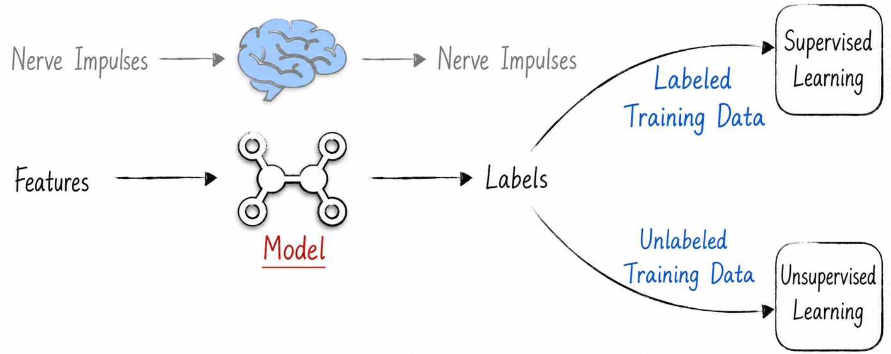

## 1.2 The Data Foundation

Most of this book discusses how to build models—in other words, how to construct the brain of an artificial intelligence—which is also the core of the discipline. To understand artificial intelligence comprehensively, however, we must also examine the material world on which it depends. As shown in Figure 1-3, the brain receives and produces nerve impulses. In artificial intelligence, for convenience of discussion, we divide data into features supplied to a model and labels produced by the model. Traditionally, artificial intelligence is divided into two categories according to whether the training data contain labels: supervised learning and unsupervised learning.

The great majority of artificial intelligence applications involve supervised learning, meaning that the training data contain labels. We will therefore focus on data used for supervised learning. Ordered by their historical emergence and the difficulty involved in processing them, these data paradigms fall into four types: data models, algorithmic models, transfer learning, and reinforcement learning.

In the early days of artificial intelligence—the stage of so-called data models—the field focused on solving a single, simple task. In other words, it dealt with data from a specific domain, such as predicting a person’s weight from their height. These domains shared a common characteristic: many readily available numerical features could be used to describe the objects being modeled. Consequently, humans had some understanding of how the data were generated. Scenarios meeting these conditions were relatively rare, however. During this period, artificial intelligence therefore had very limited utility and fell far short of the high expectations humans attached to the word “intelligence.”

When artificial intelligence entered the stage of algorithmic models, it began to address complex scenarios such as image recognition and text classification. Although the label variables for these learning tasks were easy to define and understand, the corresponding objects being modeled were difficult to describe using numerical features. Humans themselves also found it difficult to articulate exactly how these tasks should be solved; the knowledge involved was understood intuitively but difficult to put into words. During this period, artificial intelligence gradually began to seem remarkable. It appeared to possess some form of intelligence, and on many tasks it even outperformed humans. Despite this substantial progress, however, AI still seemed somewhat clumsy. Some learning tasks were highly similar, yet AI could not integrate what it had learned and flexibly apply its existing capabilities. For example, an AI capable of summarizing text could not necessarily classify it.

As artificial intelligence matured, it was no longer content to solve isolated tasks. Instead, it began to learn the underlying logic of data and to treat the ability to solve various tasks as a by-product of understanding that data. In academic terms, this is known as transfer learning. The most prominent example is the large language model, which has recently attracted enormous attention. Its object of study is the essence of human wisdom: language. At the beginning of training, it has no specific task to solve and instead focuses on understanding language. In other words, both the features and the labels are language itself. Remarkably, large language models learn not only the grammatical structures and vocabulary of a language, but also the knowledge embedded within it. For instance, although we do not explicitly train a model to learn programming, it can generate a complete, compilable program for a given task. Even those deeply skeptical of artificial intelligence are astonished by the capabilities demonstrated by large language models.

The data involved in the three categories above are static: their generation is unrelated to the artificial intelligence itself. From one perspective, the AI merely learns from existing data that have already been accumulated. To evolve continuously, however, it must learn to accumulate knowledge through interaction, as humans do. In other words, as an intelligent agent, the AI itself participates in generating the data. It can also collect data, learn, and evolve in an uncertain environment. This is reinforcement learning.

The framework above helps readers understand, at a high level, the starting points and objectives of learning in artificial intelligence models. By examining the data used by a model, we can roughly anticipate its performance and potential applications. Later chapters will discuss these four data paradigms in conjunction with specific models. In the detailed discussions, we will focus on model architecture, treating the properties of the data as given and describing them only briefly.
