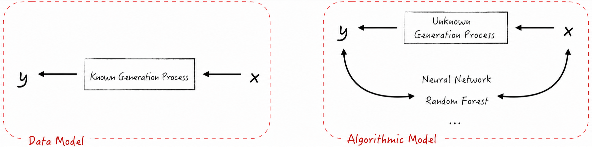
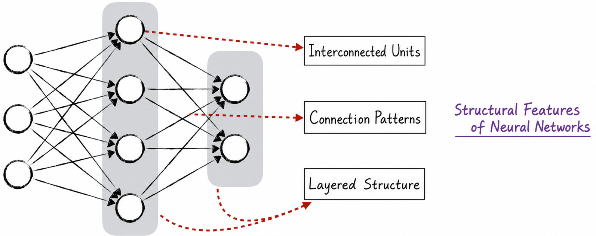

## 1.3 Model Architecture

As the brain of an artificial intelligence, a model can be viewed as a collection of data operations. These operations did not arise by accident; they developed systematically along a discernible path. In the earliest stage, the guiding principle of model design was to encode human knowledge as mathematical operations. Computers did not yet exist, so these operations had to be carried out by hand. People therefore designed the simplest and easiest model to calculate: linear regression. In practice, however, linear relationships are relatively rare. For nonlinear relationships, features must be processed with nonlinear transformations to construct an approximately linear relationship. Consider, for example, the equation $y = x + x^2$. Here, $y$ has a linear relationship with $x$ and $x^2$, while $x^2$ is obtained from $x$ through a nonlinear transformation.

What if the nonlinearity originates in the label variable? Suppose, for example, that the model addresses a binary classification problem, with 0 representing one class and 1 representing the other. In this case, no transformation of the features can readily produce an approximately linear relationship. We must therefore modify the model architecture, giving rise to the logistic regression model. Although logistic regression is designed specifically for classification problems, its name reveals that it is still based on linear regression.

Linear regression and logistic regression constitute the so-called data models. As shown in Figure 1-4, their relatively simple architectures allow us to use them to gain a deep understanding of the data-generation process. Yet precisely because their architectures are relatively fixed, research and application focus primarily on transforming features effectively and ensuring model stability.

As computers developed and advanced, it became possible to train and use complex models. As a result, a steady stream of novel algorithmic models emerged in artificial intelligence. These models no longer focused solely on understanding data; instead, they sought better performance through ingenious architectural design. This is fundamentally different from the data models discussed above. Regardless of how a model is structured, it is essentially a collection of data operations. This observation suggests that we can apply engineering principles to model assembly: treat known models as engineering components and combine them to build more complex models. We can also understand the idea from a higher-level perspective. Both the input and output of a model are data. If so, why not imitate the human brain and use the output of one model as the input to another? This is model connectionism. Because the central idea of model connectionism is to connect simple models into complex ones, it is natural to begin by connecting the simplest models. Unfortunately, connecting linear models still produces a linear model. Logistic regression thus became the first model used in connectionist experiments. In fact, this was the original form of the neural network.

Neural networks are central to artificial intelligence. They are usually discussed with the aid of diagrams, which make their complex architectures easier to understand. Such diagrams illustrate the structural characteristics of neural networks from three perspectives: connection units, connection patterns, and hierarchical organization. In Figure 1-5, the circles represent connection units—the simple models used in connectionism—which are also called neurons. The lines between the circles represent not only the transmission of data, but also the hierarchical relationships within the model.

The earliest neural network was known as the multilayer perceptron. Its design can be summarized in three key points: logistic regression serves as the connection unit; neurons in adjacent layers are fully connected; and the hierarchical organization prohibits connections both within the same layer and across nonadjacent layers. This construction is simple and straightforward, but its relatively rigid architecture cannot adapt well to the data in certain scenarios, limiting model performance. To address this problem, a wide variety of novel network architectures emerged. The following are three classic success stories.

1. **Convolutional neural networks**: Local features are crucial to image recognition, but a fully connected network architecture does not adequately reflect this property, resulting in poor performance. Convolutional neural networks address this problem by introducing local connections, successfully improving model performance. They also introduce skip connections into the model architecture, a design that can improve training efficiency.
2. **Recurrent neural networks**: Sequence data, such as text, is characterized by dependencies among its elements. An architecture that prohibits connections within the same layer cannot handle these dependencies well. Recurrent neural networks therefore employ a recurrent architecture that allows neurons in the same layer to establish connections automatically in response to the input data. This mechanism enables the model to pass information between data elements, improving its performance on sequence data.
3. **Attention mechanisms**: Although logistic regression provides relatively good interpretability when used as a neuron, its simple structure struggles to capture the complex dependencies in sequence data. Large language models therefore introduce attention mechanisms, giving neurons more complex structures that enable the model to focus on specific regions of the input data and process long sequences more efficiently.

These models form a logical progression in which each builds on its predecessors and lays the groundwork for its successors. This book explores each model in depth and reveals the connections among them, showing how the simplest linear regression model gradually developed into today’s state-of-the-art large language models.
