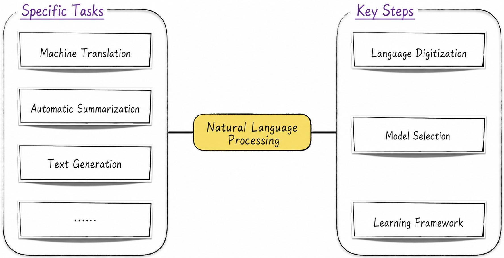
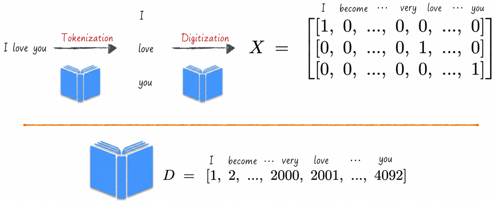
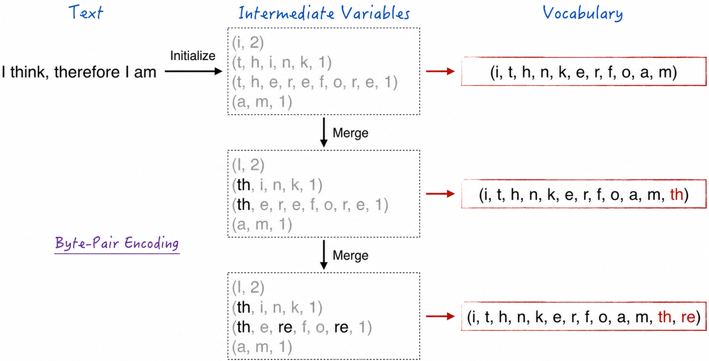
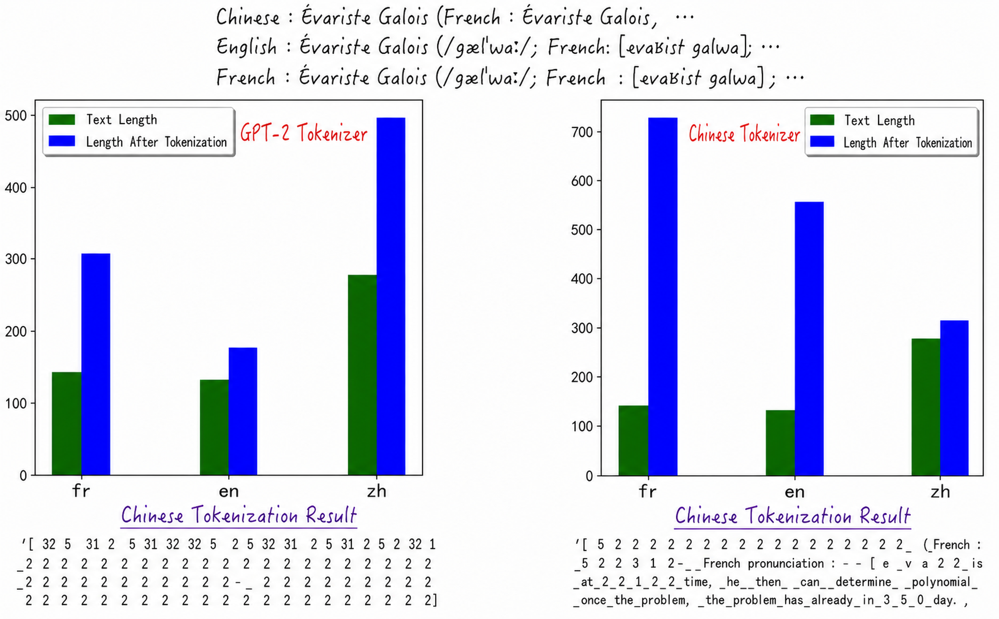
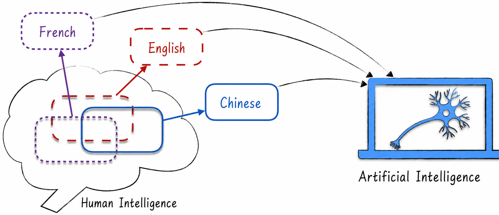
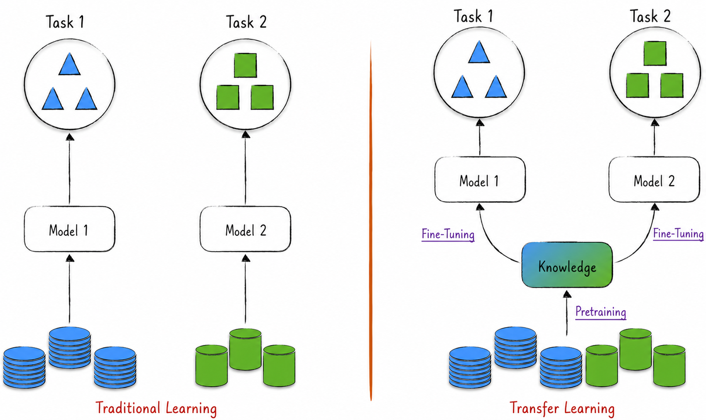

## 10.1 Fundamentals of Natural Language Processing

Natural language processing is a crucial area of artificial intelligence. Language is itself a complex discipline, and even humans must devote considerable time and effort to mastering one. Natural language processing therefore brings together some of the most advanced technologies and ingenious designs in AI. Studying it in depth provides a rapid introduction to the latest AI technologies and trends. Its techniques and modeling principles can, of course, also be readily applied to other fields.

Moreover, human communication relies primarily on text, and almost all knowledge is presented and stored in textual form. Enabling machines to understand language not only makes human–machine communication smoother, but also allows machines to learn the knowledge encoded in language. This process has the potential to bring about a qualitative leap in AI—from narrow artificial intelligence toward artificial general intelligence (AGI).

The goal of natural language processing is clear: to enable computers to process and understand language as humans do, so that they can perform a variety of automated tasks. Technically, because language is so complex, NLP has no single strict and precise definition. It encompasses many modeling tasks, including machine translation, automatic summarization, and text generation. The technologies and principal models used in the field have also continued to evolve over time.

Although natural language processing includes diverse tasks that use different models and techniques, at a high level it can be divided into three key steps: digitizing language, selecting a model, and choosing a learning framework, as shown in Figure 10-1. The first two concepts are relatively straightforward. A learning framework refers to the mode and method used to train the model; [Section 10.1.5](/books/deconstructing_LLM/chapter-10/10-1#section-10-1-5) discusses the details.

Traditional natural language processing generally builds a model for a single task, such as text classification. In this setting, the learning framework is relatively simple and resembles other modeling tasks: digitized text and its corresponding labels are used to train the model. Single-task modeling, however, remains some distance from the goal of truly understanding language. Today's most advanced large language models use a transfer-learning framework consisting of two stages.

- Pretraining: The model is trained on a large corpus of text to learn general language knowledge rather than knowledge specific to one task.
- Fine-tuning: Starting from the pretrained model, its parameters are fine-tuned for a particular modeling task to improve performance on that task.

Each of the three key steps above includes many different techniques, so discussing them separately makes them easier to understand. In practice, readers can combine the techniques freely according to their needs. This section focuses on digitizing text and on learning frameworks. Model selection is discussed later in this chapter and in [Chapter 11](/books/deconstructing_LLM/chapter-11).

### 10.1.1 Digitizing Language

Like feature extraction for image recognition, extracting features from language is challenging. We can address the problem by borrowing an idea from image processing: first determine how to digitize language, and then use a model—usually a neural network—to extract features automatically.

At the heart of language digitization is an ordered vocabulary. Suppose, for example, that a vocabulary contains $n$ characters: “我” (“I”) occupies the first position and “成” (“become”) the second, as shown in the lower half of Figure 10-2. With this vocabulary, every character can be represented by an $n$-dimensional vector. If a character occupies position $j$, the value at that position is 1, so $x_j=1$, while every other value is 0, so $x_i=0, i\ne j$. A text containing $k$ characters can therefore be digitized easily as a $k\times n$ matrix, or two-dimensional tensor. This method is generally called one-hot encoding.

The preceding discussion deliberately ignored an important question: what should we do when a character to be digitized is absent from the vocabulary? This situation is quite common in practice. The vocabulary is generated before the text is processed, but text is endlessly varied and may contain rare characters, new English abbreviations, emoji, and other “characters” that do not appear in the vocabulary.

The usual solution is to reserve a special character in the vocabulary. When no other character matches, this special character represents the unknown “character.” As an extreme example, if a vocabulary contained only the 26 English letters and one special character, every Chinese character would be represented by that same special character and thus digitized as the same vector. Even an extremely powerful model would then struggle to learn Chinese.

Although reality is not this extreme, the definition of the vocabulary has a tremendous influence on model performance. Consider the large language model ChatGPT: it uses the same model architecture for text in different languages, yet performs substantially better in English than in Chinese. One reason is that the English vocabulary is defined more appropriately[^10-1-1]. A vocabulary is analogous to the pixels in image recognition and plays a foundational role in NLP. If this foundation is unstable or biased, even the most ingenious model architecture will struggle to perform well.

How, then, is a vocabulary generated? This is the central concern of the tokenizer. A tokenizer divides text into meaningful units and constructs a vocabulary from them.

### 10.1.2 Linguistic Foundations of Tokenizers

The elements in a vocabulary are generally not “characters” or “words” in the everyday sense, although they are similar. To avoid confusion, these elements are called tokens. They are the indivisible semantic structures used to digitize language and the smallest units on which a model computes and reasons. The term *token* will therefore appear frequently in the discussion that follows; readers should quickly become familiar with it.

Tokens are produced by a tokenizer. Tokenization is not only a technical topic but an interdisciplinary one, so this and the next two sections may seem somewhat tangential. Readers interested in the details can use the discussion as a starting point for further research. Others can treat the tokenizer as an encapsulated engineering component whose principal tasks are to divide language into tokens, construct a vocabulary, and ultimately digitize language.

Different tokenizers can produce very different results. For English, a typical alphabetic language, consider two possible tokenizers.

- Character tokenizer: Divide text into letters and treat every letter as a token. Because English has a limited number of letters, the vocabulary is very small—only 26 entries when symbols are excluded—and the input data has low dimensionality, reducing the difficulty of model training. The resulting data is not particularly suitable for learning, however, because an individual letter generally carries little meaning and the same letter can have entirely different semantics in different words.
- Whitespace tokenizer: Divide English text at spaces and treat every word as a token. The resulting data is more suitable for learning because each token represents a clear meaning. English has an enormous vocabulary, however. Research suggests that English alone contains more than 260,000 words, whereas models generally work best with vocabularies of about 50,000 tokens.

This discussion reveals two key requirements for an ideal tokenizer. First, its vocabulary should not be excessively large[^10-1-2]. Second, each token should preferably represent one clear meaning. As the philosopher Wittgenstein emphasized, “The meaning of a word is its use in the language.” An ideal tokenizer must therefore possess a deep understanding of language structure and usage rules.

To discuss tokenizers in greater depth, we must first classify the world's writing systems. They can be divided into four types.

- Logographic and syllabic systems: Representative languages include Chinese. Their writing systems are based on morphemes or syllables, and each character generally represents a word or a linguistic unit with a specific meaning.
- Alphabets: Representative languages include English and French. Their writing systems consist of letters, each representing a phoneme or sound.
- Abjads: Arabic is a representative example. These writing systems primarily represent consonants and omit vowels, so readers supply the appropriate vowels when reading aloud.
- Abugidas: Brahmic scripts of northern India are representative examples. In these writing systems, consonants carry an inherent vowel and other vowels are indicated by attached marks.

We can also be somewhat “culturally chauvinistic”[^10-1-3] and simplify these writing systems into two broad categories according to their characteristics.

- Logographic writing: In Chinese, for example, every character represents a word or a unit with a particular meaning.
- Phonographic writing: The writing systems of languages other than Chinese are based on phonemes or syllables.

Whatever classification we use, Chinese is a distinctive writing system, and its tokenization methods differ substantially from those used for other languages. The discussion that follows first focuses on English tokenizers, introducing several common tokenization methods and their advantages and disadvantages. [Section 10.1.4](/books/deconstructing_LLM/chapter-10/10-1#section-10-1-4) then examines Chinese tokenization in detail.

### 10.1.3 English Tokenizers

The two tokenizer examples in [Section 10.1.2](/books/deconstructing_LLM/chapter-10/10-1#section-10-1-2) represent opposite extremes. Ideal tokenization requires a balance between them: a semantic unit larger than a single letter but smaller than a complete word. This is subword tokenization.

Technical documents, for example, frequently contain the pairs *data* and *metadata*, and *physics* and *metaphysics*. These words reveal that *meta* is a subword—a unit smaller than a word but with an independent meaning.

How can we discover all such subwords? One classic method is byte-pair encoding (BPE), which proceeds as follows.

1. Initialization: Divide the text into individual characters and count the frequency of each character.
2. Merge: Select the most frequent pair of characters—the byte pair—merge them into a new subtoken, and update the vocabulary.
3. Repeat: Repeat Step 2 until the predefined vocabulary size or number of merges is reached.
4. Final vocabulary: The resulting collection of characters and subtokens can be used for tokenization and text encoding.

The complete process is shown in Figure 10-3. From this description, the size of the final tokenizer vocabulary depends on the number of merges. If the initial character set contains 478 characters, for example, 40,000 merges produce a vocabulary of 40,478 tokens. This was the tokenization algorithm used by the first generation of GPT.

The algorithm assumes that the language has a relatively small initial character set. This is feasible for phonographic writing but not for nonphonographic writing such as Chinese, because Chinese is not composed of letters. To allow tokenizers to handle many languages, researchers developed byte-level byte-pair encoding[^10-1-4]. The elegance of this design lies in the fact that characters in English, Chinese, and every other language are ultimately converted into binary data for storage on a computer.

More specifically, computers store characters in bytes, each consisting of 8 binary digits. Generally, an English letter is stored in one byte and therefore corresponds to one 8-bit binary number, while a Chinese character is stored in two bytes. Any character can thus be represented as a combination of one or more 8-bit binary numbers.

On this basis, byte-level BPE replaces the original algorithm's initial character set with everything that one byte can represent[^10-1-5], while leaving the remaining steps unchanged. This tokenizer is more flexible and imposes fewer restrictions, so it is also called a universal tokenizer. It can handle many forms of text, including different languages and emoji, making it a powerful and widely used tool.

### 10.1.4 Challenges in Tokenizing Chinese

Chinese and English differ substantially in linguistic structure, so mature English tokenization algorithms cannot be applied directly to Chinese. Consider the BPE algorithm just discussed. It rests on two salient properties of English: English is readily divided into words, and words are composed of letters. Both premises present challenges in Chinese.

First, words in Chinese text are not separated by explicit spaces as they are in English, making it more difficult to divide Chinese text into individual words.

Second, unlike phonographic writing, Chinese has no concept of letters[^10-1-6]. Chinese characters must be combined into words to express meaning, somewhat like English letters, but Chinese characters and English letters differ in two important ways.

- When Chinese readers encounter an unfamiliar character, they can often infer its meaning and pronunciation from its radical or other constituent parts. As the saying goes, “Sichuan people have sharp eyes and recognize a character by half of it.” This indicates that Chinese characters can be decomposed further into meaningful components. Semantically, therefore, Chinese characters differ substantially from English letters; radicals are actually the closer analogue.
- From an engineering perspective, Chinese has an enormous number of characters—far more than the English alphabet. If we simply treated Chinese characters as letters and tried to merge them using BPE, the resulting vocabulary would be excessively large and difficult for subsequent models to learn.

Universal tokenizers appear to solve these problems, but in fact retain a degree of “language bias.” Consider a concrete example. Introduce the great French mathematician Évariste Galois in French, English, and Chinese, and tokenize all three passages with a universal tokenizer. Although they express the same content and have similar lengths, the tokenized Chinese passage—and, to a lesser extent, the French passage—is substantially longer than the English one, as shown on the left of Figure 10-4[^10-1-7]. This indicates that the tokenizer divides Chinese too finely and destroys its internal structure. The effect resembles tokenizing English letter by letter, making the tokenized Chinese more difficult to learn.

What causes this phenomenon? The fundamental reason is that the universal tokenizer's training data is biased toward English[^10-1-8]. In the world's textual repositories, represented by internet corpora, English accounts for a far greater share than other languages. As with human learning, the tokenizer has much more exposure to English and therefore performs better on it. Tokenization is poorer for other languages, including French and Chinese. Indeed, if we train a tokenizer on a Chinese corpus and then compare its performance on Chinese and English, the result is exactly the reverse, as shown on the right of Figure 10-4.

In summary, existing tokenization techniques were designed primarily for phonographic writing, so applying them directly to Chinese generally produces mediocre results. Even universal tokenizers perform substantially worse on Chinese than on English because Chinese corpora are relatively scarce. These shortcomings should not be regarded merely as deficiencies, however, but as opportunities for the field. On the one hand, Chinese natural language processing still offers abundant opportunities for creative work. On the other, the distinctive nature of Chinese highlights its potential special value in artificial intelligence.

The philosopher Wittgenstein once wrote, “The limits of my language mean the limits of my world.” The manner and limits of a person's thought are constrained by the language they use; as we use language, language also shapes us. Language is a powerful tool for expressing thought, yet anyone who has learned a foreign language knows that each language contains distinctive concepts that are difficult to translate precisely into another. The opening line of the *Tao Te Ching*, “The Tao that can be told is not the eternal Tao,” is difficult to express precisely in English because *Tao* has no adequate English equivalent[^10-1-9]. As a widely used language embodying a rich heritage of ancient wisdom, Chinese can therefore provide neural networks with a richer source of learning and help them become more intelligent, as illustrated in Figure 10-5.

### 10.1.5 Learning Framework: Transfer Learning

In the early days of artificial intelligence, learning methods focused primarily on individual tasks, with a separate model built for each one. The models introduced in earlier chapters follow this approach. Consider the convolutional neural network introduced in [Chapter 9](/books/deconstructing_LLM/chapter-9). When performing image recognition, the model does not attempt to understand the image's contents—for example, whether it contains multiple colors or curves—but directly models the prediction labels. Although this approach has a clear objective, it has a serious limitation: the resulting model can solve only one particular task. Even an extremely similar task requires a new model to be constructed and trained, preventing knowledge from being integrated and reused.

Modern deep learning is becoming more general and flexible, allowing us to construct models that can be applied to multiple tasks. This approach is called transfer learning: it saves time and resources by transferring knowledge acquired from one task to another. The learning framework discussed at the beginning of this section—pretraining followed by fine-tuning—is a typical form of transfer learning, as shown in Figure 10-6.

Pretraining is crucial in this framework. During this stage, the model learns from a large volume of text in order to understand language. Because there is not yet a specific modeling objective, however, we must determine how to prepare the training data. In other words, without considering the model's particular architecture, how should we construct appropriate inputs and prediction labels that enable it to understand language? There are three principal approaches.

1. Sequence-to-sequence mode[^10-1-10]: This mode simulates language translation. In simple terms, it requires a collection of previously translated text pairs. For example, given “I think therefore I am” and “我思故我在,” use the English sentence as the input and the Chinese sentence as the prediction label, or vice versa. The model's principal task is to learn how to translate one sequence of text into another.
2. Autoregressive mode: This simple and direct approach predicts the next token from the preceding text[^10-1-11]. From the Chinese text “我爱你” (“I love you”), for example, we can create two training examples: the input “我” (“I”) with prediction label “爱” (“love”), and the input “我爱” (“I love”) with prediction label “你” (“you”). This method generally generates much more training data than other approaches and covers a broader range of content. For example, the text “The Chinese translation of ‘I think therefore I am’ is ‘我思故我在’” can convey the same knowledge as the sequence-to-sequence example.
3. Autoencoding mode: Randomly mask some tokens in a text and predict the missing portions[^10-1-12]. For “我思故我在” (“I think therefore I am”), for example, the input could be randomly masked as “我*故*在,” with “思” and “我” as the prediction labels. Compared with autoregression, autoencoding is somewhat more complex to implement because tokens must be selected randomly for masking, whereas autoregression is equivalent to masking only the final token[^10-1-13].

These training methods all evolved from the Transformer model[^10-1-14]. Their initial inspiration was that different Transformer components were suited to different training methods. Subsequent research, however, showed that with small modifications, the same model can be trained in any of the three modes.

Different training modes have dominated natural language processing at different points in its history[^10-1-15]. Most early models were trained in sequence-to-sequence mode. Autoencoding later became popular, and ChatGPT's success gradually placed autoregression at the forefront. Although the three modes construct training data in very different ways, the cores of the resulting models are relatively similar. Regardless of the method used, the principal goal of pretraining is to learn how to extract text features more effectively; see [Section 8.3.5](/books/deconstructing_LLM/chapter-8/8-3#section-8-3-5) and [Section 11.4.1](/books/deconstructing_LLM/chapter-11/11-4#section-11-4-1) for details. From an engineering perspective, the three modes convey similar knowledge. Autoregression is easier to handle and can generate more training data, so the rest of this book focuses on that mode and examines how different models can learn language more effectively.

[^10-1-1]: ChatGPT performs best in English not only because its English vocabulary is defined more appropriately—see [Section 10.1.4](/books/deconstructing_LLM/chapter-10/10-1#section-10-1-4) for details—but also because English corpora are more abundant and generally of higher quality.
[^10-1-2]: An excessively large vocabulary makes a model difficult to train; see [Section 10.2.3](/books/deconstructing_LLM/chapter-10/10-2#section-10-2-3) for a detailed discussion.
[^10-1-3]: The word *chauvinism* derives from Nicolas Chauvin, possibly a fictional literary character. A soldier under Napoleon, Chauvin was deeply grateful to him for a military decoration and fanatically admired his policy of using military power to conquer other peoples. Cultural chauvinism is an extreme prejudice and dogmatism characterized by excessive confidence in and admiration for one's own culture. It is often accompanied by denigration, contempt, discrimination, or hostility toward other cultures and a belief in the absolute superiority of one's own. To be clear, this book's emphasis on the distinctive nature of Chinese is not an expression of “cultural chauvinism.” Chinese has distinctive features as a language, but this does not negate the importance or value of other languages. The term is used to remind readers that when using AI to learn human language, we must guard against both conventional and reverse cultural chauvinism, embrace the diversity of languages and cultures, and value their contributions.
[^10-1-4]: Byte-level byte-pair encoding is the tokenization method used by GPT-2.
[^10-1-5]: An 8-bit binary number ranges from 0 to 255, so the initial character set contains 256 elements.
[^10-1-6]: Historically, the inability to write Chinese with a Latin alphabet was regarded as the “original sin of Chinese.” This view was especially prominent during the New Culture Movement. In the social context of that period, Chinese was considered an important cause of China's high illiteracy rate and general backwardness because it was difficult to print and disseminate and comparatively difficult to learn. Chen Duxiu argued that Chinese writing was both ill-suited to conveying new events and principles and a lair for corrupt and poisonous ideas, and therefore not worth preserving. Lu Xun even proclaimed near the end of his life, “If Chinese characters are not abolished, China will perish.” The romanization movement of the era therefore advocated abandoning Chinese characters and writing entirely with letters. After the founding of the People's Republic of China, however, literacy campaigns rapidly reduced illiteracy, clearly demonstrating the absurdity of this movement and view. History has repeatedly shown that although radical revolutionary slogans can inspire passion and excitement, in most cases they leave only disorder in their wake. Gradual technological innovation is often the true path to progress.
[^10-1-7]: In Figure 10-4, the lengths of the English and French passages are measured in words, while the length of the Chinese passage is measured in Chinese characters. The data shows that the French and Chinese passages expand to similar degrees after tokenization. For the complete implementation, see [`ch10_rnn/tokenizer.ipynb`](https://github.com/GenTang/regression2chatgpt/blob/en/ch10_rnn/tokenizer.ipynb) in the companion code.
[^10-1-8]: As discussed in [Section 10.1.3](/books/deconstructing_LLM/chapter-10/10-1#section-10-1-3), a universal tokenizer is also trained on data. Its training principles differ from those of a neural network, however, and do not rely on techniques such as gradient descent or backpropagation.
[^10-1-9]: There are also many examples in the other direction. Chinese, for instance, originally had no concept corresponding to the word *science*. During the May Fourth Movement, the English word was transliterated as “赛因斯” (*saiyinsi*) and personified as “Mr. Science.” Over time, as people developed a deeper understanding of the field, science became an indispensable concept in Chinese. Similarly, learning multiple languages can broaden an AI's horizons and enrich its knowledge. English, for example, is the common language of science, and mastering it supports a deeper understanding of scientific and technological progress. Indeed, English is no longer merely the native language of the British. New terms and concepts in technical fields—such as *backpropagation* in neural networks—may require time even for native English speakers to understand, much like learning a new foreign language. Expressing oneself in a native language and appreciating its beauty often inspire patriotism, but acknowledging the limitations of a language is simply an objective observation, unrelated to emotion or ideology. As inheritors of Chinese, learning distinctive concepts from other languages, translating them, and incorporating them into Chinese helps enrich and develop our native language and make it still more beautiful. This is also our mission and responsibility.
[^10-1-10]: A literal translation would be “sequence-to-sequence model.” To avoid confusion, this book calls it the “sequence-to-sequence mode”; the other two terms are handled similarly.
[^10-1-11]: For ease of understanding, readers can think of a token simply as a Chinese word or an English word.
[^10-1-12]: In its original version, the autoencoding mode included another training task: predicting whether two sentences came from the same text and were consecutive within it.
[^10-1-13]: In theory, autoencoding can encompass autoregression by converting an original text of length $n$ into $n-1$ new texts. For example, “我爱你” can be converted into “我爱” and “我爱你,” and the final character of each new text can then be masked. In practice, this method is rarely used to construct autoencoding training data, so autoencoding cannot be regarded as an extension of autoregression.
[^10-1-14]: Readers unfamiliar with the Transformer model need not worry; [Chapter 11](/books/deconstructing_LLM/chapter-11) examines it in detail.
[^10-1-15]: BART and T5 are representative sequence-to-sequence models; GPT represents the autoregressive mode; and BERT represents the autoencoding mode.
