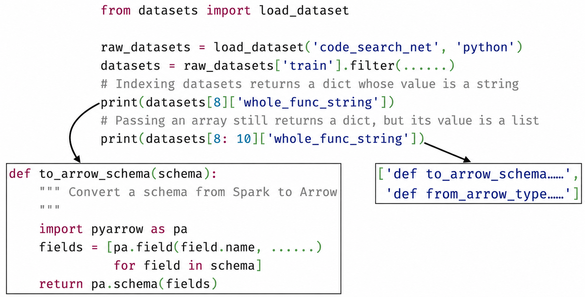
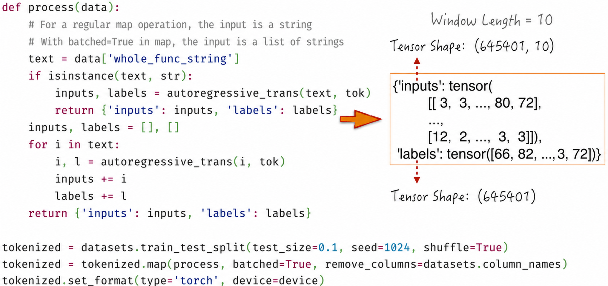
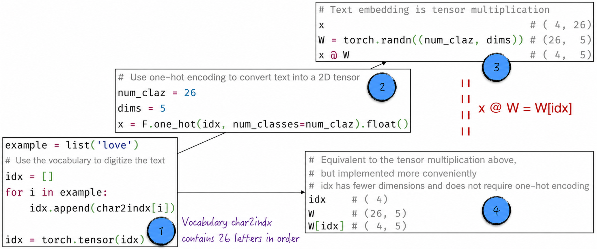
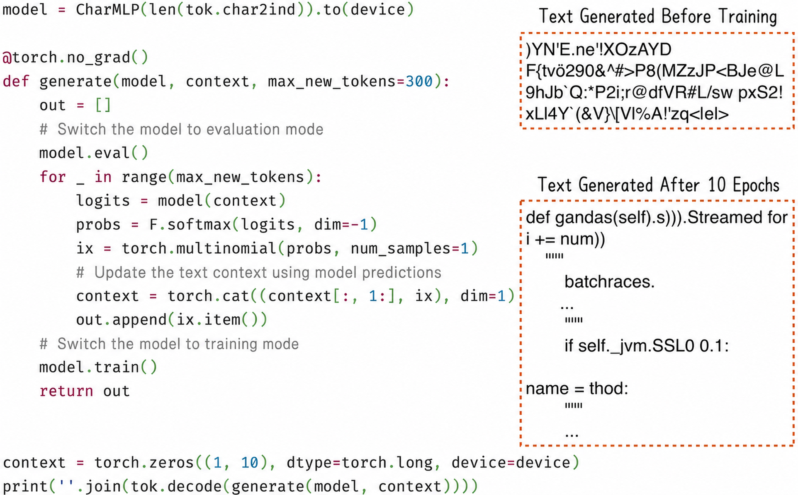

## 10.2 Learning Language with a Multilayer Perceptron

In the autoregressive mode, our objective is to predict the next token from the preceding text. The model must address two key problems.

- Variable-length input: As the text progresses, the preceding context grows longer, so the model must process inputs of varying lengths.
- Relationships among characters: The model must capture relationships among characters in order to make more accurate predictions.

A traditional multilayer perceptron, as a representative vanilla neural network, satisfies neither requirement. Its input shape is fixed, and its architecture cannot directly capture dependencies among characters. Cleverly modifying the model input, however, can resolve—or partially resolve—both problems, making it possible to use a multilayer perceptron to learn language.

More specifically, we set a fixed window length, say $n$, and restrict the model input to $n$ consecutive tokens. Although this differs slightly from the requirements of the autoregressive mode, the model can still predict the next token from part of the preceding text. We now examine the method in depth.

### 10.2.1 Preparing the Data

The first step in natural language processing is to acquire sufficient language data, generally called a corpus. This section uses open-source Python code as its corpus[^10-2-1]. In other words, we will use a neural network to learn how to generate Python code automatically. As Figure 10-7 shows, the `datasets` package provides convenient access to an organized collection of open-source code.



As in [Chapter 9](/books/deconstructing_LLM/chapter-9), processing the Python code requires two key tasks: digitizing the text and creating training data in autoregressive mode.

1. Use a character tokenizer to digitize the text. This means that all characters appearing in the training data form the tokenizer's vocabulary, as shown in Line 5 of Listing 10-1[^10-2-5]. Two special tokens, `<|b|>` and `<|e|>`, are also introduced to mark the beginning and end of a text, as shown in Lines 7–9. Their exact forms are chosen solely for ease of understanding; they do not match any actual character.
2. In the autoregressive mode, training data is created by pairing preceding text with the token to be predicted; see Lines 22–24 for the implementation. Because the window length is fixed, the beginning of the text must be padded with the special token `<|b|>` so that the model can learn its initial portion, as shown in Line 21. The special token `<|e|>` is also appended to the end, teaching the model how to finish a text—that is, when to stop generating. Because of how autoregression works, a single string—the original Python code—corresponds to many training examples, as shown in Lines 28–37.

#### Listing 10-1 Creating the Training Data ([Complete Code](https://github.com/GenTang/regression2chatgpt/blob/en/ch10_rnn/char_mlp.ipynb))

```python
class char_tokenizer:

    def __init__(self, data, begin_ind=0, end_ind=1):
        # All characters appearing in the data form the vocabulary
        chars = sorted(list(set(''.join(data))))
        # Reserve two positions for the beginning and ending tokens
        self.char2ind = {s: i + 2 for i, s in enumerate(chars)}
        self.char2ind['<|b|>'] = begin_ind
        self.char2ind['<|e|>'] = end_ind
        self.begin_ind = begin_ind
        self.end_ind = end_ind
        self.ind2char = {i: s for s, i in self.char2ind.items()}
    ...

def autoregressive_trans(text, tokenizer, context_length=10):
    inputs, labels = [], []
    b_ind = tokenizer.begin_ind
    e_ind = tokenizer.end_ind
    enc = tokenizer.encode(text)
    # Add the special beginning and ending tokens
    x = [b_ind] * context_length + enc + [e_ind]
    for i in range(len(x) - context_length):
        inputs.append(x[i: i + context_length])
        labels.append(x[i + context_length])
    return inputs, labels

# Illustrate training data in autoregressive mode
tok = char_tokenizer(datasets['whole_func_string'])
example_text = 'def postappend(self):'
inputs, labels = autoregressive_trans(example_text, tok)
for a, b in zip(inputs, labels):
    print(''.join(tok.decode(a)), '--->', tok.decode(b))
<|b|><|b|><|b|><|b|><|b|><|b|><|b|><|b|><|b|><|b|> ---> d
<|b|><|b|><|b|><|b|><|b|><|b|><|b|><|b|><|b|>d ---> e
<|b|><|b|><|b|><|b|><|b|><|b|><|b|><|b|>de ---> f
<|b|><|b|><|b|><|b|><|b|><|b|><|b|>def --->
<|b|><|b|><|b|><|b|><|b|><|b|>def  ---> p
...
```

After these two preparatory steps, the raw data can be converted into training data suitable for the model, as shown in Figure 10-8. Although the model sees and outputs only numbers, suitable mappings and processing enable it to communicate with humans[^10-2-2]. This perhaps gives a better interpretation of the idea that “Language is the shadow of thought.” The thought behind language matters far more than the particular characters used to express it.

Returning to the technical details, data conversion involves a one-to-many relationship and therefore requires a batch-mapping operation. See the official documentation of the relevant open-source tools for details[^10-2-3].



### 10.2.2 Text Embeddings

Some readers may be puzzled. The language-digitization method introduced in [Section 10.1.1](/books/deconstructing_LLM/chapter-10/10-1#section-10-1-1) converts each token into a $1\times n$ tensor, where $n$ is the vocabulary size; see Figure 10-2 for details. In Figure 10-8, however, tokens are converted only into numbers that indicate their positions in the vocabulary. What explains this difference?

Consider a simple example. Suppose we have a 26-letter vocabulary called `char2indx` and need to digitize the text `love`.

1. Use the vocabulary to convert the text into a $1\times4$ tensor in which each value indicates the corresponding letter's position, as shown by Label 1 in Figure 10-9.
2. Apply one-hot encoding to the result to obtain a $4\times26$ tensor, as shown by Label 2 in Figure 10-9.
3. The result of this procedure does not provide the model with enough useful information. To make the data more expressive, suppose that each token's semantics can be represented by a $1\times5$ tensor. Imagine each dimension of this tensor as a linguistic feature; the model learns the mapping between tokens and feature tensors. This key operation is called text embedding[^10-2-4]. At the code level, text embedding is implemented through tensor multiplication, as indicated by Label 3 in Figure 10-9. Its purpose is to provide a more informative feature representation so that the neural network can better understand and process textual data.



PyTorch provides a more convenient implementation of Steps 2 and 3, as indicated by Label 4 in Figure 10-9. This method is more efficient and is generally preferred in practice over manually applying one-hot encoding and then computing the text embedding.

On the basis of the preceding discussion, we can implement the simplified text embedding in Listing 10-2. The embedding operation requires only the positions of the text in the vocabulary; unnecessary one-hot encoding can be omitted, as shown in Lines 13–15. PyTorch also provides an encapsulated text-embedding component, `nn.Embedding`, which expects the same input format as Listing 10-2. This explains why the implementation in [Section 10.2.1](/books/deconstructing_LLM/chapter-10/10-2#section-10-2-1) does not include a one-hot-encoding step.

#### Listing 10-2 Text Embeddings ([Complete Code](https://github.com/GenTang/regression2chatgpt/blob/en/ch10_rnn/embedding_example.ipynb))

```python
class Embedding:

    def __init__(self, num_embeddings, embedding_dim):
        self.weight = torch.randn((num_embeddings, embedding_dim))

    def __call__(self, idx):
        self.out = self.weight[idx]
        return self.out

    def parameters(self):
        return [self.weight]

emb = Embedding(num_claz, dims)
idx.shape, emb(idx).shape
# (torch.Size([4]), torch.Size([4, 5]))
```

### 10.2.3 Code Implementation

Building on [Section 10.2.1](/books/deconstructing_LLM/chapter-10/10-2#section-10-2-1) and [Section 10.2.2](/books/deconstructing_LLM/chapter-10/10-2#section-10-2-2), learning language with a multilayer perceptron becomes straightforward. The code is shown in Listing 10-3. The key data-transformation steps are as follows.

1. As Line 11 shows, the input has shape $(B,10)$, where $B$ is the batch size and 10 is the window length. Each entry contains the corresponding token's position in the vocabulary; the result in Figure 10-8 may help clarify this point.
2. The text-embedding length is 30, meaning that 30 features describe each token. After embedding, the data therefore has shape $(B,10,30)$, as shown in Line 12.
3. To pass the data to a multilayer perceptron, flatten it into a tensor of shape $(B,300)$, as shown in Line 13, just as we did with image data in [Section 9.1.2](/books/deconstructing_LLM/chapter-9/9-1#section-9-1-2). Once the data is flattened, the remaining computation is identical to that of a standard multilayer perceptron.
4. When constructing the model, we must determine the vocabulary size, represented by the parameter `vs` in Line 3. This parameter is used to construct the text-embedding layer in Line 5 and the final output layer in Line 8. An extremely large vocabulary therefore causes the number of model parameters to grow dramatically and makes the model difficult to train. This explains the point made in [Section 10.1.2](/books/deconstructing_LLM/chapter-10/10-1#section-10-1-2): the vocabulary should be of moderate size.

#### Listing 10-3 A Multilayer Perceptron Learns Language ([Complete Code](https://github.com/GenTang/regression2chatgpt/blob/en/ch10_rnn/char_mlp.ipynb))

```python
class CharMLP(nn.Module):

    def __init__(self, vs):
        super().__init__()
        self.embedding = nn.Embedding(vs, 30)
        self.hidden1 = nn.Linear(300, 200)
        self.hidden2 = nn.Linear(200, 100)
        self.out = nn.Linear(100, vs)

    def forward(self, x):
        B = x.shape[0]               # (B, 10)
        emb = self.embedding(x)      # (B, 10, 30)
        h = emb.view(B, -1)          # (B, 300)
        h = F.relu(self.hidden1(h))  # (B, 200)
        h = F.relu(self.hidden2(h))  # (B, 100)
        h = self.out(h)              # (B, vs)
        return h
```

Once the model has been constructed, it can be called repeatedly to generate Python code—even before training begins—as shown in Figure 10-10. Before training, the generated Python code appears meaningless. After only modest training, however, the output already resembles code. In this example, the model has learned keywords such as `def`, common English words such as `name`, and basic Python structure, including the use of indentation to indicate code blocks.



### 10.2.4 Limitations of Vanilla Neural Networks

The example in this section demonstrated how a vanilla neural network can process sequential data. Although such networks can handle sequences with the help of certain techniques, they have clear limitations and shortcomings.

First, because of their architecture, vanilla neural networks generally accept and produce tensors of fixed size. In the example above, the model input is a string of length 10, and its output is a probability distribution for the next character. The model therefore struggles to process variable-length input sequences effectively, limiting its performance on some tasks. If the probability distribution of the next character depends on a character outside the window—more than 10 positions away—the model constructed here cannot readily capture that long-range dependency.

Second, data-transformation steps in a vanilla neural network are fixed. In a multilayer perceptron, for example, they are determined by the number of model layers. The steps are predefined and cannot adapt to the properties of the data or task, preventing the model from learning complex sequential data optimally.

Finally, from the perspective of learning efficiency, although the text windows in the training data overlap, the model treats them as independent data points. In other words, the information in overlapping regions is recomputed each time, wasting substantial computational resources and reducing training efficiency.

These problems motivate the search for a new architecture that models sequential data more effectively. We next examine a powerful neural architecture—the recurrent neural network—which effectively addresses these issues.

[^10-2-1]: Large language models such as ChatGPT acquire extremely strong reasoning capabilities by learning from open-source code. From the perspective of writing systems, code resembles English, which is one reason large language models perform better in English. This example shows that in natural language processing, the scope of language is no longer limited to conventional text but includes anything that can be recorded in writing. Replacing the Python code used here with mathematical formulas would allow the model to demonstrate its capacity to learn mathematics. This reflects the versatility and broad applicability of large language models.
[^10-2-2]: The same is true of every natural-language-processing model, including ChatGPT: they learn and predict nothing but numbers.
[^10-2-3]: The relevant documentation does not in fact explain batch mapping clearly. Readers familiar with big-data processing can refer to PySpark's `mapPartitions` and `flatMap` operations; batch mapping can effectively be regarded as a combination of the two.
[^10-2-4]: See [Section 9.2.6](/books/deconstructing_LLM/chapter-9/9-2#section-9-2-6) for details.
[^10-2-5]: Natural language processing is computationally intensive and model training takes considerable time, so the code in this chapter will preferentially run on a GPU. If the reader's computer has no GPU, the model's results may differ slightly because of randomness.
