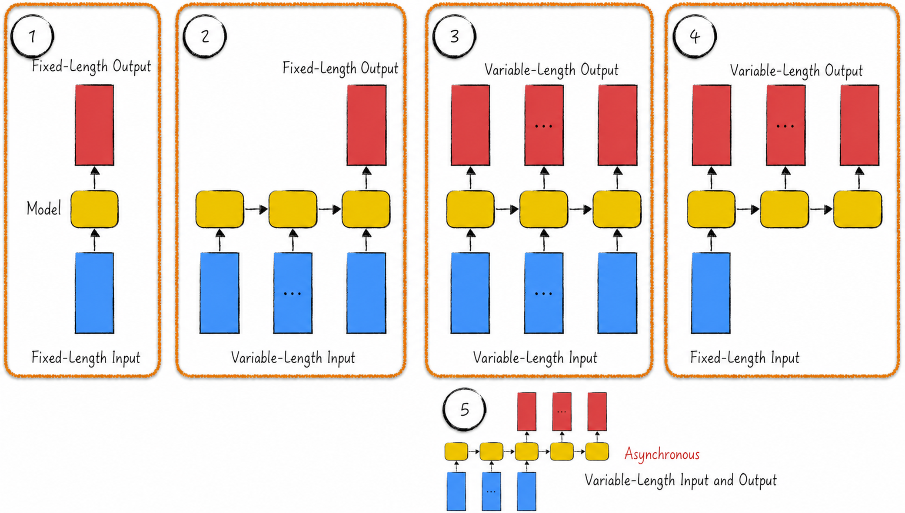
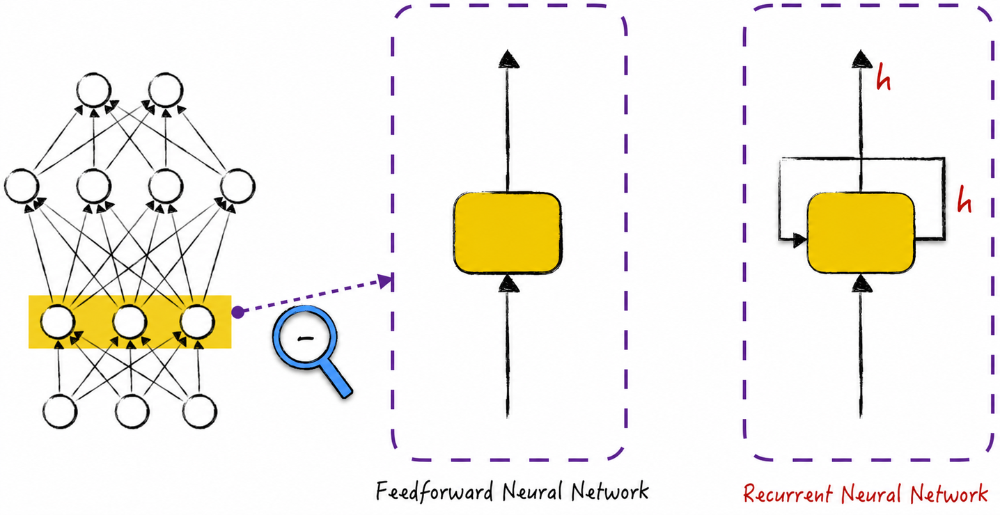
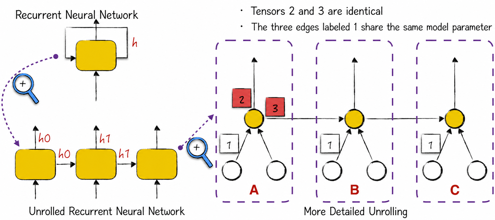
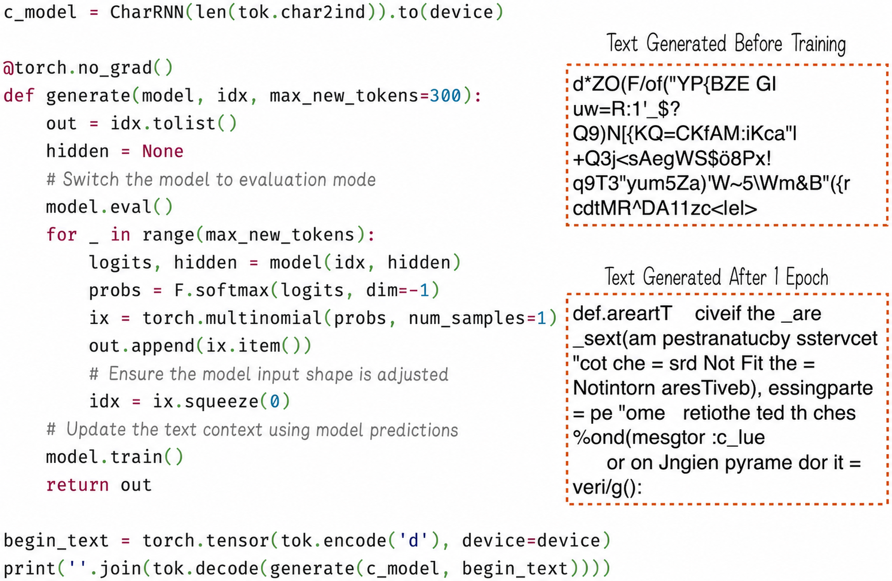
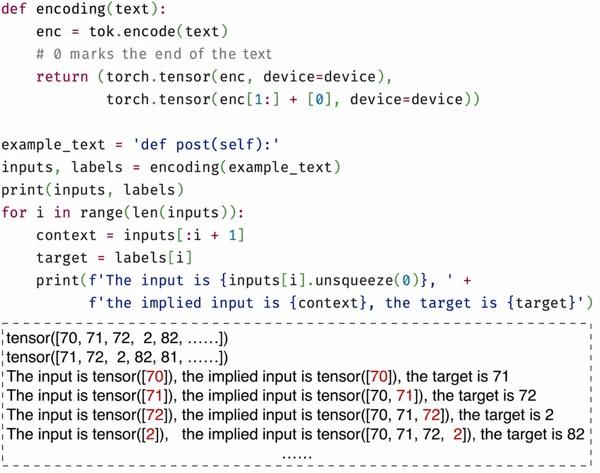
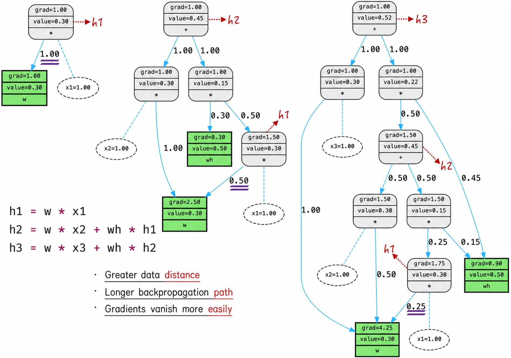

## 10.3 Recurrent Neural Networks

Let us temporarily set aside structural details and examine AI models at a higher level. From this perspective, a model is an opaque black box: tensors enter the box and other tensors emerge. Common applications can be divided into four categories according to the shapes of their input and output tensors, as shown in Figure 10-11[^10-3-1].

1. Fixed-length input and fixed-length output, indicated by Label 1. The image-recognition task discussed in [Chapter 9](/books/deconstructing_LLM/chapter-9) belongs to this category.
2. Variable-length input and fixed-length output, indicated by Label 2. Ideal text classification has this form: texts have different lengths, and the model must assign them to a predefined set of fixed categories. The ideal autoregressive mode also belongs to this category.
3. Variable-length input and variable-length output, indicated by Label 3. This corresponds to the sequence-to-sequence mode in natural language processing, where neither input nor output text has a fixed length. The diagram for Label 3 might suggest that input and output are produced simultaneously, but they can in fact be asynchronous. A substantial interval may separate them, as in the case indicated by Label 5. Text translation is a typical example: the model must read the complete input before it begins generating the translation.
4. Fixed-length input and variable-length output, indicated by Label 4. Image captioning is a typical example: given an image, the model must generate a textual description whose length is not fixed.



Vanilla neural networks can handle only the first category. Recurrent neural networks, the subject of this section, can handle all four. More excitingly, they can adaptively adjust their data-transformation steps and extract information more efficiently, producing remarkable performance and predictive results on many tasks. We now examine this class of models in depth and explore its applications to natural language processing.

### 10.3.1 Diagrams and Architecture

A defining characteristic of vanilla neural networks is that they organize neurons in layers. Neurons in the same layer are independent, with no direct neural connections among them. To show this structure clearly, the neurons in a layer can be represented as a single square, called a neural block, as in Figure 10-12. Each neural block has two arrows representing its input and output.

Recurrent neural networks break this limitation by allowing neurons in the same layer to transmit information through mutual connections. In a diagram, the difference is the addition of a recurrent arrow. Recurrent neural networks are generally used for sequential data, and this arrow indicates that the neural block processes not only the current input but also information transmitted from preceding data. Importantly, in a typical recurrent-neural-network diagram, the tensors represented by the output arrow and the recurrent arrow are actually the same—$h$ in the figure—and are generally called the hidden state. Hidden states form the core of the model and are the principal subject of the next section.



Figure 10-12 may not be sufficiently intuitive. At first glance, it is difficult to see how a single neural block can handle variable-length inputs and outputs, or what kind of neural connection the recurrent arrow represents. We therefore need to examine the model diagram more closely.

The architecture of a recurrent neural network is not static; it adjusts dynamically to the input data. If the input sequence has length 3, for example, the recurrent neural network automatically unfolds into a network consisting of three neural blocks. This unfolded architecture, which contains no cycles, is more intuitive and easier to understand, as shown on the left of Figure 10-13.



In the unfolded recurrent neural network, every neural block is “repeated” in the same way, meaning that they share parameters, much like the convolutional layer discussed in [Section 9.2.2](/books/deconstructing_LLM/chapter-9/9-2#section-9-2-2). To understand this more clearly, let us enlarge a neural block and inspect the connections among its hidden neurons. To simplify the diagram, suppose the input tensor has length 2 and each neural block contains only one neuron. The recurrent neural network processes sequential data as follows.

1. When the neural network receives the first element of the input sequence, it has the form shown in Block A of Figure 10-13. The neuron in Block A receives the first element's input and emits Signal 2 after computation. At the same time, it prepares Signal 3 and waits for the next element in the sequence.
2. When the second element arrives, the neural network adds a new neural block, shown as Block B in Figure 10-13. The complete neural network is now A+B. The neuron in Block B receives three inputs: two from the second data element and one from Signal 3 of the preceding Block A. Its output is similar to the output of Block A.
3. These computational steps repeat until the sequence ends.

Two points in Figure 10-13 deserve attention.

- Shared output and recurrent connections: As in a vanilla neural network, the signals emitted by the same neuron are identical. In a recurrent neural network, therefore, the externally directed output tensor and the tensor directed back toward the network itself are the same—for example, Signals 2 and 3.
- Shared parameters: The three edges carrying Signal 1 share one model parameter, a design similar to parameter sharing in a convolutional layer. This is a key feature of recurrent neural networks: it substantially reduces the number of model parameters and improves training efficiency while helping the model capture patterns and features in sequential data.

### 10.3.2 The Key to the Model: Hidden States

Understanding hidden states is the key to mastering recurrent neural networks. Neural networks are an engineering discipline, and implementing a model in code is the best way to understand them. Our task now is to translate the unfolded form of a recurrent neural network into code. Unlike the vanilla neural networks discussed earlier, the recurrent-neural-network diagram in Figure 10-13 has two features that may confuse beginners.

- Horizontal arrows: In addition to upward arrows, a recurrent neural network has horizontal arrows pointing back toward itself. Mathematically, a neuron in a vanilla neural network computes only from the current input. A recurrent neural network must combine the current data with the hidden state. How can this combination be implemented?
- The special nature of the initial neural block: The first neural block differs from later blocks because it begins the sequence and receives no hidden-state input. Its implementation is therefore a special case.

These descriptions may make the implementation sound complicated. Once we see the code and understand the principles, however, its simplicity and intuitiveness are surprising.

To address the first point, raise Blocks B and C in the diagram so that their input neurons are parallel with the preceding hidden-state neuron, as indicated by Label 1 in Figure 10-14. This adjustment makes the diagram look much like a vanilla neural network and more intuitive. We need only concatenate the preceding hidden state and the current data into a tensor and pass the resulting tensor to the current hidden-state neurons.

The first neural block, A, receives only the input data and has no hidden-state input. To make it consistent with the other blocks, give it an initial hidden state whose elements are all initialized to 0. This adjustment does not change the result, but it eliminates the special case, simplifies the entire architecture, and facilitates implementation.

Translating these two points into code gives the implementation indicated by Label 2 in Figure 10-14 ([Complete Code](https://github.com/GenTang/regression2chatgpt/blob/en/ch10_rnn/char_rnn.ipynb))[^10-3-2]. The model must be called repeatedly to process sequential data. If the sequence has length $n$, the model is called $n$ times. In each call, the hidden state returned by the preceding call is passed back into the model as an argument, as shown by the code under Label 3 in Figure 10-14. From an architectural perspective, each call adds a neural block to the model[^10-3-3], which is the origin of the term *recurrent neural network*.


### 10.3.3 Learning Language with a Recurrent Neural Network

Applying a recurrent neural network to autoregressive language learning requires the assistance of other model components.

First, in terms of tensor shapes, a recurrent neural network outputs a tensor of shape $(1,H)$, where $H$ is the hidden-state length. To predict the next token, however, the model should output a tensor of shape $(1,VS)$, where $VS$ is the vocabulary size—the number of possible tokens. $H$ and $VS$ are generally unequal, so a standard recurrent neural network cannot be used directly for autoregressive language learning.

Second, as we read, we form an overall understanding of the text's meaning. This understanding is continually updated as new content appears and provides a foundation for many tasks, such as analyzing the sentiment of a text or predicting what its author may say next. The operation of a recurrent neural network simulates this cognitive process. Its hidden state corresponds to an understanding of the text—or, more precisely, the hidden state is a feature representation of the text. A model can use it to predict the content that follows.

The model used for this prediction is generally called the language-modeling head. It is usually a simple linear model that transforms a hidden-state vector of shape $(1,H)$ into a tensor of shape $(1,VS)$. The latter encodes the likelihoods of the tokens and is converted into a token probability distribution with Softmax. The implementation is shown in Listing 10-4.

#### Listing 10-4 A Recurrent Neural Network Learns Language ([Complete Code](https://github.com/GenTang/regression2chatgpt/blob/en/ch10_rnn/char_rnn.ipynb))

```python
class CharRNN(nn.Module):

    def __init__(self, vs):
        super().__init__()
        self.emb_size = 30
        self.hidden_size = 50
        self.embedding = nn.Embedding(vs, self.emb_size)
        self.rnn = RNNCell(self.emb_size, self.hidden_size)
        self.h2o = nn.Linear(self.hidden_size, vs)

    def forward(self, x, hidden=None):
        # x: (1); hidden: (1, 50)
        emb = self.embedding(x)         # (1, 30)
        hidden = self.rnn(emb, hidden)  # (1, 50)
        output = self.h2o(hidden)       # (1, vs)
        return output, hidden

c_model = CharRNN(len(tok.char2ind)).to(device)
inputs = torch.tensor(tok.encode('d'), device=device)
hidden = None
logits, hidden = c_model(inputs, hidden)
logits.shape, hidden.shape
# (torch.Size([1, 98]), torch.Size([1, 50]))
```

In detail, the model input is a tensor of shape $(1)$ representing the current token's position in the vocabulary. The model first embeds the input, using an embedding length of 30, as shown in Line 13. It then passes the embedded tensor and preceding hidden state into the recurrent neural network to obtain the current hidden state, as shown in Line 14. Finally, the language-modeling head transforms this hidden state into the logits for the token distribution, as shown in Line 15.

When constructing a model, continually check the tensor shape after every transformation. This is essential for debugging and ensuring the accuracy of the model's computations. Once the model has been constructed, pass it randomly generated data to verify that its output shapes are as expected, as shown in Lines 18–23. With the complete model in place, we next discuss how to prepare its training data, train it, and use it to generate text.

### 10.3.4 Model Training and Text Generation

Once constructed, the model is ready to use. In practice, we generally use it to generate text even before training, in order to verify that the implementation behaves correctly.

Unlike a vanilla neural network (see Figure 10-10), a recurrent neural network automatically processes the preceding text and needs no complicated manual preprocessing. Figure 10-15 shows the complete text-generation process and the results after training; the technical details of the training procedure are discussed below. Comparing the results in the two figures, however, reveals that the recurrent neural network performs poorly. There are two main reasons. First, the current model learns inefficiently, so it is trained for only a limited number of epochs. Second, the recurrent-neural-network architecture can still be improved. [Section 10.4](/books/deconstructing_LLM/chapter-10/10-4) examines both problems. For now, we focus on the training procedure.



Training requires data preparation. In autoregressive mode, the recurrent neural network receives only the current token and the hidden state produced in the preceding step, so preparing the data is relatively simple, as shown in Figure 10-16. More specifically, the input data and prediction labels required for training have the same shape. Although the input data at each step may look similar, its implicit meaning changes dramatically as the text advances. This is the power of recurrent neural networks: they process complex contextual dependencies automatically and can capture and handle even variable-length context effectively.



Training a recurrent neural network differs substantially from training a vanilla neural network. Data points in a vanilla neural network are independent and can be processed in parallel with tensor operations, so the code is concise and elegant and contains almost no loops. Data points in a recurrent neural network depend on one another and cannot be computed in parallel. During training, predictions and model losses must therefore be produced step by step before backpropagation and gradient descent are performed. Listing 10-5 shows the implementation. The most important step is accumulating the model loss inside the loop, as shown in Lines 11–13.

#### Listing 10-5 Training a Recurrent Neural Network ([Complete Code](https://github.com/GenTang/regression2chatgpt/blob/en/ch10_rnn/char_rnn.ipynb))

```python
epochs = 1
optimizer = optim.Adam(c_model.parameters(), lr=learning_rate)

for epoch in range(epochs):
    for data in datasets:
        inputs, labels = encoding(data['whole_func_string'])
        hidden = None
        loss = torch.tensor([0.], device=device)
        optimizer.zero_grad()
        lens = inputs.shape[0]
        for i in range(lens):
            logits, hidden = c_model(inputs[i].unsqueeze(0), hidden)
            loss += F.cross_entropy(logits, labels[i].unsqueeze(0)) / lens
        loss.backward()
        optimizer.step()
```

Recurrent neural networks are classic and widely used models, and open-source algorithm libraries provide mature and efficient implementations[^10-3-4]. Readers can use these implementations directly or study their source code in depth. They generally contain complex abstractions, hierarchies, and inheritance structures, however, making them difficult for beginners to understand and capable of leading even experienced experts astray in a maze of code.

The preceding discussion provided an intuitive implementation to help readers understand the model's details. Its computational efficiency is relatively low, however, greatly limiting its utility. If a model required a year to train, even the most ingenious architecture would have little practical value. A more efficient implementation requires an extended discussion and is presented in [Section 10.4.1](/books/deconstructing_LLM/chapter-10/10-4#section-10-4-1). We next consider how recurrent neural networks learn.

### 10.3.5 How the Model Learns: Backpropagation Through Time

Vanilla neural networks use backpropagation to compute gradients of model parameters during training; [Chapter 7](/books/deconstructing_LLM/chapter-7) discussed the algorithm in detail. How are parameter gradients computed for a recurrent neural network? The answer is still backpropagation—or, more precisely, backpropagation remains the core of the algorithm.

To compute the parameter gradients of a recurrent neural network, first unfold the model according to the input sequence into a network without cycles, and then apply backpropagation to this unfolded network. This algorithm is generally called backpropagation through time (BPTT).

Because a recurrent neural network automatically unfolds into an enormous architecture according to the sequence length, intuition suggests that it will encounter serious gradient-instability problems; see [Section 8.4.4](/books/deconstructing_LLM/chapter-8/8-4#section-8-4-4). As discussed earlier, the longer a gradient's path, the more likely it is to vanish or explode. Recurrent neural networks do experience gradient instability, but the situation differs from that in vanilla neural networks and is often described vividly as “partial instability.”

To understand the problem more clearly, let us visualize it with a simple example ([Complete Code](https://github.com/GenTang/regression2chatgpt/blob/en/ch10_rnn/bptt_example.ipynb)). Figure 10-17 defines a sequence $x_1,x_2,x_3$ and its corresponding hidden states $h_1,h_2,h_3$. The activation function is temporarily omitted for simplicity. When backpropagation is performed from $h_3$, $x_1$ lies farther from the output, so the gradient must travel along a longer path. As a result, the gradient contribution of $x_1$ falls sharply from 1 to 0.25. The phenomenon becomes more pronounced as the sequence grows longer.

In short, when data lies far from the output, its gradient contribution becomes negligible and has almost no effect on model optimization. This indicates that although a recurrent neural network can structurally process sequences of arbitrary length, it resembles a forgetful person and has only short-term memory. It may have processed older data, but it has forgotten almost all of it.



[^10-3-1]: The illustration is based on Andrej Karpathy's article *The Unreasonable Effectiveness of Recurrent Neural Networks*. Readers may initially find the horizontal arrows confusing, but need not worry: they are part of the recurrent-neural-network diagrams discussed in this chapter.
[^10-3-2]: Besides the ReLU used in the code, Tanh is another common activation function for recurrent neural networks.
[^10-3-3]: A computer stores a neural network as a computational graph. Each model call therefore adds one neural block to the graph. In short, for an input sequence of length $n$, a recurrent neural network unfolds automatically into an architecture containing $n$ “repeated” neural blocks.
[^10-3-4]: PyTorch provides recurrent neural networks through `nn.RNN`. Its linear-transformation component contains two intercepts. Conceptually, only one is needed; two are included for compatibility with cuDNN, the CUDA Deep Neural Network library on which GPU computation for neural networks depends. Similar handling occurs in other recurrent neural network models, such as long short-term memory networks.
