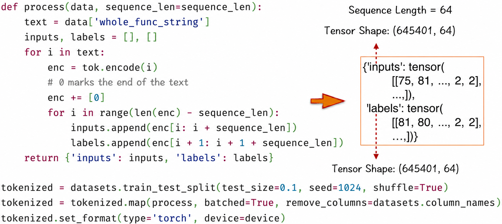
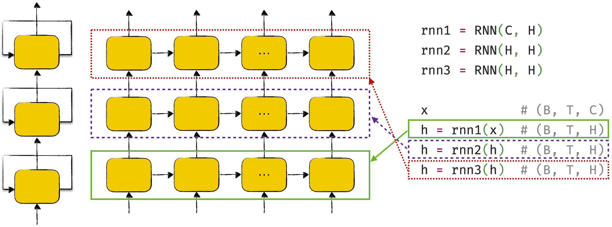
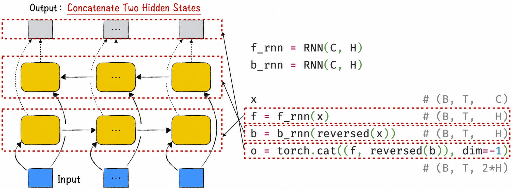
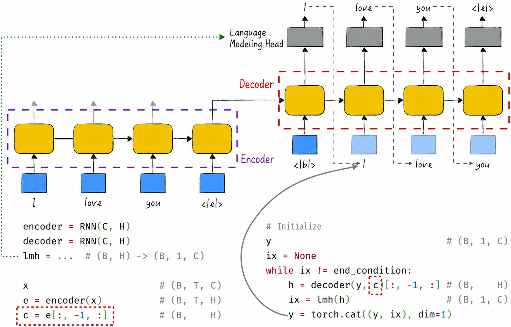
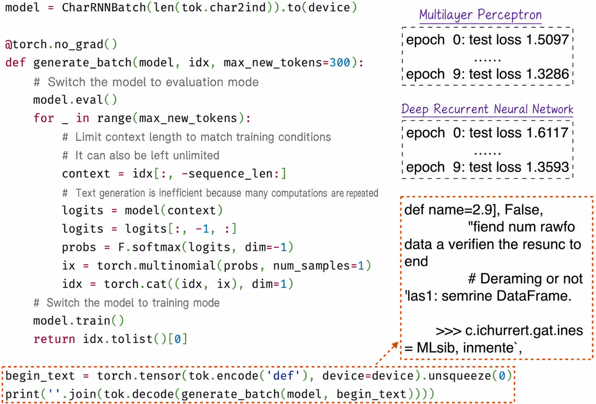

## 10.4 Deep Recurrent Neural Networks

[Section 10.3](/books/deconstructing_LLM/chapter-10/10-3) implemented the simplest possible single-layer recurrent neural network. This section examines how to construct more complex recurrent neural networks and apply them to natural language processing. Efficient and elegant code is the key to constructing complex models and is our next topic.

### 10.4.1 A More Elegant Implementation

Model training is based on gradient descent and its variants; see [Chapter 6](/books/deconstructing_LLM/chapter-6) for details. In each iteration of such an algorithm, we first select a batch of data, compute the model's loss on that batch, and perform backpropagation. Computations for different data points are independent and can run in parallel, and the same principle applies to recurrent neural networks.

Computations within the same sequence must be performed serially, but different sequences can still be processed in parallel. Characters in the same text, for example, must be processed in order, whereas different texts can be processed simultaneously. The key to improving the computational efficiency of a recurrent neural network is therefore to process a batch of sequences in parallel. Listing 10-6 shows the implementation, whose essential points are as follows.

1. The first step toward parallel computation is to combine a batch of data into a new, higher-dimensional tensor. Suppose the model input has shape $(B,T,C)$, as shown in Lines 10–13. $B$ is the batch size, $T$ is the sequence length, and $C$ is the feature length of each element. In natural language processing, $C$ generally represents the length of a text embedding. This computation assumes that all input sequences have the same length, but sequences of different lengths frequently occur in practice. [Section 10.4.2](/books/deconstructing_LLM/chapter-10/10-4#section-10-4-2) explains how to handle this detail so that the model can adapt flexibly to inputs of different lengths.
2. As discussed earlier, the model generates one hidden state for every element in the sequence. Its output therefore has shape $(B,T,H)$, as shown in Lines 22 and 23, where $H$ is the hidden-state length.
3. Because the sequence must be processed in a loop, the input tensor is transposed into shape $(T,B,C)$, as shown in Line 14. The loop that previously ran outside the model is then moved into the model. More specifically, Lines 11 and 12 of Listing 10-5 become Lines 17–20 of Listing 10-6 after small modifications.

#### Listing 10-6 A Batched Recurrent Neural Network ([Complete Code](https://github.com/GenTang/regression2chatgpt/blob/en/ch10_rnn/char_rnn_batch.ipynb))

```python
class RNN(nn.Module):

    def __init__(self, input_size, hidden_size):
        super().__init__()
        self.hidden_size = hidden_size
        self.i2h = nn.Linear(input_size + hidden_size, hidden_size)

    def forward(self, x, hidden=None):
        re = []
        # B: batch size
        # T: sequence length
        # C: number of channels
        B, T, C = x.shape
        x = x.transpose(0, 1)  # (T, B, C)
        if hidden is None:
            hidden = self.init_hidden(B, x.device)
        for i in range(T):
            # x[i]: (B, C); hidden: (B, H)
            combined = torch.cat((x[i], hidden), dim=1)
            hidden = F.relu(self.i2h(combined))  # (B, H)
            re.append(hidden)
        result_tensor = torch.stack(re, dim=0)   # (T, B, H)
        return result_tensor.transpose(0, 1)     # (B, T, H)

    def init_hidden(self, B, device):
        return torch.zeros((B, self.hidden_size), device=device)
```

Although this implementation has the same core as PyTorch's `nn.RNN`, their interfaces differ in several respects. Here, the first input dimension represents the batch size, which is not PyTorch's default. PyTorch also supports bidirectional and multilayer recurrent neural networks, whereas this implementation is single-layer and unidirectional.

### 10.4.2 Processing Batches of Sequential Data

The implementation above imposes a relatively strict requirement: all input sequences must have the same length. Two common methods allow the model to handle batches of sequences with different lengths.

One method is padding. Based on the longest sequence in the batch, special tokens fill the unused portions of the other sequences. This approach has several problems. First, computing on padding tokens is unnecessary and creates needless overhead. Second, the special padding tokens may confuse the model, which cannot tell which portions of the data it should not learn. PyTorch provides a series of functions, including `pack_padded_sequence` and `pad_packed_sequence`, to handle padded data and model computation more efficiently. Readers can consult the official documentation for details; space constraints prevent a fuller discussion here.

The other method is truncation. Set a text length $T$, and extract segments of that length from the text for training.

Large language models more commonly use truncation than padding, for two main reasons. First, although recurrent neural networks can process sequences of arbitrary length, they struggle with long-range dependencies. Extremely long sequences therefore provide little benefit for optimization; selecting an appropriate sequence length is more useful. Second, truncation makes it easy to learn from the same text many times. If the text has total length $L$, sliding a window across it produces $L-T+1$ overlapping sequence segments. This greatly expands the amount of training data and helps improve generalization.

Figure 10-18 shows one implementation of truncation, which we will use to prepare the training data. Careful readers may wonder whether it can handle texts shorter than $T$. It cannot: the implementation in Figure 10-18 does not cover this “special” case. It is an intuitive demonstration rather than a best practice.



In practice, truncation is usually performed more comprehensively as follows. Append a special ending token, such as `<|e|>`, to every text; concatenate all texts into one long string; and truncate that string. This method correctly handles a text shorter than $T$, although the resulting segment will contain the special ending token.

### 10.4.3 From One Layer to More Complex Architectures

The recurrent neural network implemented earlier has a single layer. Horizontally, it can unfold into a very wide architecture according to the input sequence, but vertically the network still has only one layer. Like a multilayer perceptron, a recurrent neural network can add layers to increase its expressive power. Stacking multiple recurrent-neural-network layers produces a deep RNN[^10-4-1], as shown in Figure 10-19. Its unfolded form is both wide and tall. From an engineering perspective, the model first transmits signals horizontally and then computes upward one layer at a time. This approach maximizes parallel processing and improves efficiency.



The model discussed earlier is not only single-layer but unidirectional: a unidirectional RNN processes the sequence from left to right in order. This assumes that the current data depends only on the preceding text to its left. The assumption does not always hold in practice. In English, for example, the choice between the articles `a` and `an` depends on the text to the right, as in `a boy` and `an example`.

A bidirectional RNN improves model performance, as shown in Figure 10-20. Its bidirectional design captures dependencies and patterns throughout a sequence more comprehensively, improving the model's ability to represent complex sequential data. In natural language processing, the autoregressive mode requires only a unidirectional recurrent neural network. In autoencoding mode, however, predicting masked content requires context on both the left and right, and generally calls for a bidirectional recurrent neural network.

The bidirectional recurrent neural network in Figure 10-20 still has only one layer; multiple layers can also be stacked to improve performance. In addition, its output uses tensor concatenation. This simple and intuitive technique appears frequently in many of the more complex neural networks discussed later.



Classified by input and output tensor shapes, all recurrent neural networks discussed so far accept variable-length input and produce variable-length output, corresponding to Label 3 in Figure 10-11. This type of model is called a standard recurrent neural network. It is broadly applicable and can be adapted to complex applications with simple modifications. As an example, we will use a standard recurrent neural network as the basis for a translation model, whose architecture is shown in Figure 10-21.



The model contains two standard recurrent neural networks, called the encoder and decoder[^10-4-2]. In Figure 10-21, the encoder reads a Chinese text one token at a time. It generates a corresponding hidden state for every input token. We are primarily interested in the final hidden state, which contains information about the complete text and is passed to the decoder.

The decoder operates differently from the encoder. Instead of generating an all-zero initial hidden state, it begins with the hidden state received from the encoder. The decoder's initial input sequence is the special beginning token `<|b|>`. As in text generation, the decoder appends its prediction to the input sequence and triggers the model again; this process depends on other model components, such as the language-modeling head `lmh` in Figure 10-21. Repeating this cycle allows the decoder to generate the target text step by step and complete the translation.

Classified by input and output shapes, the encoder maps variable-length input to fixed-length output, corresponding to Label 2 in Figure 10-11. The decoder maps fixed-length input to variable-length output, corresponding to Label 4. Together, the encoder and decoder form the structure indicated by Label 5.

### 10.4.4 Learning Language with a Deep Recurrent Neural Network

On the basis of the preceding discussion, we now construct a two-layer unidirectional recurrent neural network for language learning. Listing 10-7 presents the model in detail. To prevent overfitting, dropout is applied to each layer's output, as shown in Lines 16 and 17. This design has become nearly standard for recurrent neural networks in practice.

#### Listing 10-7 A Deep Recurrent Neural Network ([Complete Code](https://github.com/GenTang/regression2chatgpt/blob/en/ch10_rnn/char_rnn_batch.ipynb))

```python
class CharRNNBatch(nn.Module):

    def __init__(self, vs):
        super().__init__()
        self.emb_size = 256
        self.hidden_size = 128
        self.embedding = nn.Embedding(vs, self.emb_size)
        self.dp = nn.Dropout(0.4)
        self.rnn1 = RNN(self.emb_size, self.hidden_size)
        self.rnn2 = RNN(self.hidden_size, self.hidden_size)
        self.h2o = nn.Linear(self.hidden_size, vs)

    def forward(self, x):
        # x: (B, T)
        emb = self.embedding(x)      # (B, T, C)
        h = self.dp(self.rnn1(emb))  # (B, T, H)
        h = self.dp(self.rnn2(h))    # (B, T, H)
        output = self.h2o(h)         # (B, T, vs)
        return output
```

Compared with the experimental results in [Section 10.3.4](/books/deconstructing_LLM/chapter-10/10-3#section-10-3-4), the new model's predictions improve somewhat but remain unsatisfactory. As Figure 10-22 shows, its performance is comparable to that of the multilayer perceptron. The primary reason is that recurrent neural networks perform poorly on long-range dependencies, a problem examined in depth in [Section 10.5](/books/deconstructing_LLM/chapter-10/10-5).



With reference to Figure 10-19, the dropout used in this section acts on vertical signals in the neural network. This is not the only option: a similar operation can be applied to horizontal signals by introducing dropout on the hidden state. This method is called recurrent dropout.

Although PyTorch's implementation does not include recurrent dropout, the feature is not difficult to implement; only small modifications to Listing 10-6 are required. This example clearly demonstrates the flexibility of neural networks. It also confirms that we need not only understand the details of neural-network design, but also implement models in code. We can then add model components according to practical needs without being constrained by the development schedules and design choices of open-source tools.

[^10-4-1]: This model can also be called a multilayer recurrent neural network.
[^10-4-2]: The well-known Transformer language model likewise divides its basic architecture into two principal components: an encoder and a decoder.
