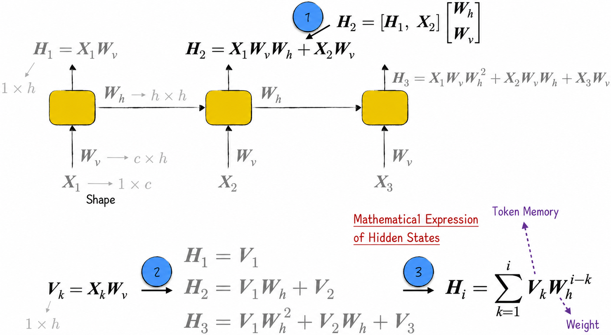
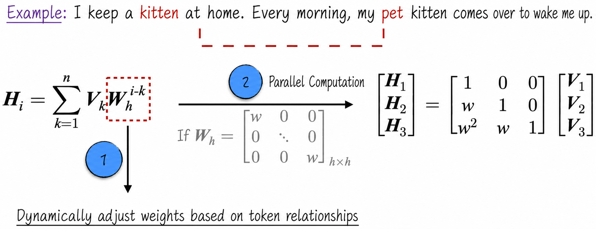
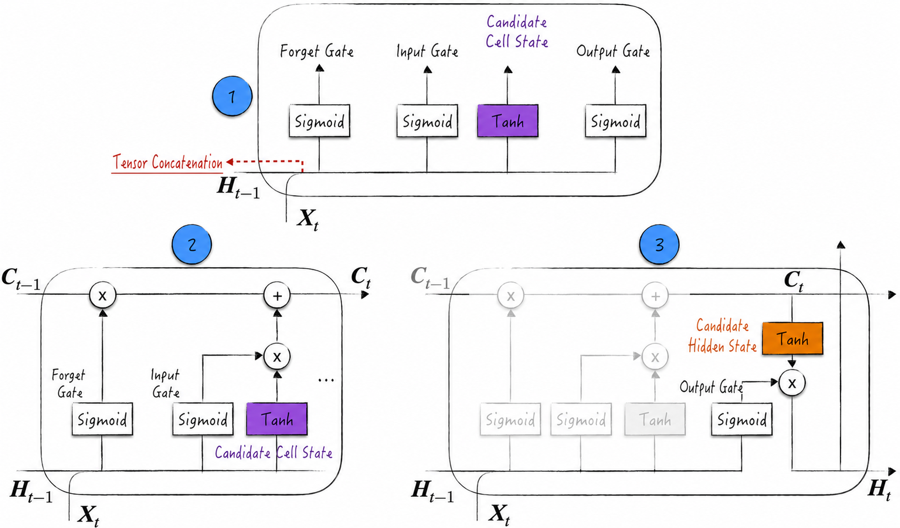
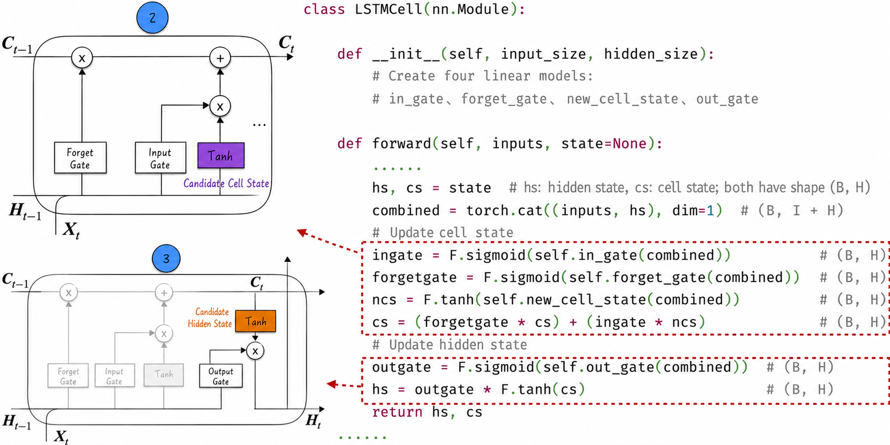
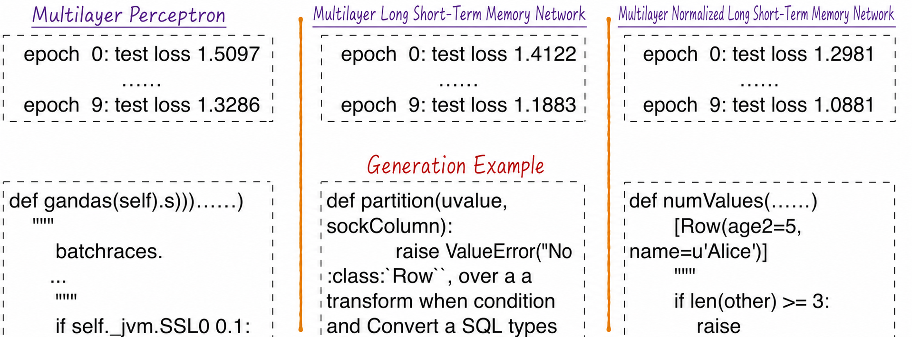

## 10.5 Long Short-Term Memory Networks

Standard recurrent neural networks perform poorly on long-range dependencies, limiting their applications in natural language processing and other fields. As the preceding discussion showed, such a model appears able to obtain information only from nearby data. This property is vividly called short-term memory. The classic long short-term memory (LSTM) network was introduced to address the problem[^10-5-1].

The name is somewhat unusual and often confusing. It should be parsed as a “long–short-term-memory network.” This phrasing accurately expresses the problem the model is intended to solve: how to retain short-term memory in the model for a long time so that it can process long-range dependencies more effectively.

LSTM is a relatively old model. Its design dates to 1995, and the formal paper was published in 1997. Although ingeniously designed, its complex architecture made it difficult to train, so for a long time it remained largely an academic research topic with few successful industry applications. As GPU computing and model-training techniques advanced, LSTM gradually found widespread use in speech recognition, text translation, gaming, and other fields. Its history demonstrates that neural networks are an intensely practical discipline. A successful model requires not only an elegant theoretical architecture but also an efficient engineering implementation, which is often even more important in real applications.

We now examine LSTM in depth and provide an implementation demonstrating its application to natural language processing.

### 10.5.1 Short-Term Memory

[Section 10.3.5](/books/deconstructing_LLM/chapter-10/10-3#section-10-3-5) provided an intuitive introduction to short-term memory from the perspective of backpropagation. Because we have not yet rigorously defined and discussed it mathematically, however, our understanding remains incomplete. Short-term memory is an extremely important problem in neural networks. It has inspired a series of famous models, including the long short-term memory network discussed here and today's highly sought-after large language models. This subsection therefore focuses on the mathematical principles behind short-term memory and possible solutions.

In a recurrent neural network, the hidden state is the basis for the model's predictions, but its memory is quite short. In natural language processing, for example, the hidden state at each step should theoretically be a feature representation of the text up to the current position. In practice, however, it records information from only the most recent tokens.

The use of an activation function to update hidden states makes the mathematics of short-term memory rather cumbersome. Ignoring the activation function, however, does not affect our understanding of the key issue or our conclusions[^10-5-2]. The following discussion therefore omits activation functions to simplify the derivation.

Figure 10-23 introduces several mathematical symbols. $\boldsymbol X_k$ denotes the input data and $\boldsymbol H_i$ the corresponding hidden state; their shapes are $1\times c$ and $1\times h$, respectively. To update the hidden state, the model concatenates the preceding hidden state and current input and then applies a linear transformation.

To clarify the update, let $\boldsymbol W_h$ represent the parameters that operate on the hidden state and $\boldsymbol W_v$ the parameters that operate on the input data. Matrix multiplication, as indicated by Label 1 in Figure 10-23, gives the hidden-state expression in Equation (10-1).

$$
\boldsymbol H_i=\sum_{k=1}^{i}\boldsymbol X_k\boldsymbol W_v\boldsymbol W_h^{i-k}
\tag{10-1}
$$



Now consider Label 2 in Figure 10-23. The computation introduces a new variable $\boldsymbol V_k$, equal to the product of $\boldsymbol X_k$ and $\boldsymbol W_v$. This variable depends only on the token itself, not its position in the text, so it can be regarded as the token's feature representation. On this basis, the mathematical expression for the hidden state can be rewritten as follows:

$$
\boldsymbol H_i=\sum_{k=1}^{i}\boldsymbol V_k\boldsymbol W_h^{i-k}
\tag{10-2}
$$

In Equation (10-2), $\boldsymbol W_h^{i-k}$ can be interpreted as a weight, making the hidden state a weighted average of all token features. More vividly, if $\boldsymbol V_k$ is the memory contributed by a token, then the hidden state is the sum of all token memories. Model parameters $\boldsymbol W_h$ are generally distributed near 0, causing $\boldsymbol W_h^{i-k}$ to approach 0 rapidly as a time step grows more distant. The hidden state therefore retains the memories of only nearby tokens. This is the short-term-memory phenomenon.

The equations reveal an unsatisfactory property of recurrent neural networks. The hidden state is the sum of all token memories, but the weight of each memory is determined primarily by distance, represented by the power term in Equation (10-2). At long distances, exponentiation causes the weight to shrink rapidly. The model cannot readily represent similarity between elements and therefore cannot process long-range dependencies effectively.

Consider the sentence, “I keep a kitten at home. Every morning, my pet kitten comes over to wake me.” When the model processes the word “pet,” it needs to establish a strong association with the earlier word “kitten.” In other words, “kitten” should have a large weight in the hidden state at this step, helping the model predict that the next token is also “kitten.” Equation (10-2), however, shows that the model cannot handle this long-range dependency effectively. Solving the problem requires redesigning the weights so that they better reflect relationships among tokens. This is the principal improvement introduced by the attention mechanism, which [Section 11.1.2](/books/deconstructing_LLM/chapter-11/11-1#section-11-1-2) discusses in detail.

If $\boldsymbol W_h$ is further restricted to a scalar matrix, the calculations for all hidden states can be expressed with matrix multiplication, as shown in Figure 10-24. Unlike the serial processing in a recurrent neural network—for example, Lines 17–21 of Listing 10-6—this calculation can run in parallel and is more efficient. From another perspective, multiplication by a lower-triangular matrix is to some extent equivalent to recurrent accumulation. Following this idea, we can adjust the recurrent part of a recurrent neural network to preserve its essential characteristics while improving computational efficiency. This is another innovation of the attention mechanism; see [Section 11.1.3](/books/deconstructing_LLM/chapter-11/11-1#section-11-1-3) for details.



### 10.5.2 Model Architecture

In a standard recurrent neural network, each neuron consists of a linear transformation and an activation function. The neuron receives the preceding hidden state and current input as two input tensors, computes the current hidden state, and emits it. The hidden state serves two purposes: it participates in calculating the next hidden state and predicts the label for the current data.

The principal improvement in an LSTM network lies in the neuron architecture. Unlike a standard recurrent neural network, LSTM introduces a more complex neuron with two key states: a cell state and a hidden state. The hidden state serves a role similar to its counterpart in a standard recurrent neural network, while the cell state transmits information over long distances. More specifically, an LSTM neuron receives three tensors: the preceding cell state, the preceding hidden state, and the current input. Its internal algorithm updates the cell and hidden states and produces the corresponding outputs. It is important to emphasize that generally only the hidden state is used to predict the label of the current data.

The computations of an LSTM neuron are relatively complex and are no longer a simple composition of linear and nonlinear transformations. The neuron must maintain and update two states while ensuring that the cell state transmits information effectively across long distances. To handle this task, the model introduces an important component: the gate. A gate determines which information should be retained and which should be forgotten.

Although the concept may seem abstract, it is mathematically clear. The process can be expressed as the tensor multiplication $\boldsymbol r=\boldsymbol g*\boldsymbol x$. Here, $\boldsymbol x$ is a $1\times h$ tensor representing candidate information, and $\boldsymbol g$ is another $1\times h$ tensor whose values range from 0 to 1. When a component of $\boldsymbol g$ equals 1, the information at the corresponding position in $\boldsymbol x$ is retained completely. When it equals 0, that information is forgotten completely. A component between 0 and 1 means that only part of the information is retained.

With the concept of gating in place, the model's computational process can be summarized as follows.

1. As in a standard recurrent neural network, concatenate the preceding hidden state and current input into a tensor, as indicated by Label 1 in Figure 10-25.
2. Update the cell state. From the concatenated tensor, the model generates two key gates: the forget gate and the input gate. It also generates a candidate cell state from the same tensor. Finally, the preceding cell state, forget gate, input gate, and candidate cell state are combined to produce the new cell state, as indicated by Label 2 in Figure 10-25.
3. Update the hidden state. The model generates a candidate hidden state from the updated cell state and an output gate from the concatenated tensor. Together, they produce the final hidden state, as indicated by Label 3 in Figure 10-25.



Applying this process to natural language processing makes the different roles of the cell and hidden states clearer. The cell state does not interact directly with the current input and therefore primarily stores knowledge about the text. The hidden state, by contrast, works closely with the current input and focuses on processing new information, including generating new information and updating textual knowledge. This clear division of labor skillfully balances long-term accumulation with short-term processing, allowing the model to handle long-range dependencies efficiently.

The preceding architectural discussion may be confusing to beginners. The model diagram appears quite complicated and difficult to understand, while the lengthy mathematical derivation may seem abstract. To clarify the details, we will translate the diagram into code. This is often the best way to understand a model: although the architecture looks complicated, its implementation is comparatively clear.

### 10.5.3 Code Implementation

At the core of an LSTM neuron are its two states, the cell state and hidden state. Implementations generally represent them with tensors of the same shape. Tensors of different shapes could be used, but would only increase code complexity without practical benefit. Under this assumption, Figure 10-26 shows the core implementation of the neuron ([Full Code](https://github.com/GenTang/regression2chatgpt/blob/en/ch10_rnn/lstm.ipynb)). Although its structure looks complex, its basic elements remain linear models and nonlinear transformations.



We begin by implementing the gate, the core component. Because gate outputs range from 0 to 1, they are implemented as a linear model followed by a Sigmoid function. The variables `ingate`, `forgetgate`, and `outgate` in Figure 10-26 correspond to the input, forget, and output gates. These gates play crucial roles in controlling the flow of information and updates to the cell state.

Next, consider the cell-state update in the context of natural language processing. A candidate cell state, `ncs`, is first generated with a Tanh function and linear model. The product of the input gate and candidate cell state can be understood as newly added textual knowledge, while the product of the forget gate and cell state `cs` represents textual knowledge retained from the preceding step. Adding the two produces the new cell state.

Two points are particularly important in this update.

1. Choice of activation function: Unlike the Sigmoid functions in the gates[^10-5-3], the Tanh function here is the neuron's activation function. It can therefore be replaced as needed by another activation function, such as the more efficient ReLU[^10-5-4]. In an ordinary neuron, the activation function's output is also the neuron's output. Here, the activation output must pass through a gate before it becomes the final neuron output. Because each neuron has two outputs, the activation function generates both the candidate cell state and the candidate hidden state. Changing the activation function therefore requires changes in both places.
2. Two-component design: During the cell-state update, the model uses two components to express new textual knowledge. This may seem puzzling because the input gate and candidate cell state receive the same input and output tensors of the same shape. Why not generate the new knowledge with a single model? The design simulates two processes by which humans acquire knowledge: extracting knowledge from new information and deciding which new knowledge should be stored for the long term. This is not the only correct design. Subsequent research has produced improvements and variants of LSTM, some of which omit the input gate[^10-5-5]. This example demonstrates how neural networks, as a practical discipline, differ from other scientific and engineering fields. There is often no absolute right or wrong. Provided that the broad idea is sound, structural details may have little effect on the result. Human learning is similar: everyone learns differently, but people who move in the right direction can achieve comparable results.

Updating the hidden state is similar to updating the cell state, so we will not discuss the process in detail.

### 10.5.4 Learning Language with a Long Short-Term Memory Network

Once the neuron has been implemented, constructing an LSTM network becomes relatively straightforward and strongly resembles constructing a recurrent neural network, so the individual steps are not shown here. A warning is nevertheless warranted: ensuring implementation accuracy is challenging for complex models. Some mathematical errors do not prevent the program from running, making them difficult to detect. One effective method is to find another implementation and compare its computational results with our own. Deep-learning frameworks such as PyTorch provide implementations of classic models, and comparison with them can ensure correctness. The process also deepens the reader's understanding of the model and familiarity with open-source tools. Concrete steps are available in the book's companion code.

To learn the Python language, we construct the multilayer LSTM network[^10-5-6] shown in Listing 10-8. In addition to dropout, we introduce normalization layers to improve training efficiency; see [Section 8.5.4](/books/deconstructing_LLM/chapter-8/8-5#section-8-5-4) for details. These improvements appear in Lines 23–25. Other training-optimization techniques could be added, but normalization layers are particularly worthy of discussion for LSTM networks and recurrent neural networks more generally.

#### Listing 10-8 A Multilayer Long Short-Term Memory Network ([Full Code](https://github.com/GenTang/regression2chatgpt/blob/en/ch10_rnn/lstm.ipynb))

```python
class LSTM(nn.Module):
    ...

class CharLSTM(nn.Module):

    def __init__(self, vs):
        super().__init__()
        self.emb_size = 256
        self.hidden_size = 128
        self.embedding = nn.Embedding(vs, self.emb_size)
        self.dp = nn.Dropout(0.4)
        self.lstm1 = LSTM(self.emb_size, self.hidden_size)
        self.norm1 = nn.LayerNorm(self.hidden_size)
        self.lstm2 = LSTM(self.hidden_size, self.hidden_size)
        self.norm2 = nn.LayerNorm(self.hidden_size)
        self.lstm3 = LSTM(self.hidden_size, self.hidden_size)
        self.norm3 = nn.LayerNorm(self.hidden_size)
        self.h2o = nn.Linear(self.hidden_size, vs)

    def forward(self, x):
        # x: (B, T)
        emb = self.embedding(x)                   # (B, T, C)
        h = self.norm1(self.dp(self.lstm1(emb)))  # (B, T, H)
        h = self.norm2(self.dp(self.lstm2(h)))    # (B, T, H)
        h = self.norm3(self.dp(self.lstm3(h)))    # (B, T, H)
        output = self.h2o(h)                      # (B, T, vs)
        return output
```

First, normalization layers can be divided into layer normalization and batch normalization. Recurrent neural networks generally use layer normalization. Batch normalization computes a mean and standard deviation from data in the same batch and then uses them to normalize that data. It implicitly assumes that data points in the same batch are similar. This assumption generally does not hold for sequential data. In natural language processing, for example, the same character can have entirely different meanings at different positions in a text, so normalizing data from different positions together is theoretically inappropriate. Computing separate statistics for each position does not solve every difficulty with batch normalization: if the model later encounters a sequence longer than every sequence in the training data, batch normalization cannot readily handle it.

Second, normalization layers can be added after every layer, as above. This does improve training efficiency, but departs somewhat from the original motivation behind normalization: ensuring that the activation functions in different layers receive similarly distributed inputs and thereby accelerating model training. Best practice is therefore to place normalization directly before the activation function rather than between model layers.

This best practice suggests embedding normalization within the neuron. More specifically, the LSTM neuron must be redesigned, as shown in Listing 10-9. Pay particular attention to Line 20, where normalization is applied before the nonlinear transformation[^10-5-7]. The input gate, forget gate, candidate cell state, and output gate all receive the same input, so their four linear transformations can be combined, as shown in Lines 8 and 9. The `chunk` function in Line 20 separates them when needed. This implementation pattern is common in PyTorch and other open-source tools and makes code clearer and more concise.

#### Listing 10-9 A Normalized Long Short-Term Memory Network ([Full Code](https://github.com/GenTang/regression2chatgpt/blob/en/ch10_rnn/lstm.ipynb))

```python
class LSTMLayerNormCell(nn.Module):

    def __init__(self, input_size, hidden_size):
        super().__init__()
        self.input_size = input_size
        self.hidden_size = hidden_size
        combined_size = self.input_size + self.hidden_size
        self.gates = nn.Linear(
            combined_size, 4 * self.hidden_size, bias=False)
        self.ln_gates = nn.LayerNorm(4 * self.hidden_size)
        self.ln_c = nn.LayerNorm(self.hidden_size)

    def forward(self, inputs, state=None):
        B, _ = inputs.shape  # (B, I)
        # state: ((B, H), (B, H))
        if state is None:
            state = self.init_state(B, inputs.device)
        hs, cs = state
        combined = torch.cat((inputs, hs), dim=1)  # (B, I + H)
        i, f, c, o = self.ln_gates(self.gates(combined)).chunk(4, 1)
        ingate = F.sigmoid(i)      # (B, H)
        forgetgate = F.sigmoid(f)  # (B, H)
        outgate = F.sigmoid(o)     # (B, H)
        # Update the cell state
        ncs = F.tanh(c)            # (B, H)
        cs = self.ln_c((forgetgate * cs) + (ingate * ncs))  # (B, H)
        # Update the hidden state
        hs = outgate * F.tanh(cs)  # (B, H)
        return hs, cs
    ...
```

Training both models on the same data produces similar results, as shown in Figure 10-27[^10-5-8]. Embedding normalization within the neuron is more effective and better aligned with the design principles of normalization layers.

The use of normalization layers reflects two seemingly contradictory properties of neural networks. On the one hand, neural networks are extremely flexible: provided that input and output tensor shapes match, model components can be combined freely. With very few exceptions, there is almost no absolutely correct or incorrect architecture, leaving ample room for creativity and imagination. On the other hand, every model component has implicit best practices that require a deep understanding of its details. Only by following those practices as closely as possible can we realize the component's full potential.



[^10-5-1]: The model's creators were German scholars, and its name reflects the German tendency to form compound words.
[^10-5-2]: Recurrent neural networks generally use ReLU as their activation function. For inputs greater than 0, ReLU acts as an identity transformation; for inputs below 0, it maps them to 0. Mapping a negative value to 0 represents complete forgetting and further aggravates the short-term-memory problem. If the activation function is Tanh, its derivative near 0 is 1, so it likewise approximates an identity transformation.
[^10-5-3]: The Sigmoid function's principal role in the model is to filter information. By definition, a gate's output is restricted to the range 0–1, so this function is generally difficult to replace. Some literature also calls Sigmoid the gating activation function.
[^10-5-4]: ReLU had not yet been developed when the LSTM network was invented. It is nevertheless almost certain that using ReLU in the model would improve performance.
[^10-5-5]: Over nearly three decades, LSTM networks have retained their core idea while their specific architecture and components have undergone many evolutions and improvements. When studying neural networks, we should therefore think flexibly and understand the underlying principles rather than memorize network architectures and mathematical formulas.
[^10-5-6]: This model contains hundreds of thousands of parameters and takes considerable time to compute on a CPU, yet it is still a very “miniature” model in natural language processing.
[^10-5-7]: There are other ways to embed normalization within a neuron. For example, the current input and hidden state can be processed separately, each with its own linear transformation and normalization.
[^10-5-8]: This is not the model's limit; continued training can further improve its predictions. Moreover, although dropout reduces the risk of overfitting, overfitting remains common as model size increases. Penalty terms can be added to the loss function to address the problem; see [Section 9.1.5](/books/deconstructing_LLM/chapter-9/9-1#section-9-1-5) for details.
