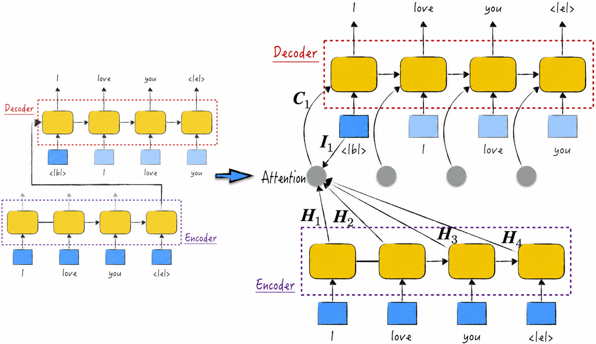
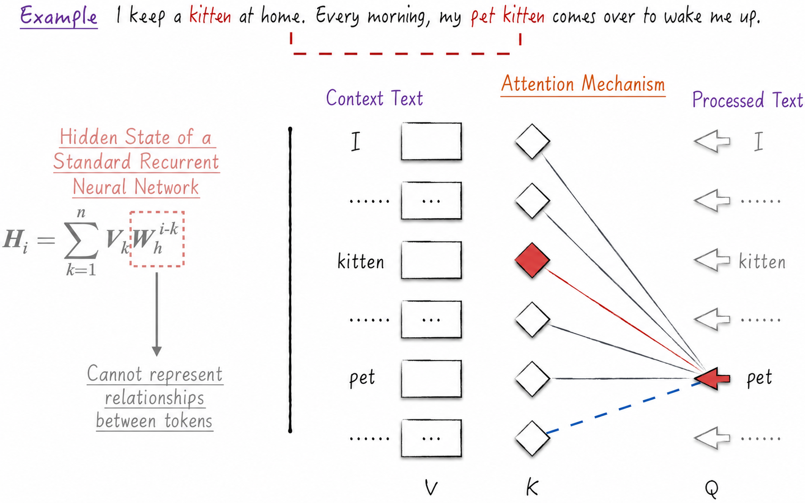
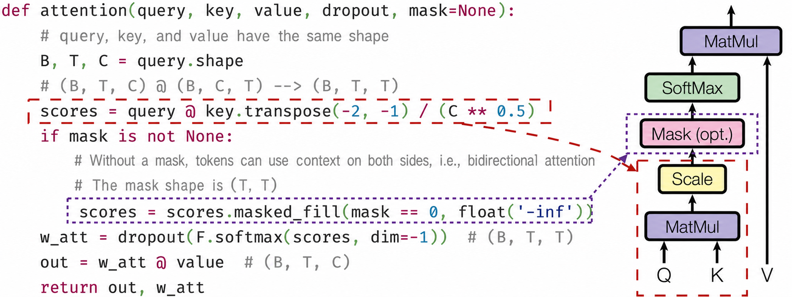
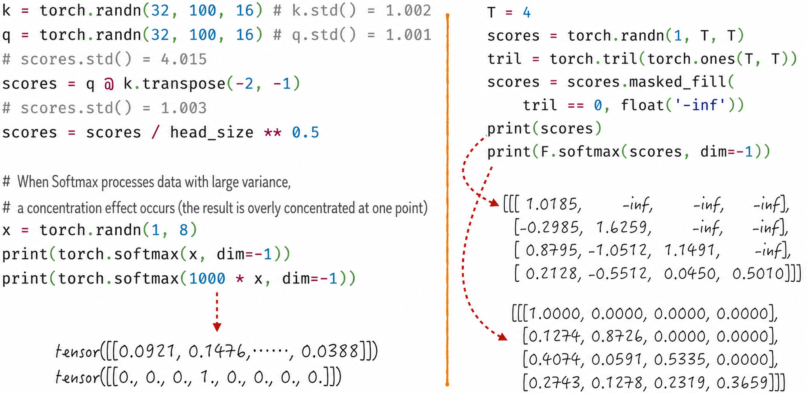

## 11.1 The Attention Mechanism

The most important design in a large language model is the attention mechanism. It efficiently captures the intricate dependencies in language and enables the model to understand language deeply. As [Chapter 10](/books/deconstructing_LLM/chapter-10) noted, language is the dwelling place of human intelligence. Once a model can understand language well—especially multiple languages—it can understand the human intelligence encoded within them. This partly explains the model's remarkable performance across many fields[^11-1-1].

We begin by tracing the history of attention and introducing its original motivation. We then examine how it varies among different training modes, including autoregressive, autoencoding, and sequence-to-sequence modes; see [Section 10.1.5](/books/deconstructing_LLM/chapter-10/10-1#section-10-1-5). Finally, we use a code example to implement attention efficiently, laying the foundation for constructing a large language model.

### 11.1.1 Original Motivation

The attention mechanism was originally designed to solve translation problems. [Section 10.4.3](/books/deconstructing_LLM/chapter-10/10-4#section-10-4-3) briefly introduced the encoder–decoder architecture, shown on the left of Figure 11-2; see Figure 10-21 for details. It contains two standard recurrent neural networks that work together and are generally used for translation. The architecture has an obvious weakness, however: the only interaction between its two components is the hidden state—a single vector—that the encoder passes to the decoder after processing the complete input. In anthropomorphic terms, the encoder reads a text and condenses its knowledge into a vector, and the decoder uses that vector to translate the text into another language. The most important assumption in this process is that a single vector can completely represent a text. In other words, regardless of its length, all content in the text can be compressed into one vector. This is clearly unreasonable, especially for long texts, because substantial information can easily be lost.

Researchers therefore improved the architecture by introducing the attention mechanism. The original encoder–decoder architecture transmitted information through a single hidden state, limiting model performance. Attention instead allows the hidden state produced by the encoder at every step to participate directly in the decoder's computation, as shown on the right of Figure 11-2.

More specifically, attention uses the current input and all hidden states from the encoder to compute an additional context vector that assists the decoder's prediction. The process consists of three key steps.

1. Compute alignment scores: A crucial task in translation is determining which position in the source text is most relevant to the content that should be translated next. In Figure 11-2, for example, when the decoder input is “I,” it must correctly determine that the next translation should align with “爱” (“love”) in the source text. To accomplish this, pair the decoder's current input with every hidden state from the encoder and compute the corresponding alignment scores[^11-1-2]. Using the notation in the figure, this process is expressed by Equation (11-1).

$$
s_{i,j}=f(\boldsymbol I_i,\boldsymbol H_j)
\tag{11-1}
$$

2. Convert alignment scores into weights: The magnitude of an alignment score reflects how much attention the translation process should assign to the corresponding position, giving the mechanism its name. Every position has an alignment score, which must be converted into weights whose sum is 1 and whose components are all positive. The Softmax function is generally used for this purpose. The complete conversion is expressed by Equation (11-2).

$$
\begin{aligned}
\boldsymbol W_i &= \operatorname{Softmax}(\boldsymbol S_i) \\
\boldsymbol W_i &= (w_{i,1},w_{i,2},\cdots,w_{i,n});\quad
\boldsymbol S_i=(s_{i,1},s_{i,2},\cdots,s_{i,n})
\end{aligned}
\tag{11-2}
$$

3. Take a weighted average to obtain the context vector: The encoder's hidden states contain semantic information. Take their weighted average using the weights from Step 2 to obtain the context vector. By combining the locations of attention with the corresponding semantic information, the context vector provides an excellent feature representation for translation. Equation (11-3) gives the details[^11-1-3].

$$
\boldsymbol C_i=\sum_{j=1}^{n}w_{i,j}\boldsymbol H_j
\tag{11-3}
$$

This is the original attention mechanism[^11-1-4]. The design considers two texts at once: an input and an output. For each token in the output text—readers can think of a token simply as a Chinese or English word, although [Section 10.1.2](/books/deconstructing_LLM/chapter-10/10-1#section-10-1-2) provides the precise definition—we locate the relevant attention positions in the input text. This setup restricts the mechanism to sequence-to-sequence mode. To apply the ingenious design more broadly, researchers developed a more general attention mechanism, the focus of [Section 11.1.2](/books/deconstructing_LLM/chapter-11/11-1#section-11-1-2).

### 11.1.2 The Improved Attention Mechanism

Taken together, Equation (11-1) through Equation (11-3) reveal that the essence of attention is feature extraction: finding a better feature representation of the text, namely the context vector. Although the hidden state at each step represents the text well, it also participates in computing the weights. This dual role can prevent it from performing either task optimally and impair model performance. To solve the problem, we temporarily leave the recurrent-neural-network framework and use the three equations above to design an improved attention mechanism.

The improved mechanism still distinguishes between a context text and a text being processed, but the two may now be the same. Introduce three vectors for each token: a query, key, and value, denoted Q, K, and V, respectively, as shown in Figure 11-3. The final feature representation is obtained as follows.

1. Use Q and K to compute alignment scores between tokens. More specifically, match the current input in the text being processed, represented by Q, with every token in the context text, represented by K, and take their inner products to obtain the alignment scores.
2. Compute a weight vector from the alignment scores.
3. Use the weight vector to compute a weighted combination of V, producing the context vector.

The central steps of attention involve the three vectors Q, K, and V. Q represents the information that the current token needs to query, K represents the token's contextual information in the text, and V represents the token's own features. In plain language, attention can therefore be understood as follows: the feature representation of a text is a weighted average of token features, with the weights primarily reflecting relationships among tokens. This mechanism avoids a shortcoming of standard recurrent neural networks—their difficulty capturing relationships among tokens effectively; see the left side of Figure 11-3 and [Section 10.5.1](/books/deconstructing_LLM/chapter-10/10-5#section-10-5-1) for details. Notably, the formula for the context vector—see Equation (11-3)—strongly resembles the hidden state, so attention can also be regarded as a member of the recurrent-neural-network family.

The improved mechanism places no restriction on the application. When the processed text and context text differ, the algorithm is called cross-attention and is used in sequence-to-sequence mode. When they are the same, it is called self-attention and is used in autoregressive and autoencoding modes. The two modes differ as follows. In autoregressive mode, the model attends only to alignment scores for tokens to the left of the current token; the dashed region in Figure 11-3 is forced to 0. This is called unidirectional attention. In autoencoding mode, alignment-score computation has no such restriction; the dashed region is computed normally. This is called bidirectional attention.

### 11.1.3 Mathematical Details and Implementation Techniques

Having introduced the core steps of attention, we now examine its mathematical details and an efficient implementation.

The improved mechanism defines the inner product of two vectors as their alignment score, allowing attention to be implemented with tensor operations. Figure 11-4 presents the detailed algorithm and code. The preceding theoretical discussion considered only one token, but an implementation should maximize computational efficiency. Suppose `query`, `key`, and `value` all have shape (B, T, C), where B is the batch size, T the text length, and C the length of the token features. Under this setup, the code in Figure 11-4 processes a batch in parallel, a substantial improvement over a traditional recurrent neural network.

The algorithm in Figure 11-4 is called scaled dot-product attention[^11-1-5]. Its computation contains two important details—scaling and masking, as shown in the figure—that have major effects on both model results and computational efficiency.

- Scaling: An alignment score is the inner product of two vectors, so its variance increases with vector length. When the input to Softmax has high variance, the resulting weight distribution becomes overly concentrated at one point, as shown on the left of Figure 11-5, which is clearly undesirable. After the inner product is computed, the alignment scores must therefore be normalized so that their variance is 1.
- Masking: In autoregressive mode, a token can use only the preceding text shown on the left of Figure 11-5. Mathematically, the weight matrix used for the weighted average must therefore be causal. We use the following technique: set the elements above the diagonal in the alignment-score matrix to negative infinity, or to negative numbers with very large absolute values. Applying Softmax then produces the desired triangular weight matrix, as shown on the right of Figure 11-5.

[^11-1-1]: Large language models perform exceptionally well in many other fields. So far, however, the question of why these models perform so well remains disputed and has no definitive answer. This is one explanation, and the author is inclined to support it. Interested readers are encouraged to consult other explanations in the literature for a deeper understanding of the subject.
[^11-1-2]: Alignment scores can be computed in several ways. One intuitive method is to take the inner product of the current input vector and hidden-state vector. A simple neural network can also be constructed to perform the calculation.
[^11-1-3]: As discussed in [Section 10.4.1](/books/deconstructing_LLM/chapter-10/10-4#section-10-4-1), a hidden state can be interpreted as a sum of token features, making its form strongly resemble Equation (11-3). The context vector can therefore be regarded as an improved and upgraded hidden state, and using it as an input to a recurrent neural network is entirely reasonable.
[^11-1-4]: This design comes from the paper “Neural Machine Translation by Jointly Learning to Align and Translate.”
[^11-1-5]: This is one of the best-known attention mechanisms and comes from the paper “Attention Is All You Need.” Other variants follow similar core principles and design ideas. As emphasized when discussing long short-term memory networks in [Section 10.4.3](/books/deconstructing_LLM/chapter-10/10-4#section-10-4-3), the key to understanding a neural network is to grasp its core ideas rather than memorize a particular architecture and formulas.
