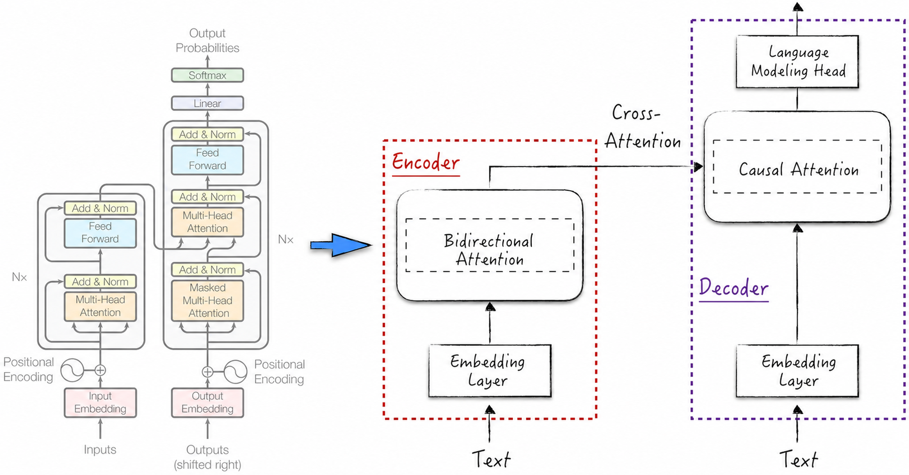
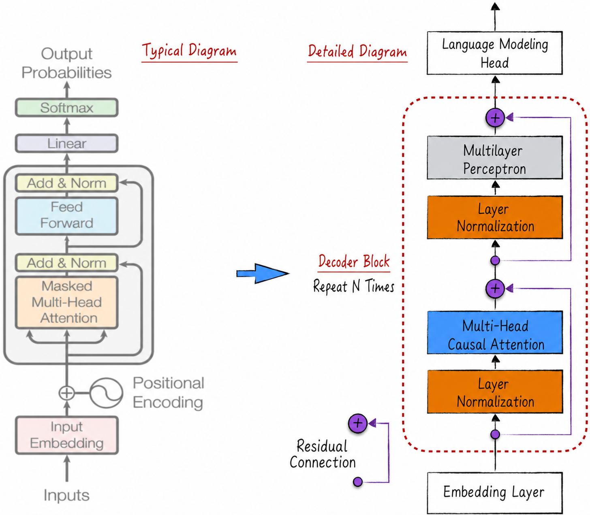
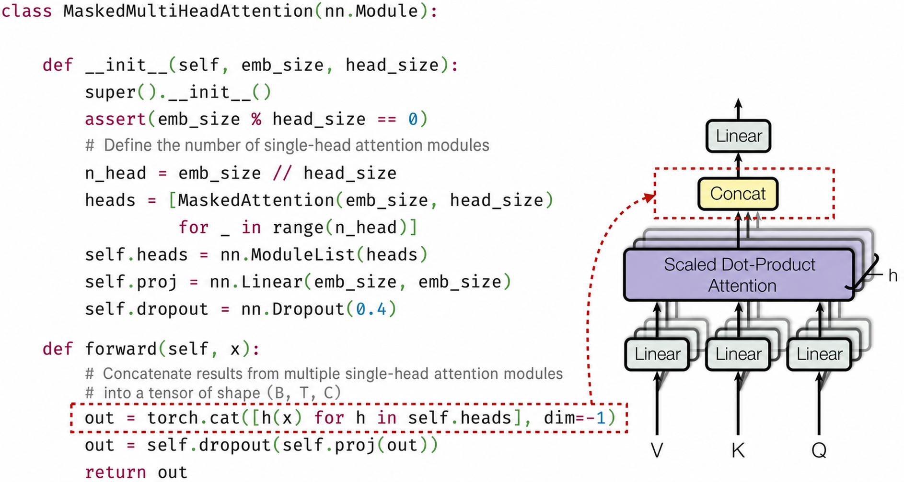
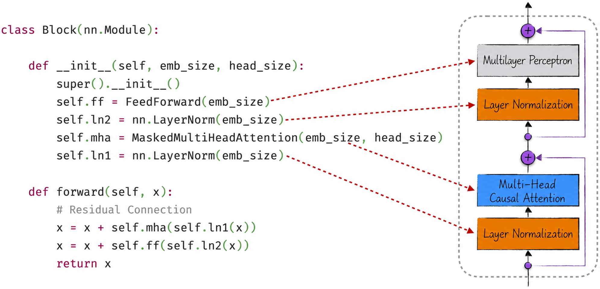
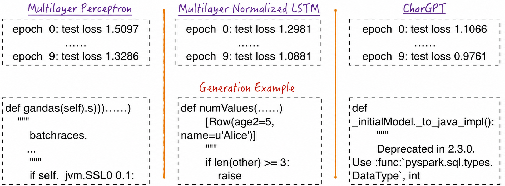

## 11.2 Implementing GPT-2 from Scratch

As its name suggests, the commercial term *large language model* emphasizes a shared characteristic of these models: they are large. This manifests itself in three principal ways. First, they have enormous numbers of parameters, generally ranging from billions to hundreds of billions. Second, training them requires enormous datasets, with corpora often totaling trillions of tokens. Finally, because of the first two factors, training costs are extremely high. In 2023, training a state-of-the-art large language model from scratch required thousands of specialized servers and cost millions of dollars.

Technically, a large language model has no precise definition. The term generally refers to a neural-network model that incorporates attention and is used for natural language processing. Although LLM architectures vary substantially, historically they share a common ancestor: the Transformer. The left side of Figure 11-6 shows its detailed architecture, reproduced from the original Transformer paper and widely cited in the literature. The diagram contains so much detail that readers may lose their way. This book therefore prefers the simplified diagram on the right, which makes the overall architecture easier to understand.

The Transformer has a complete encoder–decoder architecture and is therefore generally applied in sequence-to-sequence mode[^11-2-1]. From the perspective of attention, it contains three types: bidirectional attention in the encoder, unidirectional attention in the decoder, and cross-attention that enables the encoder and decoder to work together.

The complex architecture improves performance on tasks such as translation but also limits the range of applications. Two distinct simplifications extend it more broadly. One uses only the encoder in Figure 11-6 and therefore only bidirectional attention. It is generally used in autoencoding mode, and BERT is its best-known representative. The other uses only the decoder and therefore only unidirectional attention. It is generally used in autoregressive mode, and GPT is its best-known representative[^11-2-2].



Structurally, GPT-style unidirectional-attention models are the simplest. They are also the most convenient to implement and to prepare training data for. Perhaps for this reason, they have achieved the most striking successes. This chapter therefore focuses on the classic representative of this family, GPT-2. From a practical perspective, more capable unidirectional-attention models exist, but they are generally too large to run on an ordinary home computer, much less train on one. GPT-2, by contrast, is moderately sized and can run on a home computer. We can download, use, or modify it to better understand its principles. Model training should nevertheless preferably be performed on a server equipped with GPUs; training on a home computer can take an extremely long time.

This chapter constructs GPT-2 from scratch[^11-2-3] to give readers a deep understanding of its key structures and implementation techniques. Large language models share certain architectural features, so mastering the implementation of GPT-2 also provides the ability to implement other LLMs.

### 11.2.1 Model Architecture

At a high level, GPT-2 consists of three principal parts, from bottom to top: embedding layers, a repeated sequence of decoder blocks, and a language-modeling head, as shown on the right of Figure 11-7. The decoder block is crucial and contains four core elements: masked multi-head self-attention, residual connections, layer normalization, and a multilayer perceptron[^11-2-4]. Multilayer perceptrons are relatively familiar. Residual connections and layer normalization are key techniques for improving training; see [Section 8.5.4](/books/deconstructing_LLM/chapter-8/8-5#section-8-5-4) and [Section 9.3.1](/books/deconstructing_LLM/chapter-9/9-3#section-9-3-1) for details. Masked multi-head self-attention may be less familiar, but it is simply an improved form of self-attention and can initially be understood as ordinary attention. Before examining the details, let us consider the model's distinctive features at a higher level.

GPT-2 diagrams, especially those of the decoder block, differ substantially from traditional neural-network diagrams. Early neural-network researchers generally constructed models from a biomimetic perspective and therefore introduced concepts such as neurons, full connectivity, and hidden layers. As research progressed, scholars discovered that the essence of a neural network is the layered composition of linear computations and nonlinear transformations. Researchers then broke through the limitations of conventional neuron connections to design convolutional and recurrent neural networks. They also modified the internal structure of neurons to create long short-term memory networks.

The GPT-2 decoder block continues this line of innovation. Its internal architecture is difficult to represent with a traditional diagram, but this does not matter because the design preserves the core principles of neural networks. As [Section 11.1.3](/books/deconstructing_LLM/chapter-11/11-1#section-11-1-3) explained, attention involves only linear computations, as do layer normalization and residual connections. The complete decoder block is therefore a composition of linear computations and nonlinear transformations. Its nonlinear transformation comes from the multilayer perceptron, one reason the decoder block contains that component.

By analogy, attention is an improvement on recurrent neural networks. Although a diagram cannot represent it precisely, the decoder block effectively combines a recurrent neural network and a multilayer perceptron. When understanding complex neural networks, readers should not remain confined to traditional diagrams. Instead, they should understand the role of each computational step, which leads to a deeper understanding of the model.

Other literature frequently depicts GPT-2 in the form shown on the left of Figure 11-7. This diagram follows the classic Transformer style and makes the principal components easy to understand, but it is not GPT-2's exact architecture. The most important difference between the two sides of Figure 11-7 is the position of layer normalization. On the left, attention or the multilayer perceptron is computed first, followed by the residual connection and layer normalization. This architecture is called Post-Norm. On the right, the input is normalized first and then passed into attention or the multilayer perceptron. This is called Pre-Norm. The original Transformer uses Post-Norm, whereas GPT-2 uses Pre-Norm.

The position of layer normalization may appear to be a minor architectural detail, but it substantially affects training. Research shows that at initialization, Post-Norm can produce excessively large gradients near the output and therefore generally depends more heavily on learning-rate warmup and careful hyperparameter selection. Pre-Norm has more stable gradients at initialization and generally makes deep models easier to train. GPT-2, GPT-3, and many subsequent LLMs therefore use Pre-Norm or closely related normalization schemes[^norm].



### 11.2.2 Masked Multi-Head Attention

Masked multi-head attention combines multiple masked single-head attention components. For clarity, we can call the mechanism discussed in [Section 11.1.3](/books/deconstructing_LLM/chapter-11/11-1#section-11-1-3) single-head attention. Listing 11-1 implements a masked single-head attention component. Two points require attention.

1. Attention requires three key inputs: `query`, `key`, and `value`. The model generates these vectors with three independent linear models, as shown in Lines 8–10 and 17–20. Because the model uses layer normalization, none of the three linear models needs an intercept.
2. Implementing unidirectional attention requires a triangular matrix—the `mask`. See Lines 12, 13, and 21 for details. GPT-2 limits the length of text it can process; [Section 11.2.4](/books/deconstructing_LLM/chapter-11/11-2#section-11-2-4) explains why. To improve computational efficiency, the parameter `sequence_len` is used when the model is constructed to generate in advance a matrix `tril` that covers the maximum text length. The matrix merely assists the attention computation and does not need to participate in training. `register_buffer` records it accordingly.

#### Listing 11-1 Masked Single-Head Attention ([Complete Code](https://github.com/GenTang/regression2chatgpt/blob/en/ch11_llm/char_gpt.ipynb))

```python
def attention(query, key, value, dropout, mask=None):
    ...

class MaskedAttention(nn.Module):

    def __init__(self, emb_size, head_size):
        super().__init__()
        self.key = nn.Linear(emb_size, head_size, bias=False)
        self.query = nn.Linear(emb_size, head_size, bias=False)
        self.value = nn.Linear(emb_size, head_size, bias=False)
        # This triangular matrix does not participate in model training
        self.register_buffer(
            'tril', torch.tril(torch.ones(sequence_len, sequence_len)))
        self.dropout = nn.Dropout(0.4)

    def forward(self, x):
        B, T, C = x.shape  # C = emb_size
        q = self.query(x)  # (B, T, H)
        k = self.key(x)    # (B, T, H)
        v = self.value(x)  # (B, T, H)
        mask = self.tril[:T, :T]
        out, _ = attention(q, k, v, self.dropout, mask)
        return out         # (B, T, H)
```

Functionally, a masked single-head attention component primarily performs feature extraction. To extract feature information as comprehensively as possible, multi-head attention repeats this operation. Given the same input, it uses multiple single-head components with identical architectures but different model parameters to extract features[^11-2-5], then concatenates[^11-2-6] and maps the resulting tensors.

From the perspective of tensor shapes, the model uses residual connections, so the attention component should preferably have the same input and output shapes. A single-head component does not guarantee this; its output is generally smaller than its input. Multi-head attention can ensure consistency by concatenating multiple tensors.

On this basis, Figure 11-8 implements masked multi-head attention. The code is relatively simple and easy to understand, but it is not the most efficient implementation. Careful readers may notice a loop inside the red box and another used to generate `self.heads`. These loops impede parallel computation and reduce efficiency. A more efficient implementation expresses the “multi-head” operation as tensor computations; Listing 10-9 in [Section 10.5.4](/books/deconstructing_LLM/chapter-10/10-5#section-10-5-4) provides an analogous technique.



### 11.2.3 Decoder Blocks

The multilayer perceptron in a decoder block[^11-2-7] differs slightly from a traditional multilayer perceptron. As Listing 11-2 shows, it contains two linear computations and one nonlinear transformation[^11-2-8], whereas a traditional multilayer perceptron generally pairs one linear computation with one nonlinear transformation. The decoder block's multilayer perceptron can be divided into two parts: a classic single-layer perceptron followed by a linear projection. The second part both performs linear learning and ensures that the component's input and output tensor shapes match[^11-2-9].

#### Listing 11-2 The Multilayer Perceptron in a Decoder Block ([Complete Code](https://github.com/GenTang/regression2chatgpt/blob/en/ch11_llm/char_gpt.ipynb))

```python
class FeedForward(nn.Module):

    def __init__(self, emb_size):
        super().__init__()
        self.l1 = nn.Linear(emb_size, 4 * emb_size)
        self.l2 = nn.Linear(4 * emb_size, emb_size)
        self.dropout = nn.Dropout(0.4)

    def forward(self, x):
        x = F.gelu(self.l1(x))
        out = self.dropout(self.l2(x))
        return out
```

Combining the components according to the model diagram produces the decoder-block implementation in Figure 11-9.



### 11.2.4 The Complete GPT-2 Architecture and Its Reproduction

One final key detail must be considered when designing GPT-2: how to capture token positions in the text. Although attention successfully captures relationships among tokens, it overlooks their positions. Reviewing [Section 11.1.2](/books/deconstructing_LLM/chapter-11/11-1#section-11-1-2) and [Section 11.1.3](/books/deconstructing_LLM/chapter-11/11-1#section-11-1-3) shows that bidirectional attention contains only tensor operations unaffected by position. Shuffling token positions therefore does not affect its result. Similarly, in unidirectional attention, changing the order of tokens within the preceding text does not affect the result. Word positions are generally crucial in natural language processing, so the model must capture them somehow.

A very simple method accomplishes this. When recurrent neural networks process natural language, they begin with a text-embedding layer. Its input is the token's position in the vocabulary, and its output is the token's semantic features, which subsequent model components process. We can follow the same pattern for positional information by adding a position-embedding layer at the beginning of the model. Its input is the token's position in the text, and its output consists of positional features with the same shape as the semantic features. The positional and semantic features are combined for subsequent processing. From a human perspective, the token-embedding layer learns semantic features and the position-embedding layer learns positional information. From the model's perspective, the two are almost identical: both learn from positions—the vocabulary position and the text position. Although simple, this design captures token positions effectively.

Listing 11-3 translates this design into code. Line 6 defines the position-embedding layer. Constructing it requires determining the embedding-layer size—the maximum text length—which explains why the model can process only texts of limited length. Other LLMs have similar limits caused by attention and positional embeddings. This is an obvious shortcoming, so overcoming or relaxing the limit is an active area of research.

#### Listing 11-3 GPT-2 ([Complete Code](https://github.com/GenTang/regression2chatgpt/blob/en/ch11_llm/char_gpt.ipynb))

```python
class CharGPT(nn.Module):

    def __init__(self, vs):
        super().__init__()
        self.token_embedding = nn.Embedding(vs, emb_size)
        self.position_embedding = nn.Embedding(sequence_len, emb_size)
        blocks = [Block(emb_size, head_size) for _ in range(n_layer)]
        self.blocks = nn.Sequential(*blocks)
        self.ln = nn.LayerNorm(emb_size)
        self.lm_head = nn.Linear(emb_size, vs)

    def forward(self, x):
        B, T = x.shape
        pos = torch.arange(0, T, dtype=torch.long, device=x.device)
        tok_emb = self.token_embedding(x)       # (B, T,  C)
        pos_emb = self.position_embedding(pos)  # (   T,  C)
        x = tok_emb + pos_emb                   # (B, T,  C)
        x = self.blocks(x)                      # (B, T,  C)
        x = self.ln(x)                          # (B, T,  C)
        logits = self.lm_head(x)                # (B, T, vs)
        return logits
```

As with other models, applying GPT-2 to a natural-language-processing task requires two additional steps: defining the tokenizer and preparing the training data.

- GPT-2 uses a byte-level BPE tokenizer. [Section 10.1.3](/books/deconstructing_LLM/chapter-10/10-1#section-10-1-3) and [Section 10.1.4](/books/deconstructing_LLM/chapter-10/10-1#section-10-1-4) discuss its algorithm and shortcomings in detail.
- GPT-2 was trained on OpenWebText[^11-2-10]. To prepare the data, append a special token to each text to mark its end, concatenate all texts into a long string, and extract training examples of length `sequence_len` from that string. This method efficiently handles inconsistent text lengths and improves training efficiency.

We have now completed every preparatory step needed to reproduce GPT-2. Training requires substantial computational resources and time. According to Andrej Karpathy's experiment[^11-2-11], reproducing the smallest GPT-2 version—with 124 million parameters—requires a computer equipped with eight 40 GB A100 GPUs and approximately four days of training.

### 11.2.5 The Python-Language-Learning Task

Although we lack the resources to reproduce GPT-2, we can use a similar model for a smaller natural-language-processing task, such as learning Python, which has appeared repeatedly in preceding sections. This gives us firsthand experience of the model's advantages.

For this task, the architecture need not change; only the tokenizer and training data must be adjusted. The model uses a character-level tokenizer, and the data is prepared in much the same way as GPT-2's. The companion code and [Section 10.4.2](/books/deconstructing_LLM/chapter-10/10-4#section-10-4-2) provide further details.

Figure 11-10 shows the results. The model is relatively small, with only about 2.4 million parameters, and trains for a short time, yet achieves satisfactory results. Longer training or a larger model would produce still better performance.



[^11-2-1]: With careful design and adjustment, the Transformer has also been applied successfully in autoregressive and autoencoding modes. Moreover, encoder-only models can be used in sequence-to-sequence and autoregressive modes, and the same applies to decoder-only models.
[^11-2-2]: BERT stands for Bidirectional Encoder Representations from Transformers. GPT stands for Generative Pre-trained Transformer.
[^11-2-3]: For the complete implementation, see [`ch11_llm/char_gpt.ipynb`](https://github.com/GenTang/regression2chatgpt/blob/en/ch11_llm/char_gpt.ipynb) in the companion code. The implementation draws on OpenAI's open-source GPT-2, Harvard NLP's open-source Transformer implementation, and Andrej Karpathy's course “Neural Networks: Zero to Hero.”
[^11-2-4]: The multilayer perceptron in the decoder block differs slightly from a traditional one; see [Section 11.2.3](/books/deconstructing_LLM/chapter-11/11-2#section-11-2-3) for details.
[^11-2-5]: This design was inspired by convolutional layers in convolutional neural networks; the multi-head mechanism corresponds to the concept of channels. See [Section 9.2.2](/books/deconstructing_LLM/chapter-9/9-2#section-9-2-2) for details.
[^11-2-6]: Hidden states in recurrent neural networks provide an analogy. As discussed in [Section 10.3.2](/books/deconstructing_LLM/chapter-10/10-3#section-10-3-2), tensor concatenation is likewise used when a hidden state is updated.
[^11-2-7]: The component's formal name is the feed-forward network. This book prefers the term *multilayer perceptron*. The two are not fundamentally different in architecture, and *multilayer perceptron* is more common, more precise, and easier to understand.
[^11-2-8]: The nonlinear transformation is GeLU, or Gaussian Error Linear Unit, an improvement on ReLU discussed in [Section 8.4.5](/books/deconstructing_LLM/chapter-8/8-4#section-8-4-5).
[^11-2-9]: The final computational step in masked multi-head attention is also a linear projection. The difference is that its projection does not change the tensor shape, whereas the projection here compresses the tensor. This gives the decoder block's multilayer perceptron narrow ends and a wide middle, facilitating feature extraction—the wider the middle, the more features the model can extract—while also supporting the residual connections that follow.
[^11-2-10]: OpenWebText is a dataset created by OpenAI to train GPT-2. Despite “Open” in its name, the dataset itself is not open source. The `datasets` package does, however, provide access to open-source versions created by other researchers. According to the paper “Language Contamination Helps Explain the Cross-lingual Capabilities of English Pretrained Models,” the dataset is primarily English but includes a small amount of Chinese, which explains why GPT-2 can understand Chinese.
[^11-2-11]: See Andrej Karpathy's GitHub page for the specific results.
[^norm]: In light of subsequent engineering experience, Post-Norm can be regarded as a less-than-ideal choice in the original Transformer architecture.
