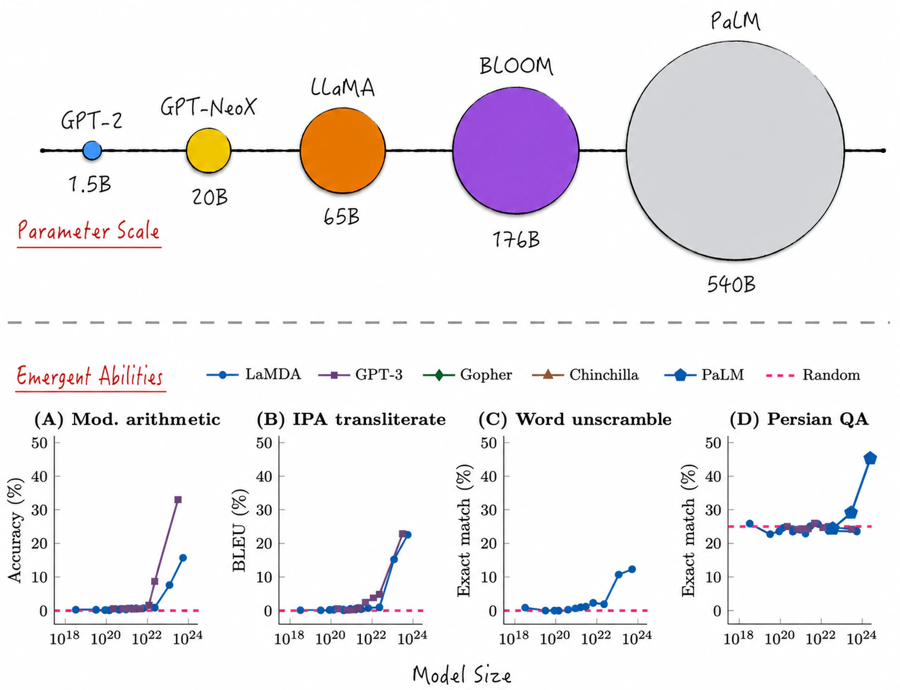
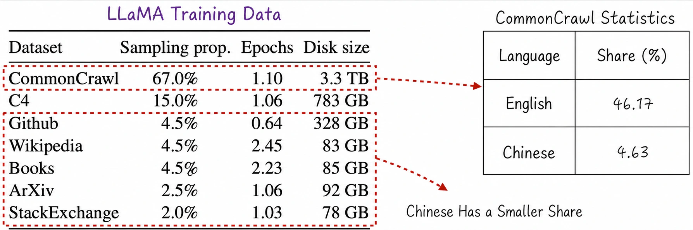
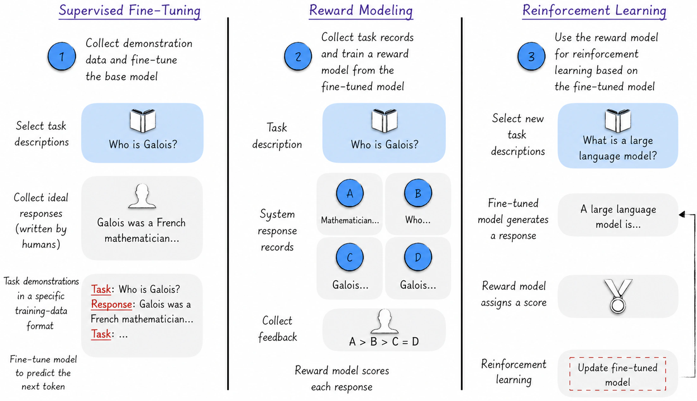
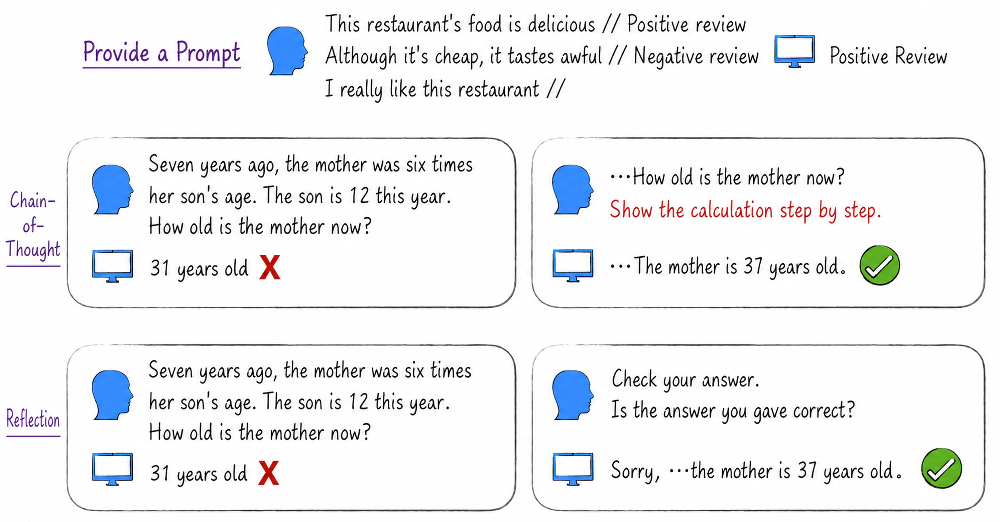
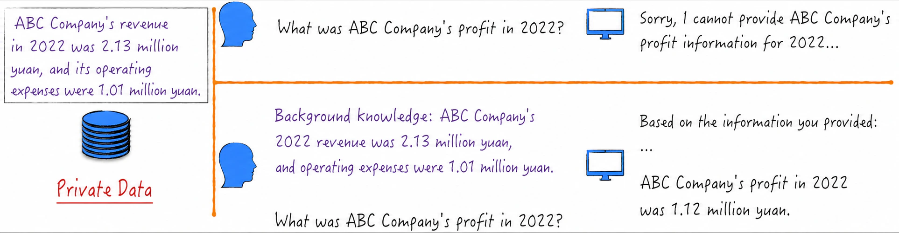
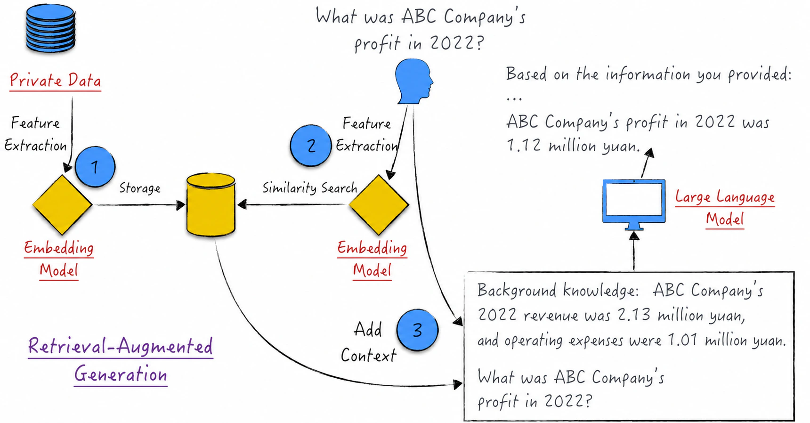

## 11.3 From Large Language Models to Intelligent Assistants

As [Section 11.2](/books/deconstructing_LLM/chapter-11/11-2) demonstrated, we can construct and train our own GPT-2 large language model from scratch. This is an extraordinarily exciting milestone, but not the final objective. Applying an LLM in production still requires solving the last-mile problem[^11-3-1]: how to combine the model's capabilities effectively with a particular application. In theory, transfer learning—see [Section 10.1.5](/books/deconstructing_LLM/chapter-10/10-1#section-10-1-5)—has two stages: pretraining and fine-tuning. Training GPT-2 covers only pretraining, and the resulting model is called a pretrained model or base model.

GPT-2 is generally not recommended as a production base model because it is small and its performance is mediocre[^11-3-2]. Many larger, more capable base models are now available as open source, and selecting an appropriate one is generally the first step in an application. This section therefore begins with the current state of large language models, especially open-source models, and uses GPT-2 to briefly introduce the considerations involved in using one.

Solving the last-mile problem requires many forms of customization for the particular scenario; no universal theoretical framework can simply be applied. We can, however, learn from the workflows of successful projects, of which ChatGPT is one example. Using ChatGPT as a case study, this section examines how to begin with a base model and gradually construct an intelligent assistant. The process involves many technical details, so the discussion here is limited to the principal workflow. [Section 11.4](/books/deconstructing_LLM/chapter-11/11-4) and [Section 11.5](/books/deconstructing_LLM/chapter-11/11-5) examine the details.

Realizing the full potential of an intelligent assistant such as ChatGPT also requires certain techniques, including prompt engineering and retrieval-augmented generation (RAG), which this section discusses. The section may appear to cover a great deal, but it can be summarized in one sentence: leave the laboratory, enter the real world, and learn from industry how to use large language models.

### 11.3.1 The Current State of Large Language Models

The defining characteristic of large language models is their scale. The upper half of Figure 11-11 shows the sizes of several classic models[^11-3-3] as of 2023. Why construct such enormous models? Because LLMs display emergent abilities[^11-3-4]—capabilities absent from smaller models that appear in larger ones. If a model were a human, emergent ability would resemble a person suddenly gaining insight and acquiring a new cognitive capacity while growing up. As the lower half of Figure 11-11 shows, predictive performance improves substantially as model size increases; note that this is not overfitting. Along with better performance metrics, LLMs display many unexpected abilities, including reasoning, that make them appear closer to artificial general intelligence. Model size is not always proportional to performance, however. Although LLaMA is smaller than BLOOM, for example, it outperforms the larger model in several respects. Size should therefore not be the only criterion when selecting a base model.

In addition to model size, we generally care about the training data, which directly affects performance. Not every model discloses the details of its training data, but the differences are unlikely to be vast. The left side of Figure 11-12 presents statistics for LLaMA's training data[^11-3-5]. The volume is considerable, but its language composition is relatively homogeneous. As the right side shows, the data is predominantly English, with relatively little in other languages and even less in Chinese[^11-3-6]. This explains why the model performs best in English and only moderately well in other languages. Tokenization is another important factor, especially for Chinese; see [Section 10.1.4](/books/deconstructing_LLM/chapter-10/10-1#section-10-1-4) for details. If the primary application language is Chinese, the first consideration when selecting a base model should be its Chinese-language capabilities.

### 11.3.2 Open-Source Models

The Transformers library is generally used to download an open-source LLM. Because the library provides many high-level abstractions—perhaps too many—the same model may have several derived versions. For GPT-2, for example, the library provides `GPT2LMHeadModel`, which includes a language-modeling head, and `GPT2Model`, which does not, among others[^11-3-7]. The differences are not our present concern. The point is simply that readers should study the documentation carefully and select the appropriate version.

A base model is trained on only one task: predicting the next token from the preceding text. In essence, it generates the most likely text by imitating the probability distribution in its training data. Its answers therefore generally contain relevant material but clearly do not truly understand the conversational intent, resembling a parrot that imitates human speech[^11-3-8]. As the upper-left portion of Figure 11-13 shows[^11-3-9], the base model's answer is confusing and falls far short of the ChatGPT responses shown earlier. Even the more powerful GPT-3 performs very differently from what we expect: instead of providing a clear explanation, it replies with a series of questions resembling the original prompt.

This is not only because the model has limited capabilities, but because it has not learned to converse and respond to requests in the manner humans expect. Models have their own form of communication, different from ours—or perhaps humans have not yet learned to communicate in a way the model can understand. Small techniques can guide the model, as shown on the right of Figure 11-13. Providing guidance in the input enables the model to answer in the desired manner. This method is both an early form of prompt engineering and an important inspiration for intelligent assistants. [Section 11.3.4](/books/deconstructing_LLM/chapter-11/11-3#section-11-3-4) and [Section 11.5](/books/deconstructing_LLM/chapter-11/11-5) examine these topics in greater depth.

### 11.3.3 From GPT to ChatGPT

Optimizing GPT into ChatGPT was an enormous leap. ChatGPT's success made the technical term *large language model* a popular topic across industries. The optimization process involves many techniques, each of which the following sections examine in depth[^11-3-10]. For now, readers can treat them as a black box and understand each technique in terms of its training data and intended effect.

The complete optimization process corresponds to the fine-tuning stage of transfer learning. Fine-tuning consists of three key steps: supervised fine-tuning[^11-3-11], reward modeling, and reinforcement learning, as shown in Figure 11-14[^11-3-12].

The steps are briefly introduced below.

1. A base model does not understand our task description or what constitutes an expected answer. Supervised fine-tuning aims to enable the model to understand a task description and provide an appropriate response. The most important work at this stage is collecting task-demonstration data and using it to train the model in autoregressive mode[^11-3-13]. After supervised fine-tuning, the model can answer user questions relatively normally. For clarity, we will call the result of this step the fine-tuned model.

2. After the fine-tuned model is deployed in production, collect user feedback on its responses. How can this feedback improve performance effectively? The answer is reinforcement learning. Reinforcement learning is a branch of AI that dynamically adjusts a model on the basis of scores assigned to its results in order to maximize the score, rather than minimizing a traditional loss function. Its training data therefore consists of three elements: a task description, the fine-tuned model's response, and a score for that response. User feedback generally ranks responses rather than assigning scores directly[^11-3-14], which does not match the format reinforcement learning requires. To solve the problem, construct a reward model that learns from user feedback and scores LLM responses, thereby producing training data for reinforcement learning. Ordinary users do not interact with the reward model. It is simply an auxiliary model that helps us use reinforcement learning to improve the fine-tuned model from Step 1.
3. Using the training data produced in Step 2, apply reinforcement learning to adjust the fine-tuned model dynamically so that its responses better match our expectations.

Three phenomena in the optimization from GPT to ChatGPT deserve reflection.

1. Fine-tuning merely releases potential already present in the base model. The fine-tuned model improves dramatically in its interactions with humans, but the entire fine-tuning process—all three steps together—is extremely brief. Both its training data and training time are less than 2% of those used for pretraining. We can therefore reasonably conclude that the model learns little new knowledge during brief fine-tuning. It merely learns how to communicate with humans and thereby brings its existing abilities fully into play. To use a loose analogy, the base model may resemble an excellent French mathematician who cannot discuss mathematics with us because he does not speak Chinese. After spending a month learning some Chinese, everyone thinks his mathematical ability has suddenly improved. It has not; he can simply communicate with us now.
2. Fine-tuning causes a model to lose diversity and creativity. The fine-tuned model interacts more effectively, but does not outperform the base model on every task. Research has found that base models are more creative and produce more diverse responses. They perform better on some creative tasks, such as writing fiction and poetry. This phenomenon also prompts reflection on education. If pretraining is analogous to primary and secondary education, the base model resembles a student graduating from high school. Higher education—the fine-tuning stage—improves the student's skills in a particular field but may also suppress creativity.
3. Will fine-tuned models leave society with only one voice? A fine-tuned model answers questions by imitating task demonstrations. During supervised fine-tuning, the training dataset is relatively small but has a major effect on the final model. All task demonstrations for the original ChatGPT were produced by a remote team of only 40 people[^11-3-15]. In a sense, ChatGPT repeats the voices of these 40 people every day. Their personal biases or narrow views—everyone harbors biases and narrow views they cannot perceive themselves—may be preserved in the model and transmitted daily to hundreds of millions of people[^11-3-16]. A healthy society should not have only one voice. Could the loss of diversity in fine-tuned models intensify social division and fragmentation, with serious consequences? Ensuring that fine-tuning data is diverse and fair is a question that deserves deep thought and vigilance.

If a fine-tuned model such as ChatGPT still does not meet a need, the same steps can be repeated to fine-tune it further. This method is relatively complex, requires retraining and substantial resources, and cannot guarantee that the resulting model will be more intelligent. Fine-tuning requires experience; in practice, it can easily make an LLM “dumber.” Simpler methods can also adjust a model to better match expectations, including prompt engineering and retrieval-augmented generation.

### 11.3.4 Prompt Engineering

What is prompt engineering? In simple terms, it means treating a large language model as a human partner and interacting with it through interpersonal communication in order to persuade it to provide better service. Prompt-engineering methods are numerous. Rather than cataloging them all, this section focuses on several classic examples.

1. Provide examples. The formal name of this method is few-shot prompting. Figure 11-13 shows a typical example. Just as in human communication, when another person does not understand an assigned task, we can provide demonstrations to help them grasp our intent quickly and complete it. This method allows us to perform many modeling tasks without writing code. The upper portion of Figure 11-15, for example, uses demonstrations to guide text classification without complex model code.
2. Give the model time to think. This method is chain-of-thought (CoT) prompting. Just as people need time to solve problems, giving the model enough “thinking time” can lead it to the correct answer. Unlike human thought, model reasoning depends not on elapsed time but on generated tokens. Generating intermediate reasoning steps can help the model organize its reasoning and complete the task, as shown in the middle of Figure 11-15. Asked directly, the model answers incorrectly; prompted to solve the problem step by step—the almost magical phrase in the original paper was “Let's think step by step”—it produces the correct answer.
3. Request reflection. After the model answers, ask it to check its response against the requirements, as shown at the bottom of Figure 11-15. The model then reflects carefully and makes any necessary corrections to produce the correct answer.
4. Positive encouragement is also effective. Before asking a question, encourage the model to provide a high-quality answer. Research shows that a simple statement preceding the question can significantly improve performance: “You are an expert in this field. Complete the following task.” There is no definitive quantitative explanation for this phenomenon. It is generally thought that the training data may contain many answers of varying quality to the same question. Encouraging the model to regard itself as an expert causes it to select correspondingly high-quality answers from its memory.

Prompt engineering has, to some extent, transformed human–computer interaction and is one of the most fascinating areas of large language models. Unlike other complex technologies, LLMs have almost no barrier to entry: users need only state what they require. Interested readers can consult other sources to explore the topic in depth and perhaps discover still more remarkable methods.

### 11.3.5 Retrieval-Augmented Generation

The term *retrieval-augmented generation* (RAG) may sound abstruse, but its principle is simple. A large language model acquires its knowledge from its training data. If particular knowledge is absent, the model struggles to perform tasks that require it. Suppose, as in Figure 11-16, that we have private financial data. The information is not public, so the LLM cannot directly answer questions about it. How can we enable the model to use the private data? Simply provide it as context. The model can use that context at inference time to complete a particular task.

This example is vivid and intuitive but remains some distance from a production application. We must manually select background information relevant to the task and then reconstruct the task description by adding that context. Retrieval-augmented generation automates the process so that the system and model handle it entirely.

To understand the algorithm, first review the basic composition of an LLM. At a high level, the model has two parts: the language-modeling head at the top and an embedding model[^11-3-17] composed of every other component. Functionally, the language-modeling head is equivalent to a multinomial logistic regression model, while the embedding model extracts text features. Processing any text[^11-3-18] with the embedding model produces a fixed-dimensional vector representing its semantic features. The closer two vectors are—as measured, for example, by cosine similarity—the more semantically similar the two texts are. Using this idea to select the most appropriate context for a task gives the three-step algorithm shown in Figure 11-17.

1. Use the embedding model to extract features from the private text and store the resulting tensors in a database or memory.
2. Use the same embedding model to extract features from the task description and locate the most similar context.
3. Add the context to the task description and use the large language model to produce the final response.

[^11-3-1]: According to Wikipedia, the *last mile* originally meant the final segment of a long journey. It later came to mean the final critical—and generally difficult—step in completing something.
[^11-3-2]: GPT-2 is quite large compared with other neural networks, but in the world of LLMs it is actually a very small model. Production models and their training datasets are much larger. ChatGPT, for example, used GPT-4 in the 2023 version. GPT-4 is larger and performs better.
[^11-3-3]: LLaMA stands for Large Language Model Meta AI; BLOOM for BigScience Large Open-science Open-access Multilingual Language Model; and PaLM for Pathways Language Model. The LLMs listed here were pretrained primarily on English. Chinese-centric LLMs also exist, but their technical documentation was too limited to support a detailed discussion in this book.
[^11-3-4]: This term comes from the paper “Emergent Abilities of Large Language Models.”
[^11-3-5]: The data comes from the paper “LLaMA: Open and Efficient Foundation Language Models.”
[^11-3-6]: Common Crawl is an unstructured, multilingual web dataset, while C4 is a cleaned dataset derived from Common Crawl. Both are major sources of LLM training data. LLaMA applied English-language filtering to both datasets, leaving the model with even less Chinese training data.
[^11-3-7]: Removing the language-modeling head is a common LLM variant. Such a model is generally used to extract text features and is therefore called an embedding model. See Figure 8-15 in [Section 8.3.5](/books/deconstructing_LLM/chapter-8/8-3#section-8-3-5) or [Section 11.3.5](/books/deconstructing_LLM/chapter-11/11-3#section-11-3-5) for details.
[^11-3-8]: Some researchers regard large language models as parrots skilled at imitating humans rather than genuinely intelligent systems. This view questions whether models truly understand language or merely imitate text statistically. The idea is fascinating and difficult either to prove or falsify. But who can say that language is not fundamentally probabilistic? According to quantum mechanics, after all, matter in the microscopic world exists as probability waves.
[^11-3-9]: For the complete implementation, see [`ch11_llm/gpt2.ipynb`](https://github.com/GenTang/regression2chatgpt/blob/en/ch11_llm/gpt2.ipynb) in the companion code. The example uses English because GPT-2 performs poorly on Chinese, making the contrast between the two methods difficult to demonstrate in Chinese.
[^11-3-10]: See [Section 11.5](/books/deconstructing_LLM/chapter-11/11-5) for supervised fine-tuning and reward modeling, and [Chapter 12](/books/deconstructing_LLM/chapter-12) for reinforcement learning.
[^11-3-11]: The name *supervised fine-tuning* can be confusing. The term emphasizes that supervised learning—in autoregressive mode—is used to fine-tune the model at this stage, in contrast to the reinforcement learning used later. In terms of training objectives, the principal goal is to make the model generate responses by imitating task demonstrations, so “supervision” in this context is approximately equivalent to “imitation.”
[^11-3-12]: The illustration is based on the paper “Training Language Models to Follow Instructions with Human Feedback.”
[^11-3-13]: Training uses specially formatted text and a small number of demonstrations to guide the model to respond in the desired manner, much like the example on the right of Figure 11-13.
[^11-3-14]: Even when users provide scores, applying them directly to reinforcement learning remains difficult because each user has different scoring standards, potentially seriously affecting the correctness of the model.
[^11-3-15]: More precisely, ChatGPT here refers to the original version, which relied on GPT-3. Although later ChatGPT versions expanded the team and data-collection methods, task demonstrations still originated from a very small number of people.
[^11-3-16]: This is not intended as criticism of ChatGPT's method. Almost all LLM-based intelligent-assistant systems face a similar problem: the construction process includes certain “dictatorial” stages that can seriously affect system neutrality. As LLMs develop, building a model goes beyond technology itself. We are introducing a new intelligence into society and cannot ignore the technology's social effects.
[^11-3-17]: In GPT-2, for example, `GPT2Model`, mentioned in [Section 11.3.2](/books/deconstructing_LLM/chapter-11/11-3#section-11-3-2), is an embedding model. Do not confuse the embedding model discussed here with a model's word-embedding layer; they are entirely different.
[^11-3-18]: Every LLM limits text length, so it cannot process context beyond that limit. A common approach to overly long material is to compress it with a model—use an LLM to generate a summary—and then perform retrieval-augmented generation.
