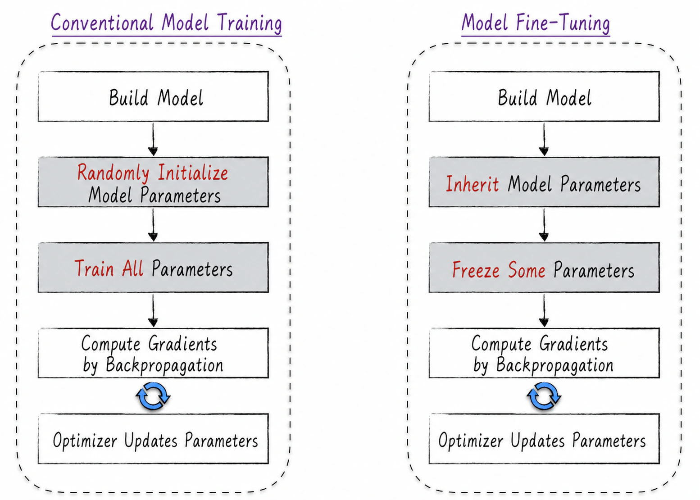
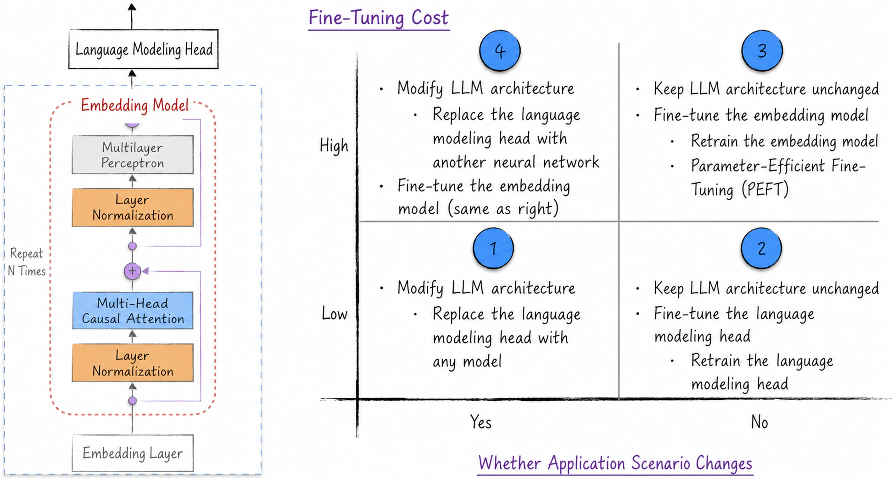
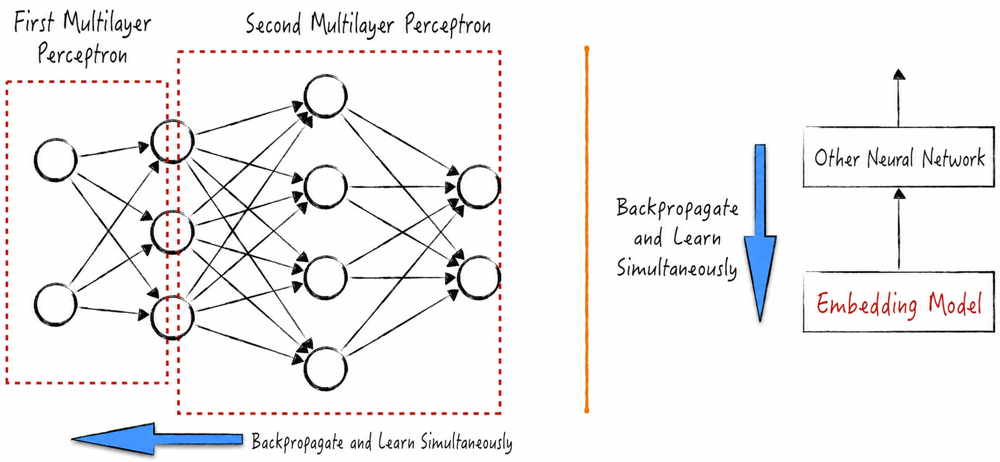
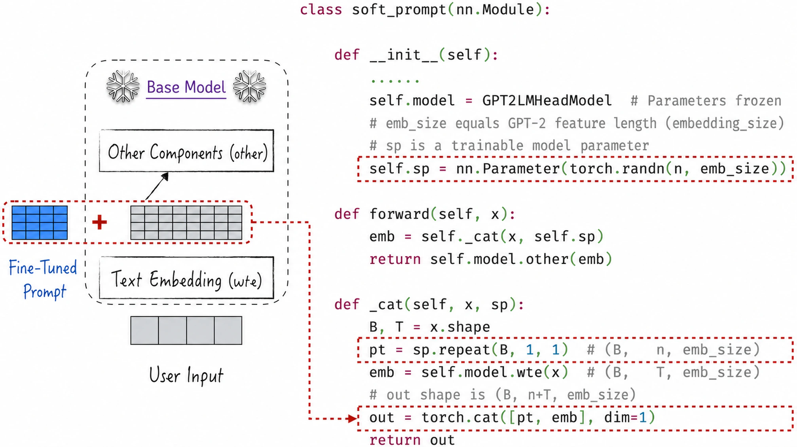
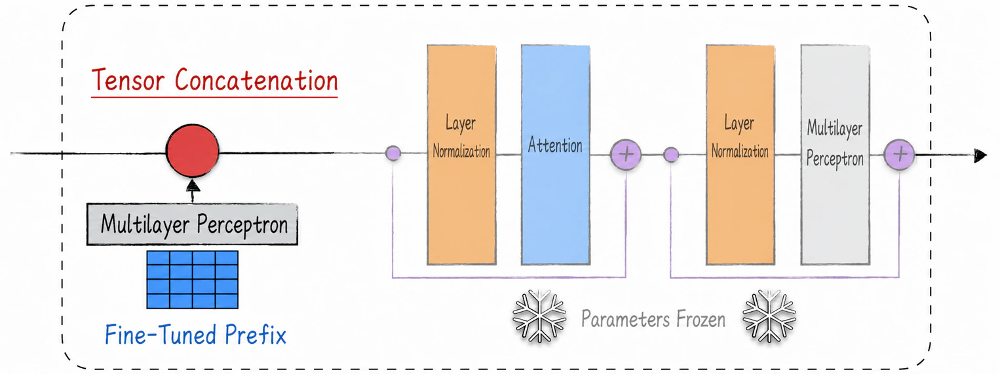
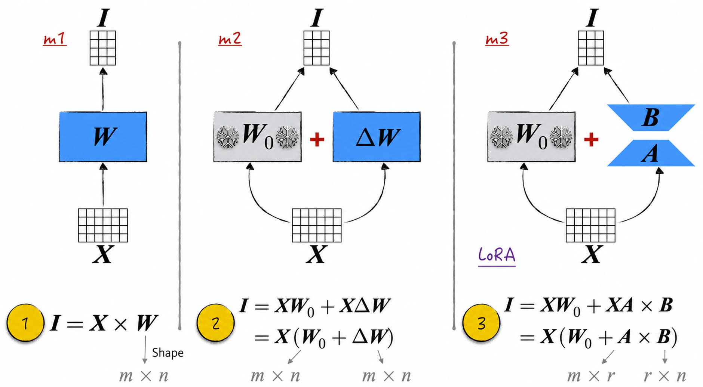
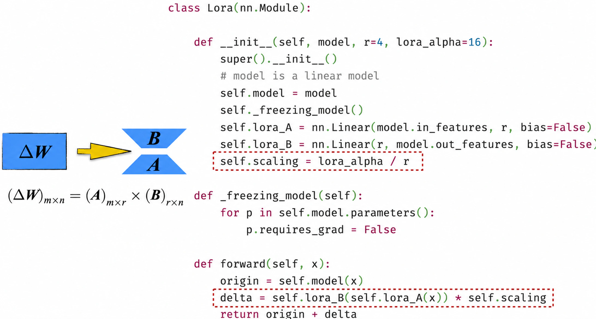

## 11.4 Model Fine-Tuning

The open-source community provides easy access to many high-performing base models—pretrained large language models. Initial experience reveals a common limitation: they cannot yet communicate with humans directly and appear clumsy in use. ChatGPT's success demonstrates, however, that appropriate fine-tuning can rapidly make these base models “smart” and turn them into reliable intelligent assistants.

What is the technical process of fine-tuning, and how does it differ from model training? The difference is minimal, as Figure 11-18 shows. Ordinary model training first constructs an architecture, then randomly initializes its parameters, and finally updates those parameters progressively from training data. Fine-tuning is very similar, with two differences. First, parameter initialization: in fine-tuning, some or all parameters are inherited from an already trained model rather than generated randomly[^11-4-1]. Second, the range of parameters trained: ordinary training updates every parameter, whereas fine-tuning can freeze selected parameters to improve efficiency and better preserve knowledge from the preceding model.



Fine-tuning is a creative task. The model architecture must be designed ingeniously to inherit as much as possible from the existing model, and we want to minimize the number of parameters trained. To understand fine-tuning more clearly, we divide it into macro and micro levels. At the macro level, the concern is how best to inherit the existing model. We will introduce the principal applications of fine-tuning and the available technical paths in different scenarios. The micro level focuses on reducing the number of trainable parameters to make fine-tuning more efficient.

Fine-tuning is a rapidly developing field with highly diverse applications. This section therefore discusses only several classic and instructive methods. For a particular task, readers can consult other sources as needed or use this section as a basis for their own creative designs. Although the discussion focuses mainly on large language models, the techniques also apply to other large neural networks.

### 11.4.1 Four Modes of Model Fine-Tuning

At the macro level, fine-tuning can be divided into four modes along two dimensions: cost and whether the application changes.

- As [Section 11.3.5](/books/deconstructing_LLM/chapter-11/11-3#section-11-3-5) discussed, an LLM can be viewed as a language-modeling head connected to an embedding model, as shown on the left of Figure 11-19. The language-modeling head is relatively simple, while the embedding model is extremely complex and costly to adjust. Fine-tuning cost is therefore classified as high or low according to whether the embedding model is adjusted[^11-4-2].
- Fine-tuned models can also be divided into two application categories. In one, the fine-tuned model has a different application from the base model. Building an entirely new text classifier from the embedding model's output is one example; reward modeling for ChatGPT is another. In the other category, the application remains unchanged, as in supervised fine-tuning for ChatGPT or strengthening a base model's Chinese capabilities.

These two dimensions produce the four-quadrant diagram on the right of Figure 11-19. The four combinations generally use the following methods.



1. Replace the language-modeling head and leave the embedding model unchanged (Label 1): When the application changes but fine-tuning must remain inexpensive, the usual approach is to preserve the embedding model and replace the language-modeling head with a suitable model. This approach fully exploits connectionism by using the embedding model's output as the new model's input. Many types of replacement components are available, including machine-learning and statistical models such as linear regression, logistic regression, and the supervised and unsupervised learning models introduced in [Chapter 13](/books/deconstructing_LLM/chapter-13).
2. Freeze the embedding model and adjust only the language-modeling head (Label 2): When the application is unchanged, the least expensive approach is to leave the embedding model unchanged and adjust only the language-modeling head. Parameter freezing, discussed in [Section 7.4.2](/books/deconstructing_LLM/chapter-7/7-4#section-7-4-2), prevents backpropagation from computing gradients for the embedding-model parameters. The embedding model therefore remains unchanged during fine-tuning, and only the language-modeling head is updated.
3. Adjust the embedding model, either directly or through parameter-efficient fine-tuning (Label 3): When the application remains the same but we want to raise the upper limit on model performance, the embedding model must be adjusted. There are two approaches. The direct approach leaves the embedding-model parameters unfrozen and trains the model on new data, at high cost. The other is parameter-efficient fine-tuning, discussed in [Section 11.4.2](/books/deconstructing_LLM/chapter-11/11-4#section-11-4-2).
4. Replace the language-modeling head with another neural network and adjust the embedding model (Label 4): Because the application changes, the language-modeling head must be replaced, but only another neural network can replace it in this mode. The two neural networks are then stacked. During training, gradients pass from one network to the other and both components are updated, as shown in Figure 11-20[^11-4-3]. This may seem magical, but we have encountered it many times. Even the simplest multilayer perceptron can be viewed as a combination of multiple multilayer perceptrons trained in precisely this way.



### 11.4.2 Overview of Parameter-Efficient Fine-Tuning

Researchers introduced parameter-efficient fine-tuning (PEFT) to reduce the cost of fine-tuning embedding models and improve efficiency. PEFT operates at the micro level. Although its techniques take many forms, their central idea is similar: freeze the embedding model's parameters and introduce additional components to fine-tune it without changing its main architecture[^11-4-4].

Classic methods fall into two categories. The first adds model components directly and includes prompt tuning and prefix tuning. The second simulates the effect of parameter updates; its representative method is low-rank adaptation (LoRA). Because no suitable Chinese translation exists, the following sections continue to use the abbreviation LoRA.

### 11.4.3 Parameter-Efficient Fine-Tuning by Adding Model Components

Prompt tuning and prefix tuning are very similar and appeared at roughly the same time.

We begin with prompt tuning. In the prompt engineering discussed in [Section 11.3.4](/books/deconstructing_LLM/chapter-11/11-3#section-11-3-4), additional phrases such as “solve step by step” are commonly added to task descriptions to improve interactions with the model. Although these human-written prompts improve performance, the process is not automatic and cannot guarantee that a prompt is optimal. Can we automatically find the best prompt in a manner similar to model training? Yes; this is the central idea of prompt tuning[^11-4-5].

To explain the algorithm clearly, divide the base model into two parts: text embedding and everything else, as shown on the left of Figure 11-21. The input first passes through text embedding and is converted into a tensor for subsequent computation. From the model's perspective, adding a prompt means concatenating prefix tensors—the tensors corresponding to the prompt—to the beginning of the tensor corresponding to the task description. To engineer this idea, first assume that the added prompt has a fixed length of $n$ tokens. The same prompt is added to every input. Freeze the base model, then generate a series of trainable parameters to represent the prompt tensors. During training, these new parameters discover the optimal prompt while the base model remains unchanged. The red box in Figure 11-21 shows the core steps.



Prefix tuning is very similar to prompt tuning. The only difference is that it injects a prefix into every decoder block in the model, as shown in Figure 11-22. Space constraints prevent a detailed implementation and example of either method here.



### 11.4.4 Parameter-Efficient Fine-Tuning with LoRA

Prompt and prefix tuning can essentially be regarded as methods for customizing large language models. They make strong assumptions about the model architecture and leave users limited room for adjustment, restricting their applications. LoRA, by contrast, is more flexible, can be applied to almost any model, and gives users greater freedom in fine-tuning. It is therefore a more popular PEFT method with broader applications. We now temporarily shift our attention away from LLMs and discuss LoRA in the broader context of neural networks.

Most neural-network parameters come from linear models[^11-4-6], so we need consider only how to fine-tune a linear model efficiently. Figure 11-23 constructs three different linear models.

- Model m1 is a conventional linear model whose parameters are represented by the matrix $\boldsymbol W$ and whose computation is shown under Label 1. Every matrix parameter is trainable, and its initial state is $\boldsymbol W_0$.
- Model m2 has two parts. One is the frozen Model m1 in state $\boldsymbol W_0$, its state before fine-tuning. The other is a conventional linear model whose parameter matrix, $\Delta\boldsymbol W$, has the same shape as $\boldsymbol W$ and is initialized entirely to 0. We call this the update matrix. Label 2 shows that m2 is also a linear model because its computation is likewise matrix multiplication. Before fine-tuning, m1 and m2 have exactly the same parameters, and their trainable parameters are essentially identical—the same number of parameters serving the same role. In other words, the two models are entirely equivalent, so we can focus on fine-tuning m2 efficiently.
- Model m3 also has two parts. One is the frozen Model m1. The other is a composition of two linear models whose parameter matrices are $\boldsymbol A$ and $\boldsymbol B$, both initialized to 0. Its computation is shown under Label 3, where $r$ is far smaller than $m$ and $n$. The formula shows that m3 is likewise a linear model. Before fine-tuning, m3 and m2 are equivalent. Because m3 has fewer trainable parameters, however, its upper limit on performance is lower than m2's.



In many fine-tuning scenarios—LLM fine-tuning is a typical example—the update matrix in m2 has very low rank in the final result. This means that $\Delta\boldsymbol W$ can be decomposed into the product of two smaller matrices[^11-4-7], as shown on the left of Figure 11-24 ([Complete Code](https://github.com/GenTang/regression2chatgpt/blob/en/ch11_llm/lora_tutorial.ipynb)). This proves that with a suitable $r$, m3 can fully match m2's results at lower cost. This is the central idea of LoRA. In the implementation, LoRA introduces the hyperparameter `lora_alpha` to regulate the relationship between the frozen and trainable components, as shown in the red box in Figure 11-24.



LoRA itself is not difficult to implement, but adding LoRA adapters flexibly to a relatively complex LLM architecture is not easy. Production applications therefore generally use the open-source `peft` library. Listing 11-4 presents several common operations; see the companion code for further usage details.

- Use `target_modules`, shown in Lines 10 and 11, to specify the linear models to which LoRA adapters should be added. Multiple adapters can be added to a model as needed.
- If the model has multiple LoRA adapters, switch among them at any time, as shown in Line 17.
- Adapters can also be disabled temporarily or unloaded to restore the original model, as shown in Lines 19–24.

#### Listing 11-4 LoRA ([Complete Code](https://github.com/GenTang/regression2chatgpt/blob/en/ch11_llm/lora_tutorial.ipynb))

```python
class MLP(nn.Module):

    def __init__(self, bias=False):
        super().__init__()
        self.lin0 = nn.Linear(2, 4, bias=bias)
        self.lin1 = nn.Linear(4, 2, bias=bias)
    ...

# Add multiple LoRA adapters to the model
config1 = LoraConfig(r=3, lora_alpha=16, target_modules=['lin0'])
config2 = LoraConfig(r=5, lora_alpha=16, target_modules=['lin0', 'lin1'])
model = MLP()
peft_model = PeftModel(model, config1, adapter_name='lora1')
peft_model.add_adapter(peft_config=config2, adapter_name='lora2')

# Switch LoRA adapters
peft_model.set_adapter('lora2')

# Disable the LoRA adapter to restore the original model
with peft_model.disable_adapter():
    print(peft_model(x))

# Unload the LoRA adapter to restore the initial model
peft_model.unload()
```

[^11-4-1]: Parameters in components that cannot be inherited are still initialized randomly.
[^11-4-2]: In theory, adjusting the embedding model can raise the upper limit on performance after fine-tuning, but the process requires greater experience and can otherwise be counterproductive.
[^11-4-3]: Training multiple neural networks together is fascinating. After joint training, the models can either be used together, as they were during training, or extracted and used independently. This method is common in fields such as reinforcement learning.
[^11-4-4]: Because the base-model parameters are frozen, saving a PEFT result requires saving only the added component parameters, which substantially reduces storage. The complete embedding model is generally frozen, but this is not an absolute rule. Selected layers can be unfrozen as needed so that they also participate in training.
[^11-4-5]: Some literature calls manual prompt discovery *hard prompt tuning* and the engineered approach *soft prompt tuning*.
[^11-4-6]: Although nonlinear transformations are crucial in neural networks, they contain no model parameters. Other components, such as layer normalization, have relatively few parameters.
[^11-4-7]: The decomposition is based on singular value decomposition. As discussed in [Section 2.1.5](/books/deconstructing_LLM/chapter-2/2-1#section-2-1-5) and [Section 13.5](/books/deconstructing_LLM/chapter-13/13-5), $r$ in the decomposition formula equals the matrix rank. LoRA therefore depends on the decomposed matrix having low rank. If the rank is high, this method may significantly reduce model performance.
