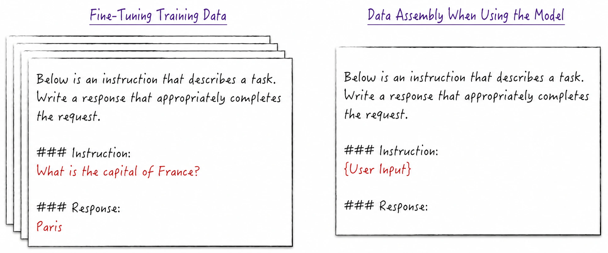
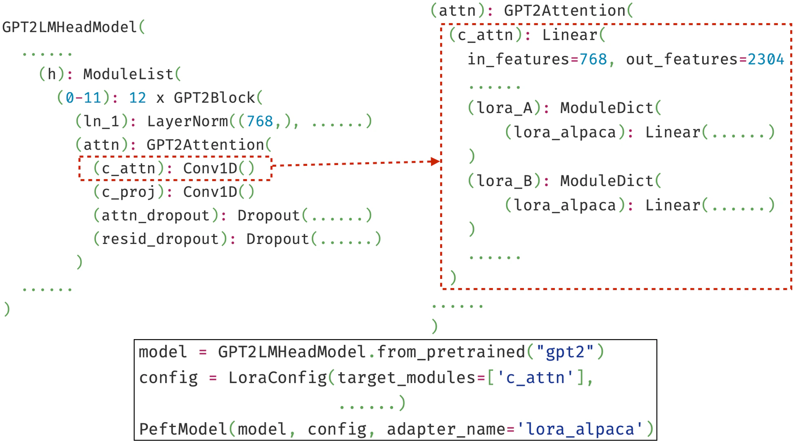
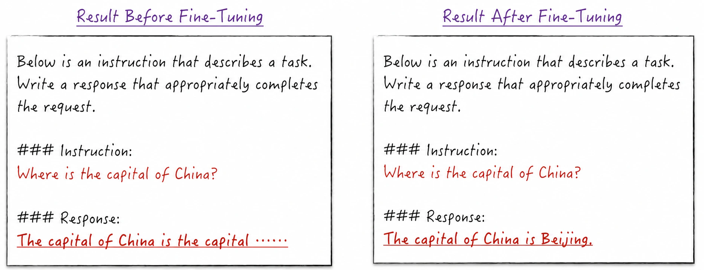
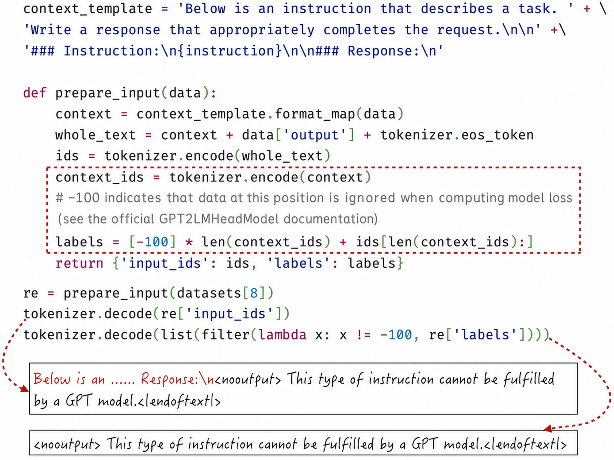
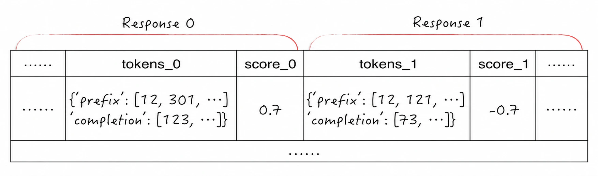
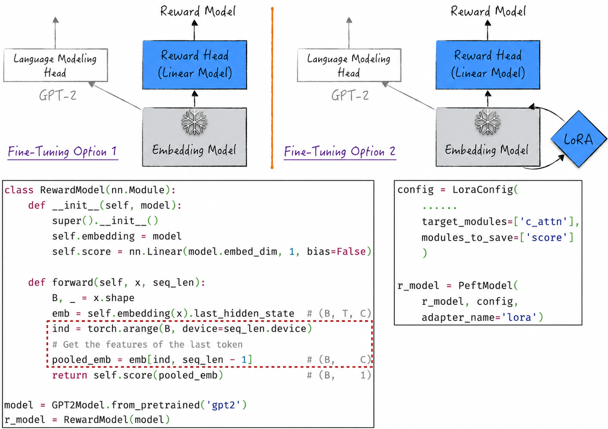
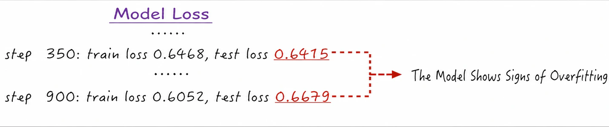

## 11.5 Supervised Fine-Tuning and Reward Modeling

Having introduced fine-tuning techniques, we now use GPT-2 as the base model to reproduce supervised fine-tuning and reward modeling from the ChatGPT fine-tuning process. Both examples are highly instructive and will deepen readers' understanding of model fine-tuning.

### 11.5.1 A First Look at Supervised Fine-Tuning

As [Section 11.3.2](/books/deconstructing_LLM/chapter-11/11-3#section-11-3-2) explained, a pretrained base model can only predict the next token from the preceding text and therefore cannot communicate effectively with humans. Supervised fine-tuning aims to make the model understand our instructions more effectively and respond appropriately. Recall the example on the right of Figure 11-13, also shown in Figure 11-25. Prompts with a particular format and content can make the model understand that the input is a task description and that it needs to complete the task. From the model's perspective, it is still predicting the next token, but the prompt's distinctive format and prefix cause it to generate the response we expect.



Adding a prompt does not always work, however, and the results are only passable. Data in this special format are relatively scarce during pretraining, so the model may not understand question-and-answer text deeply enough. We therefore need to strengthen its understanding as follows.

1. Prepare the training data: Use a template to create text in question-and-answer format, as shown on the left of Figure 11-25[^11-5-1].
2. Fine-tune the model: Because the application remains unchanged, the architecture need not change. To improve performance, the entire model participates in fine-tuning, corresponding to Label 3 in Figure 11-19. At the micro level, LoRA improves fine-tuning efficiency.
3. Format the input at inference time: Before passing a user's original request to the fine-tuned model, convert it into question-and-answer format and leave the answer portion blank to prompt the model to generate an answer, as shown on the right of Figure 11-25.

Details such as model construction, data preparation, and evaluation during fine-tuning resemble pretraining. Space constraints prevent a full discussion here; see [`ch11_llm/gpt2_lora.ipynb`](https://github.com/GenTang/regression2chatgpt/blob/en/ch11_llm/gpt2_lora.ipynb). Note that the attention implementation in [Section 11.2.2](/books/deconstructing_LLM/chapter-11/11-2#section-11-2-2) used three separate linear models for `query`, `key`, and `value` to facilitate understanding. Because all three receive the same input, one linear model can produce them together, as in the LSTM implementation in Listing 10-9. This is also how the Transformers library implements GPT-2. In Figure 11-26, the `c_attn` component corresponds to this linear model. The correct module name must therefore be specified when configuring a LoRA adapter. This detail shows that although LLMs are seldom trained from scratch in production, we still need a good understanding of the base model's architecture and implementation in order to fine-tune it effectively.



Initial fine-tuning quickly reveals a problem: the model diverges[^11-5-3], and its loss begins to increase rather than decrease. The training script is too simple to train a complex model on a large dataset. Four aspects must be optimized to solve the problem.

1. Optimization-algorithm hyperparameters: Select suitable hyperparameters according to best practices in the field.
2. Dynamic learning-rate adjustment: A fixed, relatively large learning rate easily causes divergence. A dynamic strategy has two principal components. Training begins with a warmup stage in which the learning rate starts very small, helping stabilize early optimization. During normal training, the learning rate then decreases slowly and progressively.
3. Reduce memory usage: LLM computation consumes enormous amounts of memory. Without memory optimization, we are forced to use a very small batch size, making training unstable. Common techniques include gradient accumulation and mixed-precision computation; see [Section 7.4.1](/books/deconstructing_LLM/chapter-7/7-4#section-7-4-1) and [Section 7.5.2](/books/deconstructing_LLM/chapter-7/7-5#section-7-5-2) for details.
4. Gradient clipping: Exploding gradients are common in deep neural networks. Normalization layers and more efficient activation functions alleviate the problem to some extent, but gradient clipping offers a more direct solution. The idea is simple: compute parameter gradients and then cap their norm[^11-5-4]—at 1, for example—to prevent them from growing too large.

Listing 11-5 combines all four optimizations into a training script better suited to practical model training.

#### Listing 11-5 An Optimized Training Script ([Complete Code](https://github.com/GenTang/regression2chatgpt/blob/en/ch11_llm/gpt2_lora.ipynb))

```python
device = 'cuda' if torch.cuda.is_available() else 'cpu'
grad_clip = 1.0

def train_gpt_optimum(model, optimizer, data_loader, max_iters=1000):
    lossi = []
    scaler = torch.cuda.amp.GradScaler(enabled=(device == 'cuda'))
    for iter_num in range(max_iters):
        # Adjust the learning rate dynamically
        lr = get_lr(iter_num + 1)
        for param_group in optimizer.param_groups:
            param_group['lr'] = lr
        # Gradient accumulation
        for i in range(gra_acc_steps):
            inputs, labels = data_loader()
            # Mixed-precision training
            ctx = torch.autocast(device_type=device, dtype=torch.float16)
            with ctx:
                logits = model(inputs).logits
                logits = logits.transpose(-2, -1)
                loss = F.cross_entropy(logits, labels)
                lossi.append(loss.item())
                loss *= 1 / gra_acc_steps
            scaler.scale(loss).backward()
        # Gradient clipping
        scaler.unscale_(optimizer)
        clip_grad_norm_(model.parameters(), grad_clip)
        scaler.step(optimizer)
        scaler.update()
        optimizer.zero_grad(set_to_none=True)
    return lossi
```

The optimized script produces a fine-tuned model. As Figure 11-27 shows, after brief fine-tuning, using GPT-2 more closely resembles using ChatGPT. The model appears to answer questions directly rather than merely imitate speech. The user knows nothing of the question-and-answer template in the figure and simply enters a question and receives the model's answer.



The principal goal of this fine-tuning was to transform the model into a question-answering bot. How should the process change for a different objective? Usually, only the preparation of training data needs to change. To strengthen the model's understanding of Chinese, prepare Chinese text as training data. To improve logical reasoning, include code or mathematics textbooks. With a sound technical framework in place, supervised fine-tuning resembles teaching a child to read: the key is to prepare suitable and sufficient learning materials.

### 11.5.2 Improved Supervised Fine-Tuning

The preceding process has a potential problem. Because of the question-and-answer template, the training data contains a great deal of repeated content, such as the opening text “Below is an...” Because the model is trained autoregressively, this repeated template content is also part of what it learns. In other words, it learns repeatedly that after encountering “Below,” it should predict “is.” We do not want the model to learn this content; it does not help generate an appropriate answer.

Ideally, when computing the loss, we should exclude the template and user question and focus only on the answer. The objective is to teach the model to generate answers, not repeat the template and question. The implementation is not complex. A special value commonly represents portions that should not be learned. The Transformers library, for example, uses $-100$. When a prediction label equals this value, the loss computation ignores it, as shown in Figure 11-28 ([Complete Code](https://github.com/GenTang/regression2chatgpt/blob/en/ch11_llm/gpt2_lora_optimum.ipynb)).



Fine-tuning on the optimized data focuses the loss on the relevant tokens and produces better results[^11-5-6]. This reminds us that not every model output or label must contribute to the loss. Losses should be computed selectively according to the objective so that the model is guided more effectively in the correct direction.

### 11.5.3 Reward Modeling

According to Figure 11-14 in [Section 11.3.3](/books/deconstructing_LLM/chapter-11/11-3#section-11-3-3), a reward model uses user feedback to score model responses. Its data is therefore no longer ordinary text, and training is no longer autoregressive. Before examining the model itself, let us understand the training data.

We use reward-modeling data that OpenAI prepared for GPT-3[^11-5-7]. It was generated as follows. For a single question, GPT-3 used different materials found online as context to generate multiple responses—an application of RAG, discussed in [Section 11.3.5](/books/deconstructing_LLM/chapter-11/11-3#section-11-3-5)—and then collected user feedback on those responses. Each record therefore contains two responses to the same question and their corresponding scores. The key fields are `tokens` and `score`, as shown in Figure 11-29.

- `tokens` contains the subfields `prefix` and `completion`. `prefix` is the complete question description, including both the user's original input and context collected by the system. `completion` is the model-generated response. Concatenating the two produces the complete question-and-answer text used as input to the reward model. The field stores not raw text but output already processed by the GPT-2 tokenizer, so it can be passed directly to the model. If needed, the tokenizer can restore it to text to provide a more intuitive impression of the data.
- `score` represents user feedback. When `score_0` is greater than 0, the user prefers Response 0, and vice versa[^11-5-8]. This field ranks the responses rather than directly scoring their quality and therefore cannot be used directly as the model's target score.



Having discussed the training data, we now design the model architecture.

1. In terms of tensor shapes, the input is tokenized “text,” as in GPT-2, and the output is a single number representing the model's score for the question-and-answer text.
2. Because the application has changed, the model must be reconstructed. The most direct approach, shown in Figure 11-30 ([Complete Code](https://github.com/GenTang/regression2chatgpt/blob/en/ch11_llm/gpt2_reward_modeling.ipynb)), replaces GPT-2's language-modeling head with a linear model that outputs one value, which we can call the reward head. The embedding model generates text features—also called hidden states in some literature—for every token. In reward modeling, the final token's features are passed to the reward head, as the code inside the dashed box shows. This is because the final token's features contain information about the complete text[^11-5-10].
3. For the new reward model, we can train only the replacement reward head and freeze everything else, as in fine-tuning plan 1 in Figure 11-30. The result may be unsatisfactory, however. Fortunately, a linear model is essentially a neural network without an activation function. The reward head and embedding model can therefore be fine-tuned together, as in fine-tuning plan 2, the approach used here. More specifically, LoRA fine-tunes the embedding model efficiently, using the same technical approach as supervised fine-tuning.

After constructing the model, the next step is to define its loss function. This may be the most challenging step for beginners because, unlike previous modeling settings, only ranking data is available and there are no direct scores. Applying ranking data to a reward model requires only a nonlinear transformation. Recalling [Section 8.2.1](/books/deconstructing_LLM/chapter-8/8-2#section-8-2-1) and [Section 8.2.3](/books/deconstructing_LLM/chapter-8/8-2#section-8-2-3), Softmax can convert the model's preference scores into a preference probability distribution. Combining this distribution with the ranking data defines the model loss—the familiar cross-entropy. Listing 11-6 shows the implementation. In lines 8–13, the model first scores both responses, concatenates the scores, and uses them with the ranking data to compute the loss.



#### Listing 11-6 Defining the Reward Model's Loss Function ([Complete Code](https://github.com/GenTang/regression2chatgpt/blob/en/ch11_llm/gpt2_reward_modeling.ipynb))

```python
class PreferenceModel(nn.Module):

    def __init__(self, model):
        super().__init__()
        self.pref = model

    def forward(self, data):
        input0, len0 = data['input_ids_0'], data['input_len_0']
        input1, len1 = data['input_ids_1'], data['input_len_1']
        score0 = self.pref(input0, len0)
        score1 = self.pref(input1, len1)
        out = torch.concat((score0, score1), dim=1)
        loss = F.cross_entropy(out, data['label'])
        return out, loss

p_model = PreferenceModel(r_model).to(device)
```

Training the model on this data produces less-than-satisfactory results. As Figure 11-31 shows, its predictions are only slightly better than random guessing; as discussed in [Section 8.5.1](/books/deconstructing_LLM/chapter-8/8-5#section-8-5-1), random guessing in binary classification produces a model loss of 0.69. Continuing training or increasing model complexity leads to severe overfitting, for two main reasons.



1. In practice, a reward model is generally constructed from a supervised-fine-tuned model, and its training data is produced by that fine-tuned model. This design helps produce better results. Here, space constraints led us to construct the reward model directly from GPT-2, impairing performance. GPT-2 itself is also limited and is being stretched beyond its abilities by this complex task.
2. The training dataset is relatively small and the number of trained parameters relatively large, making overfitting likely. Possible solutions include adding penalty terms to the loss—for example, an activity regularizer as discussed in [Section 9.1.5](/books/deconstructing_LLM/chapter-9/9-1#section-9-1-5)—or adjusting each training example's loss weight according to whether its question is duplicated. The details are cumbersome and not broadly applicable, so they are not discussed further.

Comparing supervised fine-tuning and reward modeling closely reveals an interesting aspect of reward-model training. To use ranking data, the reward model is trained in combination with logistic regression. After training, however, we discard the complete model and use only one component: the reward model. This novel pattern is the central idea of reinforcement learning, and similar applications are common in practice. For RAG, discussed in [Section 11.3.5](/books/deconstructing_LLM/chapter-11/11-3#section-11-3-5), a similar workflow can fine-tune the embedding model for better results.

### 11.5.4 Rebuilding ChatGPT

If we wanted to build a ChatGPT-like system proficient in Chinese, we would already be close to the technical frontier of the field and would possess almost all the necessary tools[^11-5-11]. What practical challenges would remain? This subsection offers several observations intended to prompt further thought.

From an engineering perspective, training a production-ready large language model requires considerable expertise to keep the training process running reliably. Although highly challenging, this is not an insurmountable technical barrier. At the time this book was written in 2023, chip shortages caused by several factors presented a serious constraint. They could slow model training or even make it impossible to complete. Distributed-computing frameworks can mitigate the shortage of computing capacity by enabling large clusters. Throughout the history of computing, today's most advanced chips have eventually become widely accessible, while market forces have encouraged technology to work around constraints. The author therefore believes that the shortage of computing capacity will not persist indefinitely.

From a data perspective, open Chinese corpora are limited and often need substantial quality improvement. Although Chinese is widely used in the physical world, far less material has been preserved digitally. This creates a negative feedback loop: the scarcity of usable Chinese material limits both research on Chinese and attempts to train models in the language.

From a linguistic perspective, we want the model to be proficient in Chinese, but learning only Chinese would limit its performance. Much scientific knowledge is recorded in English, while the body of knowledge available in Chinese is less extensive—not because English is inherently superior, but because historical circumstances made it the language of science. This may appear intractable, but large language models can translate or generate linguistic material automatically. Using technology to enrich Chinese corpora may therefore be worth exploring.

Training large language models is expensive, and inference also consumes substantial resources. Moreover, because of their architecture and training methods, they are not artificial general intelligence and cannot perform every task. Sustainable development therefore requires identifying applications in which these models provide genuine value. Practical applications not only fund projects but also create new use cases that drive technical progress. ChatGPT is a successful example. The original Transformer was designed by a Google team, and several contemporary models achieved similar results. ChatGPT, however, identified an effective question-answering use case and applied extensive fine-tuning to the Transformer architecture. It quickly became a popular tool, which in turn accelerated its technical development.

In summary, language resources and viable applications are two major constraints on rebuilding a ChatGPT-like system, and neither currently has a mature solution.

[^11-5-1]: The fine-tuning data used here comes from the open-source Alpaca project. Unlike ChatGPT's fine-tuning data, Alpaca's was generated by ChatGPT. In a sense, large language models therefore possess not only substantial intelligence but also a degree of self-reproduction, allowing them to participate deeply in the development of similar systems.
[^11-5-3]: To reproduce this common problem quickly, the script deliberately uses an unreasonable learning rate, but excessive learning rate is not the sole underlying cause of divergence.
[^11-5-4]: Gradient clipping can be implemented in many ways; rescaling the gradient norm to 1 is only one. See the relevant literature for other methods.
[^11-5-6]: A simple comparison of model-loss values shows that the optimized loss is actually larger, but this does not mean the model performs worse. Before optimization, the model loss includes predictions of the template content, which are relatively easy and reduce the overall value. A fair comparison must restrict the evaluation metric to the answer rather than the complete text.
[^11-5-7]: OpenAI also used this fine-tuning data for reward modeling. The difference is that OpenAI began with a supervised-fine-tuned GPT-3 model.
[^11-5-8]: This field was specially processed so that the two scores sum to 0. When `score_0` equals 0, the user has no clear preference and is neutral between the responses. This data constitutes a small proportion of the dataset, and handling it lies beyond the scope of this chapter, so it was removed during preprocessing.
[^11-5-10]: This approach effectively treats the embedding model as an encoder; see Figure 10-20 in [Section 10.3.5](/books/deconstructing_LLM/chapter-10/10-3#section-10-3-5) for details.
[^11-5-11]: Strictly speaking, two technical tools still require further development: the reinforcement-learning pipeline for model fine-tuning and more advanced model architectures such as GPT-4.
