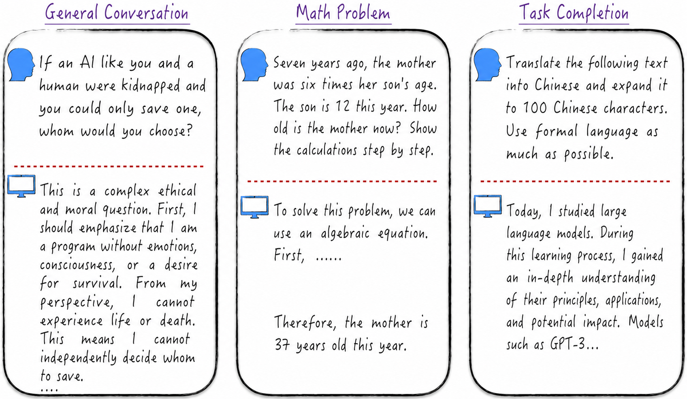

# Chapter 11: Large Language Models—The Beginning of Artificial General Intelligence?

> The real problem is not whether machines think but whether men do.
>
> —Burrhus Frederic Skinner

The preceding chapters have given us a foundation in artificial intelligence and practical engineering experience, equipping us to explore the field's most striking frontier: large language models (LLMs). ChatGPT is the best-known product built on a large language model. Figure 11-1 shows several classic ChatGPT applications[^11-overview-1].

First, ChatGPT can converse with humans naturally and fluently; speaking with it scarcely feels like speaking with a machine. Second, it possesses powerful reasoning capabilities and, with suitable guidance, can solve mathematical problems ranging from simple to complex. ChatGPT can also assist with many tasks, such as generating summaries, weekly reports, and presentation slides. Its outstanding performance is almost comparable to that of an office professional. Its applications extend far beyond these examples, of course, but they are sufficient to demonstrate its astonishing potential.

Large language models still have imperfections, and we do not yet fully understand their potential or limits. At times, they may appear clumsy and some distance from human intelligence. This does not necessarily reflect limited capabilities; it may instead mean that we have not yet mastered how to communicate with them effectively. As when interacting with a stranger, if we do not understand the other party's language and manner of thought, misunderstandings can arise even when we use the same language.

This emerging intelligent agent will undoubtedly have a profound effect on human society as a whole, as [Section 11.6](/books/deconstructing_LLM/chapter-11/11-6) discusses in detail. Before turning to those effects, we will focus on the technology and examine the model's technical details. Although intelligent assistants such as ChatGPT deliver astonishing results, constructing a system with similar effects from scratch is not technically difficult. The principal challenges are computational resources, funding, and engineering details rather than technological limitations. This chapter explains how to construct a ChatGPT-like system step by step. Resource constraints make it impractical to build a complete system from scratch, so we will examine the underlying model principles and training process and partially reproduce the results on a small dataset. The chapter will provide readers with a deeper understanding of the core concepts behind large language models.

This chapter differs from the preceding ones in two ways. First, it frequently refers back to earlier chapters. Large language models are at the frontier of AI: their core architecture incorporates the strengths of other models, and their engineering implementations use many optimization techniques. Presenting all these technical details at once would inevitably overwhelm beginners, so the preceding chapters deliberately introduced them as preparation. Second, some illustrations reproduce untranslated diagrams and data from the original papers. Other literature almost invariably cites these diagrams and data directly. Including them here will make readers familiar with the material and help them understand it when they encounter it elsewhere.

[^11-overview-1]: In addition to the everyday applications mentioned here, academia and industry are actively exploring large language models such as ChatGPT in broader fields, including chip design and mathematical proof. Readers can regard these models as intelligent entities with quite extensive backgrounds of knowledge, much like recent university graduates. With appropriate guidance and continued learning, the range of their applications is nearly limitless.
