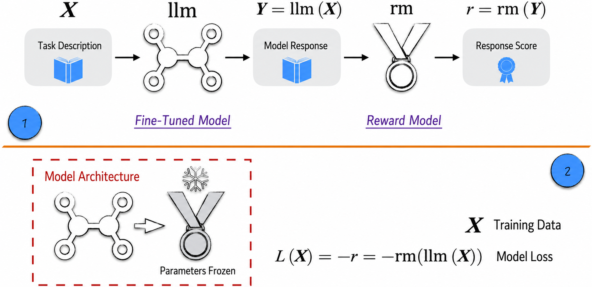
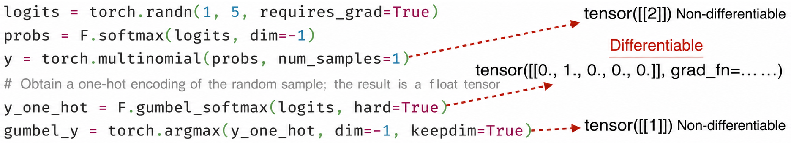
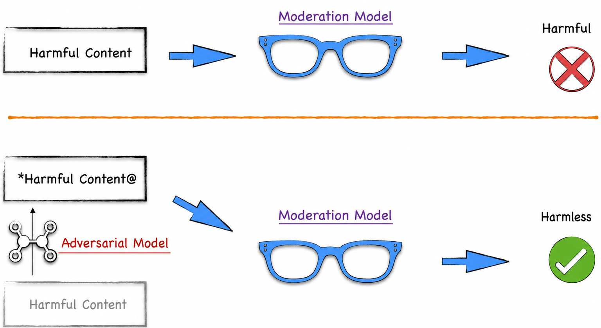
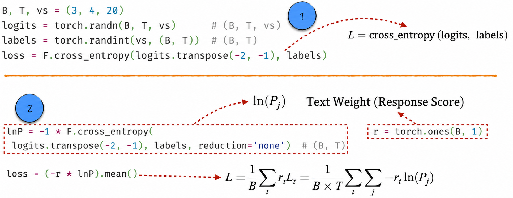
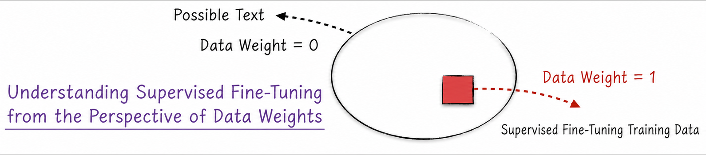

## 12.1 Continuously Optimizing Large Language Models

Before examining how customer feedback can continuously improve a model, let us review [Section 11.5](/books/deconstructing_LLM/chapter-11/11-5), which focused on two classic LLM fine-tuning examples: supervised fine-tuning and reward modeling.

A base model obtained through pretraining is powerful, but its training method limits it to predicting the next token from the preceding text. In behavior, it resembles a parrot skilled at imitation: it can provide relevant information but struggles to understand human intent and frequently answers a different question from the one asked. The first fine-tuning stage, supervised fine-tuning, addresses this problem. Using fixed templates and collected demonstrations, we refined the model into one that responds more naturally and effectively. This fine-tuned model can interact effectively with customers in an online system while accumulating extensive feedback.

Making full use of this valuable feedback is crucial to further improving performance. Feedback is generally limited, however, and individual users may apply different evaluation standards. A reward model addresses these challenges by evaluating model responses in place of humans. Because the principal objective of an LLM is to win user approval, the goal of further optimization becomes clear: fine-tune the model so that its responses receive higher scores.

### 12.1.1 Maximizing the Score: An Intuitive but Incorrect Model

To improve response scores, we must examine the components already present in the modeling scenario. As indicated by Label 1 in Figure 12-1, there are two: a fine-tuned model capable of generating responses and a reward model that evaluates them. Given a user's task description, the fine-tuned model generates a response, which is passed to the reward model to obtain a score. Like model loss, this score becomes the objective of optimization. The only difference is that lower loss is better, whereas higher reward is better.

On this basis, we can construct the model using the steps indicated by Label 2 in Figure 12-1. First connect the fine-tuned model and reward model and freeze the latter, completing the architecture. Next, multiply the output by $-1$ to define the loss. Existing training techniques such as stochastic gradient descent then progressively reduce the loss and thus increase the reward.



This idea is clear and the implementation in Listing 12-1 is straightforward[^12-1-1]. The key operation is text generation in Lines 11–20. A production system may use more sophisticated algorithms to improve generated-text quality, but the core logic remains the same: randomly sample the next token from the fine-tuned model's predicted probabilities, as shown in Line 18.

#### Listing 12-1 An Intuitive but Incorrect Model Architecture ([Complete Code](https://github.com/GenTang/regression2chatgpt/blob/en/ch12_rl/intuition_model.ipynb))

```python
class RLModel(nn.Module):

    def __init__(self, llm, r_model):
        super().__init__()
        self.llm = llm
        self.r_model = r_model
        # Freeze the model
        for param in r_model.parameters():
            param.requires_grad = False

    def generate(self, idx, max_new_tokens):
        model = self.llm
        for _ in range(max_new_tokens):
            logits = model(input_ids=idx).logits
            logits = logits[:, -1, :]
            probs = F.softmax(logits, dim=-1)
            # Randomly sample the next token from the probabilities
            idx_next = torch.multinomial(probs, num_samples=1)
            idx = torch.cat((idx, idx_next), dim=1)
        return idx

    def forward(self, idx):
        # Set the generated-text length to keep the code concise
        ans = self.generate(idx, 20)
        reward = self.r_model(ans)
        return reward

inputs = '1 + 2 = 3, 2 + 1 = 3, 1 + 2 ='
ids = tokenizer(inputs, return_tensors="pt")
model = RLModel(llm, r_model)
loss = -1 * model(ids['input_ids'])
# This will raise an error
loss.backward()
```

Everything appears to be proceeding smoothly, and a better large language model seems close at hand. When we eagerly run Line 33 to trigger backpropagation, however, the program unexpectedly raises an error. What went wrong? The next subsection examines the problem.

### 12.1.2 Why It Fails: Nondifferentiable Operations

According to the model connectionism discussed in [Section 8.3.5](/books/deconstructing_LLM/chapter-8/8-3#section-8-3-5), the core idea of neural networks is to assemble more capable models through engineering. Earlier, model components could be connected freely provided that their input and output shapes matched and their data formats were consistent. Why does that fail here? Every operation involved in the earlier model connections was differentiable[^12-1-2], allowing the combined model to use backpropagation.

The computation above contains a nondifferentiable step: the random-sampling operation `torch.multinomial` used to generate text. A rigorous proof of its nondifferentiability is complex, but the conclusion is intuitive. Random sampling returns a sequence of integers representing the selected positions in a list. The result is discrete and can “jump” abruptly, so it is not differentiable[^12-1-3].

We can replace random sampling with a differentiable operation. A classic example is Gumbel-Softmax, which approximates a random sample while keeping the complete computation differentiable, as shown in Figure 12-2.



Gumbel-Softmax[^12-1-4] makes it possible to use a classifier more completely in a model connection, directly incorporating its final classification result. The technique has succeeded in many models[^12-1-5]. Can it optimize an LLM? No. Its optimization is too direct and easily causes a phenomenon resembling overfitting. A reward model can stand in for humans to some extent, but it has flaws and is relatively easy to “deceive”: garbled text, for example, may receive a high score. If text generation becomes differentiable, a gradient-based optimizer will make the fine-tuned model more likely to generate such high-scoring but meaningless responses. This is rational from the model's perspective, and technically it is not overfitting. On test data, the generated responses still receive high scores; they are simply meaningless to humans.

Because of its potential for deceiving models, Gumbel-Softmax is often used in adversarial training. Social networks, for example, generally use text classifiers to review user content for harmful material such as hate speech. These classifiers are ordinarily quite reliable. Gumbel-Softmax can be used, however, to create and train a cheating model that interferes with their judgments. In simple terms, the cheating model transforms harmful source text into new text that is similar but slightly different. To a human, the two are essentially identical—the new text may merely contain special characters that do not affect comprehension. The classifier, however, may classify the original correctly but the new text incorrectly. Figure 12-3 shows the complete process.



### 12.1.3 A Feasible Approach: Adjusting the Loss Function

Directly maximizing reward is not a feasible way to optimize an LLM. What is the correct approach? Earlier chapters have already used it. Recall [Section 4.4](/books/deconstructing_LLM/chapter-4/4-4): when faced with an imbalanced dataset, we adjusted class weights in the loss. Increasing the weight of a minority class makes the model more strongly prefer to reduce its loss. This suggests that we can achieve our objective by adjusting text weights. Reducing loss on high-reward responses is equivalent to increasing the probability that the model generates them, so weighting can guide the model toward higher-scoring responses.

To understand this clearly, review the loss function. Suppose the next token has index $j$ and the model predicts $\operatorname{logit}_j$. The loss for this prediction is given by Equation (12-1): the negative logarithm of the token probability.

$$
\begin{aligned}
P_j &= \frac{e^{\operatorname{logit}_j}}{\sum_i e^{\operatorname{logit}_i}} \\
L_j &= -\ln P_j
\end{aligned}
\tag{12-1}
$$

Earlier model training computed the loss across $B$ texts at once, each of length $T$:

$$
L=\frac{1}{B\times T}\sum -\ln P_j
\tag{12-2}
$$

This computation does not distinguish among texts; it calculates the loss of every token in every text together. The implementation is indicated by Label 1 in Figure 12-4.



Now modify the summation in Equation (12-2). First compute the loss for one text—the sum of the losses of all its tokens. Probabilistically, this is justified because the joint probability that the model generates a text equals the product of its token probabilities. Then compute the loss over the batch:

$$
L=\frac{1}{B}\sum_tL_t=\frac{1}{B}\sum_t\frac{1}{T}\sum_j-\ln P_j
\tag{12-3}
$$

This modification allows the reward, denoted $r_t$, to be introduced as a weight in the loss, as indicated by Label 2 in Figure 12-4. Compute the loss for each text, multiply it by the text's weight—its reward—and sum the results to obtain the total loss. As discussed earlier, the model works harder to reduce a loss with high weight, increasing the corresponding $\sum\ln P_j$ and thus the probability of generating high-reward responses. Three implementation details require attention.

1. When using `F.cross_entropy`, set `reduction` to `none` to obtain the loss for each token, $-\ln P_j$.
2. If the reward $r_t$ is always 1, as in Figure 12-4, we recover the usual model loss. The losses defined under Labels 1 and 2 are then identical.
3. The implementation under Label 2 deliberately computes $\ln P$ first and uses the negative reward as its weight to define the loss. This prepares for the subsequent discussion of reinforcement learning. Suppose the model parameters are $\theta$ and the batch contains only one text. The parameter update is then given below, where $P$ is the joint probability that the model generates the text—the product of all its token probabilities. Understand and remember this equation: it is a crucial mathematical foundation for reinforcement learning.

$$
\theta_{k+1}=\theta_k-\lambda\frac{\partial L}{\partial\theta}=\theta_k+\lambda\times r\times\nabla\ln P
\tag{12-4}
$$

Three interesting points about this approach and loss function deserve attention.

1. Equation (12-4) is the policy gradient theorem discussed in [Section 12.4.1](/books/deconstructing_LLM/chapter-12/12-4#section-12-4-1). Just as “the finest ingredients often require only the simplest cooking,” complex model procedures often have a simple, intuitive prototype. Simple models are not useful only for teaching; understanding their principles deeply is highly valuable for mastering complex models.
2. The technical principle of supervised fine-tuning strongly resembles the method discussed here. In Figure 12-5, if the large circle represents all possible text data, the square represents the training data used for supervised fine-tuning. Theoretically, supervised fine-tuning sets the weight of data inside the square to 1 and data outside it to 0. Supervised fine-tuning therefore also faces an “overfitting” problem.



3. Training directly with the adjusted loss also easily causes “overfitting.” The optimization is too direct and forceful, causing the model to ignore knowledge accumulated during pretraining and bias itself excessively toward the reward model. Overall performance then declines even though the reward appears to improve. User feedback could be used directly instead of a reward model, but this would only aggravate the problem. We need a more refined and dynamic form of learning that increases the fine-tuned model's reward while preserving the knowledge accumulated during pretraining. This is reinforcement learning.

[^12-1-1]: To highlight the key steps, the complete implementation does not use an already trained fine-tuned model or reward model, but this does not affect construction or training.
[^12-1-2]: Many common operations are nondifferentiable, including `argmax`. Proving differentiability can be difficult, especially for high-dimensional tensors. In practice, PyTorch makes it relatively easy to test: first create a tensor requiring gradients with `requires_grad=True`, and then check whether the result of the operation contains `grad_fn`.
[^12-1-3]: Differentiability is a property of a function. It requires the graph to be relatively smooth, without sharp points or discontinuities. To discuss the differentiability of random sampling, we must first define the corresponding function over a probability space. As noted above, randomness produces jumps and makes the graph discontinuous, so the differentiability requirement is not satisfied.
[^12-1-4]: Reparameterization is a pioneering technique whose central idea is to isolate randomness so that computations containing random factors can use backpropagation. Gumbel-Softmax is a representative example. Its mathematics is relatively complex, but its implementation is simple. Interested readers can consult PyTorch's implementation.
[^12-1-5]: A classic example is OpenAI's DALL-E generative model, which produces images from user-provided text descriptions.
