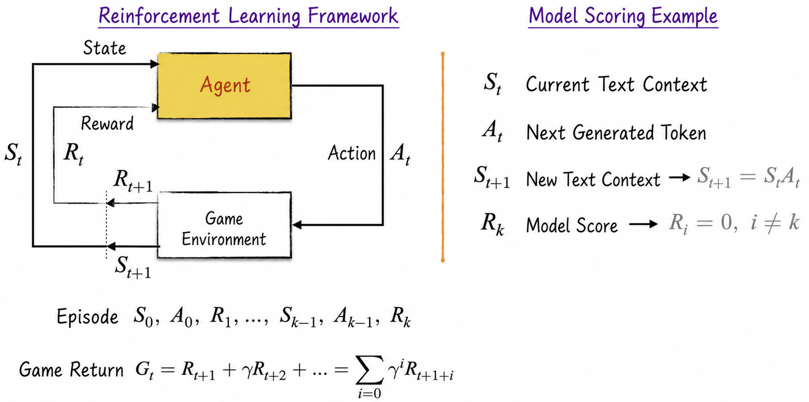
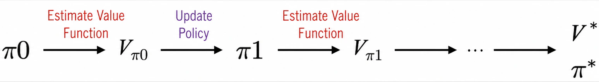

## 12.2 Introduction to Reinforcement Learning

The principal difference between reinforcement learning and traditional learning is the relationship between the training data and the model. In traditional learning, data collection and model training are relatively independent. In some scenarios, however, the training data are themselves a byproduct of using the model. Without using a large language model to generate text, for example, we cannot obtain the corresponding rewards, which form part of the training data. Traditional learning could handle this iteratively: use the model from the preceding iteration to collect rewards, then optimize the model from those rewards and prepare for the next iteration. This produces a discontinuous workflow, however: data collection and model optimization are only loosely coupled. The model changes during training, but the data are not updated promptly to reflect those changes, reducing learning efficiency.

Reinforcement learning's innovation is to interleave data collection and model optimization more tightly. The complete process resembles learning to ride a bicycle, where two steps occur almost simultaneously: gaining new riding experience and using that experience to improve one's skill. This continuity makes reinforcement learning highly effective for real-time feedback and adaptive learning.

### 12.2.1 Core Concepts

Understanding reinforcement learning in depth requires mastering its core concepts. To make them concrete, we introduce them in the setting of a game, focusing on three aspects: the game setup, episodes, and returns.

1. **Game setup**: At time $t$, the observable state of a game is $S_t$. An agent, which may be a model or a human, takes an action $A_t$ based only on the current state. As shown on the left of Figure 12-6, the action has two consequences: it produces a reward $R_{t+1}$ and changes the state from $S_t$ to $S_{t+1}$. The state transition may be stochastic: the same state and action can lead to different next states[^12-2-1], and the distribution of those next states is uncertain. The reward is likewise uncertain. This is why reinforcement learning exists. If the probability distributions of rewards and state transitions were known, traditional learning would suffice.
2. **Episode**: If $S_{t+1}$ is not a terminal state, repeat the process until the game ends; this chapter considers only finite games. The complete process from beginning to end is called an episode. As Figure 12-6 shows, the course and result of an episode ending after $k$ steps can be represented by the sequence $S_0,A_0,R_1,\cdots,S_{k-1},A_{k-1},R_k$.
3. **Return**: Although we have not yet defined the reinforcement-learning objective rigorously, intuition tells us that it must be related to the rewards obtained by the agent. An episode may contain multiple rewards, which must be aggregated somehow. Borrowing from finance, introduce the discount factor $\gamma$ and define the return as $G_t$. A return is defined for every step in the episode and represents the discounted rewards from that step onward. After aggregation, even a step with no immediate reward—for example, when the reward occurs only at the end—has a corresponding return that accurately reflects its value.

These concepts may seem abstract. Two concrete examples—the model-reward scenario and traditional learning—will make them more familiar.

In the model-reward scenario, the preceding text at time $t$ is the state $S_t$, and the next token generated by the model is the action $A_t$. These two elements fully determine the next state: the text at time $t$ plus the generated token. Moreover, not every step produces a reward[^12-2-2]. During text generation, the reward remains 0; after the complete text has been generated, its score becomes the reward.

The language of reinforcement learning differs greatly from traditional learning and may be difficult for beginners. If we define the training data as the states—with transitions depending only on the predetermined order of the data, not on the agent's actions—model predictions as actions, and the negative model loss as the reward, then reinforcement learning becomes equivalent to traditional learning with $\gamma=1$. Traditional learning can therefore be regarded as a special case of reinforcement learning.

### 12.2.2 Defining the Objective

Building on this setup, suppose the agent chooses actions through a policy $\pi$. In general, the agent has a stochastic policy[^12-2-3]: in state $S_t$, it samples an action from a probability distribution. The model-reward example has this property because an LLM returns a probability distribution over next tokens. To simplify the notation, let $\pi(A_t,S_t)$ denote the probability of taking action $A_t$ in state $S_t$:

$$
\begin{aligned}
\pi(A_t,S_t)&=p \\
\sum_{A_t}\pi(A_t,S_t)&=1
\end{aligned}
\tag{12-5}
$$

The objective of reinforcement learning is to find the optimal policy $\pi^*$ that gives the agent the highest expected return. The objective is intuitive but difficult to achieve. Defining it rigorously requires three steps.

1. As Equation (12-6) shows, define the value function for state $S_t$ as the expected return—the average return over all episodes—starting from $S_t$. Computing the value function must account for two sources of randomness: state transitions and the stochastic policy itself.

$$
V_\pi(s)=E_\pi[G_t\mid S_t=s]
\tag{12-6}
$$

2. Every state has a value, but the value of the initial state is most interesting because it reveals the agent's average performance over the complete game. For convenience, assume that the initial state is fixed and unique, and denote it $S_0$. A game without an explicit initial state can introduce a fictitious beginning. In the model-reward example, imagine an initial state in which the game generates different questions with certain probabilities before the model begins answering and receiving rewards.
3. Once the value function and initial state have been defined, the optimal policy has the mathematical expression in Equation (12-7). This is the objective of reinforcement learning.

$$
\pi^*=\operatorname*{arg\,max}_\pi V_\pi(S_0)
\tag{12-7}
$$

These equations resemble traditional learning. The value function appears to be simply the negative loss and therefore easy to compute. What makes it special?

In short, traditional loss functions have clear, simple expressions, whereas in most cases the precise form of the value function is unknown. In text generation, for example, the number of possible responses to a user question is almost infinite[^12-2-4]. Computing the exact expectation in Equation (12-6) is therefore nearly impossible. Because we do not know the function's functional form, even approximating it is extraordinarily difficult. Without reliable value estimates, Equation (12-7) remains a theoretical castle in the air—attractive but difficult to apply. The central problem of reinforcement learning is precisely to solve the optimization in Equation (12-7) without knowing the expression for the value function.

### 12.2.3 Two Solutions

Methods for solving reinforcement-learning optimization problems fall into two principal categories: policy learning and value-function learning. We begin with policy learning, whose mathematical form is more concise.

Restrict the policy to a neural network and denote it $\pi_\theta$, where $\theta$ represents model parameters. The value $V_\pi(S_0)$ is theoretically a function of $\theta$. The reinforcement-learning objective therefore becomes optimizing $\theta$ to maximize $V_\pi(S_0)$. Gradient ascent—gradient descent multiplied by $-1$—can solve this problem, as shown in Equation (12-8). In reinforcement learning, $\alpha$ conventionally denotes the learning rate.

$$
\begin{aligned}
\theta_{k+1}&=\theta_k+\alpha\nabla_\theta V_\pi(S_0) \\
\nabla_\theta V_\pi(S_0)&=\nabla_\theta E_\pi[G_t\mid S_t=S_0]
\end{aligned}
\tag{12-8}
$$

Correctly estimating the parameter gradient is the key and most challenging step. The equation does not directly solve the problem because $V_\pi(s)$ itself is difficult to compute accurately, much less its gradient. Mathematically, computing a gradient generally requires knowing the function's exact expression, as in traditional learning. Policy learning is distinctive because it estimates the gradient directly without knowing that expression. [Section 12.4](/books/deconstructing_LLM/chapter-12/12-4) examines policy learning in depth.

We next introduce value-function learning. Because LLM optimization does not directly use this method, the chapter covers only part of it.

Value-function learning uses the iterative process shown in Figure 12-7[^12-2-5] to estimate the value function and update the agent's policy. This process is called generalized policy iteration (GPI). Almost every reinforcement-learning algorithm draws on GPI to some extent, including the policy-learning methods introduced above. It will reappear throughout the discussion that follows.

Following GPI, value-function learning has two key steps: value estimation and policy updates. During value estimation, a neural network can approximate the value function[^12-2-6]. More specifically, the current policy is used to play the game and collect training data, after which the neural network estimates the value function. Although the estimates contain error, they can still drive policy updates. [Section 12.3](/books/deconstructing_LLM/chapter-12/12-3) discusses value-function estimation in depth.

Once estimates are available, use them to update the policy. Suppose the current state is $s$, the agent takes action $A_t$, receives reward $R_{t+1}$, and reaches state $S_{t+1}$. Under this setup, the updated policy[^12-2-7] is given by Equation (12-9). A policy update generally does not involve model learning; it can be solved directly from the equation[^12-2-8].

$$
\begin{aligned}
A_t^*&=\operatorname*{arg\,max}_{A_t}E[R_{t+1}+\gamma V(S_{t+1})\mid S_t=s] \\
\pi(A_t^*,s)&=1
\end{aligned}
\tag{12-9}
$$

In summary, the essence of the two methods is to estimate either the value function itself, through value-function learning, or its gradient, through policy learning, without knowing the exact expression for the value function.

[^12-2-1]: If a game's next state depends only on the current state and action, it is called a Markov game. Markov games are the principal subject of reinforcement learning and of this chapter. As the name suggests, Markov chains provide the mathematical tools for describing and solving them. Space constraints prevent an in-depth discussion; interested readers can consult [Section 13.3.2](/books/deconstructing_LLM/chapter-13/13-3#section-13-3-2).
[^12-2-2]: On the basis of the preceding section, the reward in the model-scoring game is indeed as described. ChatGPT optimization introduces other forms of reward in addition to the final score, as later sections explain in depth.
[^12-2-3]: The other type is a deterministic policy, a special case of a stochastic policy in which one action has probability 1.
[^12-2-4]: GPT-2 has a vocabulary of 50,256 tokens, excluding the special end-of-text token. If generated texts have length 10, approximately $10^{47}$ different texts are possible—an enormous number. Text generation is relatively simple because its state-transition rules are known. In typical reinforcement-learning scenarios, state transitions are also uncertain, making accurate value estimates still more difficult.
[^12-2-5]: The illustration is based on Richard S. Sutton and Andrew G. Barto's *Reinforcement Learning*.
[^12-2-6]: Almost any supervised-learning model can estimate a value function, not only a neural network; the value can also be estimated directly by an algorithm without constructing a model. Using a neural network to learn a value function is called deep reinforcement learning.
[^12-2-7]: The policy-update method used here is called a greedy policy. It is deterministic and often cannot reach the optimum. Introducing randomness can make it more flexible.
[^12-2-8]: Updating a policy directly from the value function is often difficult because the reward $R_{t+1}$ and next state $S_{t+1}$ are not fully known. Value-function learning generally uses Q-learning to simplify the update: define $Q(S_t,A_t)$ as the expected return from taking action $A_t$ in state $S_t$, and estimate it with a model. Space constraints prevent a detailed introduction here.
