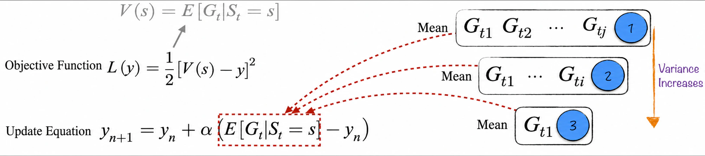
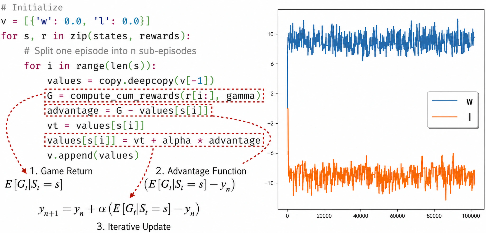
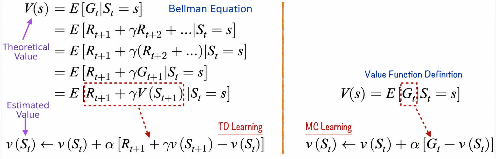
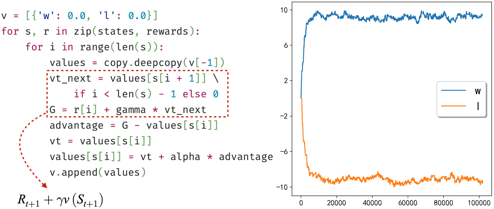
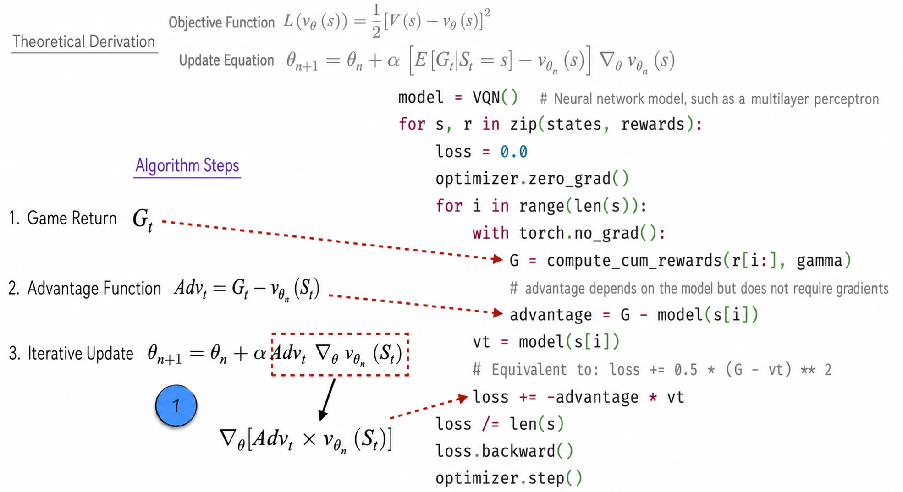
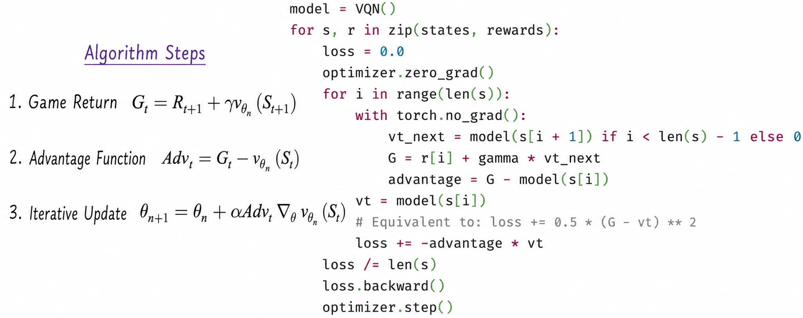
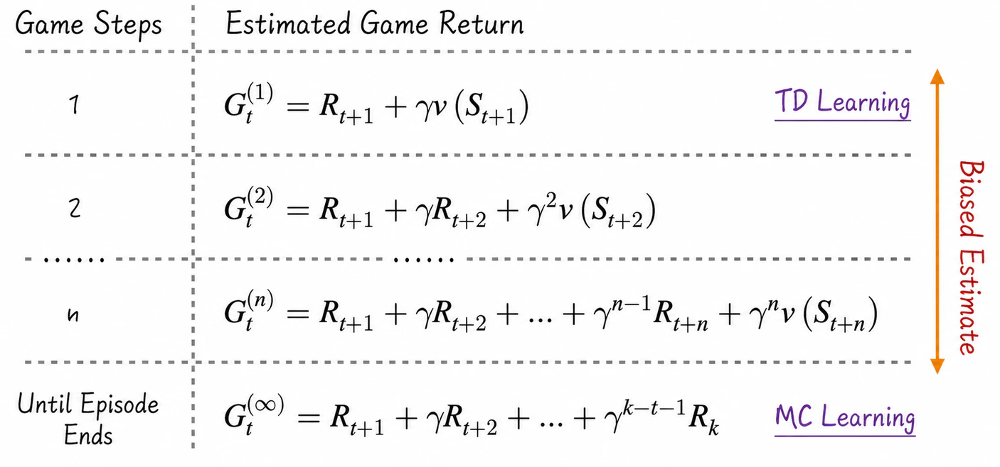
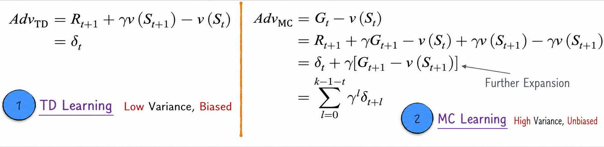
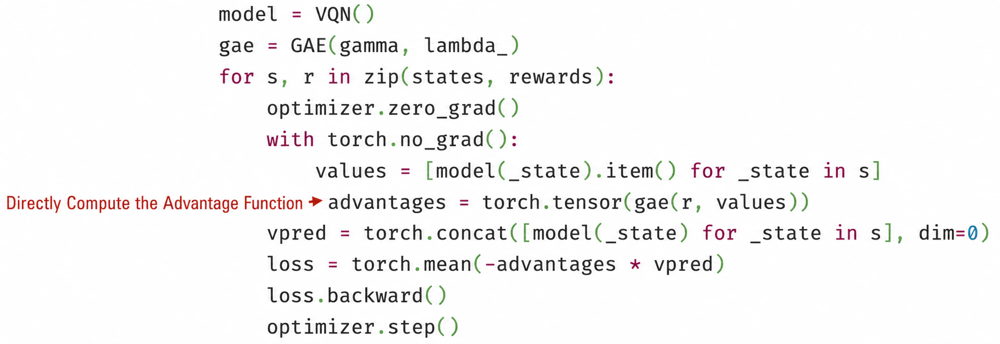

## 12.3 Value Function Learning

This section briefly discusses value function learning. Because the primary purpose of the discussion is to prepare for [Section 12.4.3](/books/deconstructing_LLM/chapter-12/12-4#section-12-4-3), it focuses on value function estimation without addressing policy updates. In other words, none of the algorithms discussed in this section are complete versions[^12-3-1].

To make the algorithms easier to discuss, consider a simple game[^12-3-2], which we will call the lottery game.

- The game has two states, denoted by $w$ and $l$.
- The player has two possible actions: draw (represented by 1) or pass (represented by 0).
- In state $w$, the reward for each draw follows a normal distribution with mean 1 and standard deviation 1. In state $l$, the reward has mean $-1$ and standard deviation 1.
- If the player chooses to draw, the game has a 1% probability of terminating after producing the reward. If the player chooses not to draw, the game terminates immediately (and the reward is 0 in this case).

Because this section does not need to consider policy updates, we can fix the policy to always draw, even though this is not the optimal policy. In this simple game, the value function of each state is relatively easy to obtain[^12-3-3]. Assuming $γ=0.9$, the expected return in state $w$ is approximately 10, and the expected return in state $l$ is approximately $-10$. These results will help us verify whether the algorithms discussed below are correct.

Value function estimation involves two concepts. The first is the theoretical value function: the expected discounted sum of rewards in an episode, denoted by $V(s)$; see Equation (12-6). The second is the actual estimate of the value function, denoted by $v(s)$. The following discussion strictly distinguishes between these symbols to avoid confusion.

### 12.3.1 MC Learning

MC learning is a classic algorithm for estimating value functions. Its full name is Monte Carlo learning, but for conciseness we will use the abbreviation hereafter. To better understand the algorithm, let us begin with an optimization problem: minimizing the objective function $L(y)$, as shown in Figure 12-8. Gradient descent (see [Section 6.2](/books/deconstructing_LLM/chapter-6/6-2)) yields the iterative formula shown in Figure 12-8. Iterating this formula causes $y$ to converge to $V(s)$.



In the iterative formula, $-(E[G_t\mid S_t=s]-y_n)$ is the gradient of the objective function. However, because $E[G_t\mid S_t=s]$ is unknown, the formula may appear impossible to execute in practice. To resolve this difficulty, recall stochastic gradient descent, discussed in [Section 6.4.1](/books/deconstructing_LLM/chapter-6/6-4#section-6-4-1). This algorithm does not compute the loss gradient exactly according to the mathematical formula; instead, it estimates the gradient from a subset of the data. Although the gradient used at each step contains some error, this does not prevent the algorithm from converging. In other words, gradient descent does not require the exact gradient; an estimate of the gradient[^12-3-4] can also lead to convergence.

Similarly, for the expectation $E[G_t\mid S_t=s]$ in the gradient above, the “correct” approach would be to complete enough game episodes, collect their returns, and calculate the mean, as indicated by label 1 in Figure 12-8. Yet this mean is itself only an estimate of the true expectation[^12-3-5]. We can instead estimate the expectation using the returns from a small number of episodes, as indicated by label 2. We can even take the “extreme” approach of using the return from a single episode, as indicated by label 3. All three methods are viable; using fewer episodes simply produces an estimate with higher variance.

Based on the preceding discussion, MC learning consists of three key steps: return calculation, advantage estimation, and iterative update. The left side of Figure 12-9 illustrates the implementation. In practice, the suffix beginning at each time step is treated as a separate episode to make full use of the collected data and improve learning efficiency. The right side of Figure 12-9 shows that the algorithm quickly converges to the vicinity of the value function.



Readers with a strong mathematical background may have a question about MC learning: given the objective function defined in Figure 12-8, we can directly derive an expression for $y$, as shown in Equation (12-10). Why, then, do we still need an iterative method to approximate the value function?

$$
y^*=V(s)=E[G_t\mid S_t=s]
\tag{12-10}
$$

The answer is straightforward. Because $E[G_t\mid S_t=s]$ is unknown, the mathematically derived expression cannot actually be used directly. If we substitute the return from a single episode into Equation (12-10), the result can only be calculated once and cannot be improved with returns from subsequent episodes. Continually refining the estimate with new returns leads directly to MC learning.

There is also a highly intuitive way to understand MC learning. With reference to the implementation in Figure 12-9, the entire algorithm can be summarized by Equation (12-11):

$$
v(S_t)\leftarrow v(S_t)+\alpha[G_t-v(S_t)]
\tag{12-11}
$$

Here, $v(S_t)$ represents an estimate of the expected return. If an observed return exceeds the current estimate—that is, if the outcome is better than the algorithm's baseline—we slightly increase the estimate. Conversely, we slightly decrease it. After many iterations, the estimate gradually approaches the true value.

### 12.3.2 The Bellman Equation and TD Learning

Although MC learning performs well in value function estimation, it is relatively inefficient: each update usually requires substantial resources and time while the algorithm waits for an entire game episode to end. Moreover, some scenarios may have no explicit terminal state, such as financial markets, where “money never sleeps.”

Ideally, the algorithm would update online while the game is still in progress, using each reward immediately and thereby learning in real time. TD learning meets this requirement. Its full name is temporal-difference learning, but for conciseness we will use the abbreviation hereafter.

To understand this algorithm more deeply, first consider the well-known Bellman equation. As shown in Figure 12-10, expanding and regrouping the expression for the return within the expectation yields the Bellman equation. It reveals a form of recursively defined equilibrium in the value function: the value of the current state equals the expected sum of the immediate reward and the discounted value of the next state.



Comparing the Bellman equation with the definition of the value function makes it easy to transform MC learning into TD learning. As shown in Figure 12-10, we simply replace $G_t$ with $R_{t+1}+\gamma v(S_{t+1})$ when calculating the advantage. TD learning can therefore also be viewed as an extension of MC learning.

- At each step of the game, estimate the episode return from the observed reward $R_{t+1}$ and the current estimate $v(S_{t+1})$.
- Use this return estimate to update the value estimate following the MC-learning procedure.

TD learning is a milestone algorithm in reinforcement learning. It has two notable characteristics. First, it can learn from each transition in real time. Second, $v(S_t)$ is not only the quantity updated by the algorithm but also part of the definition of the learning target. In other algorithms, the learning target is typically fixed. In TD learning, however, the target $R_{t+1}+\gamma v(S_{t+1})$ changes as $v(S_{t+1})$ changes[^12-3-6]. Although this estimate is usually biased early in training, the algorithm can still be guaranteed to converge in most cases, albeit sometimes relatively slowly. Careful engineering and approximation are therefore required to achieve rapid, stable convergence.

Convergence is not a problem in the simple game used in this chapter; Figure 12-11 shows the implementation and results. Although TD learning can update online while the game is being played, the code still waits for an episode to finish and collects its data before using the reward from each step to update the algorithm. This design keeps the implementation consistent with the text generation setting, where a complete text is generated first—equivalent to waiting for an episode to end—and reinforcement learning optimization is then performed.



### 12.3.3 Learning with Neural Networks

In the preceding discussion, neither MC learning nor TD learning constructed a model; each estimated the value function directly according to its algorithmic rules. This was, in fact, the original form of reinforcement learning. However, this approach can only handle discrete game states. It no longer applies when the state is continuous or the number of states is extremely large. For model scoring, for example, we cannot maintain a separate table entry for every possible text. This section therefore discusses how to integrate neural networks with reinforcement learning.

We begin with simple MC learning. Introducing the neural network model $v_\theta(s)$, where $\theta$ denotes the model parameters, into the optimization problem yields the theoretical derivation shown in Figure 12-12. The ideal iterative formula again contains the unknown quantity $E[G_t\mid S_t=s]$. Following the approach used in MC learning, we estimate this expectation with $G_t$, producing the three steps of MC learning with a neural network: return, advantage function, and iterative update.

Every iterative update involves calculating $Adv_t\nabla_\theta v_{\theta_n}(S_t)$. A literal implementation of this expression would require calculating the partial derivative of every parameter individually. In fact, if $Adv_t$ is independent of $\theta$, this expression equals the gradient of $Adv_t\times v_{\theta_n}(S_t)$. Because $Adv_t$ is originally also a function of $\theta$, a crucial technique is required: use `torch.no_grad` to disable gradient tracking for `advantage`, which is equivalent to freezing its parameters; see [Section 7.4.2](/books/deconstructing_LLM/chapter-7/7-4#section-7-4-2) for details. In addition, because gradient ascent is used here, the loss function must be multiplied by $-1$ when defined.



To summarize, when implementing reinforcement learning algorithms with PyTorch, it is best to make full use of existing abstractions for the computation. Doing so requires a deep understanding of backpropagation and optimization algorithms. Reinforcement learning algorithms differ substantially from one another, but they generally follow these steps.

1. Use algebra to move every factor multiplying the gradient, except the learning rate, inside the gradient operator.
2. Ensure that the factors moved inside the operator are treated as constants during gradient computation.
3. Define a surrogate loss from the resulting gradient expression, paying careful attention to its sign.

These steps will recur in the more complex algorithms that follow. The code divides one episode into multiple shorter episodes but does not update the parameters after every short episode, which differs slightly from the strict definition of the algorithm. This choice both maintains consistency with the text generation setting and leaves the results unaffected. When implementing classic algorithms, we must distinguish the essential steps from those that can be adjusted flexibly.

After combining MC learning with neural networks, the combination of TD learning and neural networks becomes easy to understand, as shown in Figure 12-13. We only need to adjust the return calculation accordingly.



### 12.3.4 n-Step TD Learning and the Advantage Function

As discussed in [Section 12.3.2](/books/deconstructing_LLM/chapter-12/12-3#section-12-3-2), TD learning is effectively an extension of MC learning; the only difference lies in how the return $G_t$ is estimated. MC learning calculates the actual return from all rewards in an episode, whereas TD learning estimates the return from the current reward and the algorithm's existing result. Extending the idea of TD learning, after the game proceeds for $n$ steps, we can estimate the return from the rewards over the first $n$ steps and the state reached after those steps, as shown in Figure 12-14.



After the game proceeds for $n$ steps, the best estimate of the return is $G_t^{(n)}$. Following the procedure of MC learning, we can then define n-step TD learning:

$$
v(S_t)\leftarrow v(S_t)+\alpha[G_t^{(i)}-v(S_t)]
\tag{12-12}
$$

Although the preceding sections devoted considerable space to estimating the return, the quantity that directly participates in the iterative update is $G_t^{(n)}-v(S_t)$. This quantity is called the advantage function. It can be understood as follows: before the game begins, the algorithm uses $v(S_t)$ as its baseline. As the game proceeds and feedback becomes available, the expected return is updated to $G_t^{(n)}$. If $G_t^{(n)}>v(S_t)$, the chosen action performs better than the baseline. This may mean that the model's baseline estimate is too low and should be increased, or it may mean that the action is indeed more beneficial and its probability should be increased, as discussed in [Section 12.4](/books/deconstructing_LLM/chapter-12/12-4).

### 12.3.5 TD($\lambda$) Learning and GAE

For n-step TD learning, how should we choose the most appropriate $n$? First, the advantage function in MC learning equals a discounted sum of the advantage functions in TD learning, as derived in Figure 12-15. In general, the MC advantage function has higher variance than the TD advantage function, as the examples in Figures 12-9 and 12-11 also demonstrate. On the other hand, the TD advantage function is biased. Therefore, the smaller $n$ is, the lower the variance of the advantage function but the greater its bias; no theoretically optimal $n$ can be selected.



Instead of selecting a particular $n$, we can take a weighted average of all the results. This is TD($\lambda$) learning.

$$
\begin{aligned}
G_t^\lambda&=(1-\lambda)\sum_{i=1}^{\infty}\lambda^{i-1}G_t^{(i)} \\
v(S_t)&\leftarrow v(S_t)+\alpha[G_t^\lambda-v(S_t)]
\end{aligned}
\tag{12-13}
$$

Calculating $G_t^\lambda$ directly according to Equation (12-13) would introduce substantial redundant computation. For greater efficiency, we introduce the generalized advantage estimation (GAE) algorithm. As shown in Figure 12-16, we first express the advantage function for each n-step TD method as a discounted sum of the TD advantage function $\delta_t$, and then expand the TD($\lambda$) advantage function to obtain a formula that can be computed efficiently.


When $\lambda=0$, the algorithm is TD learning; when $\lambda=1$, it becomes MC learning. Unless $\lambda=0$, TD($\lambda$) learning must wait until the episode ends. Because GAE makes better use of information from every step of the game, it is generally preferred for value function estimation when there are no special real-time requirements.

The code implementation is straightforward. Like the return calculation, it discounts a sequence: the return discounts rewards, whereas GAE discounts $\delta_t$.

#### Listing 12-2 GAE ([Complete Code](https://github.com/GenTang/regression2chatgpt/blob/en/ch12_rl/value_learning.ipynb))

```python
class GAE:

    def __init__(self, gamma, lambda_):
        self.gamma = gamma
        self.lambda_ = lambda_

    def __call__(self, rewards, values):
        advantages = []
        last_ad = 0
        vt_next = 0
        for r, vt in zip(reversed(rewards), reversed(values)):
            delta = r + self.gamma * vt_next - vt
            last_ad = delta + self.gamma * self.lambda_ * last_ad
            advantages.insert(0, last_ad)
            vt_next = vt

        return advantages
```

With GAE, we can implement the corresponding value function estimation. Figure 12-17 shows how to combine GAE with a neural network.



[^12-3-1]: A complete algorithm would also update the policy according to the relevant rules after estimating the value function. Interested readers may consult other literature on the subject.
[^12-3-2]: For the complete implementation of the game, see [`ch12_rl/utils.py`](https://github.com/GenTang/regression2chatgpt/blob/en/ch12_rl/utils.py).
[^12-3-3]: On average, each episode contains 100 draws, and the reward from each draw in state $w$ is 1. Summing the geometric series gives an expected return of approximately 10.
[^12-3-4]: Not every estimate produces good convergence. It can be proved mathematically that convergence is guaranteed only by an unbiased estimate—one whose expectation equals the true gradient.
[^12-3-5]: The return can be treated as a random variable, and the score from each episode is just one observation. The mean of multiple observations has the same expectation as a single observation but lower variance, making it a more reliable estimate.
[^12-3-6]: TD learning dynamically adjusts the learning target using the result of the existing algorithm or model. This method is called bootstrapping. It makes data collection and model optimization a relatively continuous process.
