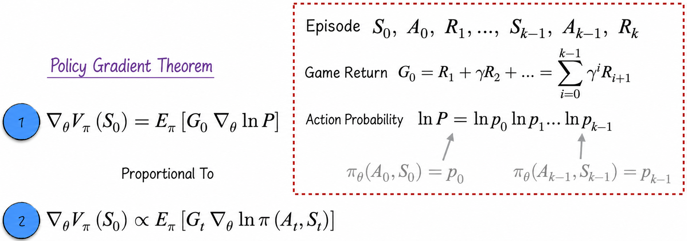
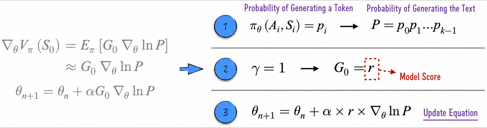
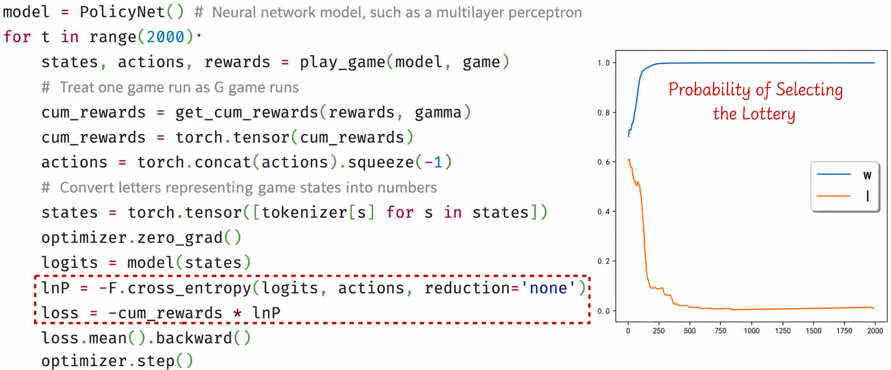
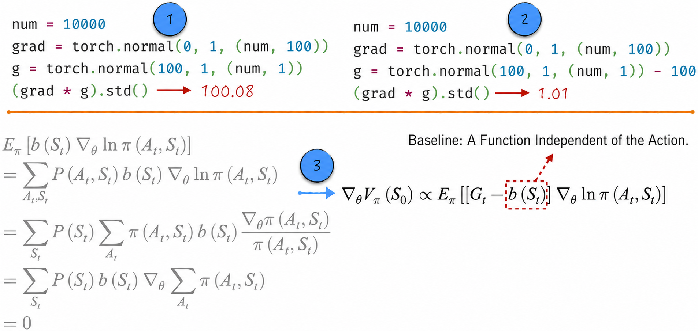
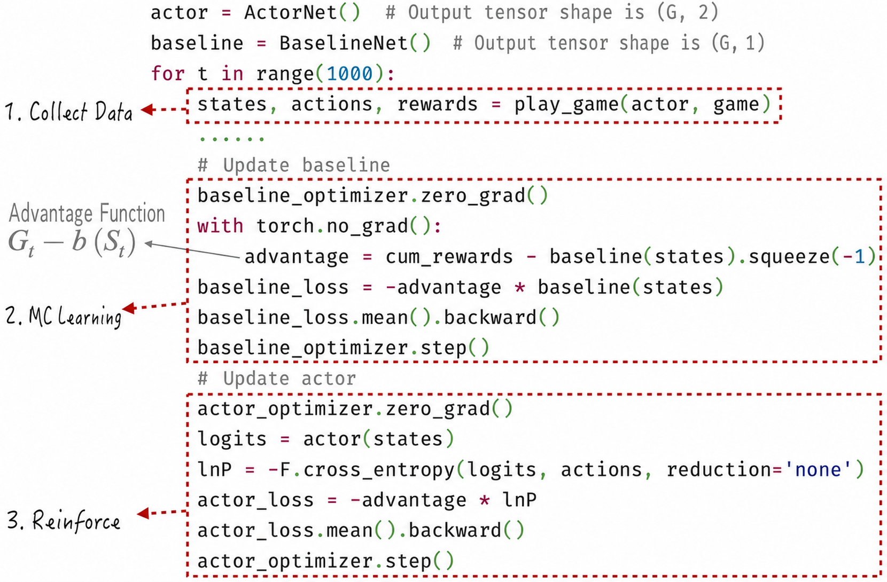
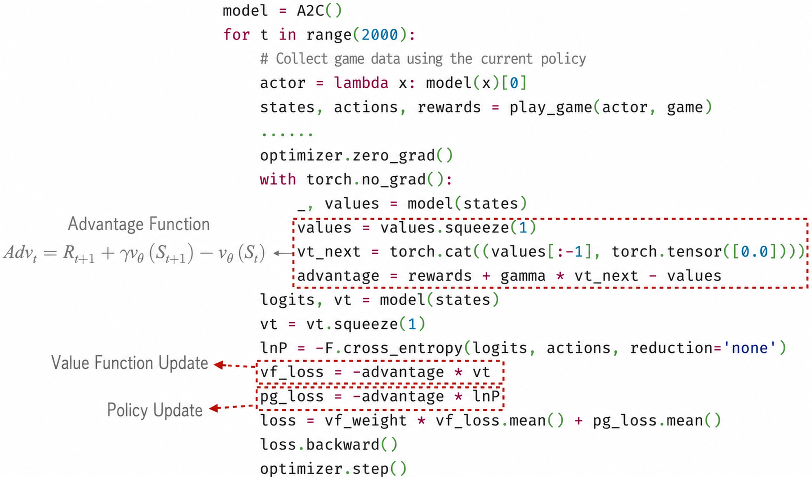

## 12.4 Policy Learning

The previous section examined the core concepts of value function learning: how to estimate a value function under a given policy. Yet value function estimation is only a small part of the overall process. The true objective of reinforcement learning is to find the optimal policy for the game. To achieve this objective, we can update the policy according to a set of rules based on the value function estimate and iterate until the optimal policy is obtained (see Figure 12-7). This method works, but it is somewhat cumbersome and indirect.

A more concise approach is to build a model for the policy directly and use an optimization algorithm to make the policy converge to the optimum. This section examines the Reinforce method for policy learning and then uses value function estimation to make policy convergence faster and more stable. These ideas lead to the other two algorithms discussed in detail here: Reinforce with Baseline and A2C (Advantage Actor-Critic).

The discussion continues to use the game from [Section 12.3](/books/deconstructing_LLM/chapter-12/12-3). By definition, the expected reward is 1 in state $w$ and $-1$ in state $l$. Because there is no transition between these states, the optimal policy is easy to derive: continue drawing while in state $w$, and avoid drawing while in state $l$.

### 12.4.1 The Policy Gradient Theorem

The core theory behind policy learning is the policy gradient theorem. To understand it, first recall [Section 12.2.2](/books/deconstructing_LLM/chapter-12/12-2#section-12-2-2). In the game, the policy takes the game state $S_t$ as input and outputs a probability distribution over actions $A_t$. We use a neural network to model the policy, denoted by $\pi_\theta$, where $\theta$ represents the model parameters. To simplify the mathematical notation, $\pi(A_t,S_t)$ denotes the probability of taking the specific action $A_t$ in state $S_t$. The learning objective is to maximize the value function of the initial state $S_0$, namely $V_\pi(S_0)=E_\pi[G_t\mid S_t=S_0]$. The key to solving this optimization problem is calculating the policy gradient:

$$
\nabla_\theta V_\pi(S_0)=\nabla_\theta E_\pi[G_t\mid S_t=S_0]
\tag{12-14}
$$

Calculating the gradient in this equation directly is challenging. Fortunately, the policy gradient theorem provides two more practical methods, as shown in Figure 12-18.



1. In the first method, indicated by label 1, the policy gradient theorem is expressed as an equality. Here, $G_0$ and $\ln P$ are episode-level quantities. If the episode is $S_0,A_0,R_1,\cdots,S_{k-1},A_{k-1},R_k$, then $G_0$ is the return at the initial state of that episode, and $\ln P$ is the joint probability of all actions in the episode.
2. In the second method, indicated by label 2, the policy gradient is expressed as a proportional relationship: the exact policy gradient differs from the quantity on the right side of the expression by a constant factor. This estimate is sufficient for an optimization algorithm. A constant factor does not affect convergence, although it does affect the choice of learning rate. Although the gradient is calculated for the policy at the initial state, the right side of the expression has little connection to that state; it is the expected product of the return and log probability at an arbitrary time step.

Of the two methods, the first is more accurate but more cumbersome because it requires calculating the joint probability of every action in an episode. The second requires only the probability of the current action and is therefore generally preferred.

Although the first method is impractical, it provides considerable theoretical insight. Following the approach of MC learning and using the return from a single episode to estimate the policy gradient $E_\pi[G_0\nabla_\theta\ln P]$ yields the parameter-update formula on the left side of Figure 12-19.



Now map this formula to the model-scoring setting. The game policy is the large language model that generates a response, and $P$ is the probability of the generated text. The game reward is produced at the final step. If the discount rate is set to $\gamma=1$, the return at the initial state of the episode equals the model score. Consequently, the parameter-update formula indicated by label 3 in Figure 12-19 is nearly identical to Equation (12-4) in [Section 12.1.3](/books/deconstructing_LLM/chapter-12/12-1#section-12-1-3). This result also reminds us that directly applying policy learning to optimize a large language model may cause serious “overfitting.”

### 12.4.2 The Reinforce Algorithm

Reinforce is sometimes translated as “reinforcement” in Chinese, but this book uses its English name to avoid unnecessary confusion. The algorithm has two core design elements. First, it uses the second formulation of the policy gradient theorem. Second, following MC learning, it uses data from a single episode to estimate the policy gradient: $E_\pi[G_t\nabla_\theta\ln\pi(A_t,S_t)]\approx G_t\nabla_\theta\ln\pi(A_t,S_t)$. The iterative formula is:

$$
\theta_{n+1}=\theta_n+\alpha G_t\nabla_\theta\ln\pi(A_t,S_t)
\tag{12-15}
$$

For an implementation of $\ln\pi(A_t,S_t)$, see Figure 12-4 in [Section 12.1.3](/books/deconstructing_LLM/chapter-12/12-1#section-12-1-3). For an implementation of $G_t\nabla_\theta\ln\pi(A_t,S_t)$, see Figure 12-12 in [Section 12.3.3](/books/deconstructing_LLM/chapter-12/12-3#section-12-3-3). With this preparation, we obtain the implementation and results shown in Figure 12-20 ([Complete Code](https://github.com/GenTang/regression2chatgpt/blob/en/ch12_rl/policy_learning.ipynb)).



The core steps of the algorithm appear inside the dashed box in Figure 12-20, where `lnP` corresponds to $\ln\pi(A_t,S_t)$ in Equation (12-15). Note that when calculating the return `cum_rewards`, its parameters must be frozen. For a classification model—the policy in this example is a classification model—the final class is selected by random sampling and is naturally nondifferentiable.

### 12.4.3 The Baseline Algorithm

In Reinforce, $G_t$ participates directly in the gradient calculation. Its high variance reduces convergence stability, as discussed in [Section 12.3.5](/books/deconstructing_LLM/chapter-12/12-3#section-12-3-5). We therefore want a method that reduces the variance of the gradient: the baseline algorithm. Its full name is Reinforce with Baseline, shortened to “Baseline” in this chapter.

Before examining the algorithm in depth, let us use an intuitive example to understand its core design. As indicated by label 1 in Figure 12-21, suppose that `grad` is the gradient of $\ln\pi(A_t,S_t)$ itself and `g` is the return. When the return is used directly, the gradient that enters the iterative update has high variance. Reducing the absolute value of the return—for example, by subtracting the mean return—can effectively reduce the variance of the final gradient, as indicated by label 2. This process resembles normalizing the return.

As indicated by label 3 in Figure 12-21, introducing a function $b(S_t)$ that is independent of the action shows that subtracting it from the return does not affect the policy gradient estimate. This action-independent function is the baseline.



The baseline can be chosen flexibly. It may be a fixed value or an action-independent function such as the value function. Because Reinforce is conceptually similar to MC learning, a natural choice is the value function estimated by MC learning. Figure 12-22 shows the specific procedure and implementation ([Complete Code](https://github.com/GenTang/regression2chatgpt/blob/en/ch12_rl/a2c.ipynb)).



Two points require attention.

1. If the value function learned by MC learning is used as the baseline, the policy is actually updated using the MC advantage function, which is also used to update the value function. The basis for increasing the probability of an action should be whether it achieves a return above the average level, not merely the average return in a particular state.
2. The value function estimate depends on the game policy. To emphasize the main ideas, [Section 12.3.3](/books/deconstructing_LLM/chapter-12/12-3#section-12-3-3) estimated the value function under a fixed policy. Here, however, the policy changes continually. We must therefore follow the generalized policy iteration introduced in Figure 12-7 and alternate between updating the value function and the policy: first collect data under the existing policy, then calculate the MC advantage function and use that same advantage function to update both the value function and the policy.

### 12.4.4 The A2C Algorithm

The Baseline algorithm uses the MC advantage function. As discussed in [Section 12.3.5](/books/deconstructing_LLM/chapter-12/12-3#section-12-3-5), the MC advantage function is only a special case of the TD Lambda advantage function ($\lambda=1$), and it has the highest variance. We can therefore improve the Baseline algorithm further by using other TD Lambda advantage functions. The A2C algorithm, for example, uses the TD advantage function ($\lambda=0$).

Once the principle behind the Baseline algorithm is understood, implementing A2C is relatively straightforward; the main change lies in calculating the advantage function. This section focuses on a model architecture commonly used with A2C: parameter sharing. In the Baseline implementation, two independent neural networks represent the game policy and the value function estimate. A2C could retain this design, but then the knowledge learned during value function training could not be transferred to policy updates. To avoid this waste, a more common architecture in practice uses one neural network with two heads to implement both the game policy and value function estimation.

#### Listing 12-3 A2C ([Complete Code](https://github.com/GenTang/regression2chatgpt/blob/en/ch12_rl/a2c.ipynb))

```python
class A2C(nn.Module):

    def __init__(self):
        super().__init__()
        self.emb = nn.Embedding(2, 4)
        self.action_ln = nn.Linear(4, 2)
        self.critic_ln = nn.Linear(4, 1)

    def forward(self, x):
        # x: (G)
        x = F.relu(self.emb(x))
        actions = self.action_ln(x)  # (G, 2)
        values = self.critic_ln(x)   # (G, 1)
        return actions, values
```

Training the model closely resembles the Baseline example, with two main differences. First, the advantage function is estimated using TD learning. Second, because the parameters are shared, only one loss function needs to be defined. Figure 12-23 shows the relevant implementation details.


