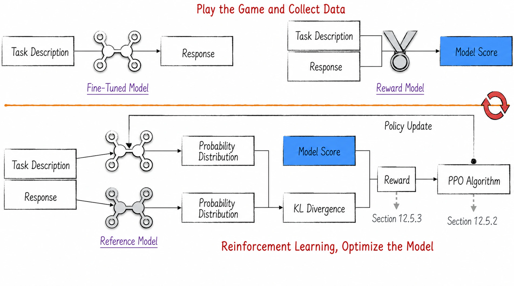
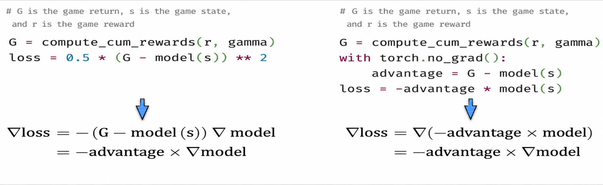
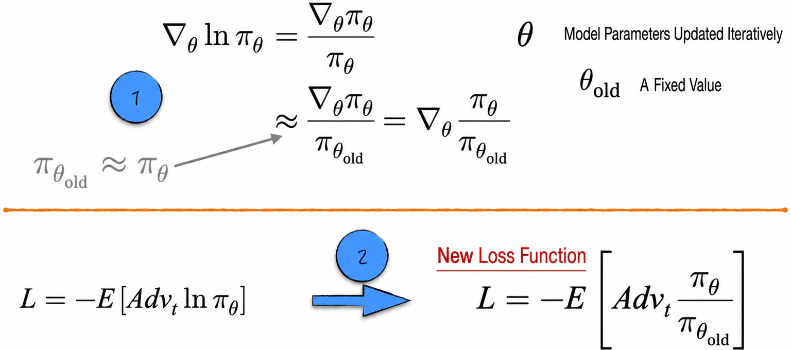
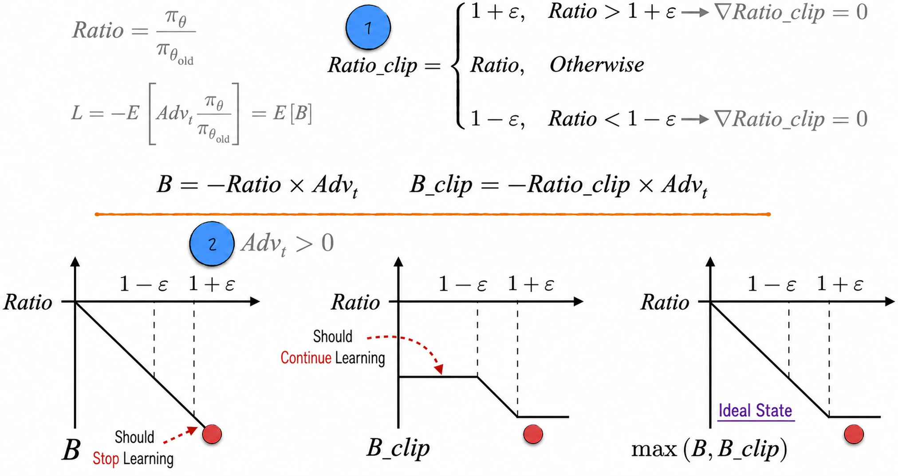
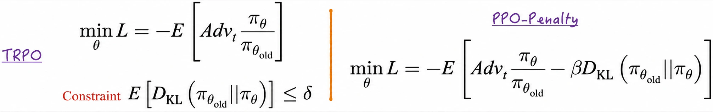
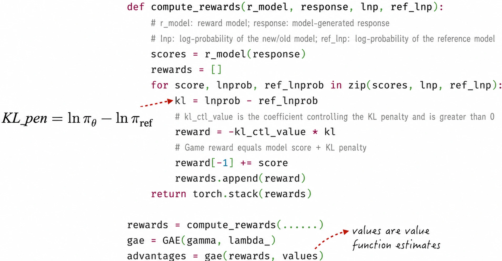
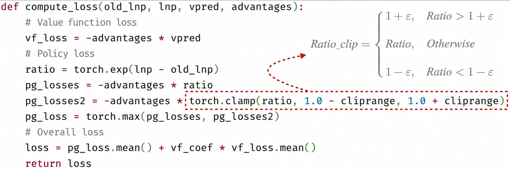
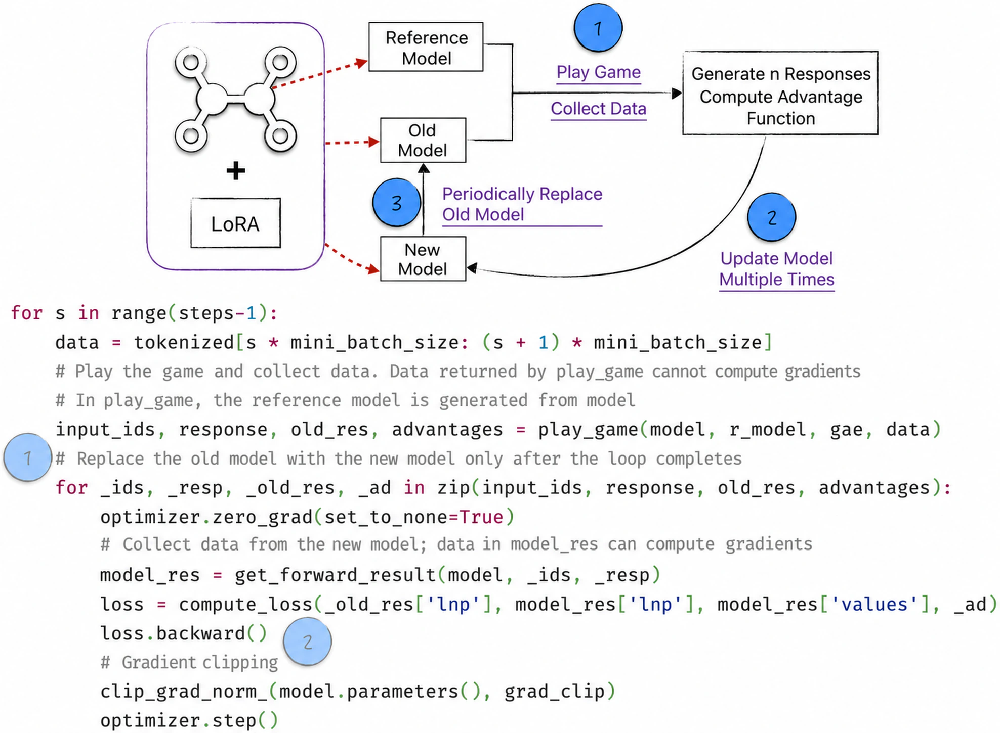

## 12.5 Optimizing Large Language Models with PPO

After the preceding preparation, we now have sufficient background knowledge and experience to examine how reinforcement learning can further optimize large language models. Figure 12-24 shows the complete optimization process[^12-5-1]. It consists of two stages. First, the large language model generates text, and the reward model assigns a corresponding score; the primary purpose of this stage is data collection. Next, reinforcement learning is applied to the collected data to optimize the model.



### 12.5.1 Loss Functions and Parameter Updates

The loss function is the soul of an artificial intelligence model. It not only provides a criterion for evaluating model performance but also directly determines how the model parameters are updated. The approach followed earlier was to define the model loss explicitly and then derive the parameter-update formula from an optimization algorithm; see Figure 6-8 in [Chapter 6](/books/deconstructing_LLM/chapter-6) for details. On closer inspection of the update formula, however, the quantity used in the calculation is actually the gradient of the loss function rather than the loss function itself. If two functions have the same gradient, choosing either one as the loss produces the same result. In the MC learning example from [Section 12.3.3](/books/deconstructing_LLM/chapter-12/12-3#section-12-3-3), for instance, the two loss definitions shown in Figure 12-25 produce exactly the same model results.



This observation suggests that we can work backward from the parameter-update formula to derive a suitable and relatively simple loss function, thereby simplifying the model's theory. In policy learning, for example, the original objective function is complex and requires the policy gradient theorem merely to estimate its gradient. Insisting on the original objective would make further improvements to the algorithm difficult. We therefore discuss how to redefine the loss function for policy learning, using A2C as an example; the same idea applies to other algorithms.

[Section 12.4.4](/books/deconstructing_LLM/chapter-12/12-4#section-12-4-4) constructed the model using shared parameters. Although this design improves learning efficiency in engineering practice, it increases the theoretical complexity. For clarity, first assume that A and C are independent models. The parameters of the policy model are updated as follows:

$$
\theta_{n+1}=\theta_n+\alpha Adv_t\nabla_\theta\ln\pi(A_t,S_t)
\tag{12-16}
$$

Equation (12-16) is nearly identical to Equation (12-4), so the A2C policy loss can be defined as in Equation (12-17). This loss function is not very different from the loss of a classification model. Setting $Adv_t=-1$ yields the familiar classification loss function.

$$
L=-E[Adv_t\ln\pi(A_t,S_t)]
\tag{12-17}
$$

### 12.5.2 From A2C to PPO

The loss function in Equation (12-17) clearly explains why using A2C to optimize a large language model may lead to serious “overfitting”: although the optimized model receives higher scores, its performance deteriorates from a human perspective. This occurs because A2C focuses only on the model score used to define the loss and ignores the knowledge accumulated during pretraining. Our objective is to optimize the model within a relatively limited range: achieve the highest possible scores while avoiding excessive deviation from the model before optimization. This requires PPO (Proximal Policy Optimization).

Starting with the A2C gradient, Figure 12-26 introduces the fixed parameters $\theta_{old}$. When $\theta\approx\theta_{old}$, we can infer that $\pi_\theta\approx\pi_{\theta_{old}}$. The gradient of $\ln\pi_\theta$ can therefore be approximated by the gradient of $\pi_\theta/\pi_{\theta_{old}}$, allowing us to define a new loss function. Intuitively, the advantage function indicates how favorable an action is relative to the average: the greater the advantage, the more the probability of that action should increase, and vice versa. The objective of the new loss can thus be understood as maximizing the expected advantage.



If $\pi_{\theta_{old}}$ represents the parameters before optimization, then $Ratio=\pi_\theta/\pi_{\theta_{old}}$ reflects the degree to which the model has changed. The old loss contains information only about the current model, whereas the new loss contains information about both the current and old models. The central optimization idea is to update the model normally when the change is small and stop updating it when the change becomes large. Clipping $Ratio$ produces $Ratio_{clip}$, as indicated by label 1 in Figure 12-27.



Using the expectation of $B$ as the loss is equivalent to A2C, and the model may continue to diverge from the old model. If only $B_{clip}$ is used, clipping prevents further optimization when $Ratio<1-\varepsilon$. Defining the expectation of $\max(B,B_{clip})$ as the loss allows $B$ to be reduced while preventing model changes from exceeding the specified range. The same conclusion applies when the advantage function is negative. The policy loss for PPO-Clip is therefore defined as follows:

$$
p_{\mathrm{loss}}=E[\max(B,B_{\mathrm{clip}})]
\tag{12-18}
$$

As in A2C with shared parameters, PPO shares parameters between the policy update and value function estimation. The policy loss and value function loss must therefore be considered together. Here, $v_\theta$ denotes the estimated value function, and $c$ is a hyperparameter that weights the value function loss.

$$
\begin{aligned}
v_{\mathrm{loss}}&=E[-Adv_t\times v_\theta] \\
L&=E[p_{\mathrm{loss}}+c\times v_{\mathrm{loss}}]
\end{aligned}
\tag{12-19}
$$

### 12.5.3 Refining Game Rewards

One more detail requires special attention when PPO is used to optimize a large language model: refining the game rewards. We begin with two mathematical tools for probability distributions: Kullback–Leibler divergence (KL divergence or KLD) and entropy. To understand their applications in artificial intelligence, let us start with cross-entropy.

- The loss function of a classification model is the cross-entropy between the labels and the model predictions. For two probability distributions $P$ and $Q$, their cross-entropy is

$$
\operatorname{cross\_entropy}(P,Q)=-\sum_i p_i\ln q_i
\tag{12-20}
$$

- Entropy is the cross-entropy of a probability distribution with itself. It reflects how dispersed the distribution is: when all probability is concentrated on one value, the entropy is 0; when the probability is uniformly distributed over $n$ values, the entropy reaches its maximum, $\ln n$.

$$
\operatorname{entropy}(P)=-\sum_i p_i\ln p_i
\tag{12-21}
$$

- KL divergence combines cross-entropy and entropy. It can be reduced in two ways: by reducing the difference between $P$ and $Q$, or by increasing the dispersion of $P$.

$$
D_{\mathrm{KL}}(P\|Q)=-\operatorname{entropy}(P)+\operatorname{cross\_entropy}(P,Q)
\tag{12-22}
$$

Now apply these tools to a large language model. The model output $\pi$ is a probability distribution over the next token, so cross-entropy can measure the difference between two large language models. Ensuring that the cross-entropy between the new and old models does not exceed an upper bound prevents the new model from straying too far from the old one. Meanwhile, subject to accuracy requirements, we also want the model to preserve as much diversity as possible. Together, these two objectives correspond precisely to keeping the KL divergence between the new and old models within a reasonable range.

The left side of Figure 12-28 uses KL divergence to define a constrained optimization problem. This is an early form of PPO known as TRPO (Trust Region Policy Optimization). Because constrained optimization problems are difficult to solve, KL divergence can instead be added to the loss as a penalty term, yielding PPO-Penalty on the right.



Classic PPO-Clip does not use KL divergence directly. To improve model optimization, we can introduce it into the model-scoring game.

1. Select a reference model. This reference model differs from PPO's old model: it remains unchanged throughout the optimization process, whereas the old model is updated at appropriate points as the algorithm runs. The fine-tuned model before optimization is usually chosen as the reference, although there are no strict requirements on its architecture or form.
2. For a given text, calculate the KL divergence between the new model and the reference model at each step, and use its negation, $-D_{\mathrm{KL}}(\pi_\theta\|\pi_{ref})$, as the game reward. This means that every generated token receives a reward, rather than the model score appearing only at the final step.

KL divergence is always positive, so this reward is always negative and guides the new model toward the reference model. Although KL divergence is mathematically an expectation, implementations usually use $KL_{pen}$ instead of calculating it exactly.

$$
\begin{aligned}
D_{\mathrm{KL}}(\pi_\theta\|\pi_{\mathrm{ref}})
&=\sum_{A_t}\pi_\theta(A_t,S_t)[\ln\pi_\theta(A_t,S_t)-\ln\pi_{\mathrm{ref}}(A_t,S_t)] \\
KL_{\mathrm{pen}}&=\ln\pi_\theta-\ln\pi_{\mathrm{ref}}
\end{aligned}
\tag{12-23}
$$

There are three main reasons for this choice. First, $KL_{pen}$ follows the same idea as estimating the policy gradient from a single episode. Second, it measures the difference between the new and reference models and is positive in most cases. Third, if the value is negative, the new model has good dispersion; subtracting a negative value is equivalent to adding an entropy reward and can increase model diversity.

### 12.5.4 Code Implementation

This section examines how PPO can be used to optimize a large language model. Before introducing the code, three pieces of background information are necessary.

1. Because this book uses the smallest version of GPT-2 and performs only limited fine-tuning, directly optimizing the question-answering model would not produce intuitive results. To highlight the characteristics of reinforcement learning, this section implements a simpler task: generating movie reviews. The same approach still applies to optimizing a question-answering chatbot.
2. Many open-source tools provide PPO abstractions, but they contain numerous details unrelated to the algorithm itself. This book implements the entire algorithm to aid understanding. The implementation does not support batch training over multiple texts and is therefore unsuitable for efficiently training on large volumes of data.
3. Reinforcement learning optimization requires a fine-tuned model, a reward model, and training data. This section uses `lvwerra/gpt2-imdb` to generate movie reviews, `lvwerra/distilbert-imdb` to classify reviews as positive or negative, and IMDb movie reviews as the training data. The optimization objective is to automatically generate a positive movie review from a given opening.

The first step is to construct the model. Through shared parameters, PPO implements both text generation—the game policy—and score prediction—the value function estimate. Lines 8–13 of Listing 12-4 show the model architecture, and Lines 17–25 use LoRA for fine-tuning.

#### Listing 12-4 Model Architecture ([Complete Code](https://github.com/GenTang/regression2chatgpt/blob/en/ch12_rl/llm_ppo.ipynb))

```python
class A2CLLM(nn.Module):

    def __init__(self, model):
        super().__init__()
        self.actor = model
        self.critic = nn.Linear(model.base_model.embed_dim, 1, bias=False)

    def forward(self, x):
        _res = self.actor(input_ids=x, output_hidden_states=True)
        logits = _res.logits
        emb = _res.hidden_states[-1]
        values = self.critic(emb).squeeze(-1)
        return logits, values

    ......

def init_peft_model(model):
    config = LoraConfig(
        r=1,
        lora_alpha=8,
        target_modules=['c_attn'],
        fan_in_fan_out=True,
        bias='none',
        modules_to_save=['critic'])
    return PeftModel(model, config, adapter_name='lora_ppo')

model = A2CLLM(AutoModelForCausalLM.from_pretrained('lvwerra/gpt2-imdb'))
model = init_peft_model(model)
```

After constructing the model architecture, the next step is to calculate the return and the resulting advantage function; for details on GAE, see [Section 12.3.5](/books/deconstructing_LLM/chapter-12/12-3#section-12-3-5). Figure 12-29 shows the implementation.



After obtaining the advantage function, the next step is to define the model loss. Figure 12-30 is essentially a direct implementation of Equation (12-18) and Equation (12-19).



Model training then follows the standard reinforcement learning procedure: play the game, collect data, and update the model. PPO requires us to distinguish among the new model, the old model, and the reference model. Figure 12-31 shows their relationships and code implementations.



Listing 12-5 shows the implementation for generating reviews and collecting data. LoRA makes it convenient to produce the reference model, as shown in Lines 14–15.

#### Listing 12-5 Generating Reviews and Collecting Data ([Complete Code](https://github.com/GenTang/regression2chatgpt/blob/en/ch12_rl/llm_ppo.ipynb))

```python
def play_game(model, r_model, gae, data):
    model.eval()
    all_input_ids, all_response, all_res, all_advantages = [], [], [], []
    for input_ids in data['input_ids']:
        all_input_ids.append(input_ids)
        # Generate a review
        response = model.generate(input_ids)
        all_response.append(response)
        with torch.no_grad():
            # Record data from the old model
            res = get_forward_result(model, input_ids, response)
            all_res.append(res)
            # Record data from the reference model
            with model.disable_adapter():
                ref_res = get_forward_result(model, input_ids, response)
            rewards = compute_rewards(r_model, response,
                                      res['lnp'], ref_res['lnp'])
            all_advantages.append(gae(rewards, res['values']))
    model.train()
    return all_input_ids, all_response, all_res, all_advantages
```

A close look at the code shows that the model is placed in evaluation mode while data is collected (Line 2). In addition, `lora_dropout` is not configured when LoRA is used. This is because the model loss depends on $Ratio$, which is a quotient of model outputs. Dropout may cause the model's prediction for some samples to deviate substantially, making $Ratio$ abnormally large and destabilizing the algorithm. Dropout must therefore be used with considerable care in PPO.

If dropout is indeed required, the best place for it is inside the LoRA components. The frozen fine-tuned model also contains dropout components, but they should remain disabled because they were originally intended to affect updates to parameters that are now frozen. Extra care is required when enabling or disabling dropout in the LoRA components independently. For the implementation and model results, see [`ch12_rl/llm_ppo_correct_dropout.ipynb`](https://github.com/GenTang/regression2chatgpt/blob/en/ch12_rl/llm_ppo_correct_dropout.ipynb).

[^12-5-1]: The workflow in the main text is based on ChatGPT's technical implementation. There are many other ways to optimize a model with reinforcement learning; readers should not be constrained by this particular example, but should learn to apply the principles more broadly.
