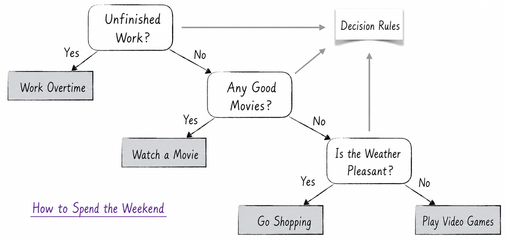
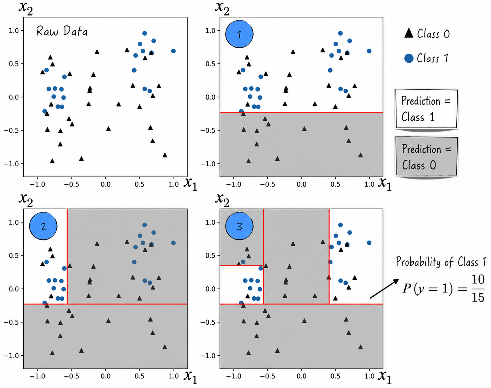
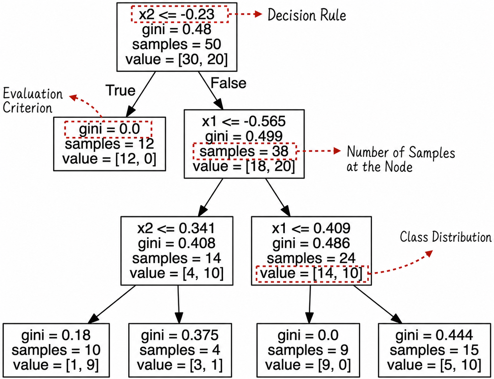
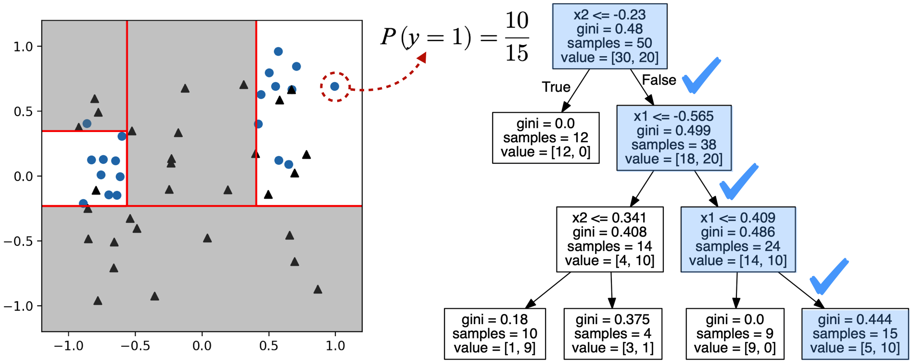
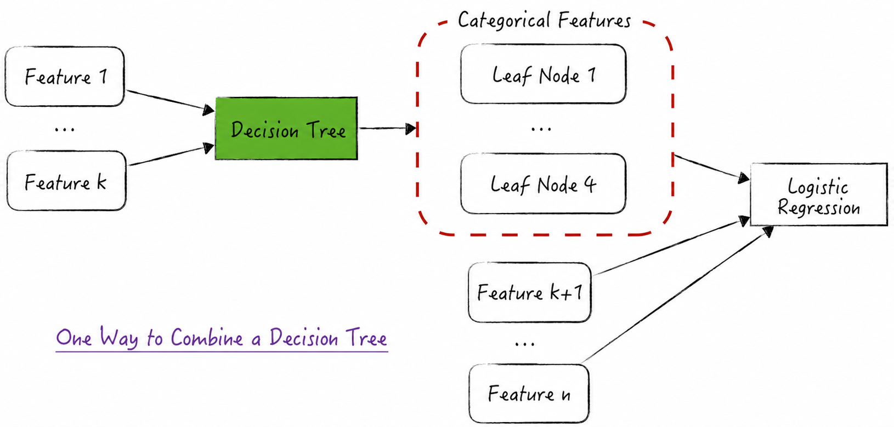
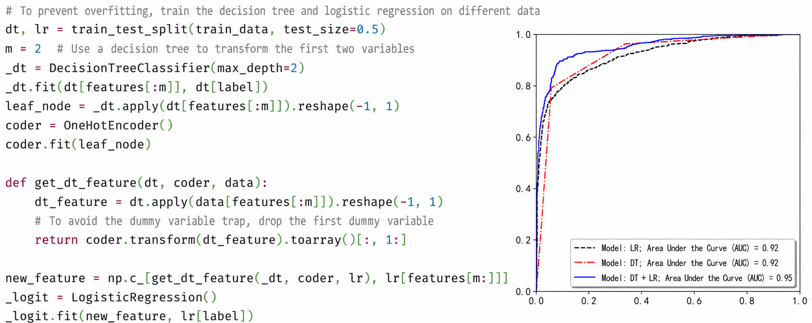
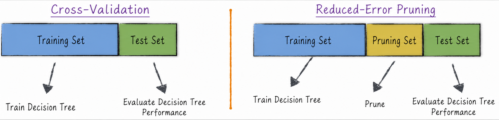
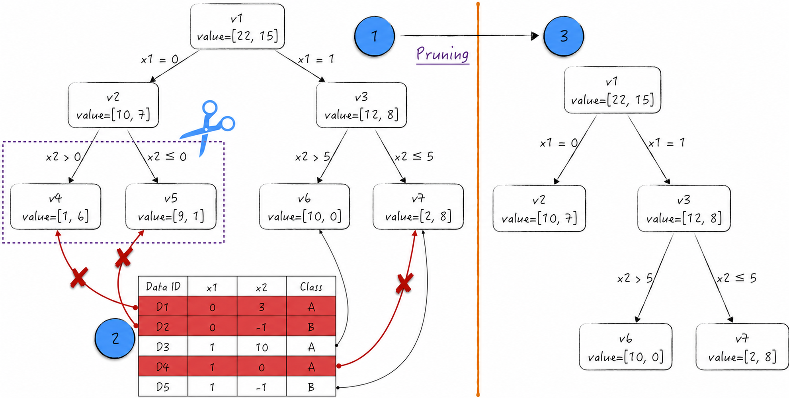

## 13.1 Decision Trees

A decision tree is a highly distinctive model. Unlike most artificial intelligence models, it does not immerse itself in complex mathematical abstractions. Instead, it solves classification and regression problems by generating decision rules, much as humans make decisions.

Academia calls it a white-box model because its operating mechanism can be translated directly into human language. Even nontechnical readers with no knowledge of the field can readily understand how it works. Decision rules lie at the core of a decision tree. To examine the model in greater depth, let us first consider how people use rules to make decisions in everyday life.

### 13.1.1 Decision Rules

Imagine that after a demanding week, the long-awaited Friday evening has finally arrived. An important decision now awaits us: how should we spend the coming weekend? The decision process consists of a series of intertwined rules, paths, and outcomes, as shown in Figure 13-1. Rounded boxes represent decision rules, square boxes represent outcomes, and the lines between boxes represent decision paths.

- If some work remains unfinished, there will be no time to rest during the weekend, and we must work overtime.
- If we can enjoy the weekend, we might want to see a movie, depending on whether an interesting film is currently playing.
- If there are no good movies, the weekend activity depends on the weather. If the weather is pleasant, we can go shopping; otherwise, we can only stay home and play games.

This simple decision process appears frequently in everyday life, and a decision tree models precisely this way of thinking. To make the model more intuitive, we now demonstrate the full process by which a decision tree solves a classification problem[^13-1-1]. First, randomly generate data with two features, $x_1$ and $x_2$, as shown in Figure 13-2. The decision tree then divides the data into two classes through the following steps.

1. The rule $x_2<-0.23$ divides the plane into two regions, as indicated by label 1. Because all training samples in the lower gray region belong to class 0, the prediction for that region is class 0. Correspondingly, class 1 has the higher proportion in the upper white region, so the prediction for that region is class 1.
2. Building on Step 1, the new rule $x_1<-0.565$ subdivides the plane into three regions, as indicated by label 2. As in Step 1, the prediction for each region is determined by the proportion of each class within it.
3. Repeating this process produces the result indicated by label 3. Note that a decision tree can predict not only the class of a sample but also the probability that it belongs to each class. Consider the white region on the right under label 3: 10 data points belong to class 1 and 5 belong to class 0. The probability that this region belongs to class 1 is therefore $10/(10+5)$.

We can convert these model results into the more intuitive tree structure shown in Figure 13-3. Each box represents a tree node. A node with a decision rule is called an internal node, while a node without one is called a leaf node. Leaf nodes represent final predictions, internal nodes reflect the decision logic, and the connections between nodes represent decision paths. The `gini` field in the figure represents node impurity, which is discussed in [Section 13.1.2](/books/deconstructing_LLM/chapter-13/13-1#section-13-1-2).

This simple example clearly illustrates how a decision tree generates rules: it selects a splitting feature and a corresponding threshold. Feature values above the threshold follow one decision path, while those below it follow another. We next examine the criteria used to evaluate decision rules, which form the basis for selecting the splitting feature and threshold.

### 13.1.2 Evaluation Criteria

In a classification problem, if nearly all data at a node belong to the same class, the node already has high purity and requires no further splitting. If the data at the node are mixed, a new splitting rule is needed. A good rule effectively separates the classes so that each child node contains relatively homogeneous data.

Following this modeling idea, we first define the impurity of a node. Suppose that the data are divided into $K$ classes, denoted by $0,1,\cdots,K-1$. Let the current node be $m$, containing a total of $N_m$ samples. The proportion of class $i$ at this node is defined as

$$
p_{mi}=\frac{1}{N_m}\sum_j\mathbf{1}_{\{y_j=i\}}
\tag{13-1}
$$

Based on the class proportions, node impurity is commonly defined in the following ways. Each metric ranges from 0 to 1, with a value closer to 0 indicating that the node contains a more homogeneous class distribution.

- Gini impurity: $\operatorname{Gini}_m=\sum_i p_{mi}(1-p_{mi})$
- Cross-entropy: $\operatorname{Entropy}_m=-\sum_i p_{mi}\ln p_{mi}$
- Misclassification rate: $\operatorname{Misclf}_m=1-\max_i p_{mi}$

Node impurity can in turn be used to define the impurity of a decision rule. Using Gini impurity as an example, suppose that node $m$ is divided into two child nodes according to a rule. Equation (13-2) defines the Gini impurity of the split, where $N_i$ is the number of samples in child node $i$ and $\operatorname{Gini}_i$ is the Gini impurity of child node $i$. In other words, the Gini impurity of a splitting rule is the weighted average of the child nodes' Gini impurities, with weights equal to their proportions of the data.

$$
\operatorname{Gini}_{\mathrm{split}}=\sum_{i=1}^{2}\frac{N_i}{N_m}\operatorname{Gini}_i
\tag{13-2}
$$

With these mathematical definitions, the algorithm for generating decision rules can be described as follows.

- If the Gini impurity of node $m$ is less than or equal to a threshold, no further splitting is required; otherwise, a new splitting rule must be generated. Other stopping conditions are discussed in [Section 13.1.4](/books/deconstructing_LLM/chapter-13/13-1#section-13-1-4).
- For each node that must be split again, select the rule with the lowest Gini impurity to generate child nodes. Repeat this process until no node requires further splitting. The strategy for growing a decision tree is effectively a greedy algorithm[^13-1-2].

The preceding algorithm solves classification problems, but decision trees can also solve regression problems. The procedure is very similar; the only difference is that impurity is replaced by a distance-based error metric such as mean squared error.

### 13.1.3 Decision Tree Prediction and Model Connectionism

A decision tree is a white-box model, and its prediction algorithm is easy to explain. Given a sample, the decision rules at successive nodes assign it to a leaf node, which provides the final prediction. Figure 13-4 illustrates the entire process.

- For a classification problem, a leaf node provides the probability that the sample belongs to each class. This probability equals the proportion of samples in that class. Suppose the data contain $K$ classes and the leaf node contains $N$ samples in total. Then $P(y=i)=\sum_j\mathbf{1}_{\{y_j=i\}}/N$. The final prediction is the class with the highest probability.
- For a regression problem, the leaf node's prediction equals the mean of the target variable among the samples in the node.

A close analysis of how decision trees process features reveals several advantages. They can consider multiple variables jointly and are stable under linear transformations of features. For a quantitative feature, a decision tree divides its values into several disjoint intervals, effectively avoiding the implicit assumption of a constant marginal effect; see [Section 5.3](/books/deconstructing_LLM/chapter-5/5-3) for details. Yet the shortcomings are equally apparent: the prediction algorithm is too simple, relying only on class proportions or means, so its predictive performance is often less than ideal.

To compensate for these shortcomings, we can borrow from model connectionism, discussed in [Section 8.3.5](/books/deconstructing_LLM/chapter-8/8-3#section-8-3-5), and combine a decision tree with other models. This section briefly introduces an approach widely used in advertising and financial fraud detection: treating the decision tree as a feature extraction tool.

As shown in Figure 13-5, suppose that a decision tree has four leaf nodes and a sample falls into the third leaf. Its new feature is then $(0,0,1,0)$. A logistic regression model is constructed using this new feature and the remaining original features to produce the final prediction. This architecture preserves the decision tree's strength in feature extraction while leveraging the strong predictive performance and stability of logistic regression.

Figure 13-6 shows the implementation of Figure 13-5 ([Complete Code](https://github.com/GenTang/regression2chatgpt/blob/en/ch13_others/dt_logit.ipynb)). The process is straightforward, but the dummy-variable trap requires particular attention when a decision tree is used to extract features; see [Section 5.4.4](/books/deconstructing_LLM/chapter-5/5-4#section-5-4-4) for details.

Two aspects of this connection deserve discussion.

First, in the model shown in Figure 13-5, if Features 1 through $k$ are all quantitative, the decision tree effectively transforms quantitative features into qualitative ones. This can be viewed as an extension of [Section 5.3](/books/deconstructing_LLM/chapter-5/5-3). A chi-squared test independently transforms one quantitative feature into a qualitative feature and therefore ignores interactions among features during the transformation. A decision tree can jointly consider the relationships among quantitative features, allowing the model to capture the information in the data more comprehensively.

Second, the way the decision tree is used resembles the neural network in Figure 8-15. The underlying logic of the two methods is indeed similar, except that features extracted by a neural network are generally quantitative, while those extracted by a decision tree are usually qualitative. In addition, decision-tree features are highly interpretable, whereas neural-network features are usually difficult to understand.

### 13.1.4 Pruning

In practical applications, decision trees frequently suffer from overfitting[^13-1-3]. Intuitively, a decision tree can split its nodes almost without limit until each leaf contains only a handful of samples from largely the same class. Its predictions may then appear perfect, even though it has failed to capture the underlying relationships in the data. Techniques that prevent a decision tree from splitting its nodes too finely are vividly known as pruning. Depending on when pruning is applied, it falls into two categories.

- Pre-pruning acts while the decision tree is being grown and restricts its growth through thresholds, such as a maximum depth or a minimum number of samples per node.
- Post-pruning acts after the tree has been grown. Its main idea is to remove unnecessary subtrees—those that produce little reduction in impurity.

Pre-pruning is relatively intuitive and can be controlled by configuring parameters in third-party tools. Post-pruning is more complex and requires a more detailed algorithm. One widely used method is reduced error pruning (REP).

In practical modeling, data are usually divided into disjoint training and test sets to prevent overfitting, as in the cross-validation introduced in [Section 3.3.1](/books/deconstructing_LLM/chapter-3/3-3#section-3-3-1). REP extends this idea. As shown in Figure 13-7, it divides the data into a training set, a test set, and a pruning set. The pruning set evaluates whether a subtree in the decision tree should be merged into a leaf node.

The following simple example illustrates the pruning algorithm. Suppose the data belong to classes A and B and have features $x_1$ and $x_2$. In Figure 13-8, label 1 shows the decision tree obtained from the training data, and label 2 shows the pruning set. The first row of each box is the node ID, and the second row gives the sample count for each class.

The pruning process is as follows.

1. Sample D1 falls in node v4 and is predicted incorrectly; D2 is also predicted incorrectly. If these two nodes are pruned, both D1 and D2 fall in node v2, where only D2 is predicted incorrectly. Because the number of errors decreases from 2 to 1 after pruning, the pruning is performed.
2. Similarly, D3, D4, and D5 are used to evaluate the subtree consisting of v3, v6, and v7. The number of errors is 1 both before and after pruning, so the subtree is not pruned.
3. Because the subtree rooted at v3 is not pruned, pruning the subtree consisting of v1, v2, and v3 is not considered. This process is called bottom-up restriction.

After pruning, the simplified decision tree indicated by label 3 in Figure 13-8 is obtained. The complete algorithm can be summarized as follows.

1. Using the pruning set, define the pruning gain of node $v$. Suppose that $T$ is the subtree rooted at $v$.

$$
\operatorname{Gain}_v=\text{prediction errors in $T$}-\text{prediction errors at $v$}
\tag{13-3}
$$

2. Starting from the leaf nodes and moving upward, prune every subtree with a gain greater than 0 unless the subtree contains a node with a negative pruning gain.

[^13-1-1]: This chapter discusses the most widely used form, CART (Classification and Regression Tree), which handles regression and classification problems by constructing a binary tree. For the complete implementation, see [`ch13_others/dt_example.ipynb`](https://github.com/GenTang/regression2chatgpt/blob/en/ch13_others/dt_example.ipynb).
[^13-1-2]: Finding the optimal decision tree is an NP-complete problem, so in practice we must settle for a greedy algorithm.
[^13-1-3]: From a theoretical perspective, a decision tree is a nonparametric model: the implicit number of model parameters grows with the size of the training data. Compared with a parametric model whose parameter count is fixed, such as logistic regression, a decision tree is more prone to overfitting.
