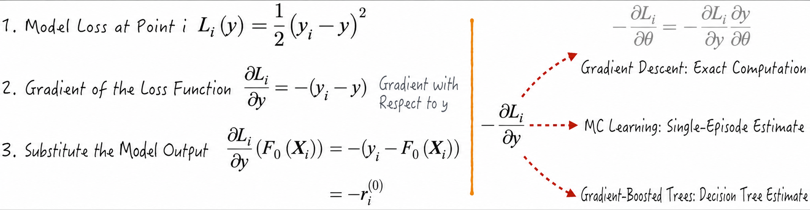
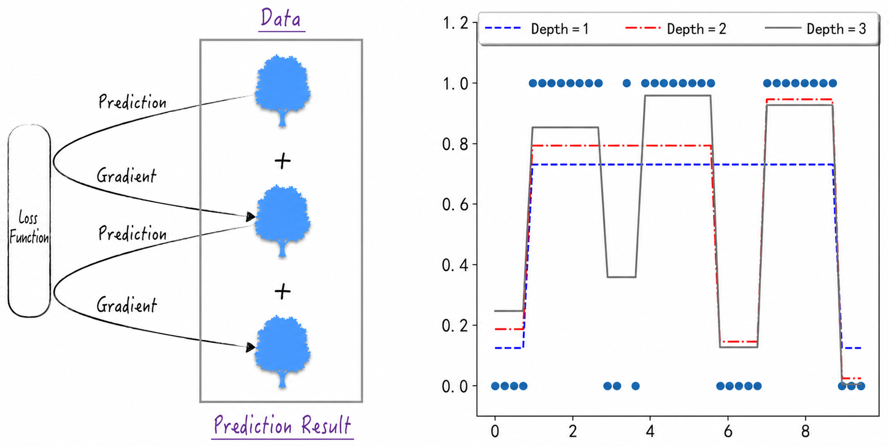

## 13.2 Tree Ensembles

Although decision trees are simple and transparent, they perform poorly when used alone. As described in [Section 13.1.3](/books/deconstructing_LLM/chapter-13/13-1#section-13-1-3), combining a decision tree with logistic regression can significantly improve model performance. Because this combination involves two entirely different models, however, it is difficult to provide an ideal mathematical abstraction for the connection, preventing it from becoming a general-purpose solution.

The success of neural networks suggests that connecting models with similar structures can unleash tremendous potential[^13-2-1]. Following this example, we can connect decision trees sequentially to construct a powerful model. Each decision tree “stands on the shoulders” of the preceding model and improves it further, forming the basic idea of the boosting method. Decision trees also have a more classic and concise form of connection: determining the final prediction from the average result of multiple trees, known as the averaging method. Intuitively, boosting makes the model longer, much like deep learning in neural networks, whereas averaging makes it wider, much like increasing the width of a neural network's hidden layers.

Representative models for these two methods are the random forest and the gradient boosting decision tree (GBDT), respectively. We now examine how these models work, along with their advantages and limitations in different applications.

### 13.2.1 Random Forests

A random forest consists of $n$ decision trees, each of which learns and predicts independently. These trees produce a series of intermediate results, and the model's final output is a “weighted average” of those results.

- For classification, the final result is the class that appears most frequently among the intermediate results. Each decision tree can be viewed as a voter and the random forest as an election, with the final decision determined by majority rule.
- For regression, the random forest prediction is the mean of the intermediate results.

The theoretical foundation of a random forest is that an individual decision tree may have a relatively high probability of making an error, but the probability that many trees make an error simultaneously is substantially lower. Suppose a classification problem has three independent decision trees, each with a 20% probability of making an incorrect prediction. If they are combined into a random forest under majority rule, the forest makes an error when all three trees are wrong or when only one tree is correct. Its error probability falls to 10.4%.

$$
0.2^3+3\times0.2^2\times0.8=10.4\%
\tag{13-4}
$$

This example shows that the predictive performance of a random forest depends heavily on whether its decision trees are independent. If every tree is identical, the random forest degenerates into a single decision tree. To generate independent trees from the same training data, randomness can be introduced in three areas: the training samples, feature selection, and splitting thresholds.

1. **Randomly select training data**: Instead of using all available samples to train a decision tree, randomly select a subset. Each tree is then grown from a different dataset, increasing independence.
2. **Restrict feature selection**: When generating a decision rule, do not examine every feature; allow only a subset of features to participate. Feature selection is therefore random for each tree.
3. **Randomize splitting thresholds**: Rather than seeking the globally optimal threshold for a rule, randomly construct a set of candidate thresholds and choose the best one from that set. This introduces further uncertainty and increases independence among the trees.

In practice, all three sources of randomness need not be implemented simultaneously. scikit-learn provides two implementations: Random Forest and Extremely Randomized Trees. The former randomizes the training data and decision features, while the latter implements all three types of randomness. See the official scikit-learn documentation for the specific model APIs.

### 13.2.2 Gradient Boosting Decision Trees

The name gradient boosting decision tree may sound obscure, but the term “gradient boosting” is related to the gradient descent method discussed in [Section 6.2](/books/deconstructing_LLM/chapter-6/6-2). In fact, the central idea of a gradient boosting decision tree is an extension of gradient descent. This is not the first time we have encountered such a method. MC learning, discussed in [Section 12.3.1](/books/deconstructing_LLM/chapter-12/12-3#section-12-3-1), likewise updates its result along the gradient.

When a decision tree is used for regression, it must perform better than predicting 0 for every sample. Suppose there are $n$ training samples, denoted by $\{\boldsymbol X_i,y_i\}$, and let $h$ denote the decision tree. The preceding claim can then be written as

$$
\sum_i[y_i-h(\boldsymbol X_i)]^2<\sum_i y_i^2
\tag{13-5}
$$

The proof of Equation (13-5) relies on the fact that a decision tree predicts the mean for all samples that fall into the same node. Without loss of generality, suppose $y_1,y_2,\cdots,y_k$ fall into the same leaf node. From the definition of variance, Equation (13-6) is easy to prove. Summing the inequalities over all leaf nodes yields Equation (13-5).

$$
\begin{aligned}
h(\boldsymbol X_i)&=\bar y=\frac{1}{k}\sum_{i=1}^{k}y_i \\
\sum_{i=1}^{k}(y_i-\bar y)^2&<\sum_{i=1}^{k}y_i^2
\end{aligned}
\tag{13-6}
$$

Now suppose that the initial model for the regression problem is $F_0$. Its specific form is unimportant; for example, assume that it predicts the same value—the mean of all target values—for every sample. For any sample $i$, the model residual is

$$
r_i^{(0)}=y_i-F_0(\boldsymbol X_i)
\tag{13-7}
$$

To improve the model, fit a decision tree $h_1$ to the dataset $\{\boldsymbol X_i,r_i^{(0)}\}$, then combine this tree with the initial model to form a new predictive model $F_1$:

$$
F_1(\boldsymbol X_i)=F_0(\boldsymbol X_i)+h_1(\boldsymbol X_i)
\tag{13-8}
$$

Equation (13-5) implies that the new model $F_1$ performs better than the initial model $F_0$. Repeating this process, with $F_k=F_{k-1}+h_k$, continually improves the model. Intuitively, each decision tree learns the residuals left by the preceding model, and the trees are added together to produce a stronger model.

Why does the model's name contain “gradient”? Because the model residual is the negative gradient of the loss function. The left side of Figure 13-9 gives the derivation. In short, a gradient boosting decision tree estimates the gradient of the loss with respect to $y$ and then updates the model using that estimate. This process resembles MC learning: both imitate gradient descent.

With this preparation, the procedure for solving a regression problem using gradient boosting decision trees is as follows.

1. As shown in Figure 13-9, define the model's loss at sample $i$ as $L_i(y)$.
2. Define the initial model as $F_0=\sum_{i=1}^{n}y_i/n$, the mean of all target values.
3. Use the loss gradient to obtain the new training data $\{\boldsymbol X_i,-\frac{\partial L_i}{\partial y}(F_0(\boldsymbol X_i))\}$ and fit the decision tree $h_1$ to them.
4. Update the model to obtain $F_1=F_0+\gamma_1h_1$, where $\gamma_1$ controls the magnitude of the model update. Estimate $\gamma_1$ with $\gamma_1=\operatorname*{arg\,min}_\gamma\sum_{i=1}^{n}L_i(F_0+\gamma h_1)$.
5. Continually repeat Steps 3 and 4 to obtain the model-update formula. The training data for decision tree $h_k$ are $\{\boldsymbol X_i,-\frac{\partial L_i}{\partial y}(F_{k-1}(\boldsymbol X_i))\}$.

$$
F_k=F_{k-1}+\gamma_kh_k
\tag{13-9}
$$

In practice, the depth $m$ of the GBTs—the number of decision trees—is usually chosen in advance, giving the model $F=F_0+\sum_{i=1}^{m}\gamma_i h_i$. Figure 13-10 shows the learning process ([Complete Code](https://github.com/GenTang/regression2chatgpt/blob/en/ch13_others/gbts.ipynb)). As the depth increases, each tree attempts to correct the errors left by the preceding model, improving the overall predictive performance layer by layer.

Although gradient boosting decision trees were originally designed for regression, they extend naturally to classification. For a binary classification problem, the label $y_i$ may be 1 or 0. If the classification loss is defined by Equation (13-10), where $y$ is the model prediction, classification becomes completely analogous to regression.

$$
L_i(y)=y_i\ln(1+e^{-y})+(1-y_i)\ln(1+e^y)
\tag{13-10}
$$

In code, scikit-learn provides `GradientBoostingRegressor` for regression and `GradientBoostingClassifier` for classification. Their usage is similar to that of a decision tree.

[^13-2-1]: This approach is known academically as the ensemble method, and it is not limited to decision trees. Relatively simple machine learning models can be called weak learners; an ensemble method combines a series of weak learners into a complex model with stronger predictive performance. It resembles connectionism, except that connectionism focuses more on the philosophical level, while ensemble methods focus more on specific algorithms.
