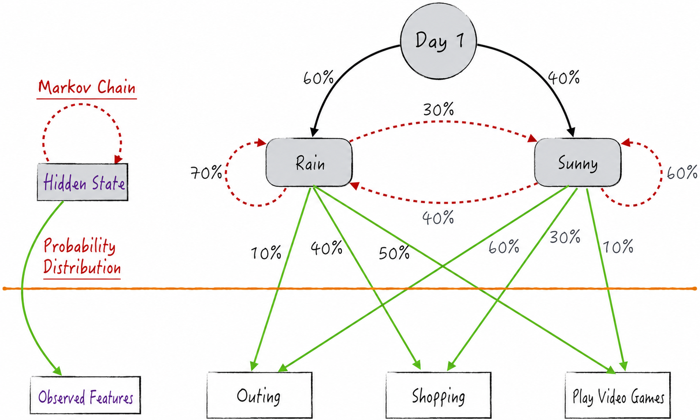
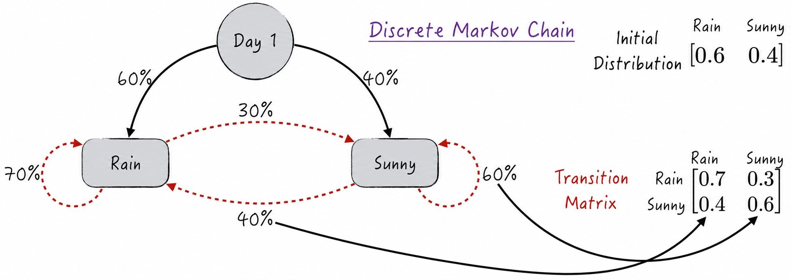
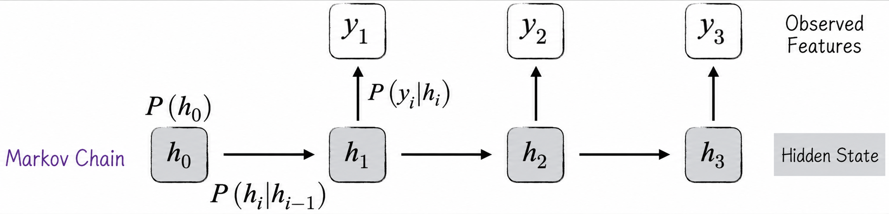
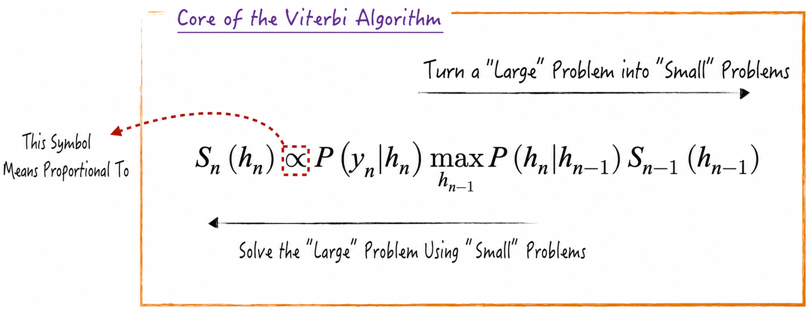
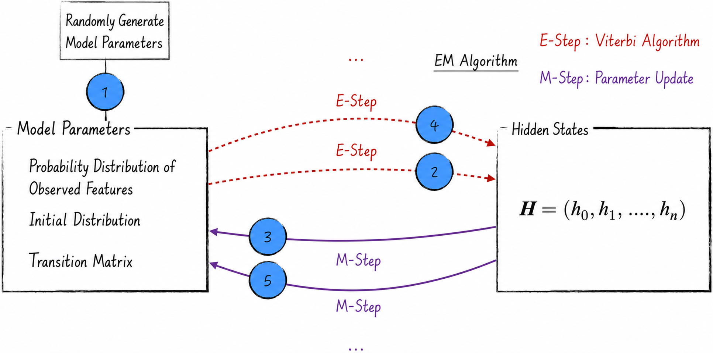
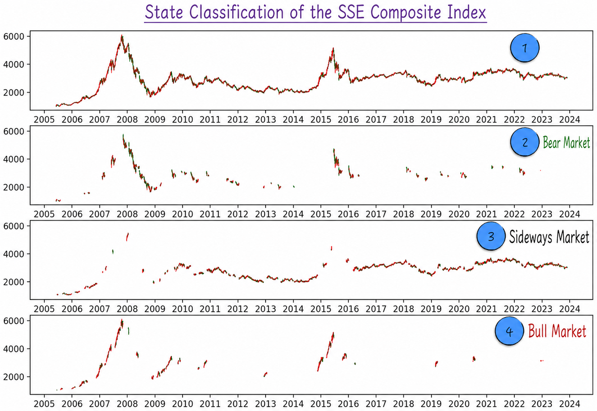

## 13.3 Hidden Markov Models

Hidden Markov models (HMMs) resemble neural networks in several respects. Functionally, an HMM is designed specifically for sequential data, placing it in the same lineage as recurrent neural networks. Structurally, it can be viewed as a simplified recurrent neural network. For model training, it uses the expectation-maximization (EM) algorithm, which has many similarities to the Forward pass and Backward pass in a neural network. Historically, hidden Markov models appeared before neural networks, and many modeling techniques were inspired by them.

Despite these similarities, hidden Markov models and neural networks also differ substantially. Neural networks emphasize designing network structures that allow a machine to learn for itself, whereas hidden Markov models focus on probabilistic modeling of the data. Today, both types of model continue to play important roles in particular tasks.

### 13.3.1 A Simple Example

Let us introduce the model with a simple example. Suppose we need to plan a three-day vacation, and the available activities are constrained by the weather. The weather can be rainy or sunny, and the possible activities are taking an outing, shopping, and playing games. We make the following assumptions about the weather.

- Each day's weather depends only on the preceding day's weather.
- If the preceding day was rainy, the next day has a 70% probability of remaining rainy and a 30% probability of becoming sunny.
- If the preceding day was sunny, the next day has a 60% probability of remaining sunny and a 40% probability of becoming rainy.
- On the first day, there is a 60% probability of rain and a 40% probability of sunshine.

The activity plan follows these probabilities.

- On a rainy day, the probabilities of taking an outing, shopping, and playing games are 10%, 40%, and 50%, respectively.
- On a sunny day, the probabilities of taking an outing, shopping, and playing games are 60%, 30%, and 10%, respectively.

Figure 13-11 depicts this scenario. If the observed activities over the three days are an outing, shopping, and playing games, and we need to infer the weather on those days, we have a typical application of a hidden Markov model.

To abstract this example, introduce the variable $h_i$ for the weather on Day $i$, which is a hidden state, and $y_i$ for the day's activity, which is an observable feature. Logically, the hidden state determines the observable feature, but the model must infer the unobserved hidden state from the observed feature.

Data processed by a recurrent neural network have input features $x_i$, hidden states $h_i$, and target variables $y_i$. The input feature $x_i$ and the preceding hidden state $h_{i-1}$ jointly determine the new hidden state $h_i$, which in turn determines the output target $y_i$. Although model training focuses on improving the accuracy of the predictions for $y_i$, an application may use only the inferred hidden state $h_i$. A hidden Markov model can therefore be viewed as a recurrent neural network without input features.

The two models look similar, but their specific computations differ greatly. In a recurrent neural network, the hidden-state transition is deterministic; in a hidden Markov model, it is stochastic. The mathematical tool for handling this stochastic relationship is the Markov chain, discussed in [Section 13.3.2](/books/deconstructing_LLM/chapter-13/13-3#section-13-3-2).

### 13.3.2 Markov Chains

A Markov chain is the most commonly used mathematical tool for processing stochastic sequential data. Suppose that $h_1,h_2,\cdots,h_n$ are random variables arranged in order. Their relationship can be expressed as

$$
P(h_i\mid h_{i-1},\cdots,h_0)=P(h_i\mid h_{i-1})
\tag{13-11}
$$

This equation states that in a stochastic process, the current state depends only on the preceding state. For a Markov chain, Equation (13-12) can also be proved: given the current state, the past and future are independent of each other.

$$
P(h_0,\cdots,h_{i-1},h_{i+1},\cdots,h_n\mid h_i)
=P(h_0,\cdots,h_{i-1}\mid h_i)P(h_{i+1},\cdots,h_n\mid h_i)
\tag{13-12}
$$

When the random variable $h_i$ takes discrete values, a Markov chain can be represented by a transition matrix and an initial distribution. For example, the weather in [Section 13.3.1](/books/deconstructing_LLM/chapter-13/13-3#section-13-3-1) can be represented by a $2\times2$ matrix and the corresponding initial distribution, as shown in Figure 13-12.

More generally, suppose that $h_i$ has $n$ possible values. The transition matrix $\boldsymbol Q$ is then an $n\times n$ square matrix whose elements are

$$
Q_{i,j}=P(h_t=j\mid h_{t-1}=i)
\tag{13-13}
$$

The element in row $i$ and column $j$ of the transition matrix is the probability of moving from state $i$ to state $j$. Row $i$ therefore represents the probability distribution over possible states reached from state $i$, and clearly $\sum_{j=1}^{n}Q_{i,j}=1$.

Although a Markov chain stipulates that the current state depends only on the preceding state, a small transformation lets it handle more complex cases. For example, if the current state depends on the two most recent states, define a new state $\boldsymbol z_i=(h_i,h_{i-1})$. The stochastic process $\boldsymbol z_i$ is still a Markov chain.

### 13.3.3 Model Architecture

This section considers only discrete hidden states. Based on the preceding discussion, the model parameters can be divided into three components: the probability distribution of the observable feature $P(y_i\mid h_i)$, the initial distribution $P(h_0)$, and the transition matrix $P(h_i\mid h_{i-1})$, as shown in Figure 13-13.

Let $\boldsymbol Y=(y_0,y_1,\cdots,y_n)$ denote the observable features and $\boldsymbol H=(h_0,h_1,\cdots,h_n)$ the hidden states. The joint probability of the data is then

$$
P(\boldsymbol Y,\boldsymbol H)
=P(h_0)P(h_1\mid h_0)\cdots P(h_n\mid h_{n-1})\prod_jP(y_j\mid h_j)
\tag{13-14}
$$

The model parameters are estimated by maximizing the joint probability of the data. The observable features $\boldsymbol Y$ are known, but the hidden states $\boldsymbol H$ may be unknown. If $\boldsymbol H$ is also known, estimates of the model parameters can be derived directly. If it is unknown, the expectation-maximization algorithm is required, as discussed in [Section 13.3.4](/books/deconstructing_LLM/chapter-13/13-3#section-13-3-4).

First, let us turn to model prediction: given known parameters, how should the hidden states be predicted? The mathematical formulation is

$$
\hat{\boldsymbol H}=\operatorname*{arg\,max}_{\boldsymbol H}
P(h_0,h_1,\cdots,h_n\mid y_1,y_2,\cdots,y_n)
\tag{13-15}
$$

Solving this expression is difficult because the choice of $h_n$ depends on the preceding state $h_{n-1}$. The solution is the Viterbi algorithm. Using dynamic programming, the Viterbi algorithm transforms the original problem into similar subproblems:

$$
S_n(h_n)=\max_{h_0,h_1,\cdots,h_{n-1}}
P(h_0,h_1,\cdots,h_n\mid y_1,y_2,\cdots,y_n)
\tag{13-16}
$$

$S_n(h_n)$ is the maximum probability the data can attain for the observable features $\{y_1,y_2,\cdots,y_n\}$ when state $h_n$ is known. It can be proved mathematically that this problem can be decomposed into a series of subproblems as shown in Figure 13-14. This is the core of the Viterbi algorithm ([full code](https://github.com/GenTang/regression2chatgpt/blob/en/ch13_others/viterbipy.py)).

### 13.3.4 An Application to the Stock Market

In the stock market, we can observe information such as stock prices and trading volume, but we cannot directly know whether the current market is a bull market, a bear market, or a sideways market. In this modeling scenario, the hidden state is unknown, parameter estimation depends on the hidden state, and hidden-state estimation in turn depends on the model parameters. A hidden Markov model solves this problem using a scheme similar to neural network training.

- **E-step**: Given the model parameters, use the Viterbi algorithm to estimate the hidden states. This step resembles the Forward pass in a neural network.
- **M-step**: Update the model parameters using the hidden states estimated in the E-step. An analytical expression for the parameter estimates can usually be obtained directly. This step resembles the Backward pass in a neural network.

Mathematical proofs show that alternating between these two steps ultimately produces the best estimates of the model parameters and, in the process, the hidden states. Figure 13-15 illustrates the entire procedure, known as the expectation-maximization algorithm.

Returning to the stock market, we first divide the model into two layers.

- The first layer contains observed stock-market features, including the logarithm of the five-day return, the logarithm of the 20-day return, the logarithm of the five-day growth rate in trading value, and the logarithm of the 20-day growth rate in trading value. These features are denoted by $\boldsymbol Y_i$.
- The second layer is the unobserved market state, with three possible values: bull market, bear market, and sideways market. It is denoted by $h_i$.

We then construct a model that predicts the current and near-future market states from market performance over a period of time. The efficient-market hypothesis states that the current stock price fully reflects all historical information. Given the current market condition, the future and past are independent; thus, $h_i$ can be treated as a Markov chain. We further assume that, given the market state, the logarithms of daily stock returns and trading-volume growth rates follow normal distributions. The resulting model is therefore called a Gaussian hidden Markov model (Gaussian HMM).

This example uses the Shanghai Composite Index and its corresponding daily trading value from June 1, 2005, through November 28, 2023. To avoid the long-term effect of inflation on trading value, the model uses the logarithms of the five-day and 20-day growth rates in trading value rather than the absolute value.

Plotting the Shanghai Composite Index under different states in separate coordinate systems produces Figure 13-16 ([full code](https://github.com/GenTang/regression2chatgpt/blob/en/ch13_others/stock_analysis.ipynb)). Label 1 contains all trading data, while Labels 2, 3, and 4 contain data from the different states. From the characteristics of the data, we can infer that Label 2 represents a bear market, Label 3 a sideways market, and Label 4 a bull market.

The model results suggest a quantitative trading strategy: buy or continue holding the asset if the current day is classified as a bull market; otherwise, sell or remain out of the market. In practice, however, performance may be far less accurate than historical backtesting suggests. When the model predicts $h_1$ from historical data, it already knows the subsequent trading data $\boldsymbol Y_2,\boldsymbol Y_3,\cdots,\boldsymbol Y_n$. The future cannot be known in reality, so Equation (13-17) must be called repeatedly to predict $h_n$ step by step rather than producing every prediction at once.

$$
\hat{\boldsymbol H}=\operatorname*{arg\,max}_{\boldsymbol H}
P(h_0,h_1,\cdots,h_n\mid\boldsymbol Y_1,\boldsymbol Y_2,\cdots,\boldsymbol Y_n)
\tag{13-17}
$$
