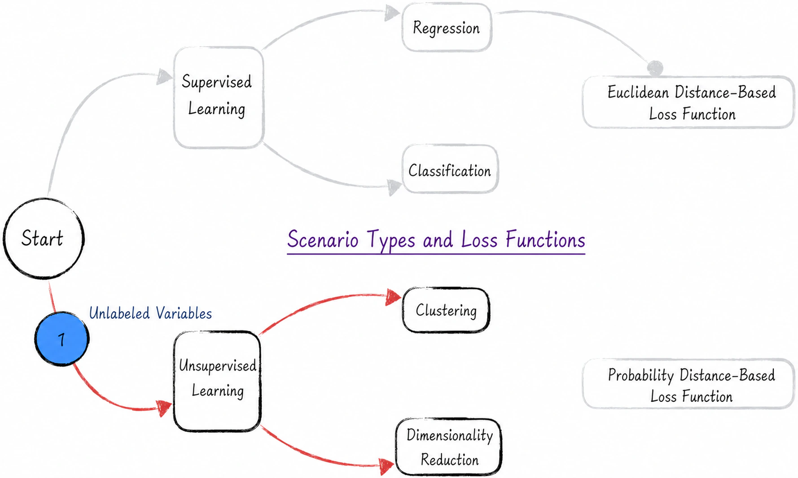
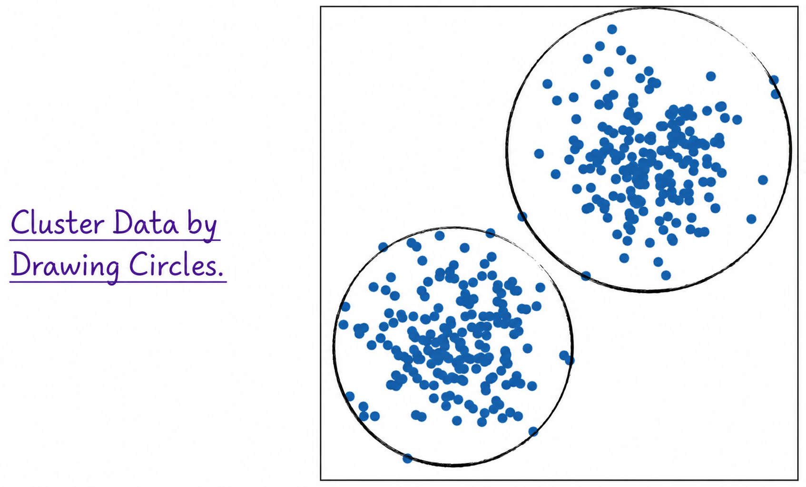
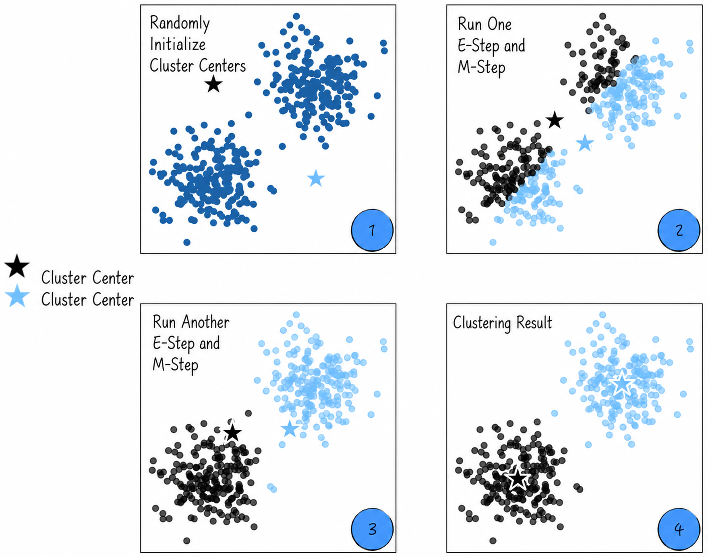
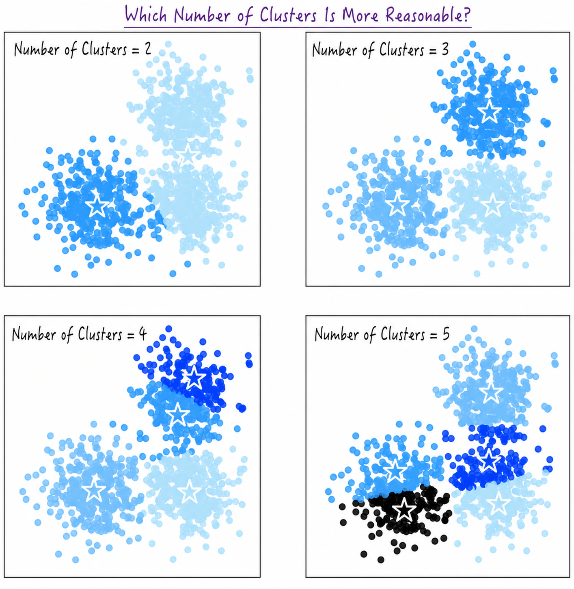
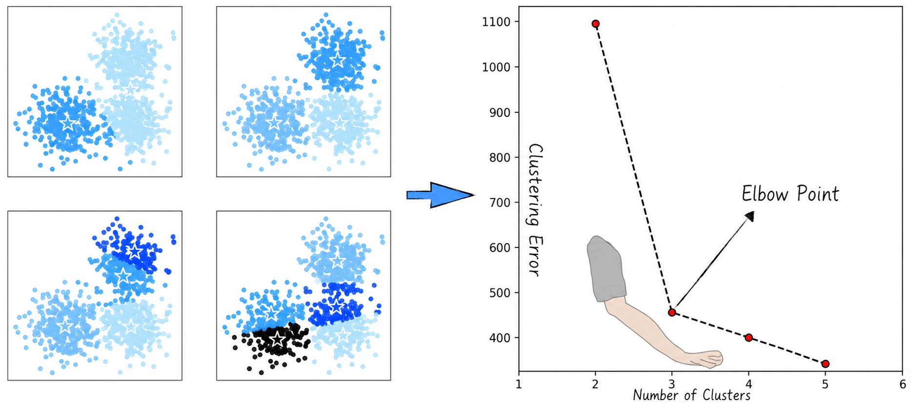
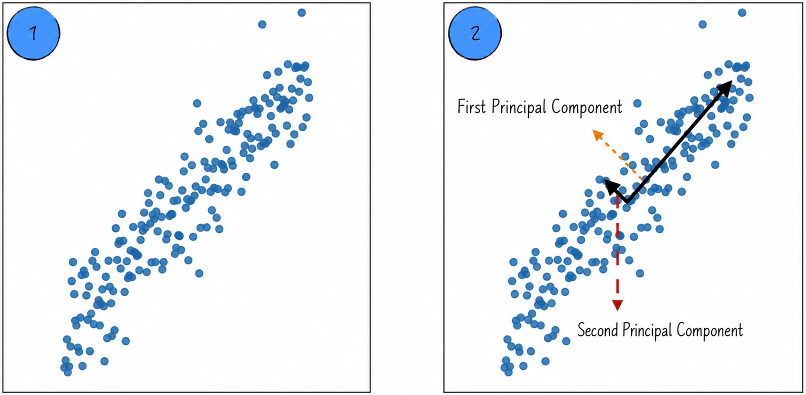
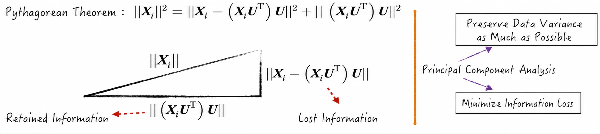

## 13.4 Clustering and Dimensionality Reduction

The preceding chapters focused on supervised learning, whose training data contain both features $\boldsymbol X$ and target labels $y$. The modeling idea is straightforward: learn the relationship between features and labels, then use it to predict unknown data. Model evaluation is equally direct: calculate the difference between predictions and actual values.

Many real-world settings, however, lack target labels. We may want to infer a person's personality from their behavior, for example, but personality is difficult to define clearly, making the corresponding data hard to collect. In retail, customers' valuations of products can be defined, but obtaining those data is almost impossible.

Supervised learning models cannot be trained effectively in such settings. Although no explicit label $y$ is available, we should not ignore the rich information contained in the features $\boldsymbol X$. Unsupervised learning models seek to learn relationships from data and infer possible answers without explicit ground truth.

Common unsupervised learning models fall into two broad categories: clustering and dimensionality reduction, as shown in Figure 13-17. Clustering assigns similar samples to the same group, while dimensionality reduction maps data from a high-dimensional space to a more compact low-dimensional representation that captures its principal characteristics.

### 13.4.1 The Classic Clustering Model: k-means

The k-means algorithm is a simple yet powerful clustering method that divides data into $K$ clusters according to the Euclidean distance between points. Suppose the data to be clustered are two-dimensional, as shown in Figure 13-18, and the model must divide them into two clusters. Nearby points are more similar and should belong to the same cluster. Mathematically, similarity is inversely related to Euclidean distance; this is the fundamental assumption of k-means.

Under this assumption, the objective is clear: place nearby points in the same group whenever possible. Visually, this is equivalent to enclosing the data in circles with the smallest possible radii.

Let us express this intuition mathematically. Suppose we cluster the samples $\boldsymbol X_i$, with the number of clusters determined by the parameter $k$; see [Section 13.4.2](/books/deconstructing_LLM/chapter-13/13-4#section-13-4-2) for choosing $k$. After clustering, let $\boldsymbol\mu_j$ denote the $k$ cluster centers and $t_i$ the cluster of each sample. We want every point to be as close as possible to the center of its cluster, so define the loss as follows:

$$
L=\sum_{j=1}^{k}\sum_{i=1}^{n}
\lVert\boldsymbol X_i-\boldsymbol\mu_j\rVert^2\mathbf{1}_{\{t_i=j\}}
\tag{13-18}
$$

Here, $t_i$ is the clustering output. Like other models, k-means is trained by minimizing the loss. The estimate of $t_i$ is therefore

$$
\hat t_i=\operatorname*{arg\,min}_{t_i}L
\tag{13-19}
$$

Equation (13-18) contains two types of model parameters: each sample's cluster $t_i$ and the cluster centers $\boldsymbol\mu_j$. They depend on each other. If each sample's cluster is known, a cluster center is the mean of its samples; if the centers are known, a sample belongs to the nearest one. This suggests using the expectation-maximization algorithm from [Section 13.3.4](/books/deconstructing_LLM/chapter-13/13-3#section-13-3-4) to estimate the parameters.

1. Randomly initialize $k$ cluster centers.
2. Assign the data to $k$ clusters according to the existing centers. Each sample is assigned to its nearest center. This can be viewed as the E-step of EM.
3. Recalculate each cluster center from the assignments. This is the M-step of EM.
4. Repeat the E-step and M-step until the cluster centers converge.

Figure 13-19 shows the convergence process ([Complete Code](https://github.com/GenTang/regression2chatgpt/blob/en/ch13_others/kmeans.ipynb)). At Labels 1, 2, and 3, the assignments and centers do not fully agree, so the algorithm has not converged. At Label 4, they match completely, indicating convergence.

The k-means algorithm can be pictured as clustering data by drawing circles, but that description applies only to a few cases. Real data take many forms: some distributions are elliptical and others follow curves. More complex distributions require other clustering models, such as Gaussian mixture models (GMMs) or spectral clustering.

### 13.4.2 Choosing the Number of Clusters

Unsupervised training data have no labels. Except in rare cases, it is difficult to know how many clusters the data should contain. Given any number $k$, k-means can always divide the data into $k$ clusters. Figure 13-20 shows the same dataset clustered into two through five clusters. How, then, should we choose a reasonable value of $k$?

Equation (13-18) in [Section 13.4.1](/books/deconstructing_LLM/chapter-13/13-4#section-13-4-1) defines the k-means loss as the sum of squared distances from each point to its cluster center. A smaller value means that the points are closer to their centers overall. The quantity is therefore also called the clustering error and is an important measure of model performance.

This metric depends on the number of clusters: as $k$ increases, clustering error decreases. To some extent, the number of clusters represents model complexity. As with other machine learning models, greater complexity improves the fit to training data but also increases the risk of overfitting; see [Section 3.3.1](/books/deconstructing_LLM/chapter-3/3-3#section-3-3-1). For clustering, however, splitting the data into training and test sets does not solve the problem, because clustering error on both sets decreases as the number of clusters increases.

In practice, the elbow method is commonly used to choose an appropriate number of clusters. Its central assumption is that clustering error decreases rapidly when the number of clusters is below the true number; once it exceeds the true number, the error still decreases, but much more slowly. The resulting curve resembles a person's elbow, with the bend corresponding to the optimal number of clusters. For the data in Figure 13-20, Figure 13-21 indicates that the optimal number is 3 ([Complete Code](https://github.com/GenTang/regression2chatgpt/blob/en/ch13_others/kmeans_choose_k.ipynb)).

The elbow method is intuitive but difficult to quantify precisely, so it involves some subjective judgment. A more rigorous approach is silhouette analysis, whose central idea is to measure how well each sample fits within its assigned cluster.

### 13.4.3 The Classic Dimensionality-Reduction Model: Principal Component Analysis

Dimensionality reduction maps data from a high-dimensional space to a low-dimensional one. Because data in artificial intelligence are usually represented as vectors, the result is a shorter vector representation. Dimensionality reduction inevitably loses information, but it can reduce interference from random factors and better capture the main characteristics of the data. High-dimensional data can also be reduced to two or three dimensions and then visualized.

The most commonly used dimensionality-reduction model is principal component analysis (PCA). It finds the principal components of the data—the directions along which the data vary most.

Figure 13-22 shows an example of compressing two-dimensional data to one dimension. Dimensionality reduction amounts to projecting the points onto a line, and the projected points are the reduced data. Under PCA, the variance of the projected data should be as large as possible so that more information is preserved. The longer arrow is the first principal component, the direction in which the data vary most. A second principal component perpendicular to the first can be defined similarly.

Let us derive this result mathematically. Suppose there are $n$ samples to reduce, each with $m$ dimensions, and denote sample $i$ by $\boldsymbol X_i=(x_{i,1},x_{i,2},\cdots,x_{i,m})$. For convenience, assume that the center of the $n$ samples is the origin.

First reduce the data to one dimension. Let the unit vector of the projection line be $\boldsymbol U=(u_1,u_2,\cdots,u_m)$, satisfying $\lVert\boldsymbol U\rVert^2=1$. The projection of point $i$ onto the line is

$$
\widetilde{\boldsymbol X}_i=(\boldsymbol X_i\boldsymbol U^\mathsf{T})\boldsymbol U
\tag{13-20}
$$

Because the center of the data remains unchanged during dimensionality reduction, the variance of the reduced data is

$$
V=\sum_{i=1}^{n}\lVert\widetilde{\boldsymbol X}_i\rVert^2
=\sum_{i=1}^{n}(\boldsymbol X_i\boldsymbol U^\mathsf{T})^2
\tag{13-21}
$$

Using $(\boldsymbol X_i\boldsymbol U^\mathsf{T})^\mathsf{T}=\boldsymbol U\boldsymbol X_i^\mathsf{T}=\boldsymbol X_i\boldsymbol U^\mathsf{T}$, this can be transformed further into

$$
V=\sum_{i=1}^{n}\boldsymbol U\boldsymbol X_i^\mathsf{T}\boldsymbol X_i\boldsymbol U^\mathsf{T}
=\boldsymbol U\left(\sum_{i=1}^{n}\boldsymbol X_i^\mathsf{T}\boldsymbol X_i\right)\boldsymbol U^\mathsf{T}
\tag{13-22}
$$

Denote $\sum_{i=1}^{n}\boldsymbol X_i^\mathsf{T}\boldsymbol X_i$ by $\boldsymbol C$. It is an $m\times m$ matrix—the covariance matrix of the data. The optimal dimensionality-reduction vector, or first principal component, is therefore estimated by

$$
\widehat{\boldsymbol U}=\operatorname*{arg\,max}_{\lVert\boldsymbol U\rVert=1}
\boldsymbol U\boldsymbol C\boldsymbol U^\mathsf{T}
\tag{13-23}
$$

It can be proved mathematically that $\boldsymbol U\boldsymbol C\boldsymbol U^\mathsf{T}$ reaches its maximum when $\boldsymbol U$ is the eigenvector of $\boldsymbol C$ associated with its largest eigenvalue. In other words, reducing the data to one dimension means finding the leading eigenvector of $\boldsymbol C$; reducing it to $k$ dimensions requires the eigenvectors associated with its $k$ largest eigenvalues.

Dimensionality reduction can also be considered from the perspective of minimizing information loss. For point $i$, the reduced data are $\widetilde{\boldsymbol X}_i$, and the lost information is $\boldsymbol L_i=\boldsymbol X_i-\widetilde{\boldsymbol X}_i$. Under the minimum-information-loss principle, the optimal projection vector is

$$
\widehat{\boldsymbol U}=\operatorname*{arg\,min}_{\lVert\boldsymbol U\rVert=1}
\sum_{i=1}^{n}\lVert\boldsymbol L_i\rVert^2
\tag{13-24}
$$

As shown in Figure 13-23, Equation (13-24) and Equation (13-23) can be proved equivalent. PCA therefore achieves two objectives simultaneously: preserving as much variation among the data as possible and minimizing information loss.

PCA can reduce data to $k$ dimensions. As with choosing the number of clusters, the eigenvalues of the covariance matrix can be sorted from largest to smallest and the elbow method from [Section 13.4.2](/books/deconstructing_LLM/chapter-13/13-4#section-13-4-2) can be used to select the optimal $k$. Note that $k$ must be smaller than both the original dimension $m$ and the number of samples $n$.

PCA uses linear projections and therefore performs well on linear data. For a nonlinear distribution, kernel techniques can first map the low-dimensional data into a high-dimensional space where they become approximately linear, after which dimensionality reduction is performed. This method is called kernel PCA. For a complete PCA example, see [`ch13_others/pca.ipynb`](https://github.com/GenTang/regression2chatgpt/blob/en/ch13_others/pca.ipynb).
