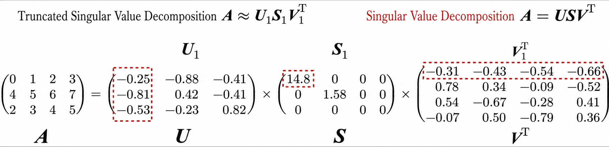
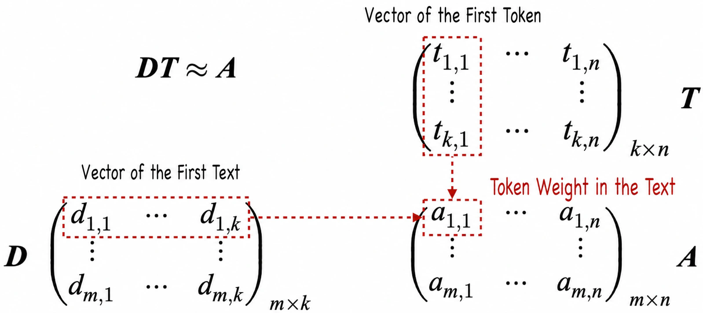
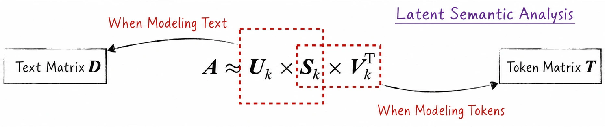
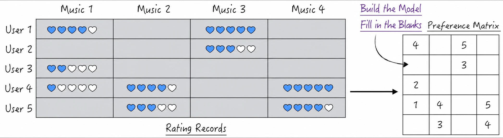
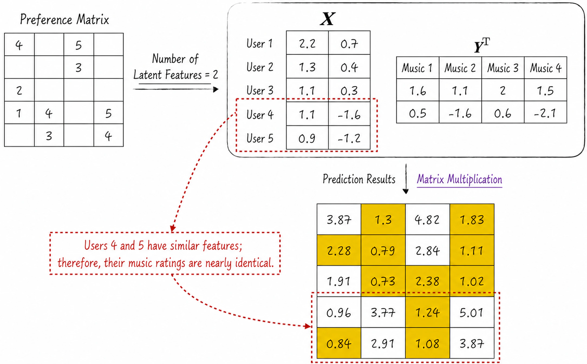

## 13.5 Singular Value Decomposition

Although matrix singular value decomposition may appear here for the first time, previous chapters have already applied its conclusions repeatedly. [Section 2.1.5](/books/deconstructing_LLM/chapter-2/2-1#section-2-1-5), for example, introduced a theorem stating that a low-rank matrix can be decomposed into the product of two smaller matrices. This theorem plays an important role in fine-tuning large language models and is the theoretical foundation of LoRA; see [Section 11.4.4](/books/deconstructing_LLM/chapter-11/11-4#section-11-4-4).

The applications of singular value decomposition in artificial intelligence extend far beyond this example. It can uncover intrinsic latent features from observable data, much like the hidden states in a recurrent neural network, and is therefore widely used in fields such as natural language processing and recommender systems.

### 13.5.1 Mathematical Definition

Singular value decomposition (SVD) is an important theorem concerning matrix factorization. Suppose $\boldsymbol A$ is an $m\times n$ matrix. It can be decomposed into the product of three matrices:

$$
\boldsymbol A=\boldsymbol U\boldsymbol S\boldsymbol V^\mathsf{T}
\tag{13-25}
$$

The matrices $\boldsymbol U$, $\boldsymbol S$, and $\boldsymbol V$ have the following meanings.

- $\boldsymbol U$ is an $m\times m$ orthonormal matrix satisfying $\boldsymbol U\boldsymbol U^\mathsf{T}=\boldsymbol U^\mathsf{T}\boldsymbol U=\boldsymbol I$.
- $\boldsymbol S$ is an $m\times n$ diagonal matrix whose diagonal elements are nonnegative real numbers arranged in descending order. These elements are called singular values. If the rank of $\boldsymbol A$ is $k$, then exactly $k$ singular values are nonzero, and vice versa. Let $\boldsymbol S_{m\times n}=(s_{i,j})$, where $l=\min(m,n)$.

$$
s_{i,j}=
\begin{cases}
0,&i\ne j \\
>0,&i=j
\end{cases}
\qquad
s_{1,1}>s_{2,2}>\cdots>s_{l,l}>0
\tag{13-26}
$$

- $\boldsymbol V$ is also an orthonormal matrix, with shape $n\times n$.

### 13.5.2 Truncated Singular Value Decomposition

Although singular value decomposition is mathematically complete, artificial intelligence applications rarely require its full result and usually care only about the largest few singular values. Academia therefore introduced truncated singular value decomposition (Truncated SVD).

For a matrix $\boldsymbol A$, the full decomposition is $\boldsymbol A=\boldsymbol U\boldsymbol S\boldsymbol V^\mathsf{T}$. Truncated SVD selects the largest $k$ singular values in $\boldsymbol S$ to form the $k\times k$ diagonal matrix $\boldsymbol S_k$; the first $k$ columns of $\boldsymbol U$ form the $m\times k$ matrix $\boldsymbol U_k$; and the first $k$ columns of $\boldsymbol V$ form the $n\times k$ matrix $\boldsymbol V_k$. Figure 13-24 illustrates the process for $k=1$.

The rank of $\boldsymbol U_k\boldsymbol S_k\boldsymbol V_k^\mathsf{T}$ is $k$, which is lower than the rank of the original matrix. From the perspective of linear spaces, truncated SVD therefore performs dimensionality reduction on the matrix. This theory also broadens the applicability of LoRA: for a high-rank parameter-change matrix, LoRA can be understood as using truncated SVD to reduce its dimensionality.

The parameter $k$ in truncated SVD is the reduced dimension. As with $k$ in principal component analysis, it can be chosen freely within a certain range. The appropriate value depends on the application and is usually found with a method such as grid search.

### 13.5.3 Latent Semantic Analysis

Latent semantic analysis (LSA) plays an important role in natural language processing. Based on training texts, it transforms tokens and texts into vectors that efficiently represent their semantics. This conversion turns human language into vectors a model can process and lays the foundation for applications such as text classification and sentiment analysis.

1. Define the weight matrix $\boldsymbol A$ for the training data. This is an $m\times n$ matrix, where the number of rows $m$ is the number of texts and the number of columns $n$ is the dictionary size; see [Section 10.1.1](/books/deconstructing_LLM/chapter-10/10-1#section-10-1-1). Each element is the weight of the corresponding token in a text. In practice, the weights are usually defined with TF-IDF.
2. Assume that both tokens and texts can be represented by vectors of length $k$, and that the inner product of a token vector and a text vector should equal the token's weight in that text. The greater the token's weight, the closer the semantics of the text are to those of the token.

Combine the text vectors into matrix $\boldsymbol D$ and the token vectors into matrix $\boldsymbol T$. The token-weight matrix $\boldsymbol A$ is then approximately the product of $\boldsymbol D$ and $\boldsymbol T$, as shown in Figure 13-25.

The matrix factorization in Figure 13-25 closely resembles truncated SVD. Decomposing $\boldsymbol A$ with $k$ singular values gives $\boldsymbol A\approx\boldsymbol U_k\boldsymbol S_k\boldsymbol V_k^\mathsf{T}$. The shape of $\boldsymbol U_k$ resembles that of $\boldsymbol D$, while the shape of $\boldsymbol V_k^\mathsf{T}$ resembles that of $\boldsymbol T$.

- Rows of $\boldsymbol U_k$ represent texts and columns represent latent features. These features represent the semantics of the texts as fully as possible, but their specific meanings are unclear—one disadvantage of latent semantic analysis.
- $\boldsymbol V_k$ is the token matrix, with tokens in its rows and features in its columns.
- $\boldsymbol S_k$ is diagonal, and its diagonal elements indicate the importance of the corresponding features.

Figure 13-26 shows common ways to handle the diagonal matrix $\boldsymbol S_k$ in practice.

- When modeling focuses on texts, as in text classification, usually set $\boldsymbol D=\boldsymbol U_k\boldsymbol S_k$ and $\boldsymbol T=\boldsymbol V_k^\mathsf{T}$.
- When modeling focuses on tokens, as in finding synonyms, usually set $\boldsymbol D=\boldsymbol U_k$ and $\boldsymbol T=\boldsymbol S_k\boldsymbol V_k^\mathsf{T}$.
- When the focus is the relationship between tokens and texts, either treatment is appropriate.

Truncated SVD is usually implemented with `sklearn.decomposition.TruncatedSVD` from scikit-learn. Large language model embedding models, discussed in [Section 11.3.5](/books/deconstructing_LLM/chapter-11/11-3#section-11-3-5), likewise transform language into vectors. In comparison, an embedding model can transform arbitrary text, whereas latent semantic analysis primarily handles texts in the training data.

### 13.5.4 Large-Scale Recommender Systems

Large-scale recommender systems are widely used on the Internet. An e-commerce platform, for example, intelligently recommends products from a user's personal information and purchase history. From a modeling perspective, recommendation is a classification problem: for a user, classify all products as interesting or uninteresting; for a product, classify users as interested or uninterested.

Logistic regression and neural networks can solve classification problems, but they model from only one perspective. From the user perspective, for example, the modeling data are product features and user preferences are reflected in the parameters, so a separate model is required for every user. Internet applications contain enormous numbers of users and products, making it difficult for traditional classifiers to construct and train tens of thousands or even millions of models simultaneously.

Matrix factorization addresses this problem by representing users and products with $k$ features and using the inner product of the corresponding vectors to represent a user's preference for a product.

Consider music recommendation. We can collect users' ratings for some songs. These ratings form the preference matrix $\boldsymbol M$, an $m\times n$ matrix whose rows represent users, columns represent songs, and elements are users' ratings, as shown in Figure 13-27. The preference matrix is incomplete, with most elements unknown. The modeling objective is to fill the matrix with predictions.

Mathematically, the model treats $\boldsymbol M$ in the same way that latent semantic analysis treats its matrix. Decompose $\boldsymbol M$ into the product of two matrices. Matrix $\boldsymbol X$ is $m\times k$: its rows represent users and each column is a latent feature. Matrix $\boldsymbol Y$ is $n\times k$: its rows represent songs, and its columns have the same meanings as those in $\boldsymbol X$.

$$
\boldsymbol M\approx\boldsymbol X\boldsymbol Y^\mathsf{T}
\tag{13-27}
$$

Because $\boldsymbol M$ is incomplete, $\boldsymbol X$ and $\boldsymbol Y$ cannot be estimated with truncated SVD. We instead introduce the following loss. Here, $m_{i,j}$ is a known element of $\boldsymbol M$; $\boldsymbol X_i$ and $\boldsymbol Y_j$ are row vectors from the two matrices; and $\alpha$ is the penalty weight.

$$
L=\sum_{i,j}(m_{i,j}-\boldsymbol X_i\boldsymbol Y_j^\mathsf{T})^2
+\alpha(\lVert\boldsymbol X_i\rVert^2+\lVert\boldsymbol Y_j\rVert^2)
\tag{13-28}
$$

Matrices $\boldsymbol X$ and $\boldsymbol Y$ are estimated by minimizing the loss. Ignoring the penalty term, the model seeks to make each prediction $\boldsymbol X_i\boldsymbol Y_j^\mathsf{T}$ as close as possible to the observed value $m_{i,j}$. Once both matrices have been estimated, predictions for the entire preference matrix can be obtained. Figure 13-28 illustrates the estimation process.

The recommendation logic is simple: if two users exhibit similar rating behavior, their preferences are likely similar, so one user's rating can help predict the other's. This modeling idea is called collaborative filtering, and matrix factorization implements it quantitatively.

Although this model can process many users and products simultaneously, it is rarely used directly in practice for two main reasons. First, the numbers of users and products may be so large that even a purpose-built model struggles to handle them. Second, the model considers only a user's preference for a product and cannot use other information, such as personal information, product attributes, or behavioral features.

To improve recommendation performance, this model is often combined with others. One common strategy is to first predict a user's preference for a category of products, then use another model to make a more precise final prediction. Engineering implementations must usually process extremely large datasets, so both training and prediction rely on distributed computing frameworks such as Apache Spark.
