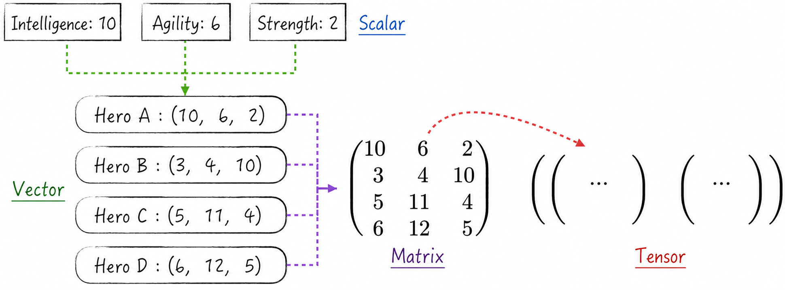
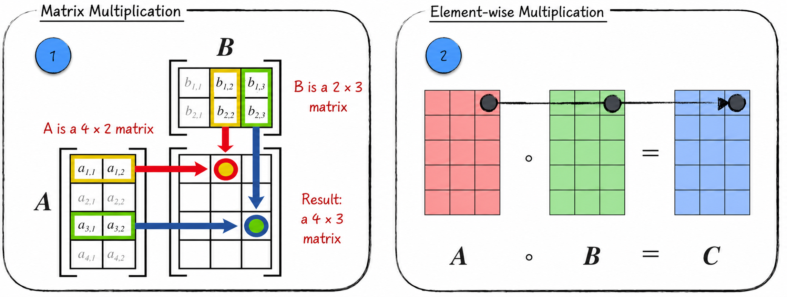
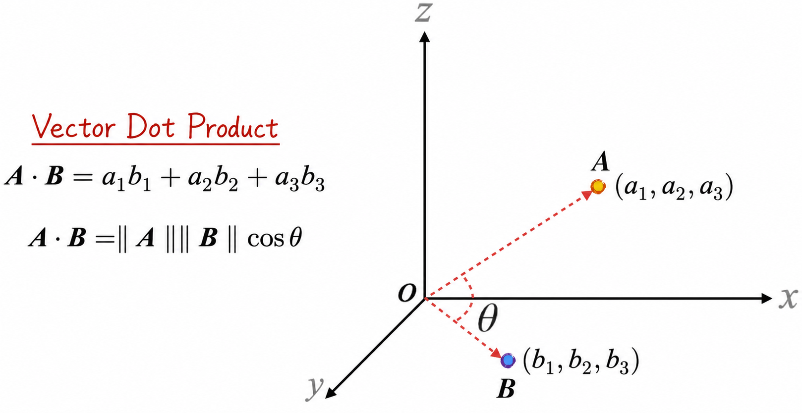
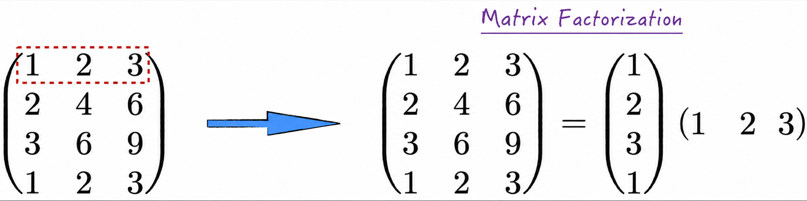
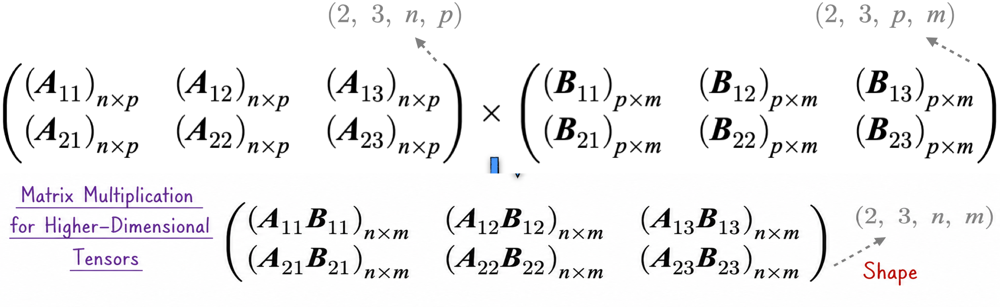
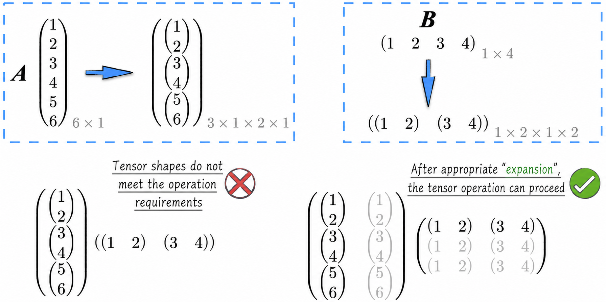

## 2.1 Vectors, Matrices, and Tensors

In artificial intelligence, both data and models take the form of tensors. To understand this relatively unfamiliar concept, we begin with the familiar notion of a scalar.

### 2.1.1 Scalars, Vectors, Matrices, and Tensors

The following simple example provides an intuitive understanding of four mathematical concepts: **scalars**, **vectors**, **matrices**, and **tensors**.

Suppose we are developing an online battle game in which players choose different heroes to fight one another. Each hero's capabilities are described by three attributes: intelligence, agility, and strength[^dota]. Let $i$ denote intelligence, $a$ agility, and $s$ strength, as shown in Figure 2-1.

- Hero A is designed as an intelligence-based hero, with intelligence 10, agility 6, and strength 2. In mathematics, these values are called scalars—that is, individual numbers.
- Arrange Hero A's attribute values in a row, in the order intelligence, agility, and strength, and write them as $\mathbf A=(10,6,2)$. In mathematics, $\mathbf A$ is called a vector, or more precisely, a row vector. Intuitively, a row vector consists of multiple numbers, or scalars, arranged in a row. Similarly, a column vector consists of multiple numbers arranged in a column.
- Now design three additional heroes, B, C, and D, represented by the vectors $\mathbf B=(3,4,10)$, $\mathbf C=(5,11,4)$, and $\mathbf D=(6,12,5)$, respectively. Arrange the vectors of these four heroes into a matrix, with each row representing one hero. This matrix contains the attribute data for all four heroes.
- The matrix above describes the initial state of the four heroes. Their attribute data changes during the game, so each level increase requires a new matrix to represent them. Arranging these matrices sequentially produces what is known as a tensor—more precisely, a three-dimensional tensor.

The example above gives an intuitive sense that scalars, vectors, and matrices are simply ways of displaying numbers in particular arrangements. A scalar can display only one number, whereas a vector—a row vector, for example—can arrange multiple numbers in a row. To facilitate description, these structures are abstracted mathematically as tensors[^tensor], and the concept of tensor dimensionality is introduced. The dimensionality of a tensor can be understood as the number of directions in which it can extend: a scalar is a zero-dimensional tensor because it is only a number; a vector is a one-dimensional tensor because a row vector can extend horizontally; and a matrix is a two-dimensional tensor because it can extend both horizontally and vertically. A tensor can, of course, have any number of dimensions. For example, arranging the three-dimensional tensors above in rows or columns produces a four-dimensional tensor. We may be unable to visualize high-dimensional tensors intuitively, but that is not a problem; in fact, almost no one can fully visualize them. We need only become accustomed to this representation.

Closely related to tensor dimensionality is a tensor's **shape**. The shape is a vector composed of the size of each dimension. For example, a vector may have shape $(3)$, a matrix shape $(4,3)$, and a three-dimensional tensor shape $(2,4,3)$.

If tensors were defined only as arrangements of numbers, however, their usefulness would be limited. Tensors are widely used because corresponding operations are defined on them. Tensors of different dimensionalities support different kinds of operations, and in terms of the richness and importance of these operations, the matrix—a two-dimensional tensor—is the most distinctive. A scalar is simply the familiar notion of a number, so its operations are intuitive. A vector can be regarded as a matrix with a special shape: for example, an $n$-dimensional row vector can be viewed as a matrix of shape $(1,n)$, so vector operations are matrix operations. In artificial intelligence, higher-dimensional tensors can be regarded as stacks of matrices, and their operations are likewise defined on the basis of matrix operations. We will therefore focus first on matrices and then examine how operations are defined for higher-dimensional tensors.

### 2.1.2 Mathematical Notation and Special Matrices

Vectors and matrices are represented in mathematics as shown in Equation (2-1), where $x_{i,j}$ denotes a scalar—that is, a real number—$\mathbf X_i$ denotes an $m$-dimensional row vector with tensor shape $(m)$, and $\mathbf X$ denotes an $n\times m$ matrix with tensor shape $(n,m)$. The same notation is used throughout the rest of this book. Note that a column vector can be represented as the transpose of a row vector, so no separate notation is introduced for column vectors. For details of the transpose operation, see [Section 2.1.3](/books/deconstructing_LLM/chapter-2/2-1#section-2-1-3).

$$
\begin{aligned}
\mathbf X_i&=(x_{i,1},x_{i,2},\dots,x_{i,m})\\
\mathbf X&=
\begin{pmatrix}
\mathbf X_1\\
\mathbf X_2\\
\vdots\\
\mathbf X_n
\end{pmatrix}
=(x_{i,j})
\end{aligned}
\tag{2-1}
$$

Before discussing matrix operations, let us first examine a special class of matrices: **square matrices**. A square matrix has the same number of rows and columns. Its shape is square, hence the name. Three kinds of square matrices deserve particular attention.

1. An **identity matrix** is a special matrix whose diagonal elements are 1 and whose other elements are all 0. An identity matrix is usually denoted by $\mathbf I_n$.

$$
\mathbf I_n=
\begin{pmatrix}
1&0&\cdots&0\\
0&1&\cdots&0\\
\vdots&\vdots&\ddots&\vdots\\
0&0&\cdots&1
\end{pmatrix}
=(\mathbf 1_{\{i=j\}})
\tag{2-2}
$$

2. A **diagonal matrix** is a matrix in which every element except those on the main diagonal is 0. It is usually denoted by $\operatorname{diag}(d_1,d_2,\dots,d_n)$. An identity matrix is clearly a special case of a diagonal matrix.

$$
\operatorname{diag}(d_1,d_2,\dots,d_n)=
\begin{pmatrix}
d_1&0&\cdots&0\\
0&d_2&\cdots&0\\
\vdots&\vdots&\ddots&\vdots\\
0&0&\cdots&d_n
\end{pmatrix}
\tag{2-3}
$$

3. A **triangular matrix** can take either of two forms: upper triangular or lower triangular. An upper triangular matrix, denoted by $\mathbf U$, has zeros below the main diagonal. A lower triangular matrix, denoted by $\mathbf L$, has zeros above the main diagonal. A diagonal matrix is clearly a special case of a triangular matrix.

$$
\mathbf U=
\begin{pmatrix}
u_{1,1}&u_{1,2}&\cdots&u_{1,n}\\
0&u_{2,2}&\cdots&u_{2,n}\\
\vdots&\vdots&\ddots&\vdots\\
0&0&\cdots&u_{n,n}
\end{pmatrix}\qquad
\mathbf L=
\begin{pmatrix}
l_{1,1}&0&\cdots&0\\
l_{2,1}&l_{2,2}&\cdots&0\\
\vdots&\vdots&\ddots&\vdots\\
l_{n,1}&l_{n,2}&\cdots&l_{n,n}
\end{pmatrix}
\tag{2-4}
$$

### 2.1.3 Matrix Operations

To work with matrices as we do with numbers, we define four operations analogous to addition, subtraction, multiplication, and division.

#### 1. Matrix Addition and Subtraction

Unlike addition and subtraction of numbers, these operations cannot be performed on every pair of matrices. The matrices must have the same shape—that is, the same number of rows and columns. Suppose $\mathbf X$ and $\mathbf Y$ are both $n\times m$ matrices. Their sum and difference are also $n\times m$ matrices, with addition and subtraction defined as follows:

$$
\begin{aligned}
\mathbf X&=(x_{i,j})\qquad \mathbf Y=(y_{i,j})\\
\mathbf X\pm\mathbf Y&=
\begin{pmatrix}
x_{1,1}\pm y_{1,1}&\cdots&x_{1,m}\pm y_{1,m}\\
\vdots&\ddots&\vdots\\
x_{n,1}\pm y_{n,1}&\cdots&x_{n,m}\pm y_{n,m}
\end{pmatrix}
\end{aligned}
\tag{2-5}
$$

From this definition, it is straightforward to prove that matrix addition is associative and commutative. If $\mathbf Z$ is also an $n\times m$ matrix, we obtain:

$$
\mathbf X+\mathbf Y=\mathbf Y+\mathbf X
\qquad
\mathbf X+\mathbf Y+\mathbf Z=\mathbf X+(\mathbf Y+\mathbf Z)
\tag{2-6}
$$

#### 2. Three Forms of Matrix Multiplication

(1) **Multiplication of a matrix by a number**. This operation resembles ordinary numerical multiplication: any real number can be multiplied by any matrix. Suppose $k$ is a real number. Its multiplication with the matrix $\mathbf X$ is defined as follows:

$$
k\mathbf X=
\begin{pmatrix}
kx_{1,1}&\cdots&kx_{1,m}\\
\vdots&\ddots&\vdots\\
kx_{n,1}&\cdots&kx_{n,m}
\end{pmatrix}
\tag{2-7}
$$

(2) **Multiplication of one matrix by another**, or **matrix multiplication**. Matrix multiplication imposes strict requirements on matrix shapes: the number of columns in the first matrix—the second element of its shape—must equal the number of rows in the second matrix—the first element of its shape. For a concrete example, suppose $\mathbf A$ is an $n\times p$ matrix and $\mathbf B$ is a $p\times m$ matrix. Their product is an $n\times m$ matrix, as indicated by label 1 in Figure 2-2[^wiki]. It is denoted by $\mathbf{AB}$[^multiplication] and defined as follows:

$$
\mathbf A=(a_{i,j})\qquad
\mathbf B=(b_{i,j})\qquad
\mathbf{AB}=\left(\sum_{r=1}^{p}a_{i,r}b_{r,j}\right)
\tag{2-8}
$$

It is straightforward to prove that matrix multiplication is associative, $(\mathbf{AB})\mathbf C=\mathbf A(\mathbf{BC})$, and distributive, $\mathbf A(\mathbf B+\mathbf C)=\mathbf{AB}+\mathbf{AC}$, but not commutative. In the usual case, reversing the order of two matrices means that the shape requirement for multiplication is not even satisfied. This differs substantially from multiplication of numbers. In addition, the product of any matrix and an identity matrix—provided the shape requirement for matrix multiplication is met—is the matrix itself. For example, $\mathbf I_n\mathbf A=\mathbf A=\mathbf A\mathbf I_p$. The identity matrix can therefore be regarded as the number 1 among matrices.

Linear models are often expressed using matrix multiplication. For example, suppose a linear model is

$$
\begin{cases}
y_1=ax_1+b\\
y_2=ax_2+b
\end{cases}
\tag{2-9}
$$

Let $\mathbf X=\begin{pmatrix}x_1&1\\x_2&1\end{pmatrix},
\boldsymbol\beta=(a,b),
\mathbf Y=\begin{pmatrix}y_1\\y_2\end{pmatrix}.$ Then Equation (2-9) can be written as $\mathbf Y=\mathbf X\boldsymbol\beta^{\mathsf T}$.

(3) **Element-wise matrix multiplication**, also known as the **Hadamard product**. Suppose $\mathbf A$ and $\mathbf B$ are both $n\times m$ matrices. Their element-wise product is also an $n\times m$ matrix, denoted by $\mathbf A\circ\mathbf B$. The computation is illustrated by label 2 in Figure 2-2 and is defined by the following equation:

$$
\mathbf A\circ\mathbf B=(a_{i,j}b_{i,j})
\tag{2-10}
$$

Element-wise matrix multiplication is uncommon in mathematical theory, but it is frequently used in programming to compute the products of multiple groups of data simultaneously.

#### 3. Matrix Division: The Inverse Matrix

Matrix inversion is a special operation performed on square matrices. Suppose $\mathbf M$ is an $n\times n$ matrix. If there exists an $n\times n$ matrix $\mathbf N$ such that their product equals the identity matrix of order $n$, as shown in Equation (2-11), then $\mathbf N$ is called the **inverse matrix** of $\mathbf M$ and is denoted by $\mathbf M^{-1}$. The matrix $\mathbf M$ is said to be invertible.

$$
\mathbf{MN}=\mathbf{NM}=\mathbf I_n
\tag{2-11}
$$

It can be proved mathematically that if a matrix has an inverse, that inverse is unique. Thus, for a square matrix $\mathbf M$, if another square matrix $\mathbf L$ satisfies $\mathbf{ML}=\mathbf I_n$, then $\mathbf{LM}=\mathbf I_n$ must also hold, and $\mathbf L=\mathbf N=\mathbf M^{-1}$.

Some commonly used identities involving inverse matrices are:

$$
(\mathbf M^{-1})^{-1}=\mathbf M
\qquad
(k\mathbf M)^{-1}=\frac{1}{k}\mathbf M^{-1}
\qquad
(\mathbf{MN})^{-1}=\mathbf N^{-1}\mathbf M^{-1}
\tag{2-12}
$$

#### 4. Matrix Transposition

Intuitively, the **transpose** of a matrix is obtained by reflecting the matrix across its main diagonal. Suppose $\mathbf X$ is an $n\times m$ matrix. Its transpose is an $m\times n$ matrix denoted by $\mathbf X^{\mathsf T}$. It is defined as follows:

$$
\mathbf X=(x_{i,j})\qquad
\mathbf X^{\mathsf T}=(x_{j,i})
\tag{2-13}
$$

Some commonly used identities involving matrix transposition are listed below. Here $k$ is assumed to be a real number, and all matrix multiplications and inverses appearing in the equations are assumed to be well-defined.

$$
\begin{aligned}
(\mathbf X^{\mathsf T})^{\mathsf T}&=\mathbf X\\
(\mathbf X+\mathbf Y)^{\mathsf T}&=\mathbf X^{\mathsf T}+\mathbf Y^{\mathsf T}\\
(k\mathbf X)^{\mathsf T}&=k\mathbf X^{\mathsf T}\\
(\mathbf{XY})^{\mathsf T}&=\mathbf Y^{\mathsf T}\mathbf X^{\mathsf T}\\
(\mathbf X^{\mathsf T})^{-1}&=(\mathbf X^{-1})^{\mathsf T}
\end{aligned}
\tag{2-14}
$$

### 2.1.4 The Angle Between Vectors

Vectors are widely used mathematical tools in artificial intelligence and are often used to describe the objects being modeled. For example, Figure 2-1 uses a vector of shape $(3)$ to describe a hero. In practical applications, it is often necessary to evaluate the similarity between data points, which motivates the definition of the angle between vectors.

Let us first develop an intuitive understanding of this angle through a concrete example. In a Cartesian coordinate system, map vectors of shape $(3)$ to points in space[^three-dimensions], such as point $\mathbf A=(a_1,a_2,a_3)$ and point $\mathbf B=(b_1,b_2,b_3)$ in Figure 2-3. Their **dot product** is defined as

$$
\mathbf A\cdot\mathbf B=a_1b_1+a_2b_2+a_3b_3
\tag{2-15}
$$

It follows directly from Equation (2-15) that the dot product of a vector with itself equals the square of its length, as shown in Equation (2-16).

$$
\mathbf A\cdot\mathbf A=\lVert\mathbf A\rVert^2=a_1^2+a_2^2+a_3^2
\tag{2-16}
$$

Further mathematical derivation shows that the dot product of two vectors equals the product of their lengths and the cosine of the angle between them, as illustrated in Figure 2-3.

From a geometric perspective, the smaller the angle between two vectors in three-dimensional space, the more similar the vectors are. Viewed another way, if both vectors are scaled to have length 1, a smaller angle means a shorter distance between them. This intuitive conclusion can be generalized to vectors of any shape. Specifically, if two vectors $\mathbf X$ and $\mathbf Y$ have the same shape, the cosine of the angle between them is defined by Equation (2-17). The larger this cosine value is, the greater their similarity, and vice versa.

$$
\cos\theta=\frac{\mathbf X\cdot\mathbf Y}{\lVert\mathbf X\rVert\lVert\mathbf Y\rVert}
\tag{2-17}
$$

### 2.1.5 Matrix Rank

In addition to dot products and angles, vectors can have another special relationship: linear representation. As a simple example, the row vector $\mathbf X=(x_1,x_2,x_3)$ can be expressed as the linear combination

$$
\mathbf X=x_1(1,0,0)+x_2(0,1,0)+x_3(0,0,1)
$$

In other words, $\mathbf X$ can be represented linearly by the three row vectors $\mathbf e_1=(1,0,0)$, $\mathbf e_2=(0,1,0)$, and $\mathbf e_3=(0,0,1)$.

Linear representation among vectors is a highly important and profound mathematical concept. Many results derived from it are often used to optimize vector or matrix computations. This section examines its application to matrix decomposition. We begin by defining the **rank of a matrix**. Consider an $n\times m$ matrix, which can be viewed as a collection of $n$ row vectors. It can be proved mathematically that there are $r$ row vectors[^linear-independence] that can represent every row vector in the matrix. This value $r$ is the rank of the matrix. Although a rigorous proof of this result is quite involved, there is no need to worry: the simple example on the left side of Figure 2-4 makes the idea intuitive. In this example, the matrix has rank 1 because every row vector is a scalar multiple of the vector inside the dashed box.

Given the definition of rank, singular value decomposition theory shows that an $n\times m$ matrix can be decomposed into the product of an $n\times r$ matrix and an $r\times m$ matrix, as shown on the right side of Figure 2-4.

The original matrix contains $n\times m$ scalar entries, but after decomposition, only $(n+m)\times r$ numbers need to be retained. When a matrix's rank is much smaller than its dimensions, this decomposition represents the original matrix with fewer numbers and therefore saves a great deal of storage space. More importantly, matrices are often used to describe linear models. With the matrix decomposition above, a smaller model can achieve the same effect as a larger model while requiring substantially less computation[^application].

### 2.1.6 Operations on Higher-Dimensional Tensors

The matrix operations defined above fall into two categories: element-wise operations and matrix multiplication. The first category includes matrix addition and subtraction, multiplication of a matrix by a number, and element-wise matrix multiplication. These operations are intuitive: they simply operate on elements at corresponding positions. They can therefore be extended conveniently to higher-dimensional tensors. In other words, addition, subtraction, multiplication by a number, and element-wise multiplication can all be defined for higher-dimensional tensors. Their equations closely resemble those for matrices and will not be listed individually here.

Because matrix multiplication provides a concise description of model computations, it must also be extended to higher-dimensional tensors. Specifically, the final two dimensions of a higher-dimensional tensor are treated as a matrix, and the remaining dimensions are treated as loop dimensions. This also explains the earlier statement that a higher-dimensional tensor is essentially a stack of matrices. A concrete example will make this concept clearer. Consider matrix multiplication between two four-dimensional tensors, as shown in Figure 2-5. First, verify that their shapes meet the requirements for the operation: excluding the final two dimensions, the sizes of the other dimensions must match, while the final two dimensions must satisfy the requirements of ordinary matrix multiplication. Next, perform matrix multiplication on the matrices formed by the final two dimensions while processing the other dimensions element by element.

On closer examination, higher-dimensional tensors and matrices can be transformed into one another. Figure 2-6, for example, transforms matrix $\mathbf A$ into a four-dimensional tensor, and the reverse operation is equally possible. More precisely, tensors of different dimensionalities can be transformed into one another[^block-matrix]. Note, however, that reshaping a tensor may make the original computation impossible. For example, matrices $\mathbf A$ and $\mathbf B$ in Figure 2-6 can be multiplied, but after the transformation shown in the figure, their shapes become $(3,1,2,1)$ and $(1,2,1,2)$. The transformed higher-dimensional tensors therefore cannot be multiplied.

To allow the transformed higher-dimensional tensors to be multiplied while producing the same result as the original matrix multiplication, the tensors can be copied and expanded appropriately, as shown in Figure 2-6, where the lighter regions indicate copied data. The expanded tensors can not only be multiplied successfully but also produce the expected result. This mechanism for automatically copying and expanding tensors is common in neural-network computations. In fact, many open-source tools have already implemented it. For more details, see [Section 6.3.1](/books/deconstructing_LLM/chapter-6/6-3#section-6-3-1).

[^dota]: Readers familiar with DotA may imagine this game as DotA.
[^tensor]: The rigorous mathematical definition of a tensor is quite complex and difficult to understand. In artificial intelligence, however, tensors are used to organize numerical computations more effectively. A simple but relatively accurate definition is therefore used here.
[^wiki]: The image is adapted from Wikipedia.
[^multiplication]: Some literature also denotes matrix multiplication by $\mathbf A\cdot\mathbf B$, but this notation can easily be confused with the vector dot product introduced later, so this book does not use it.
[^three-dimensions]: The physical world familiar to us is three-dimensional in space, so vectors of larger shape cannot be visualized directly. The reasonableness of the angle definition can therefore be explained only by analogy with three-dimensional space.
[^linear-independence]: More rigorously, these are $r$ linearly independent row vectors. Linear independence means that none of these vectors can be represented as a linear combination of the others.
[^application]: Such a purely theoretical discussion may be difficult to understand. [Section 11.4.4](/books/deconstructing_LLM/chapter-11/11-4#section-11-4-4) presents a concrete application to make the conclusions in the main text easier to grasp.
[^block-matrix]: Readers familiar with matrix operations may have encountered computations such as matrix multiplication being divided into operations on submatrices. The discussion here is essentially an extension of that computational method.
