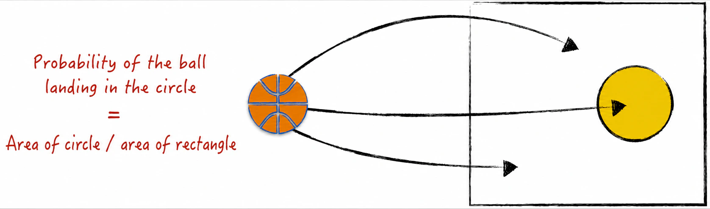
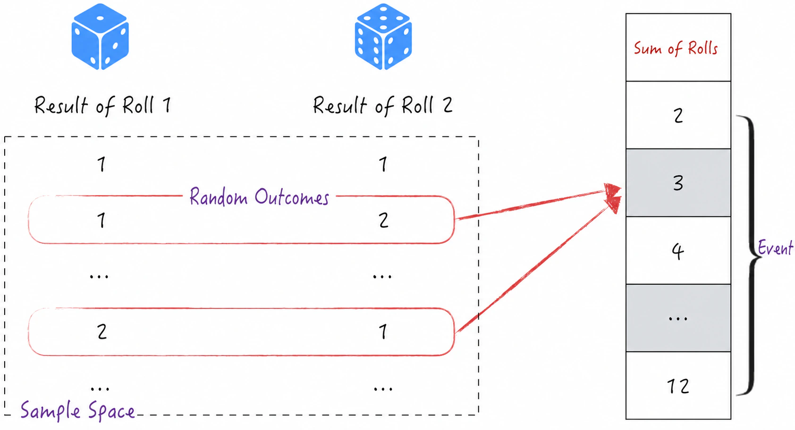
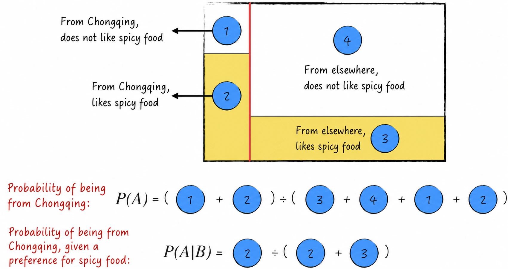
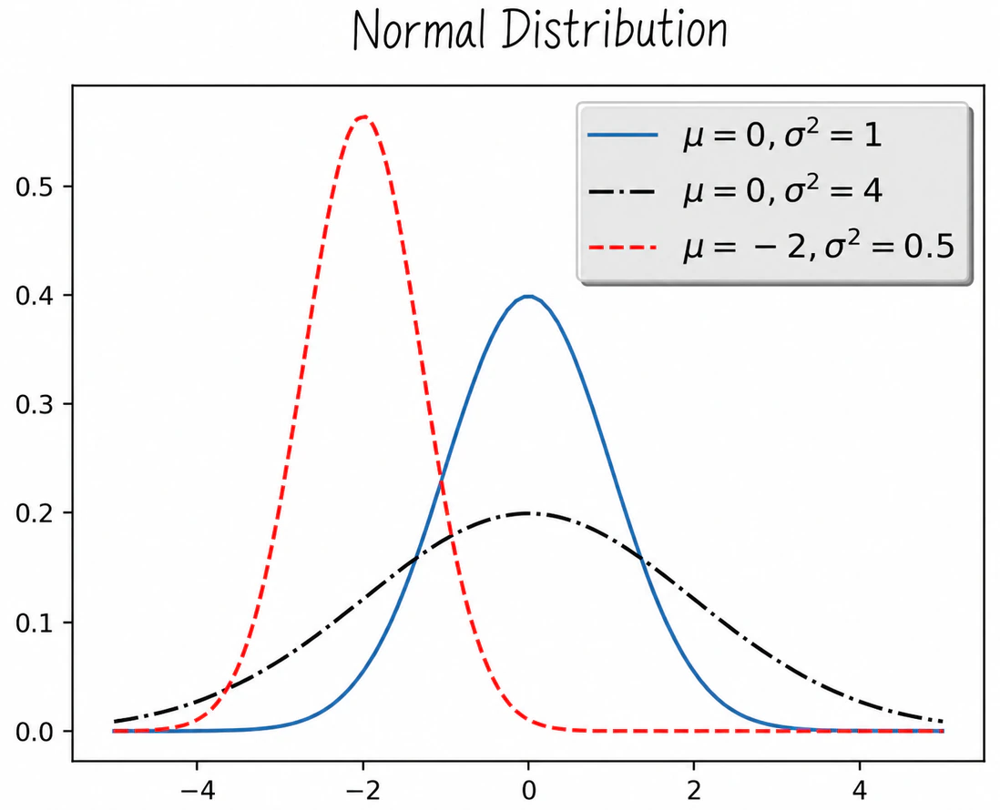
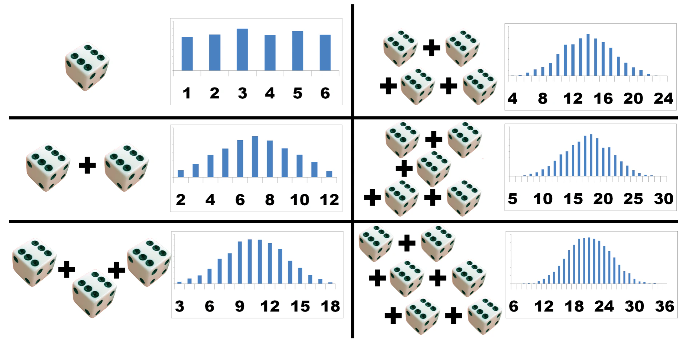
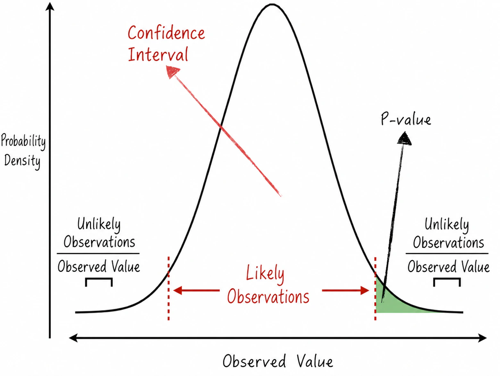

## 2.2 Probability

What is probability? Intuitively, it can be understood as the proportion of times an event occurs. For example, in Figure 2-7, suppose a ball is thrown randomly into a square. The probability that it lands inside the circle can be taken as the area of the circle divided by the area of the square.

Probability is widely used in artificial intelligence. As later discussions of models will show, nearly every model can be regarded as a probabilistic model. This also means that model predictions contain some degree of randomness. A strong command of probability not only helps us understand how models work; more importantly, it enables us to interpret model results accurately and distinguish genuinely reliable results from illusions caused by random fluctuations. To study probability in greater depth, we begin with its definition.

### 2.2.1 Defining Probability: Events and Probability Spaces

Probability theory originated in attempts to reason about dice games[^history], and we will likewise use a dice game to introduce its basic definitions. Suppose a die is rolled twice and the results are added. Let $X_1$ denote the result of the first roll and $X_2$ the result of the second. Their sum is $XX=X_1+X_2$. Clearly, $XX$ can take values from 2 to 12. Let $XX=i$ denote the event $E_i$.

These events can be subdivided further. For example, the event $E_3$ corresponding to $XX=3$ can be decomposed into two events: the first roll is 1 and the second is 2, denoted by $(1,2)$; or the first roll is 2 and the second is 1, denoted by $(2,1)$. The entire process is shown in Figure 2-8. Let $P(E_i)$ denote the probability that event $E_i$ occurs. Then

$$
P(E_3)=P\bigl((1,2)\cup(2,1)\bigr)
=P((1,2))+P((2,1))
=\frac{1}{6}
\tag{2-18}
$$

The probabilities of the other results can be defined in the same way.

Generalizing the method above gives a definition of probability[^axioms]. Denote every indivisible random outcome by $\omega$. These indivisible random outcomes form a countable, nonempty set called the **sample space**, denoted by $S$. A subset of the sample space is called an **event**. Probability $P$ is a real-valued function defined on the sample space that satisfies two conditions:

- $P(\omega)\geqslant 0$ for every $\omega$;
- $\sum_{\omega\in S}P(\omega)=1$.

For an event $E$, its probability is $P(E)=\sum_{\omega\in E}P(\omega)$. A sample space together with a probability defined on it is called a probability space. The definition of probability yields Equation (2-19), where $A$ and $B$ are random events and $A^c$ denotes the complement of event $A$.

$$
\begin{aligned}
0&\leqslant P(A)\leqslant 1,\\
P(A^c)&=1-P(A),\\
P(A\cup B)&=P(A)+P(B)-P(A\cap B)
\end{aligned}
\tag{2-19}
$$

### 2.2.2 Conditional Probability: The Value of Information

The preceding section introduced the probability of a single event and the probability that any one of several events occurs. We now consider the probability that two or more events occur simultaneously. Suppose $A$ and $B$ are two different events. The probability that they both occur is denoted by $P(A\cap B)$. How is this probability related to $P(A)$ and $P(B)$?

To explain this question more clearly, we introduce the concept of **conditional probability**. Conditional probability is the likelihood that one event occurs given that another event is known to have occurred, as expressed in Equation (2-20). Here, $P(A\mid B)$ represents the likelihood that event $A$ occurs given that event $B$ has occurred, while $P(B\mid A)$ represents the likelihood that event $B$ occurs given that event $A$ has occurred.

$$
P(A\mid B)=\frac{P(A\cap B)}{P(B)}
\qquad
P(B\mid A)=\frac{P(A\cap B)}{P(A)}
\tag{2-20}
$$

Combining the two conditional probabilities in Equation (2-20) gives **Bayes' theorem**:

$$
P(B\mid A)=\frac{P(A\mid B)P(B)}{P(A)}
\tag{2-21}
$$

A simple example provides a more intuitive understanding of conditional probability. Suppose that in a university class:

- 10% of the students are from Chongqing, and 90% of those students enjoy spicy food;
- 90% of the students are from other regions, and 30% of those students enjoy spicy food.

For clarity, let $A$ denote the event that a student is from Chongqing and $B$ the event that the student enjoys spicy food. According to the description above, without any other information, the probability that a student is from Chongqing is 10%; that is, $P(A)=0.1$. If we learn that the student enjoys spicy food, however, the probability that the student is from Chongqing clearly rises, because people from Chongqing are more likely to enjoy spicy food. The information that the student “enjoys spicy food” is therefore valuable in judging whether the student is from Chongqing. But how should its effect be quantified? Conditional probability can quantify the value of this information. Using Bayes' theorem, we obtain $P(A\mid B)=0.25$[^chongqing], as shown in Figure 2-9. Put simply, after learning that the student enjoys spicy food, the probability that the student is from Chongqing rises from 10% to 25%. This is the value obtained from the information.

If a conditional probability equals the original probability—that is, $P(A\mid B)=P(A)$, from which $P(B\mid A)=P(B)$ also follows readily—then events $A$ and $B$ are said to be **independent**. In other words, event $B$ is unrelated to event $A$, and whether the former occurs has no effect on whether the latter occurs.

When two events are independent, $P(A\cap B)=P(A)P(B)$. This concept can be extended to define any number of mutually independent events. Suppose $A_1,A_2,\dots,A_n$ are a collection of mutually independent random events. This holds if and only if, for every finite subset $A_{i_1},A_{i_2},\dots,A_{i_k}$, we have $
P(A_{i_1}\cap A_{i_2}\cap\cdots\cap A_{i_k})
=P(A_{i_1})P(A_{i_2})\cdots P(A_{i_k})
$.

### 2.2.3 Random Variables

To quantify random events further, we define a **random variable** as a function that maps random events to numbers, usually real numbers[^measurable]. For example, the variable $XX$ introduced in [Section 2.2.1](/books/deconstructing_LLM/chapter-2/2-2#section-2-2-1), which equals the sum of the two dice rolls, is a random variable. Introducing random variables makes probabilities easier to calculate. Depending on the kinds of values they can take, random variables can be classified as **discrete random variables** or **continuous random variables**.

- A discrete random variable takes discrete values. The variable $XX$ above, for example, can take discrete natural-number values from 2 through 12. Suppose a discrete random variable $X$ can take the values $x_1,x_2,\dots,x_n$. The distribution of $X$ can be described by a **probability mass function** (PMF), defined in Equation (2-22).

$$
P(x_i)=p_i
\tag{2-22}
$$

- A continuous random variable takes values on a continuum; human height is one example. The randomness of a continuous random variable $X$ can be described by a **probability density function**, defined in Equation (2-23). For the calculus used in the equation, see [Section 2.3](/books/deconstructing_LLM/chapter-2/2-3).

$$
P(a\leqslant X\leqslant b)=\int_a^b f_X(x)\,\mathrm dx
\qquad
f_X(x)=\frac{\mathrm d}{\mathrm dx}P(-\infty\leqslant X\leqslant x)
\tag{2-23}
$$

The following functions and statistical measures are commonly used for random variables.

- The **cumulative distribution function** (CDF) is defined as follows:

$$
F_X(x)=P(X\leqslant x)
\tag{2-24}
$$

- The **expected value**. The expected value can be understood intuitively as the weighted average of a random variable and is usually denoted by $E[X]$. If the expectation exists, it is computed as follows:

$$
E[X]=
\begin{cases}
\displaystyle\sum_i p_i x_i,&X\text{ is a discrete random variable},\\[6pt]
\displaystyle\int x f_X(x)\,\mathrm dx,&X\text{ is a continuous random variable}
\end{cases}
\tag{2-25}
$$

- The **variance**, denoted by $\operatorname{Var}(X)$, measures the dispersion of a random variable. If the variance exists, it is defined by

$$
\operatorname{Var}(X)
=E\bigl[(X-E[X])^2\bigr]
=E[X^2]-(E[X])^2
\tag{2-26}
$$

- The **covariance**, denoted by $\operatorname{Cov}(X,Y)$, measures how two random variables vary together. It is defined in Equation (2-27). In short, covariance describes the tendency of two variables to increase or decrease together[^covariance]. Note that the variance of a random variable is a special case of covariance.

$$
\operatorname{Cov}(X,Y)
=E\bigl[(X-E[X])(Y-E[Y])\bigr]
=E[XY]-E[X]E[Y]
\tag{2-27}
$$

The expected value and covariance of random variables satisfy several commonly used identities:

$$
\begin{aligned}
E[aX+bY]&=aE[X]+bE[Y]\\
\operatorname{Cov}(X,X)&=\operatorname{Var}(X)\\
\operatorname{Var}(aX+bY)
&=a^2\operatorname{Var}(X)+b^2\operatorname{Var}(Y)
+2ab\operatorname{Cov}(X,Y)
\end{aligned}
\tag{2-28}
$$

Having discussed the probability distribution of a single random variable, we now turn to conditional probability distributions between two random variables. Suppose the two random variables under study are $X$ and $Y$.

- If $X$ and $Y$ are both discrete random variables, their conditional distribution can be described by a conditional probability mass function, defined as follows:

$$
P(X=x_i\mid Y=y_j)
=\frac{P(X=x_i,Y=y_j)}{P(Y=y_j)}
\tag{2-29}
$$

- If $X$ and $Y$ are both continuous random variables, their conditional distribution can be described by a conditional probability density function, defined as follows. Here, $f_{X,Y}$ is the joint probability density function of $X$ and $Y$[^joint-density], and $f_X$ is the probability density function of $X$.

$$
f_{Y\mid X}(y\mid X=x)=\frac{f_{X,Y}(x,y)}{f_X(x)}
\tag{2-30}
$$

- If one of $X$ and $Y$ is discrete and the other continuous, their conditional probability distribution is defined in an analogous manner. The rigorous mathematical definition involves real analysis and is quite complex; because this situation is also uncommon in practical applications, it will not be discussed in depth here.

Just as random events can be mutually independent, random variables can be mutually independent. For a random variable $X$ and a real number $a$, the statement that $X$ is less than $a$ defines a random event, denoted by $[X<a]$. The independence of random variables can be defined from the mutual independence of such events. Specifically, suppose $X_1,X_2,\dots,X_n$ is a collection of random variables. The random variables $X_1,X_2,\dots,X_n$ are mutually independent if, for every finite subset $X_{i_1},X_{i_2},\dots,X_{i_k}$ and every corresponding set of numbers $a_{i_1},a_{i_2},\dots,a_{i_k}$, the random events $[X_{i_1}<a_{i_1}],[X_{i_2}<a_{i_2}],\dots,[X_{i_k}<a_{i_k}]$ are mutually independent.

When random variables are independent, calculating their probability distributions and statistical measures becomes simpler, as shown in Equation (2-31). For concision, only two independent random variables, denoted by $X$ and $Y$, are considered here; the treatment of multiple random variables is analogous.

$$
\begin{aligned}
P(X=x_i,Y=y_j)&=P(X=x_i)P(Y=y_j)
\quad\text{or}\quad f_{X,Y}=f_Xf_Y\\
E[XY]&=E[X]E[Y]\\
\operatorname{Var}(aX+bY)
&=a^2\operatorname{Var}(X)+b^2\operatorname{Var}(Y)
\end{aligned}
\tag{2-31}
$$

### 2.2.4 The Normal Distribution: Different Paths to the Same Destination

This section discusses a highly important probability distribution: the **normal distribution**, also known as the **Gaussian distribution**. When a random variable $X$ follows a normal distribution, it is continuous, with probability density function

$$
f(x)=\frac{1}{\sqrt{2\pi\sigma^2}}
\exp\left(-\frac{(x-\mu)^2}{2\sigma^2}\right)
\tag{2-32}
$$

The quantities $\mu$ and $\sigma^2$ in Equation (2-32) are parameters of the probability distribution. It can be proved that the expected value of $X$ equals $\mu$ and its variance equals $\sigma^2$, as shown in Equation (2-33). This is usually written as $X\sim N(\mu,\sigma^2)$.

$$
E[X]=\mu\qquad \operatorname{Var}(X)=\sigma^2
\tag{2-33}
$$

When $\mu=0$ and $\sigma^2=1$, the distribution is called the standard normal distribution. It can be proved that the random variable $(X-\mu)/\sigma$ follows the standard normal distribution; that is, $(X-\mu)/\sigma\sim N(0,1)$. Figure 2-10 shows the probability density curves of normal distributions with different parameter values. The parameter $\mu$ determines the center of the curve, while $\sigma^2$ determines how flat it is. The larger $\sigma^2$ is, the flatter the probability density curve becomes.

In practical applications, many random variables approximately follow a normal distribution, so the distribution is widely used across many fields. When constructing a model, for example, we typically assume that the model's random error term follows a normal distribution[^normal-error]. But why is the normal distribution so common? A highly plausible explanation is provided by the **central limit theorem**.

Suppose the random variables $X_1,X_2,\dots,X_n$ are **independent and identically distributed**[^not-independent] (i.i.d.) and have finite expected value and variance, denoted by $E[X_i]=m$ and $\operatorname{Var}(X_i)=v^2$. The following theorem can be proved mathematically:

$$
\begin{aligned}
\bar X_n&=\frac{1}{n}\sum_{i=1}^{n}X_i\\
T_n&=\frac{\sqrt n(\bar X_n-m)}{v}\\
\lim_{n\to\infty}T_n&\sim N(0,1)
\end{aligned}
\tag{2-34}
$$

Equation (2-34) states that, under certain conditions, random variables approach the standard normal distribution after an appropriate linear transformation, regardless of their original distribution. Intuitively, the combined effect of many random influences is approximately normally distributed. Consider the example in Figure 2-11[^muelaner]. The outcome of one die approximately follows a uniform distribution. The distribution of the sum of two dice is approximately an equilateral triangle. As the number of dice increases, the distribution of their sum becomes increasingly close to a normal distribution.

In the real world, many random variables that we observe are aggregates of multiple independent and identically distributed random variables. According to the central limit theorem, these random variables approximately follow a normal distribution.

### 2.2.5 P-Values: Confident Conjectures

Using the normal distribution as an example, we now introduce an important concept in statistics: the **p-value**. Mathematically, the p-value is related to the **quantile function**.

Suppose $X$ is a real-valued random variable and $p$ is a real number in the interval $(0,1)$. Its **quantile function** is defined as

$$
Q(p)=\inf\{x\in\mathbb R:p\leqslant P(X\leqslant x)\}
\tag{2-35}
$$

In other words, $Q(p)$ is the smallest real number for which the cumulative probability is at least $p$. A simple example illustrates the definition. Suppose $X$ is the outcome of a die. It follows a uniform distribution on the integers 1 through 6; that is, $P(X=i)=1/6,i=1,2,\dots,6$. If $p=0.5$, it is easy to obtain $P(X\leqslant 3)=0.5$, $P(X\leqslant 4)=4/6$, and $P(X\leqslant 2)=2/6$, so $Q(0.5)=3$. Continuing in this way gives the following quantile function:

$$
Q(p)=
\begin{cases}
1,&0<p\leqslant\frac16\\
2,&\frac16<p\leqslant\frac26\\
3,&\frac26<p\leqslant\frac36\\
4,&\frac36<p\leqslant\frac46\\
5,&\frac46<p\leqslant\frac56\\
6,&\frac56<p<1
\end{cases}
\tag{2-36}
$$

Having introduced the mathematical equation, let us examine the intuition behind the p-value. For a normally distributed random variable $X$, most observations cluster around the expected value because a normal distribution has higher probability density near that value. Observations in this region are therefore more common, as shown in Figure 2-12. This motivates the definition of the $\alpha$ confidence interval of $X$, where $\alpha$ is usually 0.95 or 0.99: a region symmetric about the expected value with probability $\alpha$.

The rigorous mathematical definition is as follows. Define $a$ and $b$ as in Equation (2-37), so that the $\alpha$ confidence interval of $X$ is $[a,b]$. In other words, an observation of $X$ falls in $[a,b]$ with probability $\alpha$.

$$
a=Q\left(0.5-\frac{\alpha}{2}\right)
\qquad
b=Q\left(0.5+\frac{\alpha}{2}\right)
\tag{2-37}
$$

Viewed from another perspective, it is very rare for an observation of $X$ to fall in the left—or right—tail region. When such a rare event occurs, we need to reconsider what might have gone wrong. Suppose the observed value is $x$. Define the p-value corresponding to this observation as $P(X\leqslant x)$; if the observation falls in the right tail, the p-value is $P(X\geqslant x)$, as shown in Figure 2-12. It follows readily that, for the $\alpha$ confidence interval $[a,b]$, both $a$ and $b$ have p-value $(1-\alpha)/2$.

P-values and their corresponding confidence intervals have many applications in artificial intelligence. They are often used to analyze the reliability of model results or to conduct hypothesis tests. These details are discussed in Chapters 3 through 5.

[^history]: Probability theory can be traced to seventeenth-century France, where dice-based gambling games were popular at the royal court. To determine the participants' chances of winning, people sought help from the mathematician Blaise Pascal. This episode opened the door to the discipline of probability theory.
[^axioms]: The definition in the main text is not a rigorous axiomatic definition. Strictly speaking, probability is a measure defined on a probability space—that is, a real-valued function on events. This function satisfies the Kolmogorov axioms. Specifically, suppose $P$ is a probability measure. For every event $E$, $P(E)\geqslant0$; for the sample space $\Omega$, $P(\Omega)=1$; and for any countable sequence of pairwise disjoint events $E_1,E_2,\dots$, $P(E_1\cup E_2\cup\cdots)=\sum_iP(E_i)$.
[^chongqing]: The detailed calculation is given here. First decompose the probability of event $B$: $P(B)=P(B\cap A)+P(B\cap A^c)$. The conditional probability formula then gives $P(B)=P(B\mid A)P(A)+P(B\mid A^c)P(A^c)$ and $P(A\mid B)=\frac{P(B\mid A)P(A)}{P(B\mid A)P(A)+P(B\mid A^c)P(A^c)}$. From the problem statement, $P(A)=0.1,P(A^c)=0.9,P(B\mid A)=0.9,P(B\mid A^c)=0.3$. Substitution gives $P(A\mid B)=\frac{0.09}{0.09+0.27}=0.25$.
[^measurable]: The rigorous mathematical definition requires the function to be measurable. A measurable function is a concept from measure theory. Because it is quite complex and has little direct relevance to artificial intelligence, it will not be discussed further here.
[^covariance]: Covariance can take many values, and its sign indicates the linear relationship between variables. A positive value indicates positive correlation: an increase in one variable accompanies an increase in the other. A negative value indicates negative correlation: an increase in one variable accompanies a decrease in the other. A value of zero indicates no linear correlation. The magnitude of covariance is difficult to interpret intuitively, however, so the correlation coefficient—covariance divided by variance—is usually used to measure the relationship between variables more precisely.
[^joint-density]: The joint probability density function is defined as follows. Suppose $X$ and $Y$ are continuous random variables. If a function $f_{X,Y}$ satisfies $P(a\leqslant X\leqslant b,c\leqslant Y\leqslant d)=\int_c^d\int_a^b f_{X,Y}(x,y)\,\mathrm dx\,\mathrm dy$, then $f_{X,Y}$ is called the joint probability density function of $X$ and $Y$.
[^normal-error]: This assumption does not always reflect reality and can sometimes lead to poor model performance or even incorrect conclusions. Many model improvements and innovations are also based on this assumption, including logistic regression; see [Section 4.1.3](/books/deconstructing_LLM/chapter-4/4-1#section-4-1-3) for details.
[^not-independent]: If the random variables $X_1,X_2,\dots,X_n$ are not mutually independent, the central limit theorem no longer holds. Consider the following counterexample. Suppose $X_1$ follows a uniform distribution on $-1$ and $1$, so $P(X_1=-1)=P(X_1=1)=0.5$. For $i>1$, let $X_i=X_1$, so every $X_i$ is also uniformly distributed on $-1$ and $1$. But $\frac1n\sum_{i=1}^nX_i$ equals either $1$ or $-1$. This probability distribution clearly does not approach a normal distribution.
[^muelaner]: The image is adapted from the personal website of Dr. Jody Muelaner.
