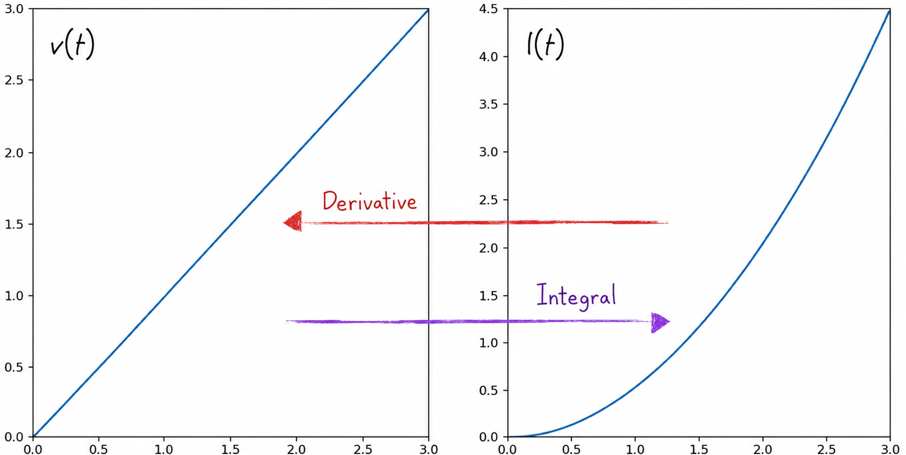
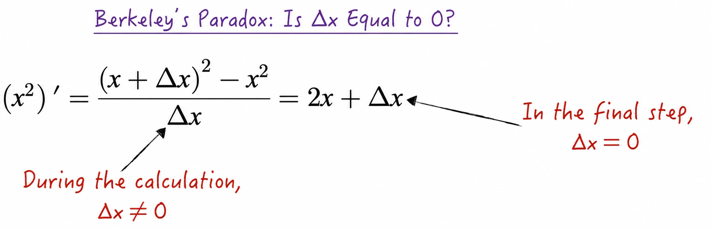
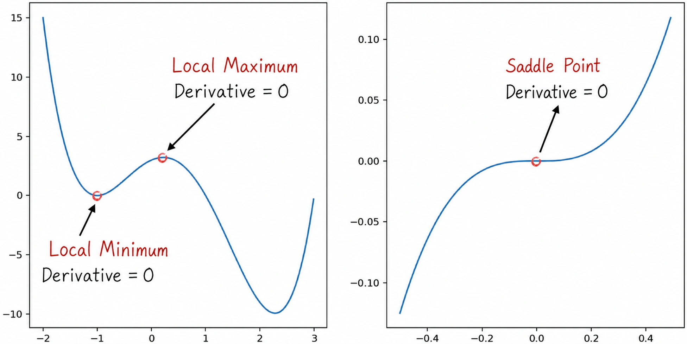

## 2.3 Calculus

Calculus is a cornerstone of modern mathematics and comprises two main concepts: derivatives, or differentiation, and integrals. A derivative represents the local rate of change of a function; for example, it can be used to calculate an object's velocity from its position function. An integral calculates the cumulative effect of a function over an interval. In statistics, for example, it can be used to calculate the probability that a continuous random variable falls within a given interval from its probability density function. In artificial intelligence, integrals are generally used in theoretical research, whereas derivatives are used extensively in practical implementations, such as in solving optimization problems. This section therefore focuses on derivatives and their applications.

### 2.3.1 Derivatives and Integrals

Continuing the style of the preceding sections, we introduce the basic concepts of calculus through an everyday example. Suppose we walk along a straight line. Two quantities are essential during this process: position and velocity. Let $l(t)$ denote our distance from the starting point at time $t$, and let $v(t)$ denote our velocity at time $t$. These two functions are related: velocity represents the instantaneous rate of change of position, while position reflects the accumulated change produced by velocity over time. The central questions of calculus are how to derive the velocity function $v(t)$ from the position function $l(t)$—differentiation—and how to recover the position function $l(t)$ from the velocity function $v(t)$—integration. The process is illustrated in Figure 2-13.

Given the position $l(t_1)$ at time $t_1$ and the position $l(t_2)$ at time $t_2$, we can readily obtain the average velocity over this period: $\bar v=[l(t_2)-l(t_1)]/(t_2-t_1)$.

If we move at a constant velocity, then the velocity at every point during this interval, $v(t),t_1\leqslant t\leqslant t_2$, equals the average velocity $\bar v$. What if the velocity is not constant? In that case, the velocity at time $t_1$ differs from the average velocity. Clearly, the shorter the time interval, the closer the average velocity $\bar v$ is to the velocity $v(t_1)$ at time $t_1$. As the length of the time interval tends to 0, $\bar v$ approaches $v(t_1)$. In mathematical language, the limit of the average velocity equals the velocity at the initial time, as shown in Equation (2-38)[^differentiable].

$$
\lim_{t_2\to t_1}\frac{l(t_2)-l(t_1)}{t_2-t_1}
=\lim_{t_2\to t_1}\bar v
=v(t_1)
\tag{2-38}
$$

In mathematics, this calculation is called finding the **derivative** of a function, written as $l'(t)=v(t)$. The physical meaning of the derivative is clear: when the independent variable $t$ changes by a very small amount $\mathrm dt$—called an infinitesimal in mathematics—the dependent variable $l(t)$ changes by approximately $v(t)\mathrm dt$, written as $\mathrm dl(t)=l'(t)\mathrm dt$. In mathematics, the latter equation is called a **differential**.

Differentiating the velocity function $v(t)$ gives its first derivative, which is also the second derivative of $l(t)$. This represents the acceleration of the motion: $a(t)=v'(t)=l''(t)$. Continuing in this way defines the $n$th derivative of $l(t)$[^higher-derivative], denoted by $l^{(n)}(t)$.

Similarly, suppose the velocity at time $t_1$ is $v(t_1)$ and the position is $l(t_1)$. If the velocity is constant, then the position at time $t_2$ is $l(t_2)=l(t_1)+v(t_1)(t_2-t_1)$. If the velocity is not constant, the position estimated under the constant-velocity assumption, $l(t_1)+v(t_1)(t_2-t_1)$, clearly differs from the actual position $l(t_2)$. How can this error be reduced? Divide the time interval $[t_1,t_2]$ into $n+1$ segments, with corresponding endpoints $x_0,x_1,\dots,x_n$, defined by

$$
x_0=t_1\qquad
x_{i+1}=x_i+\frac{t_2-t_1}{n}
\tag{2-39}
$$

Within each small time interval, the motion can be approximated as occurring at a constant velocity. The estimated position at time $t_2$ is therefore

$$
l(t_1)+\sum_{i=0}^{n}v(x_i)\frac{t_2-t_1}{n}
\tag{2-40}
$$

It can be proved mathematically that, under certain conditions[^integrable], the estimate given by Equation (2-40) approaches $l(t_2)$ as $n$ increases. As $n$ tends to infinity, the two become equal.

$$
l(t_2)-l(t_1)
=\lim_{n\to\infty}\sum_{i=0}^{n}v(x_i)\frac{t_2-t_1}{n}
=\int_{t_1}^{t_2}v(t)\,\mathrm dt
\tag{2-41}
$$

In mathematics, Equation (2-41) defines an **integral**, written as $l(t)=\int v(t)\,\mathrm dt$. Derivatives and integrals, like addition and subtraction, can be derived from one another and are inverse operations.

Calculating a derivative from first principles requires evaluating a limit, which is often quite complex. Mathematicians have therefore derived the derivatives of simple functions, along with rules for reducing the derivative of a complex function to derivatives of simpler functions; see [Section 2.3.3](/books/deconstructing_LLM/chapter-2/2-3#section-2-3-3). The sum, difference, product, and quotient rules, together with the derivatives of several common elementary functions, are listed below, where $f$ and $g$ are differentiable functions.

$$
\begin{aligned}
(fg)'&=f'g+fg'\\
\left(\frac fg\right)'&=\frac{f'g-fg'}{g^2}\\
c'&=0\qquad (x^n)'=nx^{n-1}\\
(\sin x)'&=\cos x\qquad (\cos x)'=-\sin x\\
(\mathrm e^x)'&=\mathrm e^x\qquad (\ln x)'=\frac1x
\end{aligned}
\tag{2-42}
$$

### 2.3.2 Limits

The definition of the derivative uses the mathematical concept of a **limit**. In studying the differential of a function, we also introduced another important concept: the infinitesimal $\mathrm dt$. These two concepts are among the profound results of mathematics. Historically, they even led to the so-called second crisis in the foundations of mathematics, which we briefly introduce here.

When Newton and Leibniz[^leibniz] independently invented calculus, both used the method shown in Figure 2-14 to calculate a function's derivative, with $x^2$ as the example. During the calculation, the infinitesimal $\Delta x$ was treated as nonzero at one point and as zero at another. This is the famous Berkeley paradox: the “ghost of departed quantities.”

To resolve this crisis, mathematicians led by Cauchy[^cauchy] established a rigorous theory of limits over the real numbers, treating an infinitesimal as a process rather than a fixed quantity. Specifically, the derivative $f'(x_0)$ of a function $f(x)$ at the point $x_0$ is defined as follows: for every $\varepsilon>0$, there exists a $\delta>0$ such that Equation (2-43) holds for every $x\in(x_0-\delta,x_0+\delta)$ with $x\ne x_0$. This formulation is the famous $\varepsilon$-$\delta$ language of mathematics and may be familiar to readers with a mathematical background.

$$
\left|\frac{f(x)-f(x_0)}{x-x_0}-f'(x_0)\right|<\varepsilon
\tag{2-43}
$$

Similarly, the differential equation $\mathrm df(x)=f'(x)\mathrm dx$ represents a dynamic process rather than a static equality in the ordinary sense.

### 2.3.3 The Chain Rule

Equation (2-42) lists the derivatives of several commonly used functions, but the list is clearly not comprehensive. For example, it does not include the common polynomial function $f(x)=(x^2+1)^2$. We could use the distributive law of multiplication to rewrite $f(x)$ in standard polynomial form as $f(x)=x^4+2x^2+1$, then apply the sum rule for derivatives to obtain $f'(x)=4x^3+4x=4x(x^2+1)$. This approach is inefficient, however, and not every complex function can be decomposed into simple functions using arithmetic operations as a polynomial can. A more efficient way to differentiate complex functions is therefore needed: the **chain rule**.

In fact, the polynomial function $f(x)$ can be regarded as a composition of two simple functions. Let $g(x)=x^2+1$ and $h(x)=x^2$. Then $f(x)=h(g(x))$. The function $f(x)$ is commonly called a composite function and is denoted by $f=h\circ g$.

For a composite function, the following equality can be proved mathematically:

$$
(h\circ g)'=(h'\circ g)g'
\tag{2-44}
$$

Applying Equation (2-44) to the example above gives $h'=2x$ and $h'\circ g=2g(x)=2(x^2+1)$. It then follows readily that $f'(x)=4x(x^2+1)$.

The chain rule can be used to derive the formula for the derivative of an inverse function. Let $g$ be the inverse of $f$, so $f(g(x))=x$. Differentiating both sides of this equality gives

$$
(f'\circ g)g'=1
\qquad
g'=\frac{1}{f'\circ g}
\tag{2-45}
$$

For example, the inverse of $f(x)=x^3$ is $g(x)=x^{1/3}$. Using Equation (2-45) and $f'(x)=3x^2$, we obtain $g'(x)=1/[3(x^{1/3})^2]=1/(3x^{2/3})$.

The derivatives of inverse trigonometric functions can also be obtained from the chain rule:

$$
\begin{aligned}
[\arcsin(x)]'&=\frac1{\sqrt{1-x^2}}
& [\arccos(x)]'&=-\frac1{\sqrt{1-x^2}}\\
[\arctan(x)]'&=\frac1{1+x^2}
& [\operatorname{arccot}(x)]'&=-\frac1{1+x^2}
\end{aligned}
\tag{2-46}
$$

### 2.3.4 Partial Derivatives and Gradients

The preceding sections focused on functions of a single variable. In practice, however, modeling often involves multivariable functions.

For a multivariable function, **partial derivatives** are introduced to examine the function's local behavior. Partial derivatives are based on the ordinary derivative introduced earlier. The idea is to select one variable in a multivariable function as the independent variable and treat all other variables as constants. The corresponding partial derivative is then calculated according to the definition of the derivative for a single-variable function. As an example, suppose $f(x,y)=xy+xy^2$. When differentiating with respect to $x$, $y$ is treated as a constant, and vice versa. We therefore obtain

$$
\frac{\partial f}{\partial x}=y+y^2
\qquad
\frac{\partial f}{\partial y}=x+2xy
\tag{2-47}
$$

The rules for ordinary derivatives clearly also apply to partial derivatives. The rules for addition, subtraction, multiplication, and division are relatively simple and will not be repeated. The chain rule for multivariable composite functions, however, requires further discussion. Suppose $f(u,v)$ is a function of two variables, where $u=g(x,y)$ and $v=h(x,y)$. The following equalities can be proved mathematically:

$$
\begin{aligned}
\frac{\partial f}{\partial x}
&=\frac{\partial f}{\partial u}\frac{\partial u}{\partial x}
+\frac{\partial f}{\partial v}\frac{\partial v}{\partial x}\\
\frac{\partial f}{\partial y}
&=\frac{\partial f}{\partial u}\frac{\partial u}{\partial y}
+\frac{\partial f}{\partial v}\frac{\partial v}{\partial y}
\end{aligned}
\tag{2-48}
$$

As with the differential of a single-variable function, under certain conditions[^multivariable-differentiable], the differential and partial derivatives of a multivariable function $f(x_1,x_2,\dots,x_n)$ satisfy

$$
\mathrm df=\sum_{i=1}^{n}\frac{\partial f}{\partial x_i}\,\mathrm dx_i
\tag{2-49}
$$

In fact, all first-order partial derivatives of $f$ form the vector $
\left(\frac{\partial f}{\partial x_1},\frac{\partial f}{\partial x_2},\dots,\frac{\partial f}{\partial x_n}\right)
$. This vector is called the **gradient** of the function and is denoted by $\nabla f$. The gradient plays an enormously important role in practical model implementation[^gradient]. For details, see [Section 2.3.5](/books/deconstructing_LLM/chapter-2/2-3#section-2-3-5) and [Chapter 6](/books/deconstructing_LLM/chapter-6).

### 2.3.5 Local and Global Extrema

We have devoted considerable space to derivatives and partial derivatives, but what are they used for? The answer is to find a function's **local extrema**—local minima and maxima—and **global extrema**—global minima and maxima. Finding a function's global extrema is often called an optimization problem and is central to practical AI. For simplicity, first consider a differentiable function of one variable $f(x)$ that attains its minimum at $x_0$. From the definition of the derivative, we have

$$
f'(x_0)=\lim_{x\to x_0}\frac{f(x)-f(x_0)}{x-x_0}
$$

Because $f(x_0)$ is the minimum value of the function, when $x>x_0$,

$$
\frac{f(x)-f(x_0)}{x-x_0}\geqslant0
\tag{2-50}
$$

and when $x<x_0$,

$$
\frac{f(x)-f(x_0)}{x-x_0}\leqslant0
\tag{2-51}
$$

Combining Equations (2-50) and (2-51) gives $f'(x_0)=0$[^limit-proof]. The same conclusion can be proved for a maximum. This observation extends to a differentiable multivariable function $g(\mathbf X)$, where $\mathbf X$ is a vector. If $g$ attains a global extremum at $\mathbf X_0$, then its gradient at that point equals 0; that is, $\nabla g(\mathbf X_0)=0$.

It is important to be clear, however, that a derivative or gradient equal to 0 at a point does not guarantee that the point is a global extremum. It may instead be only a local extremum or a **saddle point**, as shown in Figure 2-15. In more formal terms, a derivative or gradient equal to 0 is a necessary condition for a function to attain a global extremum, but not a sufficient condition. Although this condition is not both necessary and sufficient for identifying a global extremum, it provides a way to identify candidate extrema. In practical applications, the condition is commonly used to obtain a set of candidate extrema, after which other methods are used to determine the global extrema. Detailed methods and techniques are discussed in [Chapter 6](/books/deconstructing_LLM/chapter-6).

[^differentiable]: Equation (2-38) and the description preceding it are not mathematically rigorous because $l(t)$ may not be differentiable; that is, the limit $\lim_{t_2\to t_1}\frac{l(t_2)-l(t_1)}{t_2-t_1}$ may not exist. The rigorous statement is that if $l(t)$ is differentiable, then the velocity at the initial time equals the limit of the average velocity.
[^higher-derivative]: Unlike first and second derivatives, the meaning of higher-order derivatives in the real world is rather obscure. For precisely this reason, Newton, one of the inventors of calculus, once declared that derivatives of third order and above were meaningless. Reality has proved otherwise: higher-order derivatives have a wide range of applications. During the 1972 U.S. presidential election, for example, Nixon claimed that he would reduce the acceleration of inflation during his term. This made Nixon the first national leader in history to use a third derivative to demonstrate his competence.
[^integrable]: When the limit in Equation (2-41) exists, the function $v(t)$ is called integrable. More precisely, it is Riemann integrable. The functions encountered in artificial intelligence are generally both integrable and differentiable. In addition to the Riemann integral, the Lebesgue integral is also commonly used in mathematics. Its definition involves real analysis and is quite complex. Because it is used mainly in theoretical AI research, it is not discussed here.
[^leibniz]: Gottfried Wilhelm Leibniz was a German mathematician and philosopher. The dispute over whether he or Newton invented calculus first remains one of the greatest unresolved controversies in mathematics. In fact, Leibniz's notation for calculus was clearer and more concise, and most modern mathematical notation for calculus originated with him.
[^cauchy]: Augustin-Louis Cauchy was a French mathematician. He established a series of rigorous principles for calculus, freeing it from the difficulties posed by the Berkeley paradox. Cauchy studied and taught at France's illustrious École Polytechnique. Most of the theory in foundational university calculus courses originated at this institution.
[^multivariable-differentiable]: If all partial derivatives of a multivariable function $f$ exist in a neighborhood of a given point and are continuous at that point, then the function is differentiable there, and Equation (2-49) holds. Of course, almost all functions handled in artificial intelligence are differentiable.
[^gradient]: In fact, the gradient of a function plays an important role in the gradient descent algorithm, while the chain rule forms the theoretical foundation of the backpropagation algorithm. These two theoretical concepts are fundamental to deep learning.
[^limit-proof]: It can be proved mathematically that if a function $h(x)$ is always greater than or equal to 0 near a given point $x_0$, excluding $x_0$ itself, and if the limit $\lim_{x\to x_0}h(x)$ exists, then $\lim_{x\to x_0}h(x)\geqslant0$. Equation (2-50) implies $f'(x_0)\geqslant0$, while Equation (2-51) implies $f'(x_0)\leqslant0$. Therefore, $f'(x_0)=0$.
