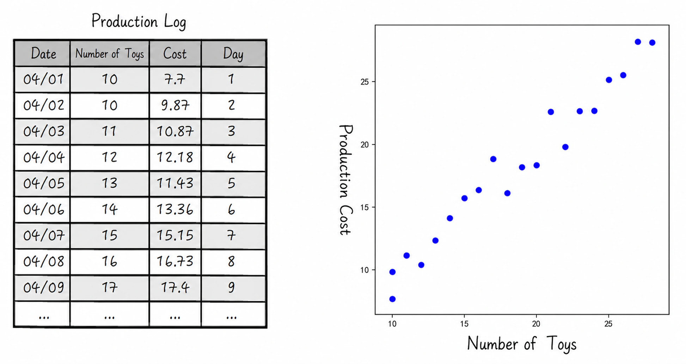
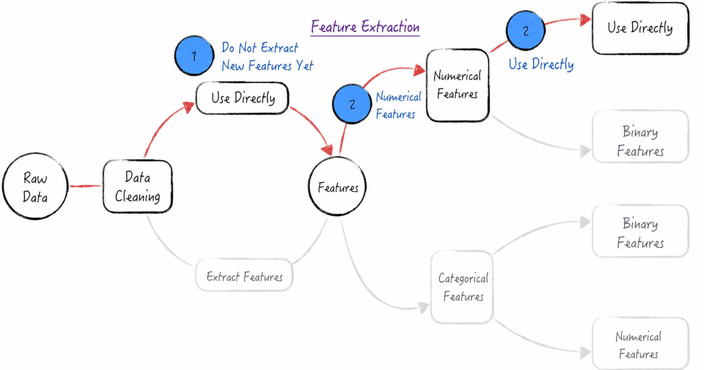
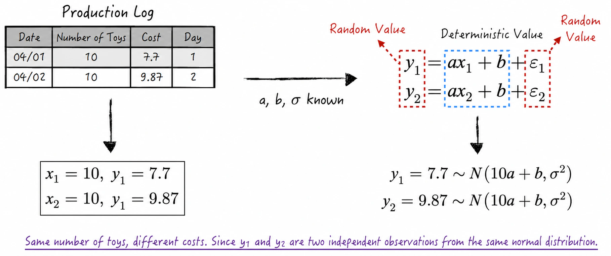

## 3.1 A Simple Example

We begin with a simple example to introduce linear regression. Suppose a factory manufactures dolls. Its production data, shown on the left side of Figure 3-1, contains two variables: the number of dolls produced and the production cost.

At first glance, we might expect a linear relationship between the number of dolls and the production cost. Visualizing the data makes this relationship easier to examine. When plotted on a coordinate plane, the observations do not fall exactly on a straight line; instead, they appear to fluctuate around one, as shown on the right side of Figure 3-1. Given this pattern and our background knowledge, linear regression appears to be a reasonable choice. To develop a more complete understanding of the model, we will approach the problem from two perspectives: machine learning and statistical analysis.

Before turning to the model itself, let us reveal the equation that generated the data. The observations above were generated by Equation (3-1)[^approximation]. In a real modeling problem, the true data-generating process is never known. Here, however, knowing the correct answer in advance helps us evaluate model performance and understand what the modeling process gets right and wrong.

$$
y_i=x_i+\varepsilon_i
\tag{3-1}
$$

Here, $x_i$ is the number of dolls produced on a given day, and $y_i$ is the production cost on that day. Equation (3-1) states that the average cost of manufacturing one doll is 1.

The error terms $\varepsilon_i$ are random variables that follow a normal distribution with mean 0 and variance 1. They represent random costs incurred during production. If a defective doll is produced, for example, $\varepsilon_i$ is positive; if usable leftover fabric happens to be found, $\varepsilon_i$ is negative. These random costs are independent of the number of dolls produced.

### 3.1.1 The Machine-Learning Approach to Modeling

A machine-learning workflow for a modeling problem can be summarized in four steps: define the modeling setting and loss function, extract features, select a model form, and evaluate model performance.

We begin by analyzing the modeling setting and loss function for the example above, as illustrated in Figure 3-2.

1. In the dataset, $x_i$ is the number of dolls produced on day $i$, and $y_i$ is the production cost on that day. Our goal is to predict cost from the number of dolls produced. The dataset therefore contains a target, or label—the production cost—that the model must predict. This makes the task a supervised-learning problem.
2. The target $y_i$ is a continuous numerical quantity rather than a discrete category, so this is a regression problem.
3. The modeling objective is to make the predicted cost as close as possible to the actual production cost. We therefore define a loss function in terms of the difference between the predicted and actual values. Suppose the actual cost is $y_i$ and the predicted cost is $\hat y_i$. One possible loss is the mean absolute error, $L=(1/n)\sum_{i=1}^{n}|y_i-\hat y_i|$. The modeling objective is to minimize this loss. Unfortunately, the function is not differentiable at certain points, which complicates the mathematics. We therefore choose a more mathematically tractable loss function[^loss-choice], shown in Equation (3-2): the mean squared difference between the true and predicted values.

$$
L=\frac{1}{n}\sum_{i=1}^{n}(y_i-\hat y_i)^2
\tag{3-2}
$$

With the basic modeling framework in place, we examine the available data and extract features for the model, as shown in Figure 3-3. In machine learning, this process is called feature engineering.

1. The data in this example is “clean,” meaning that it contains no errors or outliers, so the data-cleaning step can be omitted[^dirty-data]. The current dataset contains only one raw feature, $\mathbf X=\{x_i\}$, which represents quantity. Although mathematical transformations could generate new features from $\mathbf X$—for example, squaring it to produce $\mathbf X^2$—the initial model uses only the raw feature. New features can be considered later if the model performs poorly.
2. The raw feature $\mathbf X=\{x_i\}$ represents quantity and is therefore a numerical variable. Mathematical operations on this variable are meaningful, so $\mathbf X$ can be used directly in the model.

Selecting the model form is straightforward in this setting[^model-selection]. On the basis of the preceding analysis, we choose a linear regression model, defined in Equation (3-3). Here, $a$ is the variable cost of producing one doll, and $b$ is the fixed cost[^intercept].

$$
\hat y_i=ax_i+b
\tag{3-3}
$$

Based on the loss function and modeling principles defined above, the estimates $(\hat a,\hat b)$ of parameters $(a,b)$ are the values that minimize $L$, as shown in Equation (3-4).

$$
(\hat a,\hat b)=\underset{a,b}{\operatorname{argmin}}\sum_{i=1}^{n}(y_i-ax_i-b)^2
\tag{3-4}
$$

This completes the basic machine-learning formulation, but one task remains: evaluating model performance.

1. From a predictive perspective, we want the model's predictions to be as close as possible to the true costs. Equation (3-5) therefore defines the mean squared error (MSE) of the linear model. Here, the MSE is the same as the model's loss function: the smaller it is, the more closely the predictions match the true values.

$$
\operatorname{MSE}=\frac{1}{n}\sum_{i=1}^{n}(y_i-\hat y_i)^2=L
\tag{3-5}
$$

2. From an explanatory perspective, we want the model to account for as much of the variation in cost as possible. In other words, the unexplained deviation $(y_i-\hat y_i)$ should be small relative to the total deviation in cost $(y_i-\frac{1}{n}\sum_{i=1}^{n}y_i)$. This motivates the model's **coefficient of determination**, $R^2$, illustrated in Figure 3-4. The closer $R^2$ is to 1, the more variation the model explains[^r-squared].

After completing the analysis above, we can use the third-party scikit-learn library to solve the problem. The implementation is discussed in detail in [Section 3.2.1](/books/deconstructing_LLM/chapter-3/3-2#section-3-2-1). Readers are advised to read [Section 3.2.1](/books/deconstructing_LLM/chapter-3/3-2#section-3-2-1) before proceeding to [Section 3.1.2](/books/deconstructing_LLM/chapter-3/3-1#section-3-1-2).

### 3.1.2 The Statistical-Analysis Approach to Modeling

The machine-learning formulation is concise, but it does not fully explain the randomness observed in the data or how that randomness affects the model results. These are precisely the questions that statistical analysis is designed to address. This section therefore examines how linear regression is formulated from a statistical perspective.

Following the standard statistical approach, we begin by modeling the randomness in the data. The preceding analysis suggests a linear relationship between the independent variable $x_i$ and the dependent variable $y_i$, together with random fluctuations. We therefore assume the relationship shown in Equation (3-6). The parameters $a$ and $b$ represent the variable cost and fixed cost, respectively, of producing a doll. The term $\varepsilon_i$ is called the noise term and represents random costs not captured by the available data. It follows a normal distribution with mean 0 and variance $\sigma^2$, written as $\varepsilon_i\sim N(0,\sigma^2)$. Note that $\sigma^2$ is also a model parameter.

In addition to the model equation, we make two important assumptions[^endogeneity]: the $\varepsilon_i$ are mutually independent, and each $\varepsilon_i$ is independent of $x_i$.

$$
y_i=ax_i+b+\varepsilon_i
\tag{3-6}
$$

Equation (3-6) expresses $y_i$ as the sum of the deterministic component $ax_i+b$ and the random error $\varepsilon_i$. Given values of $a$, $b$, and the noise variance $\sigma^2$, the input $x_i$—the number of dolls—is fixed. The response $y_i$, like $\varepsilon_i$, is therefore a random variable with mean $ax_i+b$ and variance $\sigma^2$: $y_i\sim N(ax_i+b,\sigma^2)$. In other words, the observed $y_i$ is a single realization from the normal distribution $N(ax_i+b,\sigma^2)$, as shown in Figure 3-5, and the $y_i$ are mutually independent. Equivalently, the conditional distribution of $y_i$, given $a,b,x_i,\sigma^2$, is $N(ax_i+b,\sigma^2)$, as expressed in Equation (3-7).

$$
y_i\mid a,b,x_i,\sigma^2\sim N(ax_i+b,\sigma^2)
\tag{3-7}
$$

If the data consists of random variables, then intuition suggests that the parameter estimators and predictions should also be random. This perspective may seem counterintuitive, but it is one of the central ideas of statistical analysis. We now confirm it through a mathematical derivation.

From the preceding analysis, the $y_i$ are mutually independent. We therefore obtain the joint probability density of $\mathbf Y$, as shown in Equation (3-8). Viewed as a function of the model parameters, this density is called the model's **likelihood function** and is usually denoted by $L$[^likelihood-notation].

$$
\begin{aligned}
p(\mathbf Y\mid a,b,\mathbf X,\sigma^2)
&=\prod_i p(y_i\mid a,b,x_i,\sigma^2)\\
\ln p(\mathbf Y\mid a,b,\mathbf X,\sigma^2)
&=-\frac{n}{2}\ln(2\pi\sigma^2)-\frac{1}{2\sigma^2}\sum_i(y_i-ax_i-b)^2
\end{aligned}
\tag{3-8}
$$

Different model parameters give different likelihoods for the observed data. We choose the parameter values that maximize this likelihood. The method of calculating parameter estimates in this way is called **maximum likelihood estimation** (MLE). Maximizing Equation (3-8) gives the following estimation formulas.

$$
\begin{aligned}
(\hat a,\hat b)
&=\underset{a,b}{\operatorname{argmax}}\,P(\mathbf Y\mid a,b,\mathbf X,\sigma^2)
=\underset{a,b}{\operatorname{argmin}}\sum_i(y_i-ax_i-b)^2\\
\hat\sigma^2
&=\underset{a,b}{\operatorname{argmax}}\,P(\mathbf Y\mid a,b,\mathbf X,\sigma^2)
=\frac{\sum_{i=1}^{n}(y_i-\hat y_i)^2}{n}\\
\hat y_i&=\hat a x_i+\hat b
\end{aligned}
\tag{3-9}
$$

The parameter estimators $(\hat a,\hat b,\hat\sigma^2)$ obtained from Equation (3-9) are all random variables. Because the complete derivation is rather involved, the details are omitted from the main text[^matrix-proof]. The following simplified derivation uses $\hat a$ to illustrate the point. Suppose the dataset contains only two observations, $(x_k,y_k)$ and $(x_l,y_l)$, with $x_k\ne x_l$. Solving the system of equations in Equation (3-10) gives an expression for $\hat a$. The right-hand side shows that $\hat a$ is a random variable that follows a normal distribution with mean equal to the true parameter $a$.

$$
\begin{cases}
y_k=\hat a x_k+\hat b\\
y_l=\hat a x_l+\hat b
\end{cases}
\Rightarrow
\hat a=\frac{y_k-y_l}{x_k-x_l}
=\frac{a(x_k-x_l)+\varepsilon_k-\varepsilon_l}{x_k-x_l}
=a+\frac{\varepsilon_k-\varepsilon_l}{x_k-x_l}
\tag{3-10}
$$

A fuller derivation yields the exact sampling distributions of the parameter estimators, as shown in Equation (3-11). According to Equation (3-9), the model's predictions are also linear combinations of the estimated parameters and are therefore random variables. Their distributions, however, are considerably more involved than those of the parameter estimators, and deriving them contributes little to our intuitive understanding of the model. The remainder of this chapter therefore focuses primarily on the model parameters. When analyzing predictions, we will take a pragmatic approach and use algorithms provided by open-source tools without dwelling on their derivations.

$$
\begin{aligned}
\hat b&\sim N\left(b,\frac{\sigma^2}{n}\right)\\
\hat a&\sim N\left(a,\frac{\sigma^2}{\sum_i(x_i-\bar x)^2}\right)\\
\hat\sigma^2&\sim\chi_{n-2}^2\frac{\sigma^2}{n}
\end{aligned}
\tag{3-11}
$$

Because parameter estimators are random variables, understanding their sampling distributions is more important than focusing only on the particular estimates calculated from Equation (3-9). Those estimates are realizations of the estimators for the current sample and are not necessarily equal to the true parameters. Moreover, specific parameter estimates depend heavily on the data used. As a simple example, Figure 3-6 shows that estimates based on the first three days differ from those based on days four through six.

Although the randomness of parameter estimators creates uncertainty, that uncertainty generally decreases as the amount of data increases, provided that the model is correctly specified, the relevant assumptions hold, and the additional data is informative. Under these conditions, the estimators become more concentrated around the true parameter values. This is one source of the value of big data: additional data can improve estimation precision and may improve predictive performance, as illustrated in Figure 3-7.

Although machine learning and statistical analysis use different mathematical formulations, comparing Equations (3-4) and (3-9) shows that they use the same estimation formulas for parameters $a$ and $b$. The two approaches therefore produce similar results. What, then, do the more elaborate statistical derivations add? How do the parameter distributions help us understand the data? Two common applications follow.

1. **Confidence intervals**: A parameter's probability distribution can be used to calculate its confidence interval—the approximate range in which its true value lies. Similarly, a confidence interval can be obtained for a model result, indicating the range of differences between the predicted and true values and giving us greater confidence in the result.
2. **Hypothesis testing**: Parameter distributions allow us to decide whether certain hypotheses can be accepted or rejected. At a 1% probability of error, for example, can we reject the hypothesis that the true value of parameter $b$ equals 0? Informally, is the probability that the true value of $b$ equals 0 less than 1%? This is a hypothesis test of parameter $b$ at the 99% significance level. Hypothesis testing helps us judge relationships in the data more effectively. If the hypothesis cannot be rejected, we should ask whether a fixed cost—the parameter $b$—truly exists, or whether the fixed-cost estimate $\hat b$ is merely an “incorrect” conclusion caused by model inaccuracy.

The code implementation of the analysis above relies on the third-party statsmodels library. Details are provided in [Section 3.2.2](/books/deconstructing_LLM/chapter-3/3-2#section-3-2-2).

[^approximation]: Strictly speaking, this equation is not rigorous. Because the support of the normal distribution is the entire real line, the equation allows $y_i$ to be negative, contradicting the fact that production cost must be greater than 0. A fully rigorous mathematical expression would be $y_i=\max(x_i+\varepsilon_i,0)$. In this example, however, the probability that $x_i+\varepsilon_i<0$ is extremely small and can be ignored. The model can therefore be approximated by Equation (3-1).
[^loss-choice]: For linear regression, the loss function defined by Equation (3-2) is not only easier to handle mathematically; it also implicitly imposes an assumption on the data—that the random disturbance term follows a normal distribution. In fact, the absolute-value loss mentioned in the main text and Equation (3-2) correspond to different linear regression models. Absolute-value loss corresponds to least absolute deviations regression, whereas Equation (3-2) corresponds to least squares regression.
[^dirty-data]: Real modeling problems often contain a great deal of “dirty data,” making data cleaning and preprocessing indispensable.
[^model-selection]: In practice, model selection is a complex task involving many considerations, including the modeling setting, model characteristics, data scale, and available computational resources. Data scientists must draw on a broad range of skills to make these decisions effectively.
[^intercept]: In model terminology, the parameter $b$ in Equation (3-3) is called the intercept, one of the most important parameters in linear regression. Including it allows the model to remain stable under data translation and unit conversion. Under data translation—for example, if an earlier cost calculation omitted 1 yuan and must now be corrected, changing $y_i$ to $y_i+1$—the estimate of parameter $a$ remains unchanged. Under a unit conversion—for example, changing the unit of cost from yuan to hundreds of yuan, so that $y_i$ becomes $y_i/100$—parameter $a$ scales proportionally. In linear regression, especially multiple linear regression, the independent variables often have different units. Without parameter $b$, these two properties no longer hold, so an intercept is generally included when constructing a linear regression model.
[^r-squared]: Using the same notation as in the main text, minimizing the loss function gives $\sum_i y_i=\sum_i\hat y_i$. Let $SS_{tot}=\sum_i(y_i-\bar y)^2$ be the total sum of squares and $SS_{reg}=\sum_i(\hat y_i-\bar y)^2$ the explained sum of squares. Then $R^2=SS_{reg}/SS_{tot}$. In academic language, the coefficient of determination is the proportion of the dependent variable's variance that can be explained by the independent variable. This metric can therefore be used to assess the model's explanatory power. Figure 3-4 is adapted from Wikipedia.
[^endogeneity]: If these assumptions do not hold, endogeneity may arise. Because space is limited, this book does not discuss the issue; interested readers are encouraged to consult other materials. Attentive readers may notice that machine learning calls the number of dolls a “feature,” whereas statistical analysis calls it an “independent variable.” Likewise, machine learning calls production cost a “label,” whereas statistical analysis calls it a “dependent variable.” These terms have the same meanings.
[^likelihood-notation]: In academic notation, $\theta$ usually represents all model parameters, such as $a,b,\sigma^2$ in this example, while $D$ represents the data. The parameter likelihood function is therefore written as $L(\theta\mid D)=p(D\mid\theta)$. For continuous data, the right side denotes a probability density; for discrete data, it denotes a probability mass. Although the left side has a similar form, it does not denote a conditional probability.
[^matrix-proof]: A rigorous mathematical proof can express the linear regression model in matrix form: $\mathbf Y=\mathbf X\boldsymbol\beta+\boldsymbol\varepsilon$. The parameter estimator is $\hat{\boldsymbol\beta}=(\mathbf X^{\mathsf T}\mathbf X)^{-1}\mathbf X^{\mathsf T}\mathbf Y=\boldsymbol\beta+(\mathbf X^{\mathsf T}\mathbf X)^{-1}\mathbf X^{\mathsf T}\boldsymbol\varepsilon$. This expression shows that the model parameter estimators are random variables and follow normal distributions whose expected values are the true parameters. If two normally distributed random variables are independent, every linear combination of them is also normally distributed.
