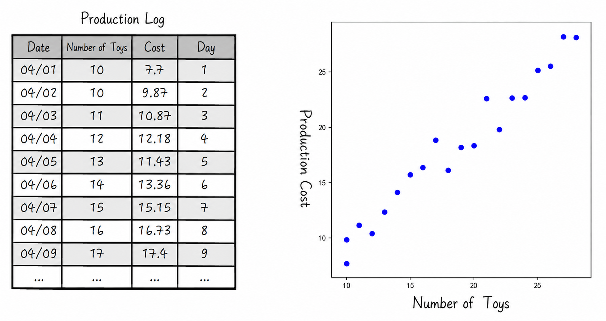
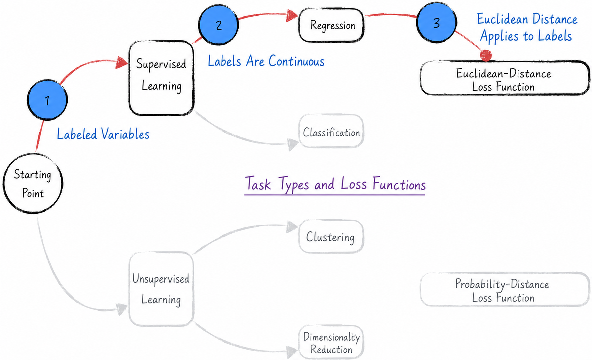
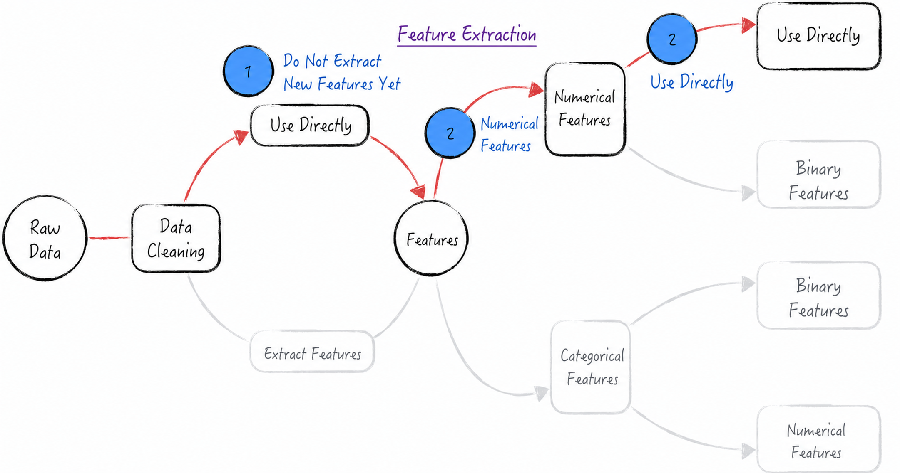
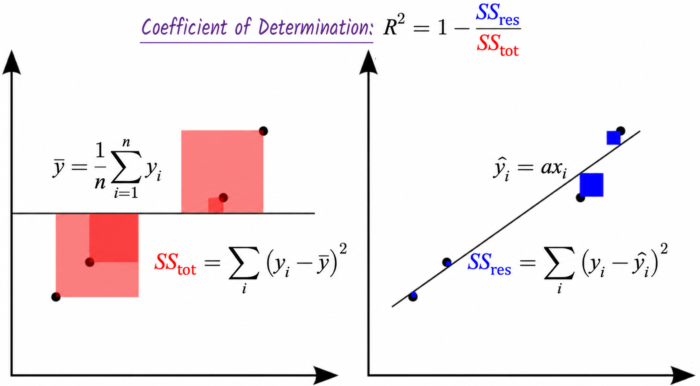
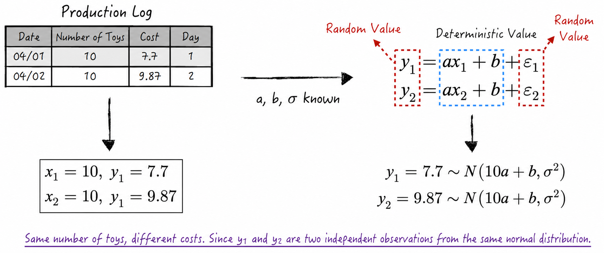
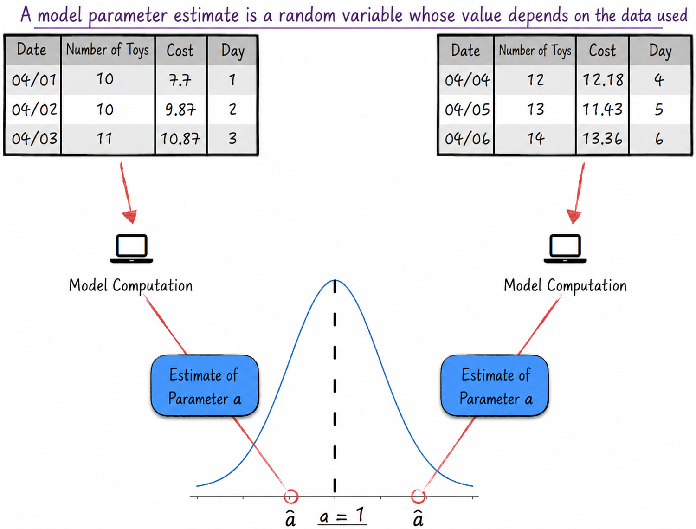
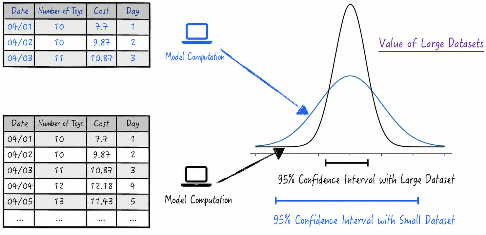

## 3.1 A Simple Example

We begin with a simple example that introduces the linear regression model. Suppose a factory manufactures dolls, with production data shown on the left side of Figure 3-1. The data contains two fields: the number of dolls and the production cost.

Intuitively, we might initially suspect a linear relationship between the number of dolls and the production cost. To understand the data more clearly, we need to visualize it, because a graphical presentation makes relationships among variables easier to see. Plotting the data in a Cartesian coordinate system reveals that the relationship between the number of dolls and production cost does not form a perfect straight line. Instead, the observations appear to fluctuate around a line, as shown on the right side of Figure 3-1. Given this visualization and our background knowledge, a linear regression model appears to be a reasonable choice. To develop a more comprehensive understanding of the model, we will approach this modeling problem in two different ways: machine learning and statistical analysis.

Before beginning the formal discussion of the model, let us “reveal” the formula that generated the data. The preceding data was in fact generated by Equation (3-1)[^approximation]. In a real modeling problem, we can never know the true law underlying the data. Knowing the correct answer in advance here, however, helps us evaluate model performance and assess the gains and losses of the modeling process.

$$
y_i=x_i+\varepsilon_i
\tag{3-1}
$$

Here, $x_i$ is the number of dolls produced on a given day, and $y_i$ is the production cost on that day. Equation (3-1) states that the average cost of manufacturing one doll is 1.

The $\varepsilon_i$ in the equation are random variables that follow a normal distribution with expected value 0 and variance 1. They represent random costs incurred while manufacturing dolls. If a defective doll is produced, for example, $\varepsilon_i$ is positive; if usable leftover fabric is found by chance, $\varepsilon_i$ is negative. These random costs are independent of the number of dolls produced.

### 3.1.1 The Machine-Learning Approach to Modeling

The steps by which machine learning solves a modeling problem can be summarized as follows: determine the modeling setting and define the loss function, extract features, select the model form, and evaluate model performance.

We begin by analyzing the modeling setting and loss function for the example above, as illustrated in Figure 3-2.

1. In the given dataset, $x_i$ is the number of dolls produced on day $i$, and $y_i$ is the production cost on that day. We need to predict cost from the number of dolls produced. The data therefore contains a label field—the target of the model's prediction—which is production cost. This is consequently a supervised-learning process.
2. The cost $y_i$ to be predicted is a continuous numerical value that represents changes in quantity rather than a discrete category. This is therefore a regression problem.
3. The modeling objective is to make the predicted cost as close as possible to the actual production cost. To achieve this, we first define model loss from the difference between the predicted and actual values. Suppose the actual cost is $y_i$ and the model predicts $\hat y_i$. Their difference defines a loss function $L=(1/n)\sum_{i=1}^{n}|y_i-\hat y_i|$. The modeling objective is thus abstracted as minimizing this loss function. Unfortunately, the function is not differentiable at certain points, making it mathematically difficult to handle. We can address this problem by redefining the loss function in a more mathematically tractable form[^loss-choice], as shown in Equation (3-2): the mean squared Euclidean distance between the true and predicted values.

$$
L=\frac{1}{n}\sum_{i=1}^{n}(y_i-\hat y_i)^2
\tag{3-2}
$$

Once the modeling framework has been established, we examine the available data and extract features for use in the model, as shown in Figure 3-3. In machine learning, this process is called feature engineering.

1. The data in this example is “clean,” meaning that it contains no errors or outliers, so the data-cleaning step can be omitted[^dirty-data]. The current dataset contains only one raw feature, $\mathbf X=\{x_i\}$, which represents quantity. Although mathematical transformations could generate new features from $\mathbf X$—for example, squaring it to produce $\mathbf X^2$—the initial model uses only the raw feature. New features can be considered later if the model performs poorly.
2. The raw feature $\mathbf X=\{x_i\}$ represents quantity and is therefore a numerical variable. Mathematical operations on this variable are meaningful, so $\mathbf X$ can be used directly in the model.

Selecting the model form is relatively straightforward in the present setting[^model-selection]. On the basis of the preceding analysis, we choose a linear regression model, defined in Equation (3-3). Here, $a$ is the variable cost of producing one doll, and $b$ is the fixed cost[^intercept].

$$
\hat y_i=ax_i+b
\tag{3-3}
$$

From the loss function and modeling principles defined above, we obtain an estimation formula for the model parameters: the estimates $(\hat a,\hat b)$ of parameters $(a,b)$ are the values that minimize the loss function $L$, as shown in Equation (3-4).

$$
(\hat a,\hat b)=\underset{a,b}{\operatorname{argmin}}\sum_{i=1}^{n}(y_i-ax_i-b)^2
\tag{3-4}
$$

At this point, we have effectively completed the machine-learning modeling task. The work is not yet finished, however, because we still need to understand how to evaluate model performance.

1. From a predictive perspective, we want the model's predictions to be as close as possible to the true costs. Equation (3-5) therefore defines the mean squared error (MSE) of the linear model. The mean squared error is simply the model's loss function: the smaller it is, the better the model predicts.

$$
\operatorname{MSE}=\frac{1}{n}\sum_{i=1}^{n}(y_i-\hat y_i)^2=L
\tag{3-5}
$$

2. From the perspective of interpreting the data, we want the model to explain as much of the variation in cost as possible. In other words, we want the unexplained cost $(y_i-\hat y_i)$ to be small relative to the total variation in cost $(y_i-\frac{1}{n}\sum_{i=1}^{n}y_i)$. Figure 3-4 therefore defines the model's **coefficient of determination**, $R^2$. The closer the coefficient is to 1, the better the model explains the data[^r-squared].

After completing the analysis above, we can use the third-party scikit-learn library to solve the problem. The implementation is discussed in detail in [Section 3.2.1](/books/deconstructing_LLM/chapter-3/3-2#section-3-2-1). Readers are advised to read [Section 3.2.1](/books/deconstructing_LLM/chapter-3/3-2#section-3-2-1) before proceeding to [Section 3.1.2](/books/deconstructing_LLM/chapter-3/3-1#section-3-1-2).

### 3.1.2 The Statistical-Analysis Approach to Modeling

The machine-learning modeling process is concise, but this concision also leaves something to be desired. Machine learning cannot fully explain the randomness observed in the data or how that randomness affects model results. These are precisely the questions at which statistical analysis excels. This section therefore examines in depth how statistical analysis constructs a linear regression model.

Following the usual procedure of statistical analysis, we first model the randomness in the data. The preceding analysis suggests a linear relationship between the independent variable $x_i$ and the dependent variable $y_i$, together with some random fluctuation. We can therefore assume that the relationship between $y_i$ and $x_i$ takes the form shown in Equation (3-6). The parameters $a$ and $b$ represent the variable cost and fixed cost, respectively, of producing a doll. The quantity $\varepsilon_i$ is called the noise term and represents random costs not captured by the available data. It follows a normal distribution with expected value 0 and variance $\sigma^2$, written as $\varepsilon_i\sim N(0,\sigma^2)$. It is especially important to note that $\sigma^2$ is also a model parameter.

In addition to the model equation, its construction makes two important assumptions[^endogeneity]: the $\varepsilon_i$ are mutually independent, and $\varepsilon_i$ is independent of $x_i$.

$$
y_i=ax_i+b+\varepsilon_i
\tag{3-6}
$$

Equation (3-6) states that $y_i$ is composed of $x_i$, $a$, $b$, and $\varepsilon_i$. Given values of the parameters $a$ and $b$ and of the noise variance $\sigma^2$, $x_i$ is a fixed quantity—the number of dolls—so $y_i$, like $\varepsilon_i$, is a random variable. It follows a normal distribution with expected value $ax_i+b$ and variance $\sigma^2$: $y_i\sim N(ax_i+b,\sigma^2)$. In other words, the observed $y_i$ in the data is only one observation from the normal distribution $N(ax_i+b,\sigma^2)$, as shown in Figure 3-5, and the $y_i$ are mutually independent. In mathematical language, the conditional probability distribution of $y_i$, given $a,b,x_i,\sigma^2$, is $N(ax_i+b,\sigma^2)$, as expressed in Equation (3-7).

$$
y_i\mid a,b,x_i,\sigma^2\sim N(ax_i+b,\sigma^2)
\tag{3-7}
$$

If the data itself consists of random variables, intuition tells us that the parameter estimates and predictions should also be random. This departure from conventional thinking may seem surprising, but it is one of the central ideas of statistical analysis. We will now confirm it through mathematical derivation.

From the preceding analysis, the $y_i$ are mutually independent. We therefore obtain the joint probability of observing $\mathbf Y$ shown in Equation (3-8), also called the model's **likelihood function** and usually denoted by $L$[^likelihood-notation].

$$
\begin{aligned}
P(\mathbf Y\mid a,b,\mathbf X,\sigma^2)
&=\prod_i P(y_i\mid a,b,x_i,\sigma^2)\\
\ln P(\mathbf Y\mid a,b,\mathbf X,\sigma^2)
&=-\frac{n}{2}\ln(2\pi\sigma^2)-\frac{1}{2\sigma^2}\sum_i(y_i-ax_i-b)^2
\end{aligned}
\tag{3-8}
$$

Different model parameters give different probabilities, or likelihoods, of observing the $y_i$. Clearly, we want this probability to be as large as possible. The method of calculating parameter estimates in this way is called **maximum likelihood estimation** (MLE). Maximizing Equation (3-8) gives the following estimation formulas.

$$
\begin{aligned}
(\hat a,\hat b)
&=\underset{a,b}{\operatorname{argmax}}\,P(\mathbf Y\mid a,b,\mathbf X,\sigma^2)
=\underset{a,b}{\operatorname{argmin}}\sum_i(y_i-ax_i-b)^2\\
\hat\sigma^2
&=\underset{a,b}{\operatorname{argmax}}\,P(\mathbf Y\mid a,b,\mathbf X,\sigma^2)
=\frac{\sum_{i=1}^{n}(y_i-\hat y_i)^2}{n}\\
\hat y_i&=\hat a x_i+\hat b
\end{aligned}
\tag{3-9}
$$

The parameter estimates $(\hat a,\hat b,\hat\sigma^2)$ obtained from Equation (3-9) are all random variables. Because the complete derivation is rather involved, the details are omitted from the main text[^matrix-proof]. Using $\hat a$ as an example, the following simplified derivation illustrates the point. Suppose the dataset contains only two observations, $(x_k,y_k)$ and $(x_l,y_l)$, with $x_k\ne x_l$. In this case, the system of equations in Equation (3-10) can be solved to obtain an expression for $\hat a$. Note that the right side of Equation (3-10) shows that $\hat a$ is a random variable that follows a normal distribution whose expected value is the true parameter $a$.

$$
\begin{cases}
y_k=\hat a x_k+\hat b\\
y_l=\hat a x_l+\hat b
\end{cases}
\Rightarrow
\hat a=\frac{y_k-y_l}{x_k-x_l}
=\frac{a(x_k-x_l)+\varepsilon_k-\varepsilon_l}{x_k-x_l}
=a+\frac{\varepsilon_k-\varepsilon_l}{x_k-x_l}
\tag{3-10}
$$

A more detailed mathematical derivation yields the exact distribution functions of the model parameters, as shown in Equation (3-11). According to Equation (3-9), the model's predictions are likewise linear combinations of its parameters and are therefore random variables. Compared with the parameter distributions, however, the distribution of the predictions is extremely complex, and deriving it is more like solving a difficult mathematical puzzle than developing an understanding of the model. The remainder of this chapter therefore focuses primarily on model parameters. When analyzing predictions, we will take a pragmatic approach and use algorithms provided by open-source tools directly, without dwelling on their underlying details.

$$
\begin{aligned}
\hat b&\sim N\left(b,\frac{\sigma^2}{n}\right)\\
\hat a&\sim N\left(a,\frac{\sigma^2}{\sum_i(x_i-\bar x)^2}\right)\\
\hat\sigma^2&\sim\chi_{n-2}^2\frac{\sigma^2}{n}
\end{aligned}
\tag{3-11}
$$

Because parameter estimates are themselves random variables, understanding the probability distributions they follow is more important than the particular values calculated by Equation (3-9). Those values are merely single observations from the corresponding distributions and are not equal to the true parameters. Moreover, specific parameter estimates depend heavily on the data used. As a simple example, Figure 3-6 shows that estimates based on the first three days differ from those based on days four through six.

Although the randomness of parameter estimates may create uncertainty, Equation (3-11) shows that their variance decreases as the amount of data increases. In other words, with more data, the parameter estimates move closer to their true values. This is one source of the value of big data: as the scale of the data grows, the accuracy of model predictions improves, as illustrated in Figure 3-7.

Although machine learning and statistical analysis differ in their mathematical calculations, a careful comparison of Equations (3-4) and (3-9) shows that the estimation formulas for parameters $a$ and $b$ are identical. The two approaches therefore produce similar results. What, then, is the value of the elaborate mathematical derivations in statistical analysis? How do parameter distribution functions help us understand the data? Two typical applications follow.

1. **Confidence intervals**: A parameter's probability distribution can be used to calculate its confidence interval—the approximate range in which its true value lies. Similarly, a confidence interval can be obtained for a model result, indicating the range of differences between the predicted and true values and giving us greater confidence in the result.
2. **Hypothesis testing**: Parameter distributions allow us to decide whether certain hypotheses can be accepted or rejected. At a 1% probability of error, for example, can we reject the hypothesis that the true value of parameter $b$ equals 0? Informally, is the probability that the true value of $b$ equals 0 less than 1%? This is a hypothesis test of parameter $b$ at the 99% significance level. Hypothesis testing helps us judge relationships in the data more effectively. If the hypothesis cannot be rejected, we should ask whether a fixed cost—the parameter $b$—truly exists, or whether the fixed-cost estimate $\hat b$ is merely an “incorrect” conclusion caused by model inaccuracy.

The code implementation of the analysis above relies on the third-party statsmodels library. Details are provided in [Section 3.2.2](/books/deconstructing_LLM/chapter-3/3-2#section-3-2-2).

[^approximation]: Strictly speaking, this equation is not rigorous. Because the support of the normal distribution is the entire real line, the equation allows $y_i$ to be negative, contradicting the fact that production cost must be greater than 0. A fully rigorous mathematical expression would be $y_i=\max(x_i+\varepsilon_i,0)$. In this example, however, the probability that $x_i+\varepsilon_i<0$ is extremely small and can be ignored. The model can therefore be approximated by Equation (3-1).
[^loss-choice]: For linear regression, the loss function defined by Equation (3-2) is not only easier to handle mathematically; it also implicitly imposes an assumption on the data—that the random disturbance term follows a normal distribution. In fact, the absolute-value loss mentioned in the main text and Equation (3-2) correspond to different linear regression models. Absolute-value loss corresponds to least absolute deviations regression, whereas Equation (3-2) corresponds to least squares regression.
[^dirty-data]: Real modeling problems often contain a great deal of “dirty data,” making data cleaning and preprocessing indispensable.
[^model-selection]: In an actual modeling process, model selection is a complex task involving many considerations, including the modeling setting, model characteristics, data scale, and available computational resources. It requires data scientists to possess a broad range of abilities through which they can fully demonstrate their value.
[^intercept]: In model terminology, the parameter $b$ in Equation (3-3) is called the intercept, one of the most important parameters in linear regression. Including it allows the model to remain stable under data translation and unit conversion. Under data translation—for example, if an earlier cost calculation omitted 1 yuan and must now be corrected, changing $y_i$ to $y_i+1$—the estimate of parameter $a$ remains unchanged. Under a unit conversion—for example, changing the unit of cost from yuan to hundreds of yuan, so that $y_i$ becomes $y_i/100$—parameter $a$ scales proportionally. In linear regression, especially multiple linear regression, the independent variables often have different units. Without parameter $b$, these two properties no longer hold, so an intercept is generally included when constructing a linear regression model.
[^r-squared]: Using the same notation as in the main text, minimizing the loss function gives $\sum_i y_i=\sum_i\hat y_i$. Let $SS_{tot}=\sum_i(y_i-\bar y)^2$ be the variance of the dependent variable and $SS_{reg}=\sum_i(\hat y_i-\bar y)^2$ the variance explained by the model. Then $R^2=SS_{reg}/SS_{tot}$. In academic language, the coefficient of determination is the proportion of the dependent variable's variance that can be explained by the independent variable. This metric can therefore be used to assess the model's explanatory power. Figure 3-4 is adapted from Wikipedia.
[^endogeneity]: If these assumptions do not hold, endogeneity may arise. Because space is limited, this book does not discuss the issue; interested readers are encouraged to consult other materials. Attentive readers may notice that machine learning calls the number of dolls a “feature,” whereas statistical analysis calls it an “independent variable.” Likewise, machine learning calls production cost a “label,” whereas statistical analysis calls it a “dependent variable.” These terms have the same meanings.
[^likelihood-notation]: In academic notation, $\theta$ usually represents all model parameters, such as $a,b,\sigma^2$ in this example, while $D$ represents the data. The parameter likelihood function is therefore written as $L(\theta\mid D)=P(D\mid\theta)$. Note that the right side of the equality denotes a conditional probability. Although the left side has a similar form, it does not denote a conditional probability.
[^matrix-proof]: A rigorous mathematical proof can express the linear regression model in matrix form: $\mathbf Y=\mathbf X\boldsymbol\beta+\boldsymbol\varepsilon$. The parameter estimate is $\hat{\boldsymbol\beta}=(\mathbf X^{\mathsf T}\mathbf X)^{-1}\mathbf X^{\mathsf T}\mathbf Y=\boldsymbol\beta+(\mathbf X^{\mathsf T}\mathbf X)^{-1}\mathbf X^{\mathsf T}\boldsymbol\varepsilon$. This expression shows that the model parameter estimates are random variables and follow normal distributions whose expected values are the true parameters. If two normally distributed random variables are independent, every linear combination of them is also normally distributed.
