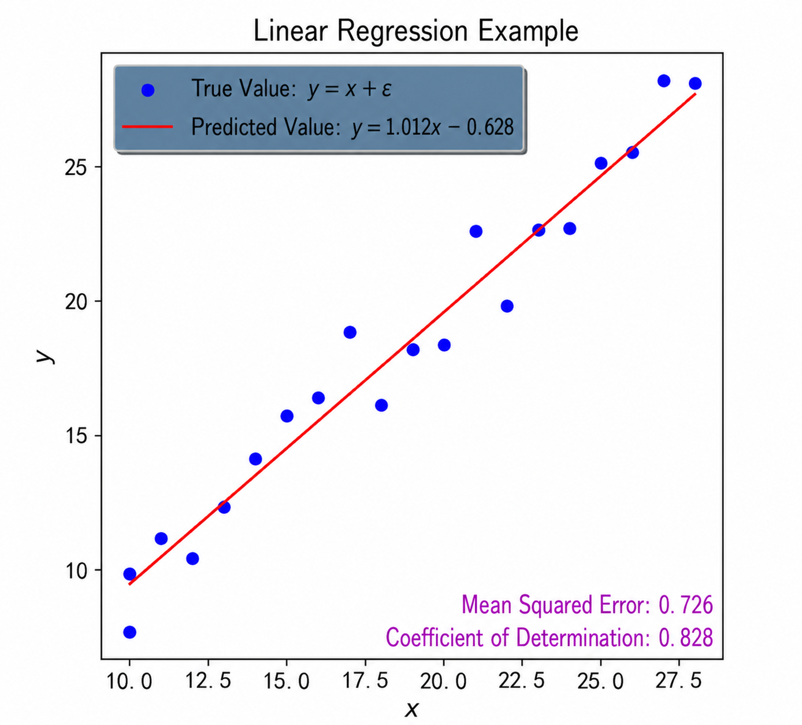
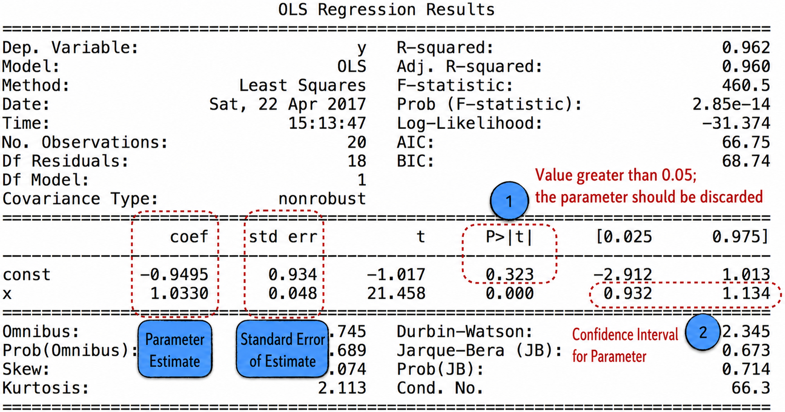
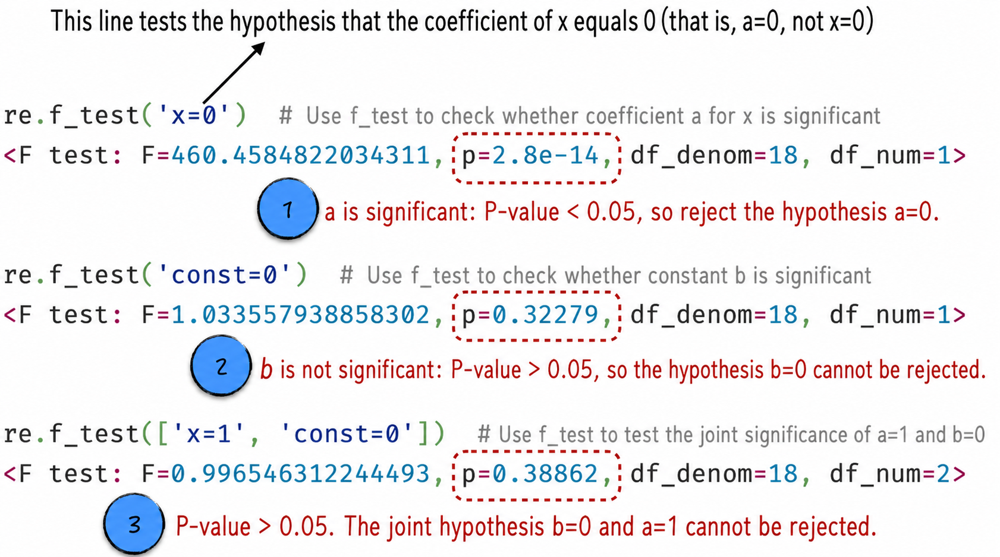
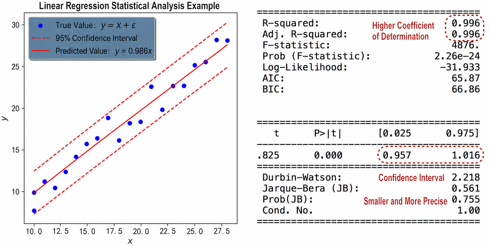

## 3.2 Model Implementation

This section implements the linear regression model with two open-source tools: scikit-learn and statsmodels. Both implementations are relatively straightforward. The scikit-learn version corresponds to the machine-learning approach to modeling, whereas the statsmodels version focuses more on statistical analysis. In addition to constructing the model, this section therefore emphasizes how to calculate confidence intervals and conduct hypothesis tests.

### 3.2.1 Machine-Learning Implementation

Building and training a linear regression model with scikit-learn is quite simple and consists mainly of three steps, as shown in Listing 3-1.

1. **Prepare the data**: Lines 6–8 divide the data into a training set and a test set. The purpose is to prevent the model from overfitting, as discussed in detail in [Section 3.3.1](/books/deconstructing_LLM/chapter-3/3-3#section-3-3-1).
2. **Build and train the model**: Line 11 constructs the model, and line 14 trains it. Note that once `model.fit` is called, it estimates the model parameters from the supplied data and modifies the corresponding `model` object. Thus, although line 14 contains no explicit assignment, `model` has been modified and now represents the trained model.
3. **Evaluate model performance**: The methods provided by scikit-learn make it easy to calculate the model's mean squared error and coefficient of determination, as shown in lines 17–20.

#### Listing 3-1 Linear Regression ([Complete Code](https://github.com/GenTang/regression2chatgpt/blob/en/ch03_linear/linear_ml.ipynb))

```python
import numpy as np
import pandas as pd
from sklearn import linear_model

# Divide the data into training and test sets
data = pd.read_csv('./data/simple_example.csv')
train_data = data[:15]
test_data = data[15:]

# Create a linear regression model
model = linear_model.LinearRegression()
# Train the model and estimate its parameters
features, labels = ['x'], ['y']
model.fit(train_data[features], train_data[labels])

# Mean squared error: smaller is better
error = model.predict(test_data[features]) - test_data[labels]
mse = np.mean(error.values ** 2)
# Coefficient of determination: closer to 1 is better
score = model.score(test_data[features], test_data[labels])
```

Visualizing the model results produces Figure 3-8. The visualization uses another common third-party library, matplotlib; see the accompanying code for implementation details.



- The machine-learning model is $\hat y_i=1.012x_i-0.628$. It estimates that the average cost of producing a doll is 1.012 and that the fixed cost is $-0.628$. The estimated average cost is close to the actual production cost of 1, but the estimated fixed cost is negative, which contradicts common sense.
- The model's mean squared error is estimated to be 0.726. This means that if the model is used to estimate total production cost, the average magnitude of the error is $\sqrt{0.726}\approx0.85$.
- The model's coefficient of determination is 0.828. This means that approximately 83% of the variation in cost can be explained by the model—that is, 83% of the cost arises from the doll-production process. This portion of the cost is controllable and has a clear linear relationship with the number produced, while the remaining 17% is currently unexplained random cost.

### 3.2.2 Statistical-Analysis Implementation

Statistics focuses on using models to analyze data and then progressively revising and improving the model in light of the analysis. The implementation in this section demonstrates that process. Specifically, we first use the third-party statsmodels library to construct the linear regression model assumed earlier, $y_i=ax_i+b+\varepsilon_i$. See Listing 3-2 for the implementation.

1. In statsmodels, a linear regression model is represented in matrix form. To introduce the parameter $b$, a constant value of 1 must therefore be added to the independent variables. As line 8 shows, the `add_constant` function performs this operation, and the new constant variable is named `const`.
2. Building and training the model is also straightforward, as shown in lines 11 and 12. Line 11 creates a linear regression model, and line 12 trains it by estimating its parameters.
3. For a trained model, the `summary` function can calculate the most commonly used statistical properties, while `f_test` can conduct hypothesis tests. See lines 14–24 for the code; the results are discussed in detail below.

#### Listing 3-2 Analyzing a Linear Regression Model ([Complete Code](https://github.com/GenTang/regression2chatgpt/blob/en/ch03_linear/linear_stat.ipynb))

```python
import statsmodels.api as sm

# Prepare the data
data = pd.read_csv('./data/simple_example.csv')
features, labels = ['x'], ['y']
Y = data[labels]
# Add a constant variable
X = sm.add_constant(data[features])

# Construct the model
model = sm.OLS(Y, X)
re = model.fit()

# Overall statistical-analysis results
print(re.summary())
# Use f_test to test whether coefficient a for x is significant
print('Test the hypothesis that the coefficient of x equals 0:')
print(re.f_test('x=0'))
# Use f_test to test whether constant b is significant
print('Test the hypothesis that the coefficient of const equals 0:')
print(re.f_test('const=0'))
# Use f_test to test the joint hypothesis a=1 and b=0
print('Test the joint hypothesis that the coefficient of x equals 1 and the coefficient of const equals 0:')
print(re.f_test(['x=1', 'const=0']))
```

We now analyze the resulting model in depth. Running line 15 of Listing 3-2 produces the output shown in Figure 3-9, which presents the parameter estimates and their corresponding statistics.



1. First consider label 1 in the figure. The estimated value of parameter $b$ is $-0.9495$, yet under the hypothesis $b=0$, its p-value is as high as 32.3%. In other words, based on the available data, although the estimate is $-0.9495$, the probability that the true value of $b$ is actually 0 is 32.3%[^p-value-wording]. We therefore regard parameter $b$ as insignificant. In statistics, a p-value below 5% is called significant, and one below 1% is called highly significant. The parameter should consequently be excluded from the model[^keep-intercept]. Similarly, the estimated value of parameter $a$ is 1.033, and its p-value rounds to 0 at three decimal places. In other words, the p-value is below 1%, so parameter $a$ is highly significant and should be included in the model. On the basis of this result, the model should be revised to

$$
y_i=ax_i+\varepsilon_i
\tag{3-12}
$$

2. Next consider label 2 in the figure. The interval formed by the two values is called the parameter's confidence interval, in this case with a confidence level of 95%. In other words, with 95% probability, the true value of parameter $a$ lies in the interval $[0.932,1.134]$, which contains the true value 1. Likewise, the 95% confidence interval of parameter $b$ is $[-2.912,1.013]$, which contains 0. This conclusion is consistent with the result that $b$ is insignificant, and the two can be proved mathematically equivalent. Thus, the significance of a parameter can be determined by whether its 95% confidence interval contains 0: if it does, the parameter is insignificant; if it does not, the parameter is significant.
3. In addition to the results shown in Figure 3-9, the `f_test` function can be used for hypothesis testing. For example, lines 18 and 21 of Listing 3-2 test the significance of parameters $a$ and $b$, respectively, while line 24 tests the joint hypothesis that $a=1$ and $b=0$. The results are shown in Figure 3-10[^tests].



Following the analysis above, revise the model according to Equation (3-12) and estimate its parameters again. Reconstructing the model is straightforward: when training it, simply supply data that does not contain the constant term. The result of the new model is shown in Figure 3-11. As noted earlier, the prediction of a linear regression model is itself a random variable, so a confidence interval can also be calculated for it. This can be done with the `wls_prediction_std` function provided by statsmodels. Although the predictions still deviate somewhat from the true values, every true value lies within the 95% confidence interval of the predictions, as shown on the left side of Figure 3-11. In practical applications, confidence intervals for model results can be used to determine the approximate range of unknown data or to identify observations outside the interval as anomalies.

The statistical analysis of the new model is shown on the right side of Figure 3-11. Compared with the old model in Figure 3-9, the new model has a larger coefficient of determination and a narrower confidence interval for parameter $a$. The new model is $y_i=0.986x_i+\tilde\varepsilon_i$, which is closer to the true model $y_i=x_i+\varepsilon_i$. In other words, statistical-analysis tools have enabled us to construct a more accurate model.



[^p-value-wording]: This statement is not mathematically rigorous. Strictly speaking, under the hypothesis that parameter $b$ equals 0, rejecting the hypothesis would carry a 32.3% probability of error. Such a philosophically intricate formulation is difficult to understand, however, so the main text uses an approximation. It sacrifices some precision, but not without reason.
[^keep-intercept]: In practical modeling, the constant term, or intercept, is usually retained even when its coefficient is insignificant. Doing so ensures that the model remains stable under data translation and unit conversion.
[^tests]: Readers may notice that the result marked by label 2 in Figure 3-10 is the same as that marked by label 1 in Figure 3-9. In fact, Figure 3-9 shows the result of a `t_test`, whereas Figure 3-10 shows the result of an `f_test`. Because space is limited, the definitions and differences between the two tests are not discussed. Note that `t_test` can test only a single hypothesis for a single variable, such as `const=0`; it cannot test multiple hypotheses involving multiple variables, such as `x=1` and `const=0` simultaneously. The `f_test` can perform both kinds of tests.
