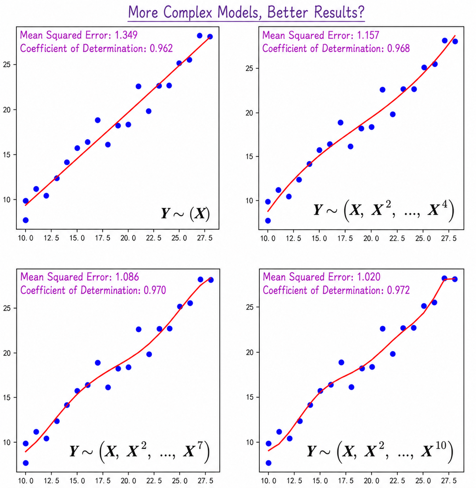
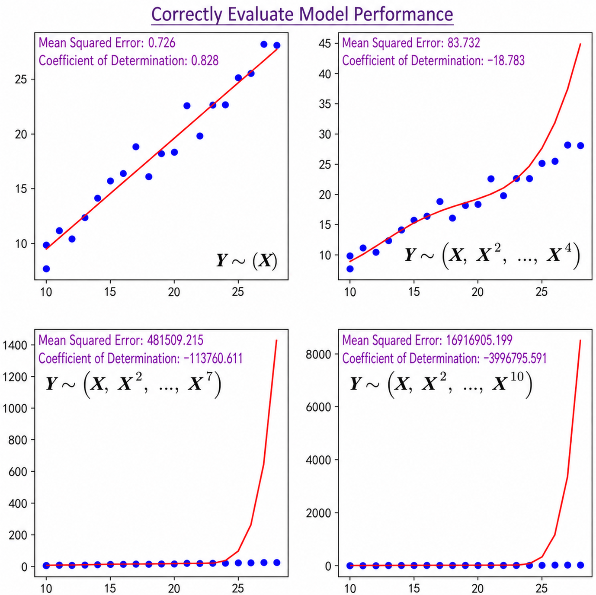
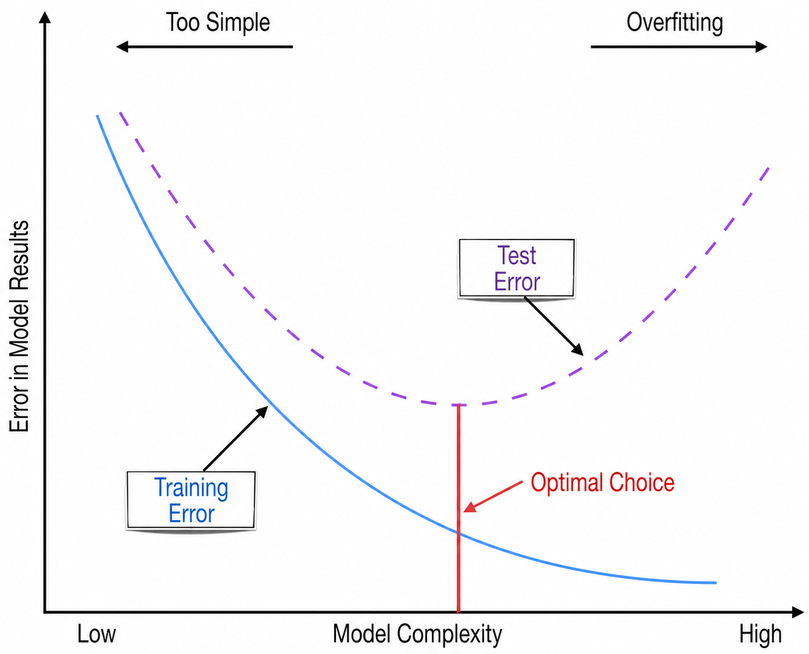
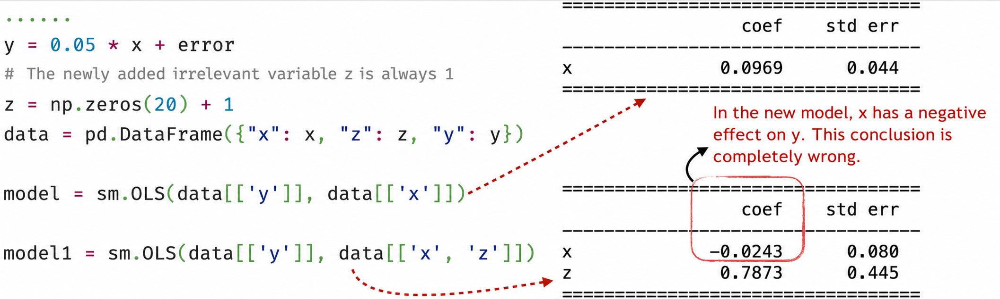
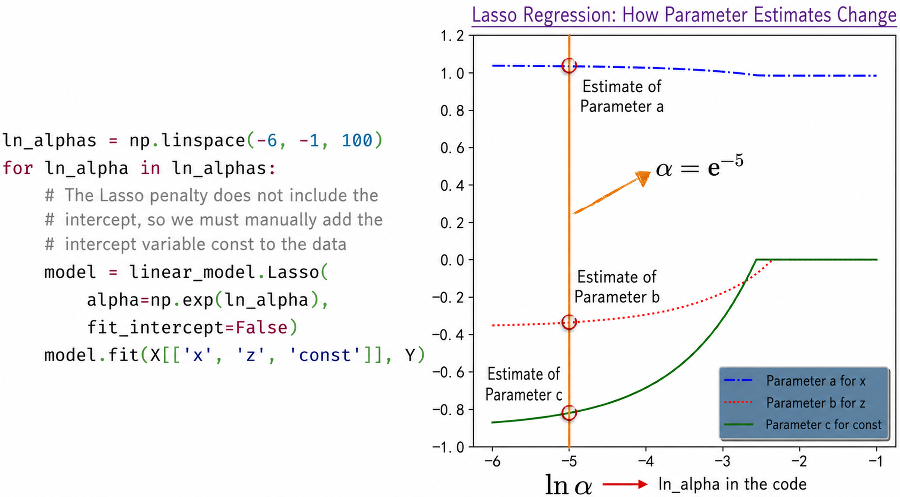
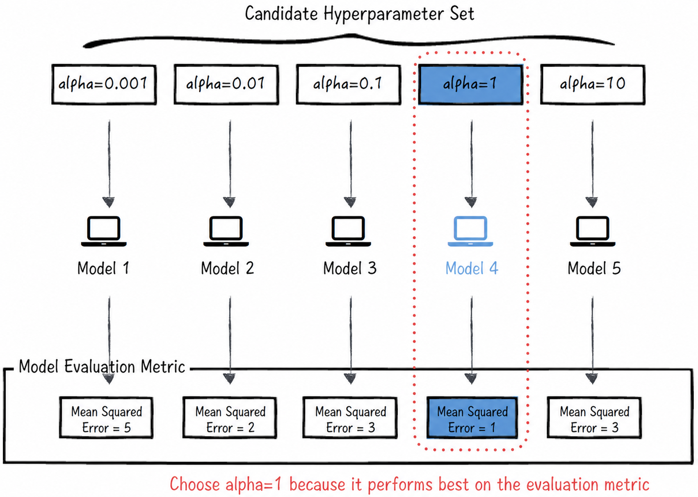
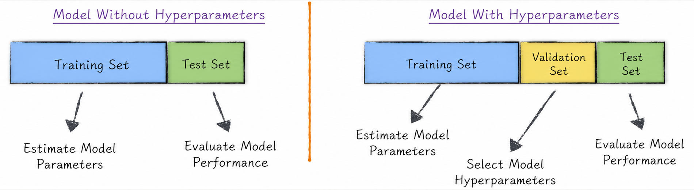

## 3.3 Model Pitfalls

In artificial-intelligence practice, models are generally built for two main purposes: first, to predict unknown data; and second, to analyze data, uncover its underlying patterns, and support decision-making. Work directed toward these two objectives commonly encounters the following two kinds of problems.

1. **Unstable model predictions**: While building a model, data scientists define various technical metrics to assess its predictive accuracy. For example, [Section 3.1.1](/books/deconstructing_LLM/chapter-3/3-1#section-3-1-1) defines metrics such as mean squared error and the coefficient of determination for linear regression. These metrics perform well on historical data, giving us confidence in the model. Yet when the model is actually used to predict unknown data, it may perform far worse than expected—sometimes even worse than random guessing. This means that its predictive performance is unstable.
2. **Unreliable parameter estimates**: In artificial intelligence, interpreting and understanding data is as important as making predictions. In the era of big data, as data-driven thinking has become widespread, corporate decisions increasingly rely on data analysis rather than solely on the personal experience of executives. Model parameter estimates, however, contain randomness. A parameter with a large estimation error may lead us to infer an incorrect relationship between an independent variable and the predicted outcome, seriously compromising the accuracy of the analysis. In [Section 3.2.1](/books/deconstructing_LLM/chapter-3/3-2#section-3-2-1), for example, the model produces a negative estimate of doll production cost, which is clearly inconsistent with reality.

These two problems arise for different reasons, and specific methods can be used to avoid them. Before examining those methods in depth, let us first explore the origins of the two problems, as illustrated in Figure 3-12.

To improve predictive accuracy during model construction, data scientists often derive additional features from known ones and use them to build more complex models. Particularly with the growing popularity of deep learning, people seem increasingly inclined to use complex models even in relatively simple situations. The more complex a model becomes, however, the more easily it falls into the trap of “misleading itself and reinforcing its biases,” which leads to overfitting. Once overfitting occurs, greater complexity makes the model's errors more pronounced. Its evaluation metrics may look excellent during training, yet its performance in real applications may be disappointing.

The era of big data has given us more variables than ever before, providing more choices for model construction. In modeling practice, data scientists search for new independent variables and incorporate them into the model. Yet model training is fundamentally a mathematical computation. Even if a completely irrelevant variable is introduced, the model will produce a corresponding parameter estimate, and that estimate will almost never be exactly 0. This causes what may be called a “model hallucination”: the model appears to reveal many relationships among variables, but those relationships do not actually exist and are merely numerical coincidences caused by random variation. Model hallucinations make analytical results unreliable, particularly analyses of model parameters. They not only estimate nonexistent effects as real; worse still, a newly introduced variable may distort an originally reasonable estimate into an incorrect one—for example, turning the estimated positive effect of an existing variable into a negative effect and changing the corresponding parameter estimate from positive to negative.

Overfitting and model hallucinations are not isolated problems. On the contrary, they often intertwine and reinforce each other, undermining a model's accuracy and reliability. Mature solutions to these problems already exist, and the following sections discuss them in detail.

### 3.3.1 Overfitting: Is a More Complex Model Always Better?

Although the original modeling data contains only one feature—the number of dolls, $\mathbf X=\{x_i\}$—we can derive multiple new features from it. One common approach is a polynomial transformation. Specifically, transform the original data $\mathbf X$ into a sequence of new features $(\mathbf X,\mathbf X^2,\dots,\mathbf X^n)$ and use them to construct the linear regression model in Equation (3-13). For subsequent discussion, we denote this model by $\mathbf Y\sim(\mathbf X,\mathbf X^2,\dots,\mathbf X^n)$.

$$
y_i=b+a_1x_i+a_2x_i^2+\cdots+a_nx_i^n
\tag{3-13}
$$

Figure 3-13 shows the model results ([complete code](https://github.com/GenTang/regression2chatgpt/blob/en/ch03_linear/linear_overfitting.ipynb)). According to the technical metrics in the figure, model performance appears to improve as the number of features increases.

The reality is different: the simplest model is actually closest to the true relationship. Why does this happen? There are two reasons.

- From a mathematical perspective, when a new variable is introduced, the original model becomes a special case of the new model in which the coefficient of the new variable is 0. For the same set of known data, the new model will therefore generally fit at least as well as the original model. Strong performance on known data, however, does not imply equally accurate predictions on unknown data.
- From a data perspective, models are usually trained on known historical data and then used to predict future, unknown data. The data on which the model will actually make predictions is therefore unavailable during training. In the example in Figure 3-13, however, all of the data is used to train the model, and the same data is then used to evaluate it. In other words, during training, the model has already seen the data used for evaluation. This is like asking the same data to serve as both “referee” and “athlete,” which is fundamentally inconsistent with the real situation.

These two factors lead us into the trap of overfitting: the model is distracted by random effects, ignores the true underlying pattern in the data, and ultimately reaches an incorrect conclusion.

A common way to evaluate a model properly is to separate the data used for training from the data used for evaluation. In other words, the evaluation data is not used during model training, allowing model performance to be estimated accurately. In practice, the data is therefore generally divided first into two parts: a **training set** and a **test set**. The training set is used to estimate the model parameters, and the test set is then used to evaluate model performance. In academia, this method is called **cross-validation**. Applying the same treatment to the models above produces the results in Figure 3-14. They are the exact opposite of those in Figure 3-13 and show that the simplest model actually performs best, which is the correct conclusion.

Addressing model overfitting is a common and crucial task in artificial intelligence. To understand and handle the problem more effectively, we can summarize the lessons of the example above and generalize them to a wider range of situations. In academic terminology, a model's error on the training set is called the training error, and its error on the test set is called the test error. Figure 3-15 shows how these errors relate to model complexity[^complexity]. The solid line represents training error, and the dashed line represents test error.

- When a model is too simple, both its training error and test error are large. This means that an overly simple model cannot capture complex relationships in the data.
- Conversely, when a model is too complex, its training error may be very small while its test error remains relatively large. This is overfitting. Overfitting is more dangerous than excessive simplicity because it is deceptive and can easily make a model appear to perform exceptionally well.

Either problem can produce poor performance. Model construction therefore requires an appropriate level of complexity that minimizes test error.

In practical modeling, model complexity is often influenced by model hallucinations, which tempt data scientists to add new features and make the model more complex. Statistics and machine learning offer different solutions to model hallucinations. The following sections discuss them in detail.

### 3.3.2 Hypothesis Testing: The Statistical Solution

Suppose a new weather variable $z_i$ can take two values, 0 and 1. The value $z_i=1$ indicates a sunny day, while $z_i=0$ indicates a day that is not sunny. Weather might affect the cost of manufacturing dolls: workers may be in a better mood on sunny days, for example, perhaps improving the precision of their work. Adding this variable to the model gives

$$
y_i=ax_i+bz_i+c+\varepsilon_i
\tag{3-14}
$$

In reality, however, this newly introduced variable is unrelated to production cost because it is generated randomly; see the code inside the dashed box in Figure 3-16 ([complete code](https://github.com/GenTang/regression2chatgpt/blob/en/ch03_linear/linear_illusion_ci.ipynb)). In other words, the true value of parameter $b$ in this model should be 0. The training results are nevertheless those shown in Figure 3-16. Although the true values of both $b$ and $c$ are 0, their estimates deviate substantially from 0. This is a typical “model hallucination.” If we relied only on the parameter estimates, we would mistakenly conclude that weather truly affects the cost of making dolls and might consequently recommend that the factory produce only on sunny days to reduce costs by approximately 36%. Such a recommendation would, of course, be entirely unfounded. Considering the variables' statistical significance reveals that insignificant variables should be excluded, preventing us from falling into the trap of model hallucination.

As noted earlier, introducing irrelevant variables can also distort estimates that were previously reasonably accurate. A simple example makes this intuitive. On the left side of Figure 3-17, the true relationship between variables $x$ and $y$ is $y_i=0.05x_i+\varepsilon_i$, where $\varepsilon_i$ follows the standard normal distribution. Now introduce a variable $z$ that is completely unrelated to $y$ and always equals 1. If only $x$ is used to model $y$, the result is close to the true model. If both $x$ and $z$ are used, however, the coefficient of $x$ changes from positive to negative. According to the new model, $y$ and $x$ are negatively correlated: as $x$ increases, $y$ decreases. This conclusion is clearly entirely wrong. As in the preceding example, statistical hypothesis tests and confidence intervals enable us to avoid these traps.

### 3.3.3 Penalty Terms: The Machine-Learning Solution

As discussed in [Section 3.1.1](/books/deconstructing_LLM/chapter-3/3-1#section-3-1-1), the core of machine-learning modeling is the definition of a loss function. After the weather variable is introduced, as described in [Section 3.3.2](/books/deconstructing_LLM/chapter-3/3-3#section-3-3-2), the model's loss function is

$$
L=\frac{1}{n}\sum_{i=1}^{n}(y_i-ax_i-bz_i-c)^2
\tag{3-15}
$$

The problem with model hallucinations is that coefficients whose true values should be 0, such as $b$ and $c$, receive estimates that are not close to 0. Because this defect arises from the mathematical form of the loss function, we want to introduce a mathematical effect that drives estimates toward 0 when their true values should be 0. Academia addresses this problem through a mechanism called a **penalty term**, or **regularization term**. Introducing an L1 penalty term, for example, rewrites the loss function as

$$
L=\frac{1}{n}\sum_{i=1}^{n}(y_i-ax_i-bz_i-c)^2+\alpha(|a|+|b|+|c|)
\tag{3-16}
$$

The newly added expression $(|a|+|b|+|c|)$ is the penalty term, and $\alpha$ is its weight. When $\alpha>0$, the penalty term increases with the absolute values of $a$, $b$, and $c$. Put simply, the farther the parameter estimates move from 0, the larger the penalty becomes. Thus, when estimating the parameters—that is, when searching for the minimum of $L$—the penalty forces the estimates toward 0. Estimates corresponding to irrelevant variables move toward 0 especially quickly.

A linear regression model with an L1 penalty is also known as Lasso regression. The model requires relatively little code to implement ([complete code](https://github.com/GenTang/regression2chatgpt/blob/en/ch03_linear/linear_illusion_reg.ipynb)), as shown on the left side of Figure 3-18. Note, however, that the loss function in scikit-learn's implementation differs slightly from Equation (3-16) in two main respects. First, the weight of the penalty term changes from $\alpha$ to $2\alpha$. Second, the penalty term does not include the intercept. The model construction must therefore be adjusted slightly[^implementation-difference].

The weight of the penalty term affects the parameter estimates. As the right side of Figure 3-18 shows, the estimates of $b$ and $c$ gradually approach 0 as $\alpha$ increases; the horizontal axis uses $\ln\alpha$. When $\alpha$ is relatively large—for example, when $\alpha=\mathrm e^{-2}$—the resulting parameter estimates are comparatively “correct.”

In addition to the L1 penalty, another common choice is the L2 penalty, the sum of the squares of the model parameters. The two penalties are hardly competing alternatives; in fact, they are often used together[^regularization-models]. Because space is limited, however, this chapter discusses only the L1 penalty.

The example above shows that the value of $\alpha$ affects the estimates of the model parameters $a$, $b$, and $c$, but $\alpha$ is not itself part of the model. The two types of quantities must therefore be distinguished. In academic terminology, $a$, $b$, and $c$ are called **parameters**, while $\alpha$ is called a **hyperparameter**. Hyperparameters are commonly divided into two categories: those such as $\alpha$ that adjust the model's structure, and those used in engineering implementation; see [Section 6.4](/books/deconstructing_LLM/chapter-6/6-4).

Parameters and hyperparameters are estimated in distinctly different ways. In general, parameter estimates are determined through optimization algorithms, as discussed in [Chapter 6](/books/deconstructing_LLM/chapter-6). Hyperparameter selection is more flexible and gives data scientists greater room for adjustment. In practice, hyperparameters are often selected through **grid search**. This method begins by specifying a sequence of possible hyperparameter values, based on the data scientist's preferences and experience, to form a candidate set. It then iterates through these values, evaluates the performance of the corresponding models, and selects the best-performing hyperparameter. For the model above, the complete process is shown in Figure 3-19.

[Section 3.3.1](/books/deconstructing_LLM/chapter-3/3-3#section-3-3-1) introduced cross-validation as a method for preventing overfitting. It divides the data into two parts: a training set and a test set. The training set estimates the model parameters, and the test set evaluates model performance. Once hyperparameters are introduced, however, this approach is no longer appropriate. If the data were still divided only into training and test sets, the training set would estimate the parameters and model performance on the test set would then be used to select the hyperparameters. In other words, the test set originally intended for model evaluation would be misused to select hyperparameters. The supposedly isolated test data would become partially visible during model training, causing performance to be overestimated and leading to overfitting.

To avoid this problem, the test data must remain invisible during hyperparameter selection. The data is therefore divided into three parts: a **training set**, a **validation set**, and a **test set**. The training set estimates model parameters, the validation set selects model hyperparameters, and the test set evaluates final model performance. The complete process is shown in Figure 3-20.

### 3.3.4 Comparing the Two Solutions

Hypothesis testing and the introduction of penalty terms are both effective solutions to model hallucinations. Each, however, has significant advantages and disadvantages.

- Hypothesis testing is mathematically more rigorous and supported by a substantial body of theory. It can completely eliminate interference from irrelevant variables. As the preceding examples show, however, it requires considerable human intervention and cannot be fully automated. It also has an important limitation: it is effective only for a few simple models. For complex models such as neural networks, hypothesis testing has almost no room to operate because the distributions of their parameters are too difficult to analyze.
- Introducing a penalty term, by contrast, is a more automated solution and applies to almost any model. Its disadvantage is the lack of a solid theoretical foundation, which makes the results less interpretable and the method difficult to explain to nontechnical audiences in plain language.

In practical applications, hypothesis testing may be more appropriate when the objective is to model and analyze data, because its analytical process provides a better understanding of the relationships among variables. Penalty terms are more appropriate when the objective is prediction or when a model is engineered to trigger and learn automatically.

[^complexity]: Model complexity depends not only on structural complexity but also on the number of features used. In this example, even a structurally simple linear regression model can become excessively complex when more features are added.
[^implementation-difference]: Different open-source tools may differ slightly in their model definitions and implementations. Reading the relevant documentation carefully before using these tools is therefore essential for avoiding discrepancies.
[^regularization-models]: A model with an L1 penalty is academically known as Lasso regression. A linear regression model with an L2-norm penalty is known as Ridge regression. A model that uses both L1 and L2 penalties is called ElasticNet regression. The differences among these regression methods are not discussed in detail here. Lasso regression is more likely to produce a sparse solution, in which only a small number of model parameters are nonzero, whereas Ridge regression tends to produce parameter estimates that are close to, but not exactly, 0.
