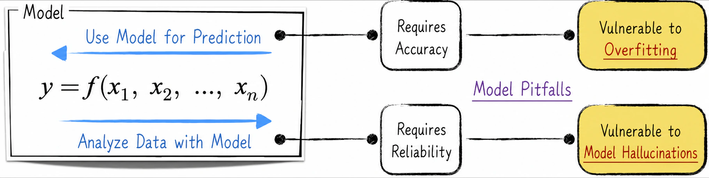
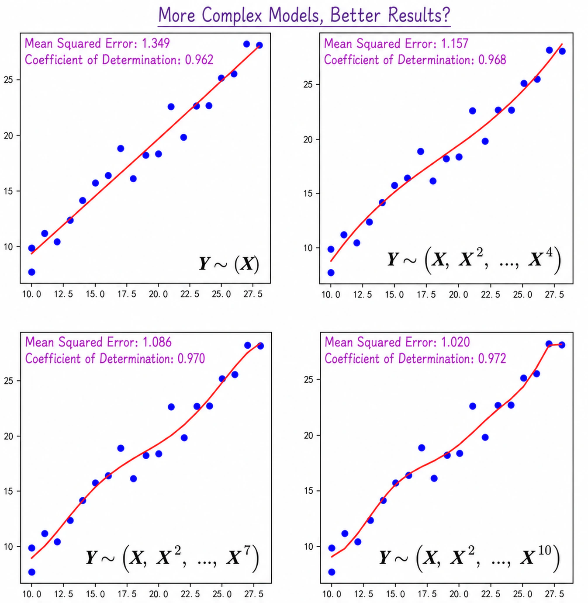
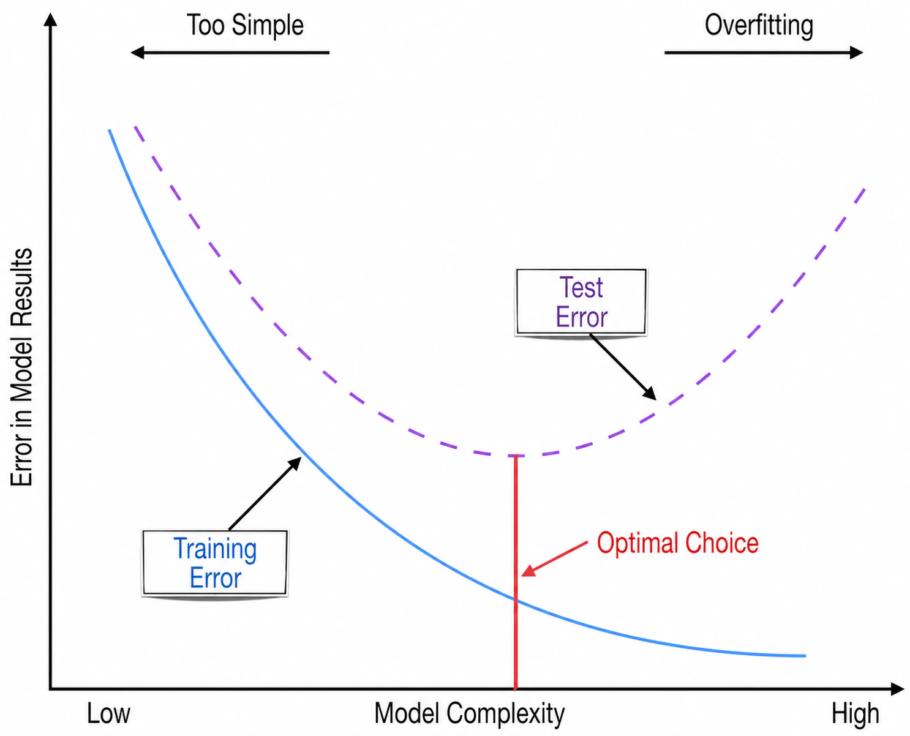
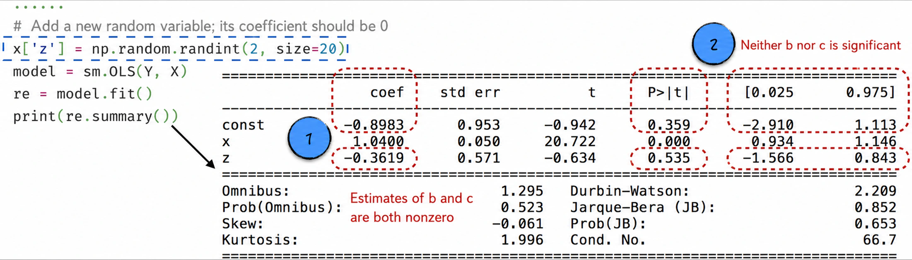
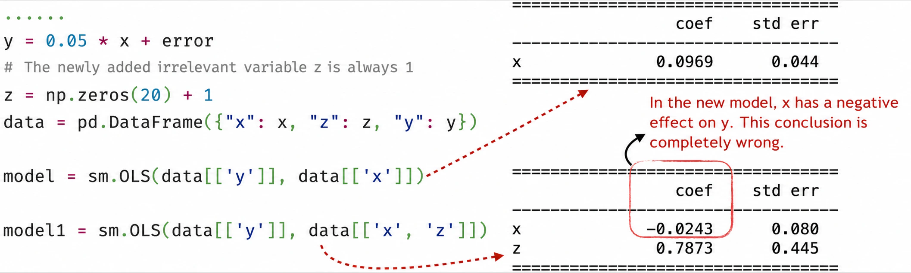
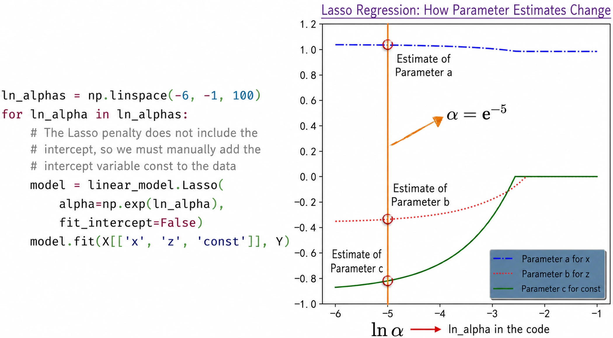
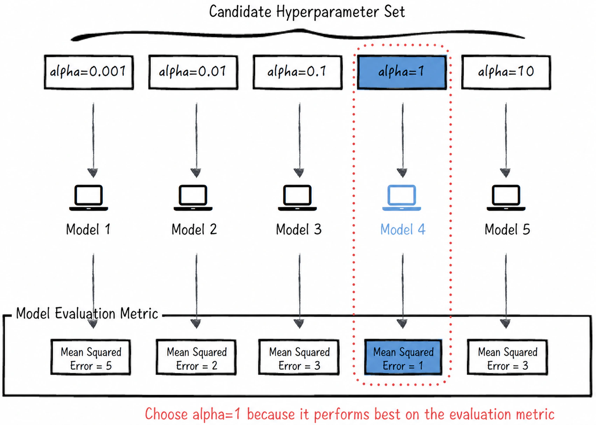

## 3.3 Model Pitfalls

In applied AI, models are generally built for two main purposes: to make predictions for unseen data, and to analyze data, uncover underlying patterns, and support decision-making. In pursuing these objectives, practitioners commonly encounter two kinds of problems.

1. **Unstable model predictions**: During model development, data scientists define various metrics to assess predictive accuracy. For example, [Section 3.1.1](/books/deconstructing_LLM/chapter-3/3-1#section-3-1-1) introduced mean squared error and the coefficient of determination for linear regression. A model may score well on these metrics when evaluated on historical data, giving us confidence in its performance. Yet when used to make predictions for unseen data, it may perform far worse than expected—sometimes even worse than random guessing. Its predictive performance is therefore unstable.
2. **Unreliable parameter estimates**: Interpreting and understanding data is as important in AI as making predictions. In the era of big data, as data-driven thinking has become widespread, corporate decisions increasingly rely on data analysis rather than solely on the personal experience of executives. Parameter estimates, however, vary from sample to sample. A large estimation error may lead us to infer an incorrect relationship between an independent variable and the outcome, seriously compromising the analysis. In [Section 3.2.1](/books/deconstructing_LLM/chapter-3/3-2#section-3-2-1), for example, the model produces a negative estimate of the fixed production cost, which is clearly inconsistent with reality.

These two problems have different causes and call for different remedies. Before examining those remedies, let us first consider where the problems come from, as illustrated in Figure 3-12.

To improve predictive accuracy, data scientists often derive additional features from existing ones and use them to build more complex models. With the growing popularity of deep learning in particular, practitioners seem increasingly inclined to use complex models even for relatively simple problems. As complexity increases, however, a model becomes more prone to “misleading itself and reinforcing its biases,” leading to overfitting. Once overfitting sets in, additional complexity can make the model's errors even more pronounced. Its evaluation metrics may look excellent during training, yet its performance in real applications may be disappointing.

The era of big data has given us more variables than ever before, providing more choices for model construction. In modeling practice, data scientists search for new independent variables and incorporate them into the model. Yet model training is fundamentally a mathematical computation. Even if a completely irrelevant variable is introduced, the model will produce a corresponding parameter estimate, and that estimate will almost never be exactly 0. This produces spurious associations, referred to metaphorically in this book as “model hallucinations”: the model appears to reveal many relationships among variables, but those relationships do not actually exist and are merely numerical coincidences caused by random variation. Model hallucinations make analytical results unreliable, particularly analyses of model parameters. They not only make nonexistent effects appear real; worse still, a newly introduced variable may distort an originally reasonable estimate into an incorrect one—for example, turning the estimated positive effect of an existing variable into a negative effect and changing the corresponding parameter estimate from positive to negative.

Overfitting and model hallucinations are not isolated problems. They often interact and reinforce each other, undermining a model's accuracy and reliability. Well-established approaches to these problems are available, and the following sections examine them in detail.

### 3.3.1 Overfitting: Is a More Complex Model Always Better?

Although the original dataset contains only one feature—the number of dolls, $\mathbf X=\{x_i\}$—we can derive several new features from it. A common technique is polynomial feature expansion: transform $\mathbf X$ into $(\mathbf X,\mathbf X^2,\dots,\mathbf X^n)$ and use these features to construct the linear regression model in Equation (3-13). In the discussion that follows, we denote this model by $\mathbf Y\sim(\mathbf X,\mathbf X^2,\dots,\mathbf X^n)$.

$$
y_i=b+a_1x_i+a_2x_i^2+\cdots+a_nx_i^n
\tag{3-13}
$$

Figure 3-13 shows the model results ([Complete Code](https://github.com/GenTang/regression2chatgpt/blob/en/ch03_linear/linear_overfitting.ipynb)). According to the evaluation metrics in the figure, performance appears to improve as the number of features increases.

This conclusion is misleading: the simplest model is actually closest to the true relationship. There are two reasons.

- From a mathematical perspective, when a new variable is introduced, the original model becomes a special case of the new model in which the coefficient of the new variable is 0. On the same training data, the new model will therefore generally fit at least as well as the original model. A strong fit to the training data, however, does not imply equally accurate predictions for unseen data.
- From a data perspective, models are usually trained on historical data and then used to predict future, unseen data. The data on which the model will ultimately make predictions is therefore unavailable during training. In Figure 3-13, however, all the data is used both to train and to evaluate the model. The model has already seen its evaluation data during training. This is like asking the same data to serve as both “referee” and “athlete,” which bears little resemblance to how the model will be used in practice.

Together, these two factors lead to overfitting: the model fits random fluctuations rather than the true underlying pattern and ultimately reaches the wrong conclusion.

A common way to evaluate a model properly is to separate the data used for training from the data used for evaluation. In other words, the evaluation data is not used during model training, allowing model performance to be estimated accurately. In practice, the data is therefore generally divided first into two parts: a **training set** and a **test set**. The training set is used to estimate the model parameters, and the test set is then used to evaluate model performance. In academia, this method is called **cross-validation**. Applying the same treatment to the models above produces the results in Figure 3-14. They are the exact opposite of those in Figure 3-13 and show that the simplest model actually performs best, which is the correct conclusion.

Addressing overfitting is a routine but crucial part of building AI systems. The example above can be generalized to a wider range of settings. A model's error on the training set is called its **training error**, and its error on the test set is called its **test error**. Figure 3-15 shows how these errors relate to model complexity[^complexity]. The solid line represents training error, and the dashed line represents test error.

- When a model is too simple, both its training error and test error are large. This means that an overly simple model cannot capture complex relationships in the data.
- Conversely, when a model is too complex, its training error may be very small while its test error remains relatively large. This is overfitting. Overfitting is more dangerous than excessive simplicity because it is deceptive and can easily make a model appear to perform exceptionally well.

Both extremes can produce poor performance. We therefore seek an appropriate level of model complexity that minimizes test error.

In practice, model hallucinations may tempt data scientists to add new features, thereby increasing model complexity. Statistics and machine learning offer different approaches to this problem, as the following sections explain.

### 3.3.2 Hypothesis Testing: The Statistical Solution

Suppose a new weather variable $z_i$ can take the values 0 and 1. The value $z_i=1$ indicates a sunny day, while $z_i=0$ indicates otherwise. Weather might affect the cost of manufacturing dolls: workers may be in a better mood on sunny days, for example, perhaps improving the precision of their work. Adding this variable to the model gives

$$
y_i=ax_i+bz_i+c+\varepsilon_i
\tag{3-14}
$$

In reality, however, this newly introduced variable is unrelated to production cost because it is generated randomly; see the code inside the dashed box in Figure 3-16 ([Complete Code](https://github.com/GenTang/regression2chatgpt/blob/en/ch03_linear/linear_illusion_ci.ipynb)). In other words, the true value of parameter $b$ in this model should be 0. The training results are nevertheless those shown in Figure 3-16. Although the true values of both $b$ and $c$ are 0, their estimates deviate substantially from 0. This is a typical “model hallucination.” If we relied only on the parameter estimates, we would mistakenly conclude that weather truly affects the cost of making dolls and might consequently recommend that the factory produce only on sunny days to reduce costs by approximately 36%. Such a recommendation would, of course, be entirely unfounded. Examining the variables' statistical significance, however, indicates that insignificant variables should be excluded and helps us avoid the trap of model hallucination.

As noted earlier, introducing irrelevant variables can also distort estimates that were previously reasonably accurate. The following example illustrates this effect. On the left side of Figure 3-17, the true relationship between $x$ and $y$ is $y_i=0.05x_i+\varepsilon_i$, where $\varepsilon_i$ follows a standard normal distribution. Now introduce a constant variable $z$ that always equals 1. In this model, it acts as an intercept whose true coefficient is 0. Modeling $y$ with $x$ alone produces a result close to the true model. When both $x$ and $z$ are used, however, the coefficient of $x$ changes from positive to negative. The new model therefore indicates a negative relationship between $y$ and $x$: as $x$ increases, $y$ decreases. This conclusion is clearly wrong. As in the preceding example, statistical hypothesis tests and confidence intervals enable us to avoid these traps.

### 3.3.3 Penalty Terms: The Machine-Learning Solution

As discussed in [Section 3.1.1](/books/deconstructing_LLM/chapter-3/3-1#section-3-1-1), a central step in machine-learning modeling is defining the loss function. After introducing the weather variable from [Section 3.3.2](/books/deconstructing_LLM/chapter-3/3-3#section-3-3-2), the loss function becomes

$$
L=\frac{1}{n}\sum_{i=1}^{n}(y_i-ax_i-bz_i-c)^2
\tag{3-15}
$$

The problem with model hallucinations is that coefficients whose true values should be 0, such as $b$ and $c$, may receive estimates far from 0. Because this behavior arises from the mathematical form of the loss function, we introduce an additional term that encourages such estimates to approach 0. This term is called a **penalty term**, or **regularization term**. Adding an L1 penalty, for example, changes the loss function to

$$
L=\frac{1}{n}\sum_{i=1}^{n}(y_i-ax_i-bz_i-c)^2+\alpha(|a|+|b|+|c|)
\tag{3-16}
$$

The newly added expression $(|a|+|b|+|c|)$ is the penalty term, and $\alpha$ is its weight. When $\alpha>0$, the penalty term increases with the absolute values of $a$, $b$, and $c$. Put simply, the farther the parameter estimates move from 0, the larger the penalty becomes. Thus, when estimating the parameters—that is, when searching for the minimum of $L$—the penalty forces the estimates toward 0. An L1 penalty can also shrink some coefficient estimates exactly to 0, producing a sparse model.

A linear regression model with an L1 penalty is known as Lasso regression. It requires relatively little code to implement ([Complete Code](https://github.com/GenTang/regression2chatgpt/blob/en/ch03_linear/linear_illusion_reg.ipynb)), as shown on the left side of Figure 3-18. Note, however, that the loss function implemented by scikit-learn differs from Equation (3-16) in two respects. First, the weight of the penalty changes from $\alpha$ to $2\alpha$. Second, the penalty excludes the intercept. The implementation must account for these differences[^implementation-difference].

The weight of the penalty affects the parameter estimates. As the right side of Figure 3-18 shows, the estimates of $b$ and $c$ gradually approach 0 as $\alpha$ increases; $\ln\alpha$ is plotted on the horizontal axis. When $\alpha$ is relatively large—for example, when $\alpha=\mathrm e^{-2}$—the resulting parameter estimates are comparatively “correct.”

In addition to the L1 penalty, another common choice is the L2 penalty, the sum of the squares of the model parameters. The two penalties can be used separately or combined[^regularization-models]. Because space is limited, however, this chapter discusses only the L1 penalty.

The example above shows that $\alpha$ affects the estimates of the model parameters $a$, $b$, and $c$, but is not itself a coefficient learned by the same optimization process. The two types of quantities must therefore be distinguished. In standard terminology, $a$, $b$, and $c$ are **parameters**, whereas $\alpha$ is a **hyperparameter**. Hyperparameters commonly fall into two categories: model-related hyperparameters such as $\alpha$, and implementation-related hyperparameters; see [Section 6.4](/books/deconstructing_LLM/chapter-6/6-4).

Model parameters are estimated, whereas hyperparameters are selected or tuned. Parameter estimates are generally obtained through optimization algorithms, as discussed in [Chapter 6](/books/deconstructing_LLM/chapter-6). Hyperparameter selection is more flexible and gives data scientists greater room for adjustment. In practice, hyperparameters are often selected through **grid search**. This method begins by specifying a set of candidate values based on the data scientist's experience and judgment. It then evaluates the model at each candidate value and selects the best-performing one. Figure 3-19 shows the complete process for the model above.

[Section 3.3.1](/books/deconstructing_LLM/chapter-3/3-3#section-3-3-1) introduced cross-validation as a method for preventing overfitting. It divides the data into two parts: a training set and a test set. The training set estimates the model parameters, and the test set evaluates model performance. Once hyperparameters are introduced, however, this approach is no longer appropriate. If the data were still divided only into training and test sets, the training set would estimate the parameters and model performance on the test set would then be used to select the hyperparameters. In other words, the test set originally intended for model evaluation would be misused to select hyperparameters. The supposedly isolated test data would become partially visible during model training, causing performance to be overestimated and leading to overfitting.

To avoid this problem, the test data must remain invisible during hyperparameter selection. The data is therefore divided into three parts: a **training set**, a **validation set**, and a **test set**. The training set estimates model parameters, the validation set selects model hyperparameters, and the test set evaluates final model performance. The complete process is shown in Figure 3-20.

### 3.3.4 Comparing the Two Solutions

Hypothesis testing and regularization are both effective ways to address model hallucinations, but each has distinct advantages and disadvantages.

- Hypothesis testing is mathematically rigorous and supported by a substantial body of theory. It can help identify irrelevant variables, but it cannot guarantee that their influence will be completely eliminated. As the preceding examples show, it also requires considerable human judgment and cannot be fully automated. Another important limitation is that it is practical only for a small set of simple models. For complex models such as neural networks, hypothesis testing is far less tractable because their parameter distributions are difficult to analyze.
- Regularization, by contrast, is more readily automated and applies to almost any model. Its disadvantage is that the coefficients are shrunk, making statistical inference and direct interpretation less straightforward than in ordinary linear regression. This can make the method difficult to explain to a nontechnical audience.

In practice, hypothesis testing may be more appropriate when the objective is to model and analyze data, because it can provide greater insight into relationships among variables. Regularization may be more appropriate when the primary objective is prediction or when the model is deployed in an automated training and inference pipeline.

[^complexity]: Model complexity depends not only on the model's structure but also on the number of features it uses. In this example, even a structurally simple linear regression model can become excessively complex as features are added.
[^implementation-difference]: Open-source tools may differ slightly in how they define and implement a model. Reading the relevant documentation carefully before using a tool is therefore essential to avoid unexpected discrepancies.
[^regularization-models]: A model with an L1 penalty is known as Lasso regression. A linear regression model with an L2-norm penalty is known as Ridge regression. A model that combines L1 and L2 penalties is called Elastic Net regression. The differences among these methods are not discussed in detail here. Lasso is more likely to produce a sparse solution, in which only a small number of parameters are nonzero, whereas Ridge tends to produce estimates that are close to, but not exactly, 0.
