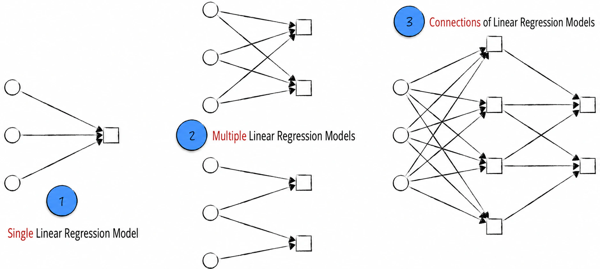
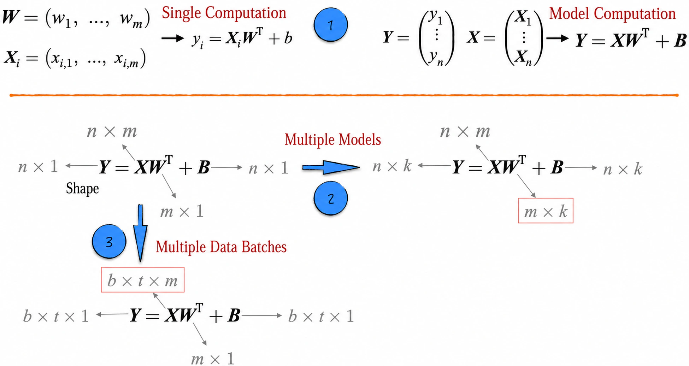
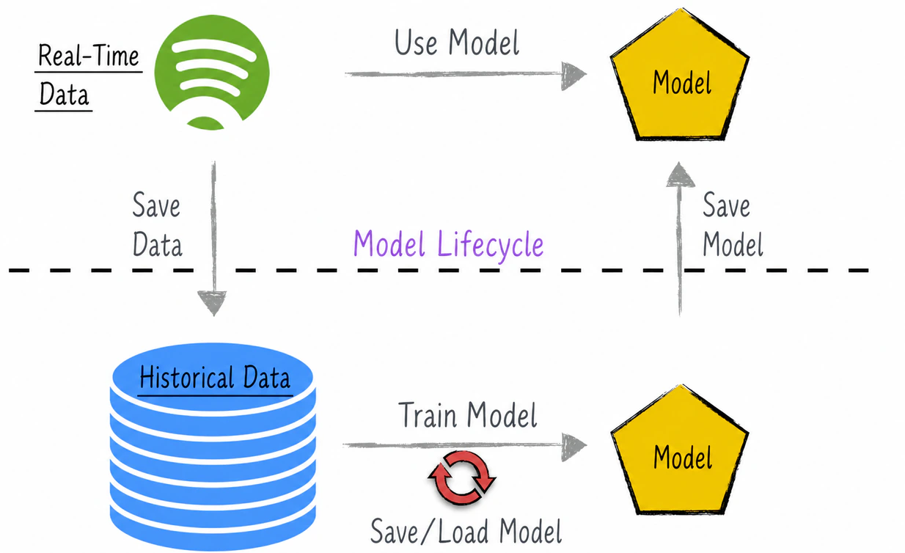

## 3.4 Preparing for What Comes Next

In artificial intelligence, linear regression can be used independently to model data, which has been the focus of the preceding sections. More commonly, however, it serves as a “model skeleton” on which more complex models, such as deep neural networks, are built. To understand complex models more effectively, we need an efficient and clear way to express their linear components. This section lays the necessary groundwork, beginning with graphical and mathematical representations of linear regression models.

As the preceding discussion has shown, even a simple linear regression model requires some care to construct and train. The models introduced later will be more complex, take longer to build and train, and require substantial computational resources. Once training is complete, we therefore want to preserve the trained model for future use, much as we save an ordinary program. This process involves model persistence and lifecycle management, the other topic covered in this section.

### 3.4.1 Graphical and Mathematical Representations

The preceding sections have used equations such as $y=ax+b$ to describe linear regression models. This representation helps beginners understand the model without confronting complex mathematical expressions at the outset, but it is cumbersome and inefficient even for the simplest individual linear regression model. Efficient mathematical representation becomes especially important for complex models, which may contain thousands of linear models. It not only helps us understand model structure in depth but also provides more convenient analytical tools for working with complex problems. We will therefore introduce graphical representations of linear models and show how matrix operations—or, more generally, tensor operations—can represent large numbers of linear regression models.

- Label 1 in Figure 3-21 shows a graphical representation of a linear model commonly used in practice. Circles, arrows, and boxes represent different elements of the model: circles represent features, or independent variables; arrows represent the products of weights and features; and boxes represent summation and the intercept term.
- When the same set of variables is used to construct multiple linear regression models, the corresponding diagram is shown by label 2. What if different linear models use different variables? The solution is simple: combine all the variables being used. If a model does not use a particular variable, remove the corresponding arrow, as shown in the lower half of label 2.
- Note that there is no essential distinction between the circles and boxes in the figure, because the input to a linear regression model can also be the output of another model. As label 3 shows, linear models can be connected. Attentive readers may immediately notice, however, that this form of connection has limited usefulness, because the composition of multiple linear regression models is still a linear regression model[^linear-composition].

Graphical representations describe linear models from a logical perspective: they show the number of features but not the number of data points. We now examine how tensor operations describe a model from a computational perspective. When a linear model is applied to a single data point, row vectors represent the features and model parameters. The model computation is then expressed as vector multiplication, with row-vector shape $(1,m)$. Extending this representation to $n$ data points, a tensor of shape $(n,m)$ represents the data. As label 1 in Figure 3-22 shows, the model computation for multiple data points can be expressed concisely as a single tensor multiplication.

For $k$ models, the tensor of model parameters can be represented with shape $(k,m)$. This clearly expresses the computations of multiple models over multiple data points, as shown by label 2 in Figure 3-22. Additional tensor dimensions can also be introduced as needed. In label 3 of Figure 3-22, for example, if the model input is divided into multiple batches, the data can be represented by a tensor of shape $(b,t,m)$. The size $b$ of the first dimension is the number of batches, and the size $t$ of the second dimension is the amount of data in each batch. Model parameters can be handled similarly.

Linear models correspond directly to tensor matrix multiplication. Whenever tensor matrix multiplication appears in the mathematical representation of a complex model, we should understand that this part of the model is effectively using a linear regression model.

### 3.4.2 Model Lifecycle and Persistence

The model lifecycle has two clearly distinct stages: training and use. In a data-modeling project, historical data is usually stored in an offline data system. We use this data to construct and train a model, then save the trained model[^checkpoint]. When new data arrives—for example, from a production system in real time—the saved model is used to generate predictions or perform analysis. The new data is then stored as historical data and incorporated into the offline system. As data accumulates over time, the model is retrained and redeployed as needed.

The model lifecycle is a continuous cycle of updates, as shown in Figure 3-23. Saving and loading models are crucial steps in this process.

Saving a model requires preserving two key components: its structure and its parameter estimates. Model structures are often complex, making manual serialization and loading impractical. We therefore usually rely on the third-party tools used to train the model, most of which provide convenient persistence mechanisms. This keeps the implementation relatively simple, but it can make a trained model difficult to migrate to another platform or tool, limiting its portability[^pmml].

Model-persistence mechanisms vary across tools and are beyond the scope of this section. Readers should consult the relevant official documentation for details.

[^linear-composition]: It is straightforward to prove mathematically that linear models correspond to tensor matrix multiplication. Because tensor matrix multiplication is associative and distributive, the composition of linear models remains linear.
[^checkpoint]: In practice, complex models often take a great deal of time to train, so checkpoints are usually saved during training. This avoids having to restart the entire process if training fails.
[^pmml]: Predictive Model Markup Language (PMML) is an open-source project for model persistence. It is independent of any particular programming language and allows models to be saved and loaded across languages—for example, a model can be built in Python and loaded in Java. PMML supports only a limited range of models, however, so it is not widely used in practice.
