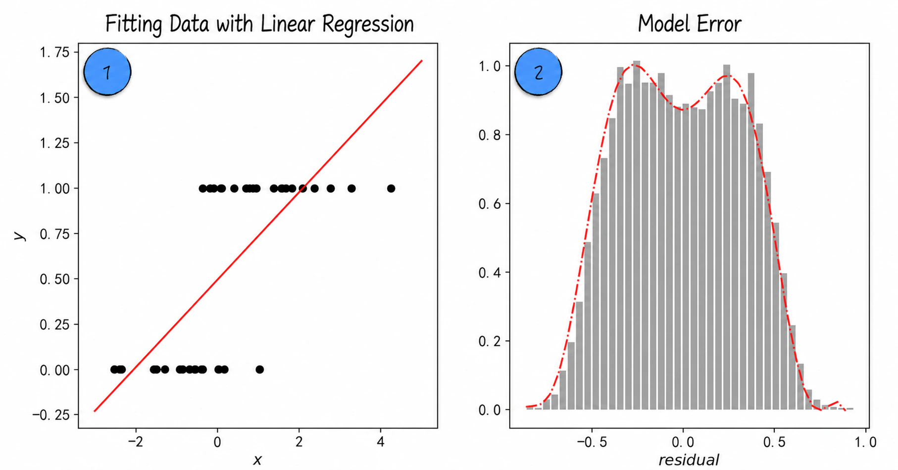
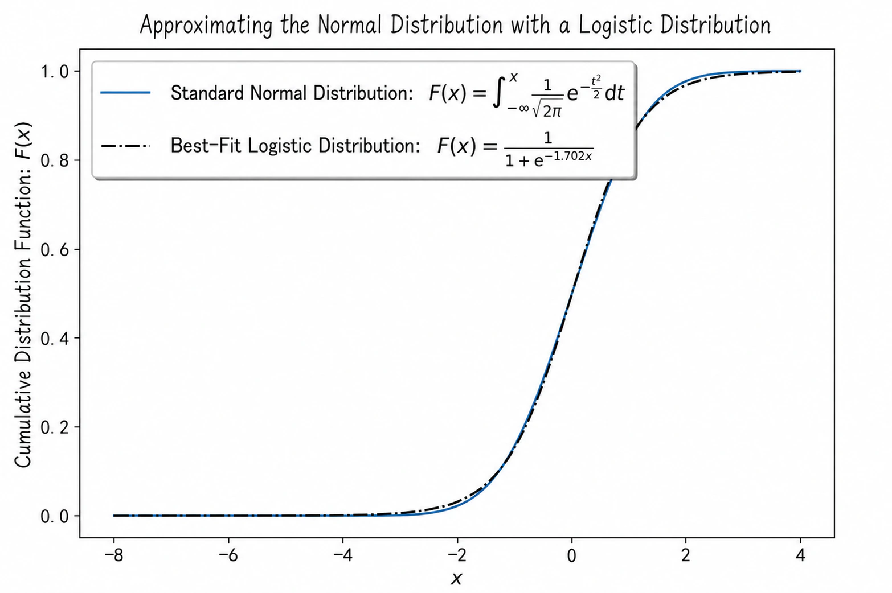
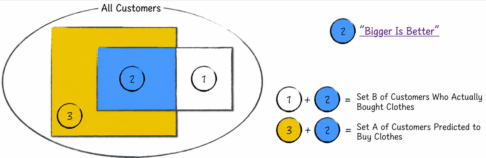
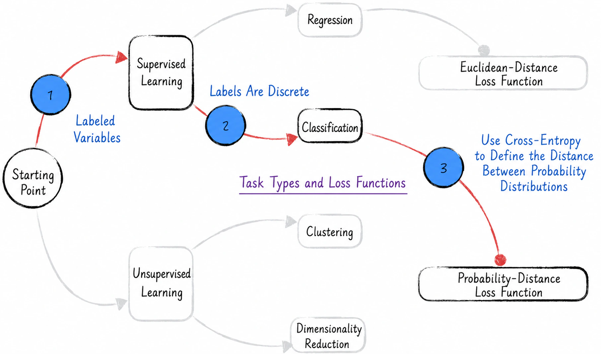

## 4.1 Binary Classification: Yes or No

Everyday life is full of binary choices. When shopping, for example, deciding whether to buy an item of clothing is a binary-choice problem. Analyzing such situations is extremely valuable. Imagine that an e-commerce platform could build a model that predicted with reasonable accuracy whether a customer would buy a particular garment. The platform could then recommend relevant products proactively to customers who were likely to be interested. This capability not only improves the user experience but directly increases sales. Precise recommendations are a core competitive advantage for many internet companies and are crucial to their business models.

How should a binary-choice problem be modeled? Can the linear regression model introduced in [Chapter 3](/books/deconstructing_LLM/chapter-3) solve it? Unfortunately, it cannot. From a modeling perspective, a binary-choice problem is a classification problem—for example, classifying customers into buyers and nonbuyers. This differs clearly from the regression problems discussed in [Chapter 3](/books/deconstructing_LLM/chapter-3), and linear regression cannot solve it effectively. The following discussion of clothing purchases makes the point clearer.

### 4.1.1 Linear Regression: Why It Fails

Construct a dataset for the clothing-purchase setting with two variables: an independent variable $\{x_i\}$ and a dependent variable $\{y_i\}$. Here, $\{x_i\}$ represents income and $\{y_i\}$ indicates whether a purchase is made. There are only two possibilities, so 0 represents no purchase and 1 represents a purchase. Thus, $y_i$ is discrete rather than continuous. Plotting the data gives the points marked 1 in Figure 4-1 ([Complete Code](https://github.com/GenTang/regression2chatgpt/blob/en/ch04_logit/logit_example.ipynb)). The figure makes it clear that a straight line does not fit the data well.

Using linear regression would give the model

$$
y_i=ax_i+b+\varepsilon_i
\tag{4-1}
$$

where $\varepsilon_i$ is a random variable following a normal distribution with expected value 0 and variance $\sigma^2$, written as $\varepsilon_i\sim N(0,\sigma^2)$. This is an important but frequently overlooked assumption of linear regression.

Training the linear regression model in Equation (4-1) on this data produces the solid line in Figure 4-1. The predicted values differ substantially from the true values, so performance is poor. The predictions are also difficult to interpret. By definition, $y_i$ represents a choice and can equal only 0 or 1, yet the model predicts values across the entire real line. What, for example, would a prediction of 0.73 for some $y_i$ mean?

More importantly, plotting the distribution of model errors—the observed values of $\varepsilon_i$—shows that it is not normal. The error distribution, marked 2 in Figure 4-1, appears bimodal, whereas a normal distribution is unimodal. A more rigorous derivation confirms that the errors here do not follow a normal distribution[^linear-assumptions].

This is a serious problem because using linear regression imposes the following three assumptions. There are more assumptions in practice, but only the three most fundamental are considered here.

1. The dependent variable $\{y_i\}$ and independent variable $\{x_i\}$ have a linear relationship.
2. The independent variable $\{x_i\}$ is independent of the disturbance term $\varepsilon_i$.
3. The random effects $\varepsilon_i$ not captured by the linear model follow a normal distribution.

The error distribution shows that the third assumption does not hold. In other words, the data does not satisfy the model's assumptions, leading to poor predictions.

Verifying that data satisfies model assumptions is a crucial step in model construction. Model computation generally places few restrictions on data: almost any data can train a model, and a trained model can make predictions[^random-parameters]. How, then, can predictive performance be ensured? An effective approach is to continually check whether the data satisfies the assumptions. If it does, the model will generally perform well; if not, performance cannot be guaranteed. As this example shows, forcing a model onto data while ignoring its assumptions often produces a model that is “wrong and useless.”

If a linear model is unsuitable for classification, how should the model be constructed?

### 4.1.2 The Window Effect: What Cannot Be Seen Is What Matters

Binary choices often exhibit a “window effect.” As outside observers, we can see only the final choice, not the series of hidden factors behind it, even though those factors determine the outcome. A customer's decision to buy clothing provides a detailed example.

On one hand, buying clothing can bring happiness by satisfying needs such as improving one's appearance or staying warm. On the other hand, it can cause inconvenience, such as the need to pay for it. A customer considers both sides and then decides whether to buy. If the satisfaction gained outweighs the burden of the price, for example, the customer makes the purchase. In economic terms, purchasing produces both positive and negative utility. When positive utility exceeds negative utility—so the overall utility is positive—the customer buys; otherwise, the customer does not.

We can translate this description into modeling language. Suppose the independent variables $\mathbf X_i=(x_{i,1},x_{i,2},\cdots,x_{i,k},1)$ determine customer $i$'s utility from buying the garment[^intercept], including positive utility $y_i^*$, which makes the customer happy, and negative utility $\tilde y_i$, which causes inconvenience. Let $y_i$ represent the purchase decision: $y_i=1$ means that customer $i$ buys the garment, while $y_i=0$ means that the customer does not. Then

$$
\begin{aligned}
y_i^*&=f(\mathbf X_i),\qquad \tilde y_i=g(\mathbf X_i)\\
y_i&=
\begin{cases}
1,&y_i^*>\tilde y_i\\
0,&y_i^*\leq \tilde y_i
\end{cases}
\end{aligned}
\tag{4-2}
$$

Further assume that both positive and negative utility have linear relationships with the independent variables. Specifically, let $\boldsymbol\varphi=(\varphi_1,\varphi_2,\cdots,\varphi_k,\varphi_{k+1})^{\mathrm T}$ and $\boldsymbol\omega=(\omega_1,\omega_2,\cdots,\omega_k,\omega_{k+1})^{\mathrm T}$ be model parameters. Then

$$
\begin{aligned}
y_i^*&=\mathbf X_i\boldsymbol\varphi+\theta_i\\
\tilde y_i&=\mathbf X_i\boldsymbol\omega+\tau_i
\end{aligned}
\tag{4-3}
$$

where $\theta_i$ and $\tau_i$ are independent random variables that both follow normal distributions. Let $z_i=y_i^*-\tilde y_i$, $\boldsymbol\gamma=\boldsymbol\varphi-\boldsymbol\omega$, and $\varepsilon_i=\theta_i-\tau_i$. Note that $\varepsilon_i$ also follows a normal distribution because $\theta_i$ and $\tau_i$ are independent. We obtain

$$
\begin{aligned}
z_i&=\mathbf X_i\boldsymbol\gamma+\varepsilon_i\\
y_i&=
\begin{cases}
1,&\mathbf X_i\boldsymbol\gamma+\varepsilon_i>0\\
0,&\text{otherwise}
\end{cases}
\end{aligned}
\tag{4-4}
$$

It follows that

$$
\begin{aligned}
P(y_i=1)&=P(z_i>0)=P(\varepsilon_i>-\mathbf X_i\boldsymbol\gamma)\\
P(y_i=1)&=1-P(\varepsilon_i\leq-\mathbf X_i\boldsymbol\gamma)=1-F_\varepsilon(-\mathbf X_i\boldsymbol\gamma)
\end{aligned}
\tag{4-5}
$$

Here, $F_\varepsilon$ is the cumulative distribution function of the random variable $\varepsilon$, and $P(y_i=1)$ is the probability that the customer makes the purchase. The model in Equation (4-5) is known academically as **probit regression**. Although its name includes “regression,” it solves a classification problem. Figure 4-2 provides an approximate representation of the complete process.

During model construction, we assumed the existence of variables that cannot be observed directly: $y_i^*$ and $\tilde y_i$. This class of model is therefore called a **latent-variable model**, and $y_i^*$ and $\tilde y_i$ are called **latent variables**.

Although probit regression is mathematically elegant, the normal cumulative distribution function has no closed-form expression[^normal-cdf]. This makes the model parameters relatively difficult to estimate and limits practical use. To make the model easier to apply, we need an approximation that simplifies its mathematics.

### 4.1.3 The Logistic Distribution

According to Equation (4-5), approximating probit regression depends on approximating the normal cumulative distribution function $F_\varepsilon(x)$. Suppose the random variable $\varepsilon$ has expected value $\mu$ and variance $\sigma^2$, and let $\phi(x)$ be the standard normal cumulative distribution function. It is straightforward to prove that

$$
F_\varepsilon(x)=\phi\left(\frac{x-\mu}{\sigma}\right)
\tag{4-6}
$$

This shows that the normal distribution is stable under linear transformations, so only the standard normal distribution needs to be approximated. Researchers have found that the logistic distribution approximates the normal distribution well, as shown in Figure 4-3[^normal-logit]. The cumulative distribution functions of the two distributions are almost identical.

The probability density function of the standard logistic distribution is $f(x)=e^{-x}/(1+e^{-x})^2$, and its cumulative distribution function is

$$
S(x)=\frac{1}{1+e^{-x}}
\tag{4-7}
$$

The function in Equation (4-7) is commonly called the **sigmoid function** and is widely used in artificial intelligence. Its graph is S-shaped, so it is also called an S-function. The analysis above shows that when two different utilities compete, assuming that both satisfy the assumptions of linear regression, the probability that one wins can be approximated mathematically by the sigmoid function, as shown in Equation (4-8). In other words, the sigmoid function describes the probability that one side wins a competition.

$$
F_\varepsilon(\sigma x+\mu)=\phi(x)\approx S(-1.702x)
\tag{4-8}
$$

Equations (4-5) and (4-8) yield Equation (4-9)[^logistic-assumption], whose two expressions are equivalent. As in [Section 3.4.1](/books/deconstructing_LLM/chapter-3/3-4#section-3-4-1), the first expression gives the purchase probability for customer $i$, while the second uses matrix form to show the purchase probabilities for all customers. Here, $\mathbf X_i=(x_{i,1},x_{i,2},\cdots,x_{i,k},1)$ contains the features of customer $i$, and $\boldsymbol\beta=(\beta_1,\beta_2,\cdots,\beta_k,\beta_{k+1})^{\mathrm T}$ contains the model parameters.

$$
\begin{aligned}
P(y_i=1)&=\frac{1}{1+e^{-\mathbf X_i\boldsymbol\beta}}\\
P(\mathbf Y=1)&=\frac{1}{1+e^{-\mathbf X\boldsymbol\beta}}
\end{aligned}
\tag{4-9}
$$

Equation (4-9) presents the **logistic regression**, or **logit regression**, model. Like probit regression, it is a classification model despite its name[^model-name]. Transforming Equation (4-9) gives the more interesting expression

$$
\ln\frac{P(y_i=1)}{1-P(y_i=1)}=\mathbf X_i\boldsymbol\beta
\tag{4-10}
$$

In statistics, $P/(1-P)$ is called the **odds**, the ratio of the probability that an event occurs to the probability that it does not. Equation (4-10) therefore says that logistic regression assumes the logarithm of the odds to be a linear model. This is one concise explanation of logistic regression.

### 4.1.4 The Likelihood Function: Statistical Parameter Estimation

From a statistical perspective, estimating the model parameters requires defining a reasonable likelihood function and deriving an expression for the estimates from it. This process resembles the treatment of linear regression.

Because the predicted value $y_i$ is discrete and equals either 1 or 0, its probability distribution under the model assumptions can be written as

$$
\begin{aligned}
P(y_i)&=P(y_i=1)^{y_i}P(y_i=0)^{1-y_i}\\
\ln P(y_i)&=y_i\ln P(y_i=1)+(1-y_i)\ln[1-P(y_i=1)]
\end{aligned}
\tag{4-11}
$$

Because the $y_i$ are mutually independent, $P(\mathbf Y)=\prod_iP(y_i)$. Using the first expression in Equation (4-9), we derive the likelihood function $L$ for parameter $\boldsymbol\beta$:

$$
\begin{aligned}
h(\mathbf X_i)&=\frac{1}{1+e^{-\mathbf X_i\boldsymbol\beta}}\\
L=P(\mathbf Y\mid\boldsymbol\beta)&=\prod_i h(\mathbf X_i)^{y_i}[1-h(\mathbf X_i)]^{1-y_i}
\end{aligned}
\tag{4-12}
$$

For computational convenience, the logarithm of the likelihood in Equation (4-12) is generally used. Maximum likelihood estimation then gives the following expression for the parameter estimate:

$$
\begin{aligned}
\hat{\boldsymbol\beta}
&=\underset{\boldsymbol\beta}{\operatorname{argmax}}\,L
=\underset{\boldsymbol\beta}{\operatorname{argmax}}\,\ln L
=\underset{\boldsymbol\beta}{\operatorname{argmax}}\,\ln P(\mathbf Y\mid\boldsymbol\beta)\\
\hat{\boldsymbol\beta}
&=\underset{\boldsymbol\beta}{\operatorname{argmax}}
\sum_i\left\{y_i\ln h(\mathbf X_i)+(1-y_i)\ln[1-h(\mathbf X_i)]\right\}
\end{aligned}
\tag{4-13}
$$

### 4.1.5 The Loss Function: Machine-Learning Parameter Estimation

From a machine-learning perspective, in a binary-choice problem we want the predicted labels—yes or no—to be as close as possible to the true labels. In the clothing example, let $A$ be the set of customers whom the model predicts will make a purchase and $B$ the set who actually do. We want the intersection of $A$ and $B$ to be “as large as possible”—but is larger always better? [Section 4.3.1](/books/deconstructing_LLM/chapter-4/4-3#section-4-3-1) examines the question in depth—as shown in Figure 4-4.

It is not easy to define a mathematically tractable loss function directly from this idea; the most direct formulation is clearly nondifferentiable. We therefore draw on the statistical approach and define the loss function as

$$
LL=-\frac{1}{n}\sum_{i=1}^{n}\left[y_i\ln h(\mathbf X_i)+(1-y_i)\ln(1-h(\mathbf X_i))\right]
\tag{4-14}
$$

Equation (4-14) is known as **cross-entropy**. It can be understood as a distance between two probability distributions[^kl-divergence]: the smaller the cross-entropy, the more similar the distributions. We have now completed the machine-learning analysis of the setting and defined the loss function, as summarized in Figure 4-5.

Minimizing the loss function gives the model parameter estimates. The result is very similar to Equation (4-13), so the details are not repeated here.

In practical applications, penalty terms are generally added to the logistic regression loss function in Equation (4-14) to prevent overfitting. Common choices include the L1 norm, the sum of the absolute values of the model parameters, and the L2 norm, the sum of their squares. The details resemble those for linear regression; see [Section 3.3.3](/books/deconstructing_LLM/chapter-3/3-3#section-3-3-3).

### 4.1.6 Final Predictions: From Probabilities to Classes

Equation (4-13) gives the model parameter estimate $\hat{\boldsymbol\beta}$. Substituting it into Equation (4-9) gives the probability that a customer purchases the garment—the model's predicted probability:

$$
\hat P(y_i=1)=\frac{1}{1+e^{-\mathbf X_i\hat{\boldsymbol\beta}}}
\tag{4-15}
$$

This predicts only a probability, whereas we are most interested in predicting customer behavior, so one final step remains. Because this is a binary-choice problem, when $\hat P(y_i=1)>\hat P(y_i=0)$, or equivalently $\hat P(y_i=1)>0.5$, it is reasonable to predict that the customer will buy. The final model result can therefore be written as

$$
\hat y_i=
\begin{cases}
1,&\dfrac{1}{1+e^{-\mathbf X_i\hat{\boldsymbol\beta}}}>0.5\\
0,&\text{otherwise}
\end{cases}
\tag{4-16}
$$

In certain settings, however, a threshold $\alpha$ may need to be selected manually, so the customer is predicted to buy only when $\hat P(y_i=1)>\alpha$. See [Section 4.3](/books/deconstructing_LLM/chapter-4/4-3) for a detailed discussion.

[^linear-assumptions]: A rigorous derivation follows. For convenience, express the model in matrix form. Suppose the model has $k$ independent variables $x_1,x_2,\cdots,x_k$, dependent variable $y$, and random disturbance $\varepsilon$. Let $\mathbf X_i=(x_{i,1},x_{i,2},\cdots,x_{i,k},1)$ and $\boldsymbol\beta=(a_1,a_2,\cdots,a_k,b)^{\mathrm T}$, where $i$ identifies the $i$th observation. The model is $y_i=\mathbf X_i\boldsymbol\beta+\varepsilon_i$. By assumption, $\mathbf X_i$ and $\varepsilon_i$ are independent, so $P(\varepsilon_i\mid\mathbf X_i)=P(\varepsilon_i)$. Thus, for a given $\mathbf X_i$, $\varepsilon_i$ should still follow a normal distribution. But the model equation gives $\varepsilon_i=y_i-\mathbf X_i\boldsymbol\beta$, so $\varepsilon_i=0-\mathbf X_i\boldsymbol\beta$ or $\varepsilon_i=1-\mathbf X_i\boldsymbol\beta$. Given $\mathbf X_i$, $\varepsilon_i$ can therefore take only two values, which clearly does not constitute a normal distribution.
[^random-parameters]: In fact, a model can make predictions as soon as numerical values are assigned to its parameters, even if those values are generated randomly. In that case, however, the accuracy of the predictions cannot be guaranteed.
[^intercept]: Adding the constant 1 to the independent variables absorbs the intercept term, simplifying the mathematical expression of the linear regression model and making the derivation more concise.
[^normal-cdf]: Suppose $\varepsilon$ follows a normal distribution with expected value $\mu$ and variance $\sigma^2$. Its cumulative distribution function is $F_\varepsilon(x)=\frac{1}{\sqrt{2\pi\sigma^2}}\int_{-\infty}^{x}e^{-\frac{(t-\mu)^2}{2\sigma^2}}\,\mathrm dt$. This function has no closed-form expression.
[^normal-logit]: See the [Complete Code](https://github.com/GenTang/regression2chatgpt/blob/en/ch04_logit/normal_logit_approx.ipynb) for the implementation of the figure. The equation in the figure comes from Bowling, S. R., et al. 2009. “A logistic approximation to the cumulative normal distribution.” *Journal of Industrial Engineering and Management*, 2(1), 114–127.
[^logistic-assumption]: Equation (4-9) can also be obtained by assuming directly in Equation (4-4) that $\varepsilon$ follows a logistic distribution. In the author's view, however, that assumption is arbitrary and lacks a firm theoretical basis; it also omits the competition between the two utilities and the resulting intuition for the sigmoid function. It is therefore not a good modeling approach.
[^model-name]: The names of these models have particular historical origins. When biologist Chester Ittner Bliss first proposed the probit model in 1934, he called it probits regression. The logit model, an improved version proposed by statistician David Cox in 1958, retained the regression terminology and was called logit regression. Both models also make extensive use of methods from linear regression in details such as parameter confidence intervals, so calling them “regressions” is not entirely unreasonable. Readers should nevertheless avoid being misled by the names.
[^kl-divergence]: In artificial intelligence, Kullback–Leibler divergence (KL divergence) is commonly used to measure the difference between two probabilities. Suppose two probability distributions $P$ and $Q$ are defined over the same discrete random variable $x$. The divergence of $P$ relative to $Q$ is $D_{KL}(P\parallel Q)=\sum_iP(i)\ln\frac{P(i)}{Q(i)}$. The definition for continuous $x$ is analogous. It can be proved that the KL divergence is 0 when $P=Q$ and grows as their difference increases. Mathematical derivation also gives $D_{KL}(P\parallel Q)=H(P,Q)-H(P)$, where $H(P,Q)$ is their cross-entropy and $H(P)$ is a constant called the entropy of $P$. Cross-entropy can therefore be regarded as a distance between two distributions.
