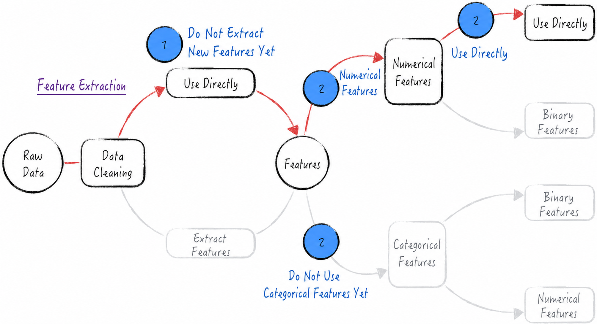
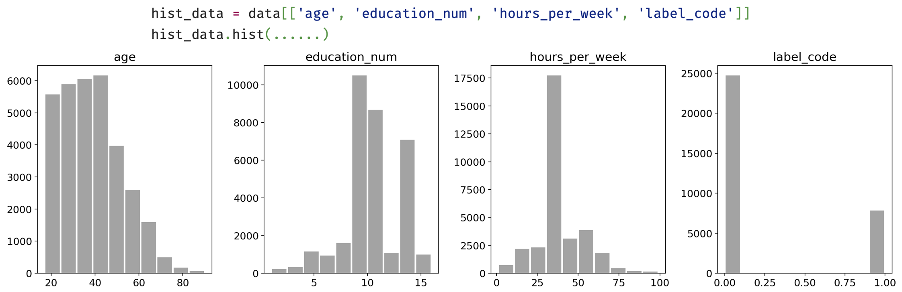
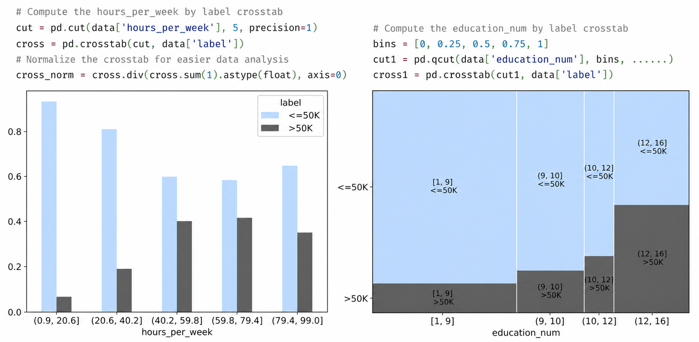
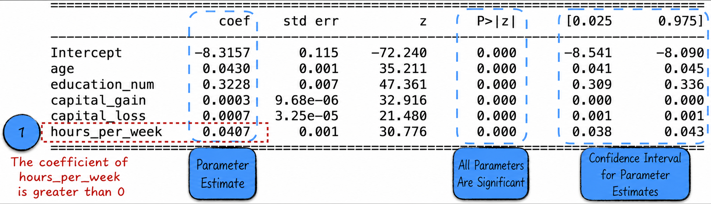
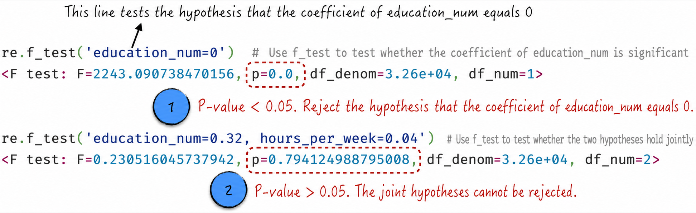
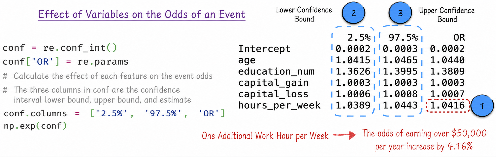
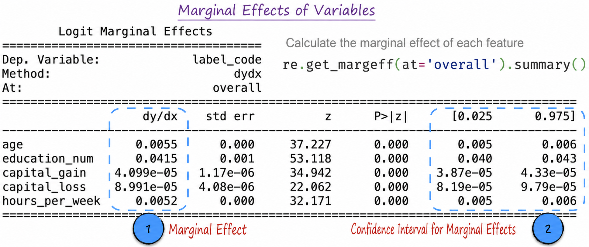

## 4.2 Model Implementation

This section uses personal-income census data provided by the University of California, Irvine to discuss how to construct a logistic regression model. The dataset contains multiple variables, as shown in Table 4-1. The label to be predicted is `label`, an annual-income category with only two possible values.

Table 4-1

| Variable | Type | Description |
| --- | --- | --- |
| `age` | Numerical | Age |
| `workclass` | Categorical | Type of employment, such as government or private-sector employment |
| `fnlwgt` | Numerical | Sampling weight, a census variable unrelated to the modeling analysis |
| `education` | Categorical | Educational qualification, such as bachelor's or graduate degree |
| `education_num` | Numerical | Years of education |
| `martial-status` | Categorical | Marital status |
| `occupation` | Categorical | Industry of employment |
| `relationship` | Categorical | Family role, such as husband or wife |
| `race` | Categorical | Race |
| `sex` | Categorical | Sex |
| `capital_gain` | Numerical | Investment gains during the year |
| `capital_loss` | Numerical | Investment losses during the year |
| `hours_per_week` | Numerical | Hours worked per week |
| `native_country` | Categorical | Country of birth |
| `label` | Categorical | Annual-income class: “>50K” or “<=50K” |

### 4.2.1 Preliminary Data Analysis: First Impressions

The dataset contains two kinds of variables: numerical and categorical. A numerical variable represents a specific quantity, such as age, whereas a categorical variable represents a category or type, such as educational qualification. The two differ in the following ways.

- Numerical variables can be used directly in mathematical operations. Adding 2 years to age 53 gives age 55, for example, and this calculation has a practical meaning.
- Categorical variables cannot be used directly in mathematical operations. A high-school education and a bachelor's degree, for example, cannot be added mathematically. Even if categories are mapped to numbers—say, 1 for high school, 2 for a bachelor's degree, and 3 for a graduate degree—the results of arithmetic remain meaningless. Although $1+2=3$, a high-school education plus a bachelor's degree does not equal a graduate degree.

Numerical and categorical variables are fundamentally different and must therefore be handled separately during feature extraction. To focus on logistic regression itself, we temporarily use only the numerical variables; see [Section 5.2](/books/deconstructing_LLM/chapter-5/5-2) for details on categorical variables. The selected variables are age, years of education, annual investment gains, annual investment losses, and hours worked per week. Figure 4-6 shows the complete feature-processing procedure.

The prediction label `label` remains categorical, so a new numerical variable must represent it. Specifically, generate a variable called `label_code` from the original data. It has two possible values: 0 represents “<=50K,” an income no greater than USD 50,000, and 1 represents “>50K,” an income greater than USD 50,000.



Before building the model, we need a basic understanding of the data in two respects: the distribution of each variable and the relationships among variables, particularly those between the independent variables and the prediction label.

Histograms provide a clear visualization of variable distributions. A histogram's horizontal axis represents ranges of variable values, while its vertical axis shows the frequency of observations in each range, as illustrated in Figure 4-7 ([Complete Code](https://github.com/GenTang/regression2chatgpt/blob/en/ch04_logit/logit_regression.ipynb)). Histograms make it possible to observe a data distribution intuitively and identify its concentration, dispersion, possible outliers, and special patterns.



A crosstab is an intuitive and effective way to analyze relationships among variables. Consider hours worked per week (`hours_per_week`) and annual-income class (`label`). Divide working hours evenly into five intervals and calculate the label distribution in each interval. The result, shown on the left side of Figure 4-8, indicates that the proportion of people earning more than USD 50,000 does not always increase with weekly working hours. Below 80 hours, the proportion rises as working hours increase; above 80 hours, however, it falls.

More sophisticated charts can also present crosstab results. The right side of Figure 4-8 analyzes years of education (`education_num`) and the prediction label. The area of each square is proportional to the value in the corresponding interval. The chart makes the conclusion clear: as years of education increase, so does the proportion of people earning more than USD 50,000.



These basic analyses help us understand the variables and their relationships, providing important guidance for model construction and feature selection.

### 4.2.2 Building the Model

After the preparation and analysis above, we can construct the logistic regression model. The implementation is straightforward, as shown in Listing 4-1.

1. Following [Section 3.3.1](/books/deconstructing_LLM/chapter-3/3-3#section-3-3-1), divide the data into two disjoint parts to avoid overfitting: one for training and the other for evaluating performance. Line 5 divides the data into a training set and a test set, with the test set accounting for 20% of the data.
2. Lines 7 and 8 show how statsmodels constructs a model from a string[^formula-syntax]. A simpler example helps explain the syntax. Suppose the model string is `label_code ~ age + age * education_num`. It specifies `label_code` as the prediction label and uses two features: the original variable `age` and the derived feature `age * education_num`, which multiplies age by years of education.

#### Listing 4-1 Logistic Regression ([Complete Code](https://github.com/GenTang/regression2chatgpt/blob/en/ch04_logit/logit_regression.ipynb))

```python
from sklearn.model_selection import train_test_split
import statsmodels.api as sm

# Divide the data into training and test sets
train_set, test_set = train_test_split(data, test_size=0.2, random_state=2310)
# Train the model and analyze its performance
formula = 'label_code ~ age + education_num + capital_gain + capital_loss + hours_per_week'
model = sm.Logit.from_formula(formula, data=data)
re = model.fit()
print(re.summary())
```

Once training is complete, at line 9 of Listing 4-1, the results shown in Figure 4-9 are obtained.

1. As with linear regression, the results include parameter estimates and their confidence intervals. Every parameter in the model is significant, meaning that no variable needs to be removed.
2. Of particular note, the coefficient of `hours_per_week` is 0.0407, as marked by label 1 in Figure 4-9. This indicates that the likelihood of earning more than USD 50,000 increases with weekly working hours; see [Section 4.2.3](/books/deconstructing_LLM/chapter-4/4-2#section-4-2-3) for detailed analysis. This conclusion conflicts with Figure 4-8, where the proportion earning more than USD 50,000 is not always positively related to weekly working hours. The difference arises from the characteristics of numerical variables themselves; see [Section 5.3](/books/deconstructing_LLM/chapter-5/5-3) for details and solutions.



The `f_test` function can also perform hypothesis tests, with results shown in Figure 4-10.



### 4.2.3 Understanding the Model Results

The model's specific form and parameter estimates allow us to analyze how changes in variables, or features, affect the predictions and thereby understand relationships in the data. In linear regression, this effect is intuitive and simple; in logistic regression, it is somewhat more complex. This section examines two common approaches: the effect of a variable on the odds of an event and the variable's marginal effect.

We can examine these questions at two levels: theoretical mathematical derivation and practical code implementation. To simplify the derivation and emphasize the main point, consider the simpler logistic regression model in Equation (4-17), where $P$ is the probability of the event and $x$ and $z$ are variables.

$$
\ln\frac{P}{1-P}=ax+bz+c
\tag{4-17}
$$

First consider how variables affect the odds of an event. In Equation (4-17), hold $z$ constant and increase $x$ from $k$ to $k+1$. Then

$$
\begin{aligned}
\ln\operatorname{odds}(x=k)&=\ln\frac{P}{1-P}=ak+bz+c\\
\ln\operatorname{odds}(x=k+1)&=\ln\frac{P}{1-P}=a(k+1)+bz+c\\
\ln\frac{\operatorname{odds}(x=k+1)}{\operatorname{odds}(x=k)}&=a
\end{aligned}
\tag{4-18}
$$

Recall that $P/(1-P)$ is the odds, the ratio of the probability that an event occurs to the probability that it does not. Rearranging Equation (4-18) gives $\operatorname{odds}(x=k+1)/\operatorname{odds}(x=k)=e^a$. Thus, with all other variables fixed, increasing $x$ by 1 multiplies the corresponding odds by $e^a$[^odds-ratio].

Applying this result to the example in [Section 4.2](/books/deconstructing_LLM/chapter-4/4-2) produces Figure 4-11. It is worth emphasizing again that, according to the model, the odds of earning more than USD 50,000 always increase with weekly working hours: each additional hour raises the odds by 4.07%. This conflicts with the actual pattern in Figure 4-8, so the model must be revised. See [Section 5.3](/books/deconstructing_LLM/chapter-5/5-3) for a detailed explanation and solution.



Next consider the marginal effect of a change in a variable. Compared with an intermediate quantity such as the odds, we are more interested in the variable's effect on the final result: how does the probability of the event change when a variable increases by 1? In academic terminology, this is the variable's **marginal effect**. Mathematically, the marginal effect of a variable is the derivative of the predicted quantity with respect to that variable. Differentiating both sides of Equation (4-17) with respect to $x$ gives Equation (4-19).

$$
\begin{aligned}
\frac{1}{P}\frac{\partial P}{\partial x}+\frac{1}{1-P}\frac{\partial P}{\partial x}&=a\\
\frac{\partial P}{\partial x}&=aP(1-P)
\end{aligned}
\tag{4-19}
$$

Equation (4-19) can be interpreted simply: when $x$ increases by 1, the probability of the event increases by $aP(1-P)$. Because $P$ is the probability of the event, parameter $a$ is constant across observations but $P$ generally differs. A variable's marginal effect therefore differs from one observation to another[^marginal-effect]. This contrasts with linear regression, whose marginal effects are constant. Because the marginal effect is not constant, practical applications generally calculate it at every observation and then take the average. This average is treated as the variable's marginal effect.

Applying this analysis to the model in [Section 4.2.2](/books/deconstructing_LLM/chapter-4/4-2#section-4-2-2) gives the results shown in Figure 4-12, including each variable's marginal effect and its confidence interval. According to the figure, for example, an increase of 1 in years of education (`education_num`) increases the probability of earning more than USD 50,000 by 0.0415, and in 95% of cases this increase lies in the interval $[0.040,0.043]$.



[^formula-syntax]: Readers familiar with R, another common statistical programming language, will notice that the statsmodels syntax for defining a model is almost identical to R's.
[^odds-ratio]: In statistics, $\operatorname{odds}(x=k+1)/\operatorname{odds}(x=k)$ is called the **odds ratio**. It is commonly used to measure whether the odds of an event differ substantially between groups.
[^marginal-effect]: More generally, differentiating both sides of the logistic regression equation with respect to $\mathbf X$ gives $\frac{\partial P}{\partial\mathbf X}=P(1-P)\boldsymbol\beta$. Here, $\boldsymbol\beta$ is constant while $P$ varies. Thus, marginal effects are likewise nonconstant in a logistic regression model.
