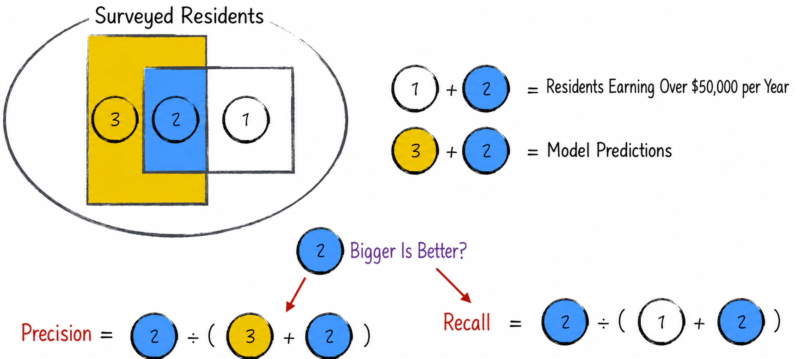
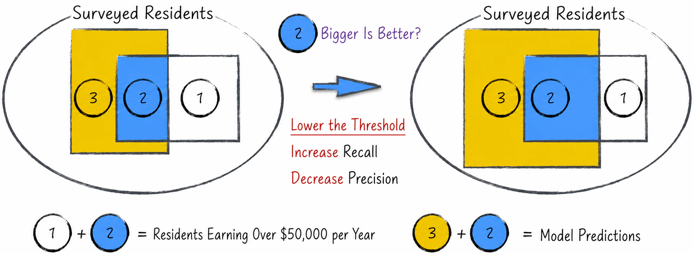
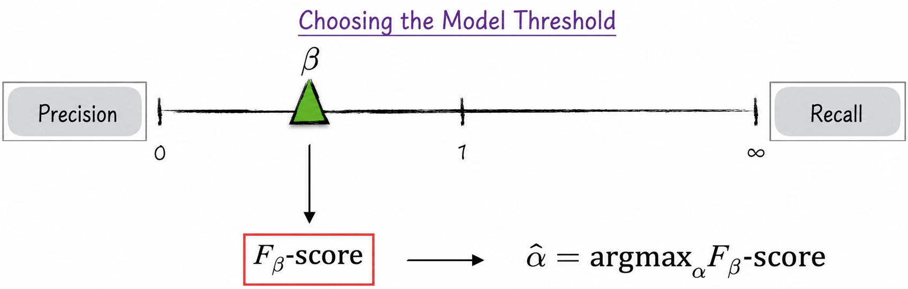
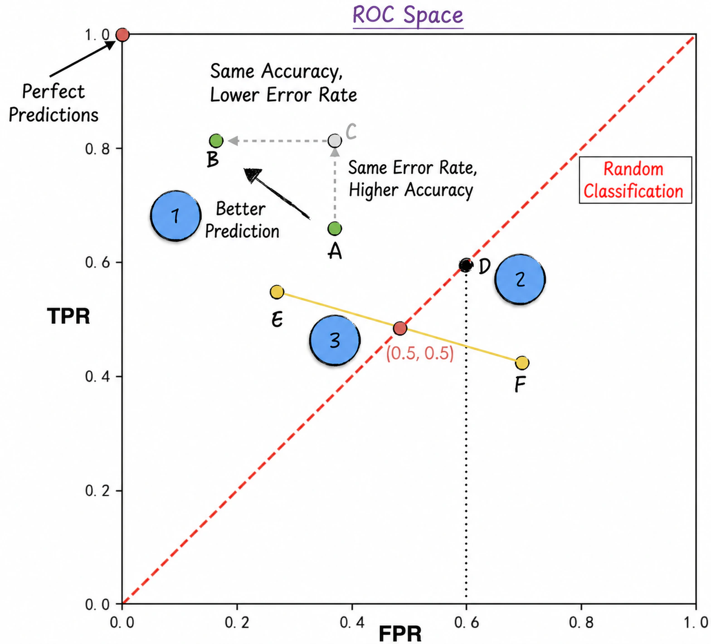
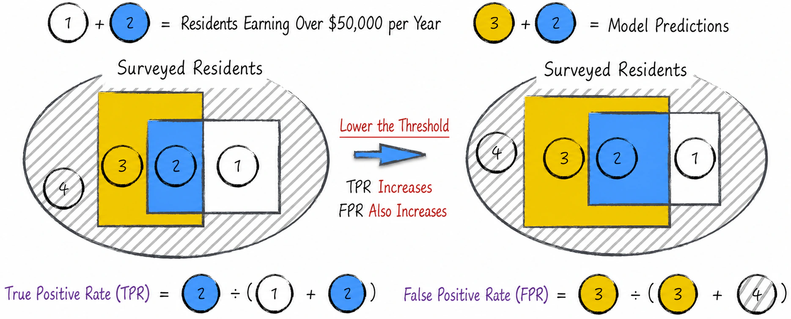
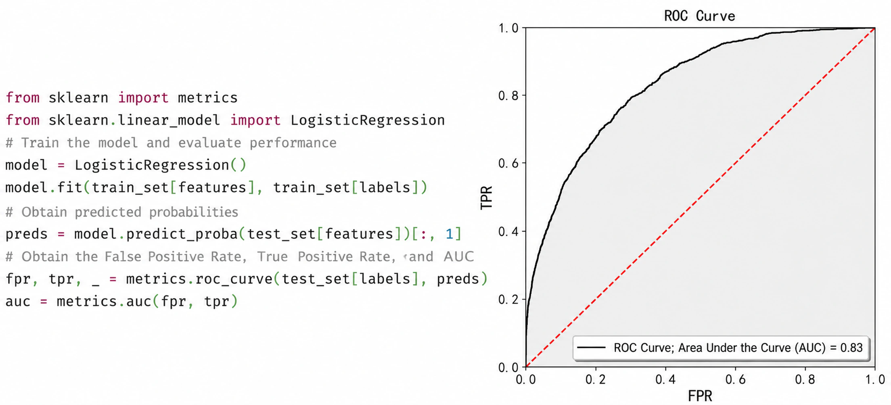
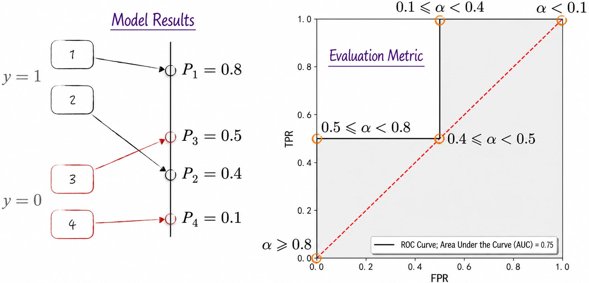

## 4.3 Evaluating Model Performance

A trained logistic regression model can predict unknown data. Recall from [Section 4.1.6](/books/deconstructing_LLM/chapter-4/4-1#section-4-1-6) that logistic regression predicts not whether an event occurs, but the probability that it occurs. Its output is therefore an intermediate value rather than the final result and requires further processing, as shown in Equation (4-20).

$$
\hat y_i=
\begin{cases}
1,&\hat P(y_i=1)>\alpha\\
0,&\hat P(y_i=1)\leq\alpha
\end{cases}
\tag{4-20}
$$

The symbols in the equation have the following meanings.

- $y_i=1$ means that resident $i$ earns more than USD 50,000 per year; $y_i=0$ means that the resident earns no more than USD 50,000; and $\hat y_i$ is the predicted value of $y_i$.
- $\hat P(y_i=1)$ is the predicted probability returned by the model—the predicted probability that annual income exceeds USD 50,000.
- $\alpha$ is the event threshold and is usually set to $\alpha=0.5$.

Listing 4-2 shows the implementation.

#### Listing 4-2 Prediction Results ([Complete Code](https://github.com/GenTang/regression2chatgpt/blob/en/ch04_logit/logit_regression.ipynb))

```python
# Use the trained model to predict the test data
# Calculate the probability that the event occurs
test_set['prob'] = re.predict(test_set)
print('Number of observations with event probability (predicted probability) greater than 0.6:')
print(test_set[test_set['prob'] > 0.6].shape[0]) # 584
print('Number of observations with event probability (predicted probability) greater than 0.5:')
print(test_set[test_set['prob'] > 0.5].shape[0]) # 846
```

Changing the threshold $\alpha$ clearly changes the predictions. Lowering it, for example, produces more predictions with $\hat y_i=1$, as lines 5–7 show. Although $\alpha$ largely determines the final prediction, it is not part of the model. Like the hyperparameters introduced in [Section 3.3.3](/books/deconstructing_LLM/chapter-3/3-3#section-3-3-3), its selection depends on the business setting and the data scientist's experience. We now examine how to select an appropriate threshold for a particular situation.

### 4.3.1 Precision and Recall

Before discussing how to select $\alpha$, we must first examine how to evaluate the quality of a set of binary-classification predictions. Such evaluation provides the foundation for threshold selection.

Using the notation of Equation (4-20), the block marked 1 in Figure 4-13 represents observations with $\hat y_i=0,y_i=1$; the concave block marked 3 represents observations with $\hat y_i=1,y_i=0$; and the block marked 2 represents observations with $\hat y_i=1,y_i=1$[^positive-class]. The area of each shape is proportional to the number of corresponding observations. The more observations for which both $\hat y_i=1$ and $y_i=1$, for example, the larger the area marked 2.

Clearly, the region marked 2 represents correct predictions, while those marked 1 and 3 represent incorrect predictions.

- On the one hand, we want the predictions to be precise: when $\hat y_i=1$, the true value $y_i$ should also be very likely to equal 1. In the figure, this means that region 2 should be large and region 3 small.
- On the other hand, we want the predictions to be comprehensive: for almost every observation with $y_i=1$, the corresponding prediction $\hat y_i$ should also equal 1. In the figure, this means that region 2 should be large and region 1 small.

This discussion motivates two quantitative metrics: **precision** and **recall**[^precision-translation]. Figure 4-13 illustrates their intuitive meanings.



We now define the two metrics rigorously. Divide the observations into four categories according to their predicted and true values, as shown in Table 4-2[^classification-errors]. Terms such as true positive and false negative may initially sound awkward; readers should understand the ideas behind them rather than merely memorize their names.

Table 4-2

| Predicted value | True value is 1 | True value is 0 |
| --- | --- | --- |
| 1 | True positive (TP), region 2 in Figure 4-13 | False positive (FP), region 3 in Figure 4-13 |
| 0 | False negative (FN), region 1 in Figure 4-13 | True negative (TN) |

From the table, precision and recall are defined mathematically as

$$
\begin{aligned}
\operatorname{Precision}&=\frac{TP}{TP+FP}\\
\operatorname{Recall}&=\frac{TP}{TP+FN}
\end{aligned}
\tag{4-21}
$$

Further derivation gives their probabilistic definitions:

$$
\begin{aligned}
\operatorname{Precision}&=P(y_i=1\mid\hat y_i=1)\\
\operatorname{Recall}&=P(\hat y_i=1\mid y_i=1)
\end{aligned}
\tag{4-22}
$$

### 4.3.2 F-Scores

A “perfect” set of predictions should have both high precision and high recall. Reality is less accommodating: the two metrics generally trade off against one another. Consider an extreme example. If a model predicts that every resident earns more than USD 50,000, recall will be 100%, but precision will be quite low, and the predictions will clearly have little practical value.



Although difficult to prove rigorously in general, lowering the threshold $\alpha$ in Equation (4-20) usually raises recall while reducing precision, and vice versa. Figure 4-14 illustrates this process.

Because of this tradeoff, model evaluation must consider precision and recall together. This motivates the $F_1$-score, defined in Equation (4-23). It is the harmonic mean of precision and recall and combines the accuracy and coverage of the predictions into a more comprehensive assessment of model performance.

$$
F_1=\frac{2}{\dfrac{1}{\mathrm{precision}}+\dfrac{1}{\mathrm{recall}}}
=2\frac{\mathrm{precision}\times\mathrm{recall}}{\mathrm{precision}+\mathrm{recall}}
\tag{4-23}
$$

In practice, the $F_1$-score can select the optimal threshold $\hat\alpha$, where $\hat\alpha=\operatorname*{argmax}_{\alpha}F_1$. On closer inspection, however, this metric gives precision and recall equal weight. In some situations, we may prefer to optimize one of them, such as precision. The more general $F_\beta$-score is therefore defined as

$$
F_\beta=(1+\beta^2)\frac{\mathrm{precision}\times\mathrm{recall}}{\beta^2\times\mathrm{precision}+\mathrm{recall}}
\tag{4-24}
$$

As $\beta$ approaches 0, the $F_\beta$-score increasingly emphasizes precision; when $\beta$ is large, it emphasizes recall. Figure 4-15 illustrates the process.



Precision, recall, and the $F_\beta$-score are common evaluation metrics for binary classification. Listing 4-3 shows their implementation. Precision is calculated on line 6, recall on line 7, and the $F_1$-score on line 8.

#### Listing 4-3 Evaluation Metrics ([Complete Code](https://github.com/GenTang/regression2chatgpt/blob/en/ch04_logit/logit_regression.ipynb))

```python
# Calculate precision, recall, and F1 for the predictions
bins = np.array([0, 0.5, 1])
label = test_set['label_code']
pred = test_set['pred']
tn, fp, fn, tp = np.histogram2d(label, pred, bins=bins)[0].flatten()
precision = tp / (tp + fp) # 0.702
recall = tp / (tp + fn) # 0.377
f1 = 2 * precision * recall / (precision + recall) # 0.491
```

### 4.3.3 ROC Space

The definitions of precision, recall, and the $F_\beta$-score all depend on the choice of threshold $\alpha$. In other words, $\alpha$ must be selected before these metrics can be calculated. Is there an evaluation metric that does not depend on $\alpha$? This section addresses that question.

Consider the definition of recall, $\operatorname{Recall}=TP/(TP+FN)$. The denominator is the number of residents in the data who actually earn more than USD 50,000—the number of observations with $y_i=1$. It is fixed and independent of the model, although the numerator is affected by the model. Precision, by contrast, is $\operatorname{Precision}=TP/(TP+FP)$. Its denominator is the number of residents whom the model predicts to earn more than USD 50,000—the number with $\hat y_i=1$. Both the numerator and denominator of precision are therefore affected by the model. When precision changes, it is difficult to determine how much of the change comes from the numerator and how much from the denominator. This limits the ability of precision to support a deeper analysis of model performance.

To address the problem, we can follow the logic of recall: fix the denominator and allow model predictions to affect only the numerator. This leads to two metrics, the **true positive rate** (TPR) and **false positive rate** (FPR). Using the notation defined in Table 4-2, Equation (4-25) gives their definitions. For an intuitive example, see Figure 4-17 in [Section 4.3.4](/books/deconstructing_LLM/chapter-4/4-3#section-4-3-4).

$$
\begin{aligned}
TPR&=\frac{TP}{TP+FN}\\
FPR&=\frac{FP}{FP+TN}
\end{aligned}
\tag{4-25}
$$

The true positive rate is simply recall. It measures how accurately the model predicts residents who earn more than USD 50,000—that is, the model's ability to identify them correctly. The false positive rate is the proportion of residents earning less than USD 50,000 whom the model incorrectly predicts to earn more than USD 50,000, so it measures the model's errors. For any prediction result, a higher true positive rate and lower false positive rate are desirable.

Once these two metrics are defined, they can be represented graphically. Draw a unit square with the false positive rate on the horizontal axis and the true positive rate on the vertical axis. This forms **ROC space**[^roc-name], or receiver operating characteristic space. Any set of predictions can be represented as a point in ROC space according to its TPR and FPR, as shown in Figure 4-16.



Several observations about ROC space are important.

1. A point closer to the upper-left corner represents more accurate predictions. In Figure 4-16, point $B$ lies above and to the left of point $A$, with a higher correct rate and a lower error rate, so it represents the better result. The upper-left corner of the square represents predictions that agree perfectly with reality.
2. Suppose the following strategy is applied to each observation $i$: predict $\hat y_i=1$ with 60% probability and $\hat y_i=0$ with 40% probability. This is a completely random classification. Its TPR and FPR are both 60%, corresponding to point $D$. By the same reasoning, the dashed diagonal of the square represents all random-classification results.
3. Random classification merely guesses according to a fixed probability and has no true predictive capability, so in theory it is the worst possible approach. Point $F$, however, lies below and to the right of the diagonal and represents performance even worse than random classification, which is entirely unacceptable. Reversing every conclusion represented by $F$ would produce a better result, point $E$. Thus, if a prediction lies below and to the right of the diagonal, we should check for possible computational errors. This provides a useful criterion for model debugging.

### 4.3.4 ROC Curves and AUC

Precision and recall generally trade off against one another. The true and false positive rates behave differently: they are positively correlated. In logistic regression, for example, lowering the threshold raises both rates. Their denominators are fixed, while lowering the threshold increases both numerators because more observations are predicted as 1. Figure 4-17 illustrates the process. More intuitively, the true positive rate represents the return on a prediction, while the false positive rate represents its cost. As in many situations in life, higher returns generally come with higher costs.



Gradually increase the model threshold from 0 to 1 and record the predictions at each threshold[^roc-direction]. The result is the model's **ROC curve**, or receiver operating characteristic curve. For the model discussed in [Section 4.2](/books/deconstructing_LLM/chapter-4/4-2), the ROC curve is shown on the right side of Figure 4-18. The implementation appears on the left ([Complete Code](https://github.com/GenTang/regression2chatgpt/blob/en/ch04_logit/roc_curve.ipynb)); scikit-learn makes the task straightforward.

Recall from the discussion of ROC space in [Section 4.3.3](/books/deconstructing_LLM/chapter-4/4-3#section-4-3-3) that points farther upward and to the left represent better predictions. Thus, the closer an ROC curve lies to the top and left edges of the space, the better the model performs. The **area under the curve** (AUC) metric quantifies this idea. AUC is the area beneath the ROC curve—the gray region in Figure 4-18. A larger area indicates better predictive performance. Because this metric does not depend on the model threshold and is based entirely on the model itself, it evaluates predictive performance effectively. AUC is therefore regarded as a more comprehensive and reliable evaluation metric.



### 4.3.5 The Probabilistic Interpretation of AUC

AUC has a clear mathematical meaning, which this section examines in depth. Before turning to the abstract mathematics, consider an intuitive example with four observations, numbered 1, 2, 3, and 4.

- The observations are divided into two groups according to $y_i$. The first group has value 1 and contains observations 1 and 2, so $y_1=y_2=1$. The second group has value 0 and contains observations 3 and 4, so $y_3=y_4=0$.
- Suppose the model predictions are the probabilities that $y_i=1$, which we may call the scores. Observations 1 and 2 have scores $P_1=0.8,P_2=0.4$, while observations 3 and 4 have scores $P_3=0.5,P_4=0.1$, as shown on the left side of Figure 4-19.

If one observation is selected at random from each group, the probability that the score from the first group exceeds the score from the second is 0.75. Plotting the model results in ROC space produces the curve on the right side of Figure 4-19, whose AUC is also exactly 0.75. Is this a coincidence?

It is not. More generally, suppose a logistic regression model predicts $\hat P(y_i=1)$, the probability that $y_i=1$. Select two observations at random, denoted by $k$ and $l$, where the true label of $k$ is $y_k=1$ and that of $l$ is $y_l=0$. If $\hat P(y_k=1)>\hat P(y_l=1)$, the model's direct prediction ranks the observations correctly, although the final class predictions may still be incorrect because of the threshold. It can be proved mathematically that AUC is exactly the probability of this event—the probability that the score of $k$ exceeds the score of $l$. In other words, AUC can be viewed as the probability that the model makes a correct ranking. This relationship is expressed as

$$
AUC=P\left(\hat P(y_k=1)>\hat P(y_l=1)\right)
\tag{4-26}
$$



Although AUC is traditionally used for binary classification, its probabilistic interpretation helps extend it to a broader range of applications, including large-scale recommendation systems based on preferences. Space does not permit an in-depth discussion here; interested readers can consult other resources[^auc-reference].

[^positive-class]: In a binary-classification problem, practical applications generally focus more on one of the two classes. In this example, the focus is on annual income above USD 50,000. During the data transformation that precedes modeling, the class of greater interest is usually mapped to 1. Evaluation therefore tends to focus on cases in which the true or predicted value equals 1.
[^precision-translation]: Some Chinese-language literature uses alternative Chinese translations for the terms precision and recall.
[^classification-errors]: In statistics, a false positive is also called a Type I error, and a false negative a Type II error. Precision is therefore often regarded as a metric for Type I errors, while recall is regarded as a metric for Type II errors.
[^roc-name]: The name “receiver operating characteristic” sounds unusual because ROC space and ROC curves were originally invented by electronics and radar engineers during World War II to detect enemy vehicles, such as aircraft and ships, from received signals.
[^roc-direction]: The predictions move from the point $(1,1)$ to the point $(0,0)$ in ROC space.
[^auc-reference]: Interested readers can consult [Chapter 3](/books/deconstructing_LLM/chapter-3) of *Advanced Analytics with Spark*.
