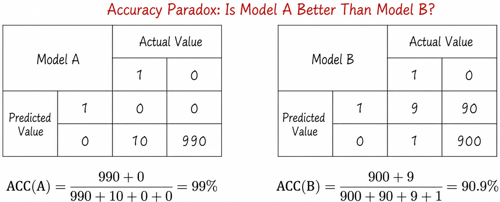
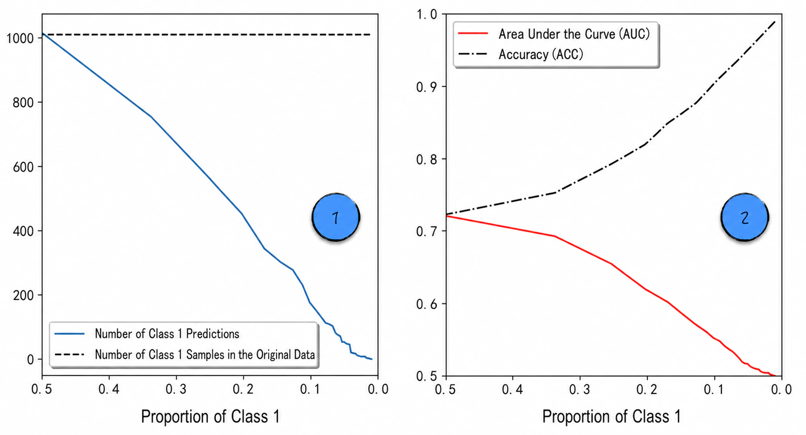
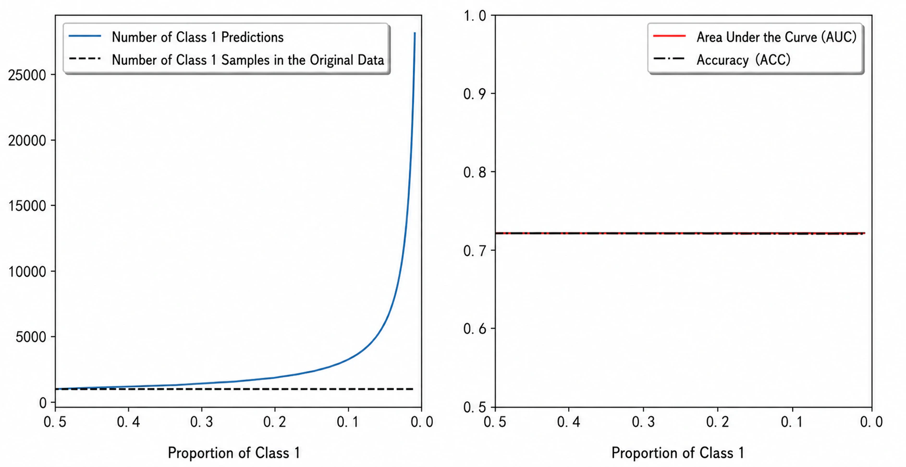

## 4.4 Imbalanced Datasets

When logistic regression is used for binary classification, we often face the challenge of **imbalanced data**. In a classification problem, a dataset is imbalanced when the proportions of samples in its classes differ substantially.

Imbalanced datasets are common in practice. In online advertising, for example, a model may predict whether a user will click an advertisement on a webpage. “Clicking the advertisement” is defined as class 1 and “not clicking” as class 0. Class 1 usually accounts for a very small proportion of the data, perhaps only about one observation in a thousand. This imbalance creates additional modeling difficulties. If handled carelessly, it may render the model's predictions meaningless. Before examining the topic in depth, we briefly digress to discuss the **accuracy paradox**.

### 4.4.1 The Accuracy Paradox

The accuracy paradox refers to the misleading results that may arise when model evaluation on an imbalanced dataset relies only on accuracy. The paradox is especially pronounced in this setting. According to Table 4-2, true positives (TP) and true negatives (TN) are correct predictions, while the other two categories are incorrect. This gives the following model-evaluation metric, **accuracy** (ACC):

$$
ACC=\frac{TP+TN}{TP+FP+FN+TN}
\tag{4-27}
$$

Accuracy appears reasonable, but with an imbalanced dataset it can become severely biased or even meaningless. Consider a dataset containing 1,000 observations, of which 990 belong to class 0 and the remaining 10 to class 1, as shown in Figure 4-20.



Model A predicts class 0 for every observation and therefore provides no useful predictions. Nevertheless, its accuracy is as high as 99%. Model B actually performs quite well: it correctly predicts 9 of the 10 class 1 observations and 900 of the 990 class 0 observations. Yet its accuracy is only 90.9%, far below that of Model A.

This is the accuracy paradox: with an imbalanced dataset, accuracy heavily favors the majority class and distorts the model's predictive performance. This is why [Section 4.3](/books/deconstructing_LLM/chapter-4/4-3) did not introduce accuracy as an evaluation metric. In fact, the area under the curve (AUC) discussed in [Section 4.3.4](/books/deconstructing_LLM/chapter-4/4-3#section-4-3-4) remains stable on imbalanced datasets and does not suffer from the pronounced bias of the accuracy paradox.

### 4.4.2 The Effect on Model Performance

An imbalanced dataset not only causes the accuracy paradox but also seriously affects model performance. A simple example illustrates the problem. Generate data according to Equation (4-28), where $y$ is the label, $x_1$ and $x_2$ are features, and $\varepsilon$ is a random disturbance that follows the logistic distribution.

$$
y=
\begin{cases}
1,&x_1-x_2+\varepsilon>0\\
0,&\text{otherwise}
\end{cases}
\tag{4-28}
$$

The generated data perfectly satisfies the assumptions of logistic regression. In theory, modeling it with logistic regression should produce excellent results. When the dataset is balanced—that is, when the proportion of class 1 is approximately 0.5—the model does perform well. When the proportion of class 1 approaches 0 and the dataset becomes imbalanced, however, performance deteriorates sharply. Although the number of class 1 observations remains constant, the model predicts almost everything as class 0, as shown by label 1 in Figure 4-21 ([Complete Code](https://github.com/GenTang/regression2chatgpt/blob/en/ch04_logit/imbalanced_data.ipynb)). In other words, the model loses almost all practical predictive value on an imbalanced dataset. Yet as [Section 4.4.1](/books/deconstructing_LLM/chapter-4/4-4#section-4-4-1) explains, accuracy (ACC) fails to reveal the problem and instead gives the distorted impression that the model performs well. AUC, by contrast, remains stable on the imbalanced dataset and evaluates performance accurately, as label 2 in Figure 4-21 shows.



The example above intuitively demonstrates how an imbalanced dataset affects model performance. We now examine the mathematical reason. Suppose class 0 occupies a very high proportion of a binary-classification dataset. Near a point $\mathbf X$, assume there are $k$ observations from class 0 and one from class 1. For simplicity, further suppose these points are so close to $\mathbf X$ that they can be approximated as equal to it. Referring to [Section 4.1.4](/books/deconstructing_LLM/chapter-4/4-1#section-4-1-4) and [Section 4.1.5](/books/deconstructing_LLM/chapter-4/4-1#section-4-1-5), the logistic regression loss function is

$$
\begin{aligned}
P(y_i=1)=h(\mathbf X_i)&=\frac{1}{1+e^{-\mathbf X_i\boldsymbol\beta}}\\
LL&=-\frac{1}{n}\sum_{i=1}^{n}\left[y_i\ln h(\mathbf X_i)+(1-y_i)\ln(1-h(\mathbf X_i))\right]
\end{aligned}
\tag{4-29}
$$

Under this setup, the loss on the class 1 observation is $-\ln h(\mathbf X)$, so class 1 pushes the model to increase $h(\mathbf X)$. The loss on each class 0 observation is $-\ln[1-h(\mathbf X)]$, which pushes in the opposite direction and seeks to reduce $h(\mathbf X)$. The total loss on these observations is $-\ln h(\mathbf X)-k\ln[1-h(\mathbf X)]$. The model consequently reduces the overall loss by lowering $h(\mathbf X)$: it chooses to “sacrifice” class 1 to satisfy the demands of class 0. This bias becomes more pronounced as $k$ increases.

Although this discussion is based on logistic regression, the conclusion also applies to other classification models introduced in later chapters.

### 4.4.3 Solutions

A common solution for imbalanced datasets is to adjust the weights of different classes in the loss function. For logistic regression, rewrite the loss function as Equation (4-30).

$$
LL=-\frac{1}{n}\sum_{i=1}^{n}\left[w_1y_i\ln h(\mathbf X_i)+w_0(1-y_i)\ln(1-h(\mathbf X_i))\right]
\tag{4-30}
$$

Here, $w_0$ and $w_1$ are class weights. When class 1 has a low proportion, increasing $w_1$ makes the model more sensitive to losses on class 1 and balances the influence of the classes. Class weights are commonly set to the reciprocals of the class proportions. Lines 1 and 2 of Listing 4-4 show the calculation. After the weights are adjusted, the training data appears balanced from the model's perspective.

#### Listing 4-4 Imbalanced Datasets ([Complete Code](https://github.com/GenTang/regression2chatgpt/blob/en/ch04_logit/imbalanced_data.ipynb))

```python
positive_weight = len(_y[_y > 0]) / float(len(_y))
class_weight = {1: 1. / positive_weight, 0: 1. / (1 - positive_weight)}
# Set the penalty coefficient to a large value to eliminate interference from regularization
model = LogisticRegression(class_weight=class_weight, C=1e4)
model.fit(_x, _y.ravel())
```

The result of the reweighted model is shown on the left side of Figure 4-22: the model incorrectly predicts many class 0 observations as class 1. This is consistent with our expectation. Increasing the weight of class 1 makes the model place greater emphasis on class 1 at the expense of class 0. The adjusted model has a larger AUC and performs better than the original. Note that ACC and AUC are almost equal, so their curves nearly overlap on the right side of Figure 4-22.



Weight adjustment is not the only solution for imbalanced datasets. Other methods include undersampling the majority class and oversampling the minority class. Interested readers can consult other resources for further information.
