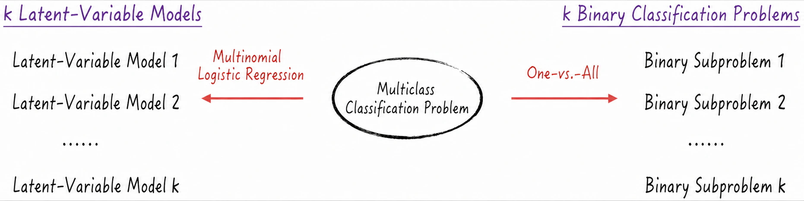
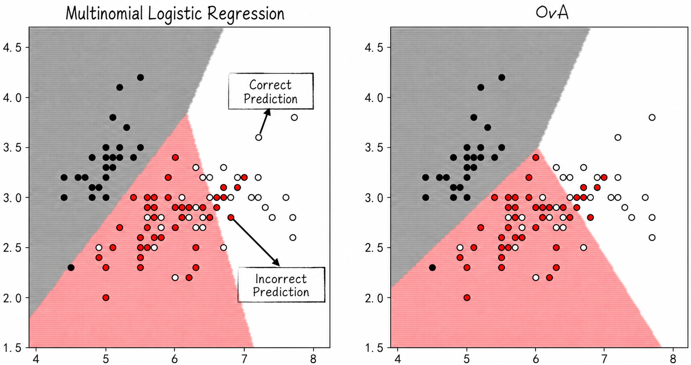

## 4.5 Multiclass Classification: Beyond Yes or No

Practical applications often involve multiclass classification, in which there are more than two classes to predict. On an e-commerce website, for example, users might be divided into ordinary users, premium users, and users at risk of leaving. Can logistic regression handle such multiclass problems? Yes, but the model must be adjusted appropriately. There are two common approaches. One changes the model structure to produce **multinomial logistic regression**. The other leaves the model structure unchanged but adds steps that transform the multiclass problem into multiple binary-classification problems; the classic example is **One-vs.-All** (OvA)[^one-vs-one]. The following sections discuss both approaches in detail.

### 4.5.1 Multinomial Logistic Regression

Suppose a multiclass problem has $k$ classes, denoted by $0,1,\cdots,k-1$. Following the reasoning of [Section 4.1.2](/books/deconstructing_LLM/chapter-4/4-1#section-4-1-2), modify the assumptions of the latent-variable model as follows:

$$
\begin{cases}
Y_{i,0}^*=\mathbf X_i\boldsymbol\theta_0+\varepsilon_0\\
Y_{i,1}^*=\mathbf X_i\boldsymbol\theta_1+\varepsilon_1\\
\qquad\vdots\\
Y_{i,k-1}^*=\mathbf X_i\boldsymbol\theta_{k-1}+\varepsilon_{k-1}
\end{cases}
\tag{4-31}
$$

Here, $Y_{i,j}^*$ is the latent variable for data point $i$ and class $j$, which can be understood as the utility of class $j$ for data point $i$; $\mathbf X_i$ contains the features of data point $i$; $\boldsymbol\theta_j$ contains the parameters of the corresponding linear model; and $\varepsilon_j$ is a random disturbance following the standard Type I extreme value distribution[^extreme-value], written as $\varepsilon_j\sim EV_1(0,1)$.

As in the binary derivation, data point $m$ belongs to class $l$ if and only if the utility of class $l$ for that data point exceeds the utilities of all other classes—that is, $Y_{m,l}^*=\max_jY_{m,j}^*$. Let $Y_m=l$ mean that data point $m$ belongs to class $l$. Then

$$
\begin{cases}
P(Y_i=0)=P(Y_{i,0}^*=\max_jY_{i,j}^*)\\
P(Y_i=1)=P(Y_{i,1}^*=\max_jY_{i,j}^*)\\
\qquad\vdots\\
P(Y_i=k-1)=P(Y_{i,k-1}^*=\max_jY_{i,j}^*)
\end{cases}
\tag{4-32}
$$

After a series of complex mathematical derivations, we obtain explicit expressions for the probabilities of the classes:

$$
\begin{cases}
P(Y_i=1)=P(Y_i=0)e^{\mathbf X_i\boldsymbol\beta_1}
=\dfrac{e^{\mathbf X_i\boldsymbol\beta_1}}{1+\sum_{j=1}^{k-1}e^{\mathbf X_i\boldsymbol\beta_j}}\\
P(Y_i=2)=P(Y_i=0)e^{\mathbf X_i\boldsymbol\beta_2}
=\dfrac{e^{\mathbf X_i\boldsymbol\beta_2}}{1+\sum_{j=1}^{k-1}e^{\mathbf X_i\boldsymbol\beta_j}}\\
\qquad\vdots\\
P(Y_i=0)=\dfrac{1}{1+\sum_{j=1}^{k-1}e^{\mathbf X_i\boldsymbol\beta_j}}
\end{cases}
\tag{4-33}
$$

Multinomial logistic regression is clearly very similar to ordinary logistic regression. When $k=2$, Equation (4-33) for multinomial logistic regression reduces to Equation (4-9) for logistic regression. Logistic regression can therefore be regarded as a special case of multinomial logistic regression. As with logistic regression, we can derive a parameter likelihood function from the class probabilities and then estimate the parameters by maximum likelihood. The likelihood function for multinomial logistic regression is shown in Equation (4-34), where $1_{\{Y_i=j\}}$ is an indicator function: it equals 1 when $Y_i=j$ and 0 otherwise.

$$
\begin{aligned}
L=P(\mathbf Y\mid\boldsymbol\beta)
&=\prod_i\prod_{j=0}^{k-1}P(Y_i=j)^{1_{\{Y_i=j\}}}\\
\ln L&=\sum_i\sum_{j=0}^{k-1}1_{\{Y_i=j\}}\ln P(Y_i=j)
\end{aligned}
\tag{4-34}
$$

### 4.5.2 One-vs.-All: From Binary to Multiclass

Although a multiclass problem involves several classes, if we focus on one particular class—class 1, for example—the data has only two possible states: belonging to class 1 or not belonging to class 1[^ova-imbalance]. This is the familiar binary-classification problem.

Extending this reasoning to every class produces the One-vs.-All strategy. Specifically, suppose the multiclass problem has $k$ classes, denoted by $0,1,\cdots,k-1$. Build an independent model for each class, decomposing the original $k$-class problem into $k$ binary-classification problems. Continuing the notation above, let $Y_i=j$ mean that data point $i$ belongs to class $j$, and generate $k$ new label variables:

$$
\tilde Y_{i,j}=
\begin{cases}
1,&Y_i=j\\
0,&Y_i\neq j
\end{cases}
\tag{4-35}
$$

Apply logistic regression in turn to each dataset $\{\mathbf X_i,\tilde Y_{i,j}\}$. The corresponding prediction—the probability that data point $i$ belongs to class $j$ in the new binary setting—is denoted by $\hat P_j(\tilde Y_{i,j}=1)$:

$$
\hat P_j(\tilde Y_{i,j}=1)=\frac{1}{1+e^{\mathbf X_i\hat{\boldsymbol\varphi}_j}}
\tag{4-36}
$$

Here, $\hat{\boldsymbol\varphi}_j$ is the parameter estimate of the $j$th logistic regression model. A different letter is used to distinguish it from the model in [Section 4.5.1](/books/deconstructing_LLM/chapter-4/4-5#section-4-5-1).

To some extent, $\hat P_j(\tilde Y_{i,j}=1)$ in Equation (4-36) represents the probability that the final label $Y_i$ equals $j$. We therefore select the class with the largest probability as the final prediction.

$$
\begin{aligned}
\hat Y_i=j
&\Longleftrightarrow
\hat P_j(\tilde Y_{i,j}=1)=\max_t\hat P_t(\tilde Y_{i,t}=1)\\
\hat Y_i&=\operatorname*{argmax}_t\hat P_t(\tilde Y_{i,t}=1)
\end{aligned}
\tag{4-37}
$$

Figure 4-23 presents the two approaches to multiclass classification as intuitive workflows.



### 4.5.3 Model Implementation

Although the theoretical derivations of these two methods involve complex mathematics, implementing them with scikit-learn is relatively simple. As lines 6 and 9 of Listing 4-5 show, we need only set the `multi_class` parameter correctly: `multinomial` selects multinomial logistic regression, and `ovr` selects One-vs.-All.

#### Listing 4-5 Multiclass Classification ([Complete Code](https://github.com/GenTang/regression2chatgpt/blob/en/ch04_logit/multi_logit_example.ipynb))

```python
from sklearn.linear_model import LogisticRegression

# Model a multiclass problem with logistic regression and visualize the results
features = ['x1', 'x2']
labels = 'label'
methods = ['multinomial', 'ovr']
# Model the data using two different methods
for i in range(len(methods)):
    model = LogisticRegression(multi_class=methods[i])
    model.fit(data[features], data[labels])
    ......
```

Training on a dataset with three classes produces the results in Figure 4-24.



In Figure 4-24, circles with black outlines represent the original data, and their fill colors indicate their classes. The three background colors represent model predictions. A circle whose fill color matches the background is classified correctly; otherwise, it is classified incorrectly. Visually, the two methods produce slightly different but broadly similar results. Mathematically, each method has advantages and disadvantages, and neither is absolutely superior.

[^one-vs-one]: In addition to the One-vs.-All method introduced here, which some literature calls One-vs.-Rest (OvR), another strategy is One-vs.-One. It decomposes a classification problem with $k$ classes into $k(k-1)/2$ binary-classification problems. Every pair of classes is combined, and a binary classifier such as logistic regression distinguishes between them. The final prediction is then obtained from the results of the binary classifiers through a voting-like procedure.
[^extreme-value]: In statistics, an extreme value distribution can be regarded as an extension of the normal distribution. Its probability density resembles that of a normal distribution but has heavier tails, meaning that extreme values occur with higher probability. This makes extreme value distributions widely useful in finance, especially when financial markets are volatile and risks are elevated. After the 2008 financial crisis, they were often used to guard against rare but consequential “black swan” events. There are several types of extreme value distribution. The Type I extreme value distribution, also called the Gumbel distribution, has probability density function $EV_1(\mu,\beta)=\frac{1}{\beta}e^{\frac{x-\mu}{\beta}}e^{-e^{\frac{x-\mu}{\beta}}}$.
[^ova-imbalance]: The split between data belonging to class 1 and data not belonging to class 1 can easily become imbalanced, so One-vs.-All frequently encounters the imbalanced-data problem. See [Section 4.4](/books/deconstructing_LLM/chapter-4/4-4) for solutions.
