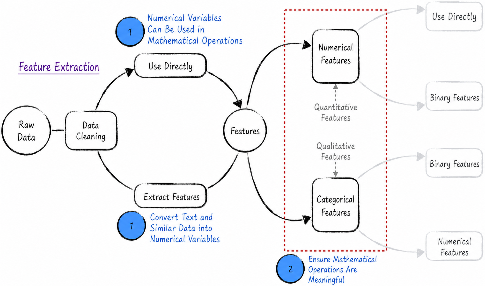

## 5.1 Quantitative and Qualitative Features: Are Mathematical Operations on Features Meaningful?

At its core, a model performs mathematical operations on data. For its computations to be meaningful, two conditions must hold. First, the data must be computable. Second, the mathematical operations performed on the features (independent variables) must be reasonable and valid. Data used for modeling can generally be computed directly. In special settings such as natural language processing or image recognition, the raw data may require specific transformations, but these transformations are usually fairly straightforward.

Ensuring that the mathematical operations are meaningful is more complex and must be analyzed separately for different settings. In general, two aspects of feature operations require attention.

- The ordering relationships among numbers.
- The four basic arithmetic operations on numbers.

To explore these issues more clearly, the following discussion divides model features into two categories: numerical features and categorical features, as shown in Figure 5-1.

Numerical features, also called quantitative features, represent measurable or countable values such as length, income, and weight. The ordering relationships among their values are meaningful both mathematically and in real life. For example, an income of 100 is numerically less than 1,000, and in real life 100 yuan is likewise less than 1,000 yuan. Performing the four basic arithmetic operations on these values is also meaningful. Note, however, that numerical features often imply an assumption of a constant marginal effect (see [Section 4.2.3](/books/deconstructing_LLM/chapter-4/4-2#section-4-2-3) and [Section 5.3](/books/deconstructing_LLM/chapter-5/5-3)). In some settings, this assumption does not fully reflect reality, and using such features directly may impair model performance.

Categorical features, also called qualitative features, represent categories such as gender, province, education level, and product grade. Their values are usually text rather than numbers. Gender, for example, may take the values male or female. To use such a feature in a model, its text values must be converted to numbers, such as 1 for male and 0 for female. This simple conversion, however, does not fully meet the requirements of modeling.

- **Ordinal categorical features** have an intrinsic order. Consider product grades, where 0 denotes acceptable, 1 good, and 2 excellent. Here, “0 is less than 1” does correspond to “acceptable ranks below good,” but the four arithmetic operations no longer have corresponding practical meanings. Mathematically, 2 minus 1 equals 1, but does excellent minus good equal good when applied to product grades?
- **Nominal categorical features** have no intrinsic order. Consider a variable representing regions, where 0 denotes Beijing, 1 Shanghai, 2 Shenzhen, and so on. Neither the ordering relationships among these numbers nor arithmetic operations on them have any practical meaning.

Therefore, even after a simple conversion, using categorical features directly in a model is meaningless and may even severely impair model performance.

In summary, both numerical and categorical features generally require transformations or other processing appropriate to the application before they are used in a model. The following sections examine the specific methods for handling each type of feature so that the data can be used appropriately.
