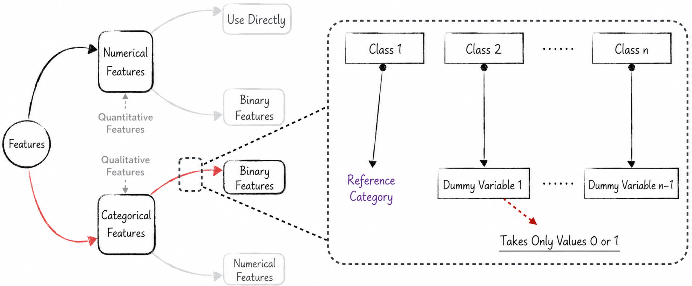
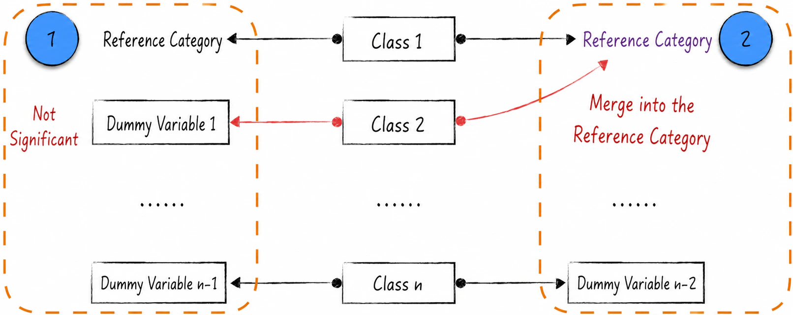
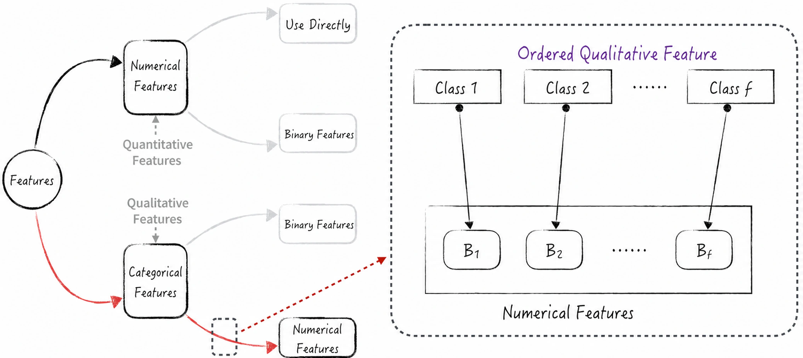

## 5.2 Processing Qualitative Features

There are generally two ways to process qualitative features: convert a qualitative feature into multiple dummy variables, or convert an ordinal qualitative feature into a quantitative feature.

- **Converting a qualitative feature into dummy variables**: This method separates each category of a qualitative feature into an individual dummy variable. Each dummy variable represents one category and takes the value 1 or 0 to indicate whether a sample belongs to that category. This transformation is common in classification tasks.
- **Converting an ordinal feature into a quantitative feature**: If a qualitative feature has an intrinsic order, it can in some settings be converted into a quantitative feature. This preserves its ordering information while giving the four arithmetic operations some practical meaning.

### 5.2.1 Dummy Variables

As discussed above, directly encoding a qualitative feature as numbers produces a variable on which meaningful mathematical operations are difficult to perform. One solution is to convert the qualitative feature into multiple dummy variables.

Consider a simple example: suppose height and gender are used to build a linear regression model that predicts body weight. Gender is a binary qualitative feature whose possible values are male and female. To use this feature in the model, replace gender with two newly generated variables, $x_1$ and $x_2$. These are called dummy variables. Here, $x_1=1$ means male and $x_1=0$ means not male; similarly, $x_2$ indicates whether the individual is female. A dummy variable is a special discrete variable whose only possible values are 0 and 1, so it is also called a 0/1 feature.

Let $y$ denote body weight and $z$ denote height, and construct the following model:

$$
y=ax_1+bx_2+cz+d+\varepsilon
\tag{5-1}
$$

Note that $x_1+x_2\equiv1$, which means that $x_1$ and $x_2$ have a linear relationship. This gives rise to another problem: multicollinearity[^dummy-trap], which will be discussed in [Section 5.4](/books/deconstructing_LLM/chapter-5/5-4). To avoid this problem, transform Equation (5-1) as follows:

$$
\begin{aligned}
y&=a(x_1+x_2)+(b-a)x_2+cz+d+\varepsilon\\
&=(b-a)x_2+cz+(a+d)+\varepsilon
\end{aligned}
\tag{5-2}
$$

This transformation can be understood as follows. First, select male as the reference category and generate the one-dimensional dummy variable $x_2$, whose meaning is unchanged from above. The coefficient $b-a$ represents the difference in body weight between females and males, the reference category. For a binary qualitative feature, directly encoding the variable numerically and using a dummy variable may appear to produce the same result. This is merely a coincidence, however; the two methods are fundamentally different.

Generalize this method to an $n$-category qualitative feature, one with $n$ possible values. Select one category as the reference category (see [Section 5.4.4](/books/deconstructing_LLM/chapter-5/5-4#section-5-4-4) for guidance on this choice), and generate $n-1$ dummy variables to represent the remaining $n-1$ categories. When building the model, use these newly generated variables in place of the original qualitative feature. Figure 5-2 illustrates the process.

Implementing dummy variables in code is relatively straightforward, so readers can consult the book's companion code ([Complete Code](https://github.com/GenTang/regression2chatgpt/blob/en/ch05_econometrics/categorical_variable.ipynb)); the implementation is not developed further here. It is important to remember, however, that confidence intervals and hypothesis tests can also be used to select among the newly generated dummy variables. As label 1 in Figure 5-3 shows, a statistically insignificant dummy variable means that the category it represents does not differ significantly from the reference category. During modeling, the two should be merged to form a larger reference category, as label 2 in Figure 5-3 shows.

### 5.2.2 Converting Qualitative Features into Quantitative Features

The dummy-variable method described above is broadly applicable, but it has an obvious drawback: each dummy variable can take only the value 0 or 1 and therefore cannot convey more information. For ordinal qualitative features in particular, this method discards the ordering information among the feature's categories. To address this issue, a qualitative feature is often converted into a quantitative feature according to the order of its categories. This section focuses on one such method: Ridit scoring[^ridit] for binary classification.

Suppose the ordinal qualitative feature $x$ has $t$ possible categories, denoted $(1,2,\cdots,t)$. For the label $y$, assume that, with all other variables held constant, categories later in the order have a lower probability of $y=1$. In other words, under identical conditions, category 1 has the highest probability and category $t$ the lowest. Let $(p_1,p_2,\cdots,p_t)$ denote the proportions of the respective categories. The Ridit score of category $i$ is defined as follows:

$$
B_i=\sum_{j<i}p_j-\sum_{j>i}p_j
\tag{5-3}
$$

Using Equation (5-3), we can generate a numerical feature from the ordinal qualitative feature $x$. This numerical feature contains $t$ discrete values corresponding exactly to the $t$ values defined in the equation, as shown in Figure 5-4. The method preserves the ordering information of the qualitative feature more effectively while converting it into a numerical feature that the model can use.

Many similar methods convert qualitative features into quantitative ones, but none is broadly applicable. First, these methods generally apply only to ordinal qualitative features. Second, their fixed transformation formulas limit the settings in which they can be used. Artificial intelligence offers a more direct approach: use a neural network to convert qualitative features into quantitative ones. A classic example is word embedding in natural language processing, which [Section 10.2.2](/books/deconstructing_LLM/chapter-10/10-2#section-10-2-2) will discuss in detail. Introducing this neural-network example in advance emphasizes that qualitative features can be processed with more complex models rather than relying solely on experience or manually defined feature-transformation formulas.

[^dummy-trap]: In academic literature, multicollinearity caused by dummy variables is known as the dummy variable trap. See [Section 5.4.4](/books/deconstructing_LLM/chapter-5/5-4#section-5-4-4) for details.
[^ridit]: This method is widely used in the insurance industry. For details, see Brockett, P. L., et al. (2002), “Fraud Classification Using Principal Component Analysis of Ridits,” *Journal of Risk and Insurance*, 69(3), 341–371.
