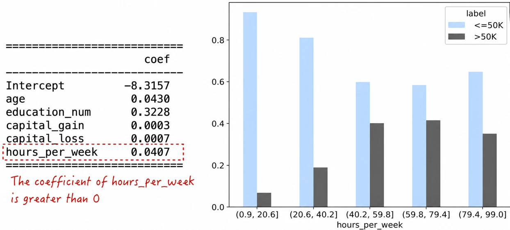
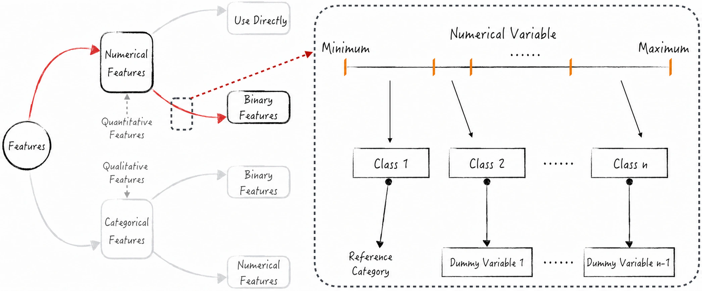
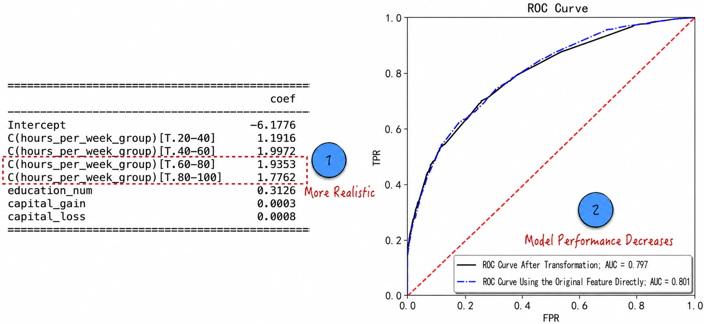
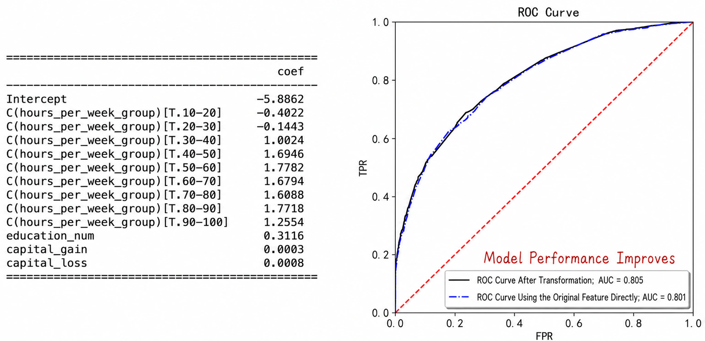
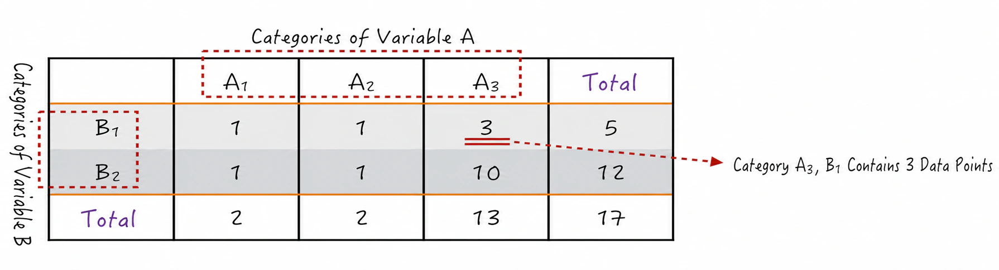
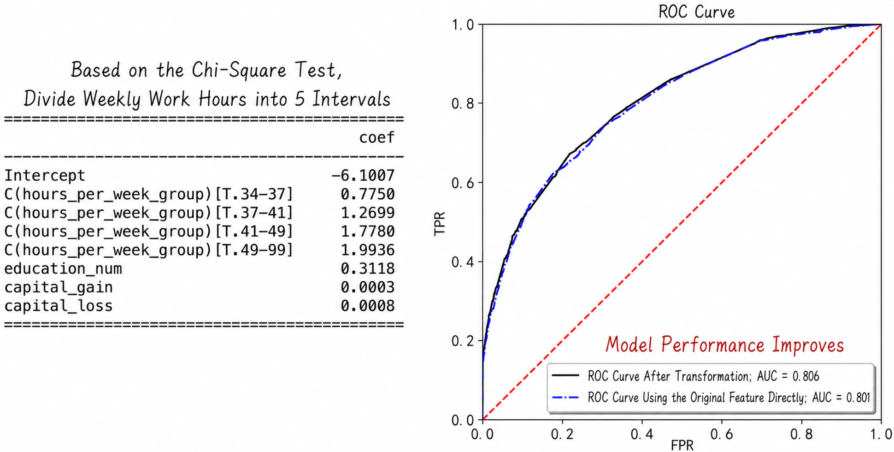

## 5.3 Processing Quantitative Features

This chapter continues to use the U.S. census data on individual income (see [Section 4.2](/books/deconstructing_LLM/chapter-4/4-2) for the data fields) to discuss how quantitative features are processed. Before examining the details, briefly review the logistic regression model from [Chapter 4](/books/deconstructing_LLM/chapter-4). Let $P(y_i=1)$ denote the probability that annual income exceeds USD 50,000. The logistic regression model can be expressed as follows:

$$
\ln\frac{P(y_i=1)}{1-P(y_i=1)}=\mathbf X_i\boldsymbol\beta
\tag{5-4}
$$

The ratio $P/(1-P)$ is called the odds of an event, and Equation (5-4) states that the logarithm of this ratio is a linear model. Using a quantitative feature directly implies that its marginal effect on the log-odds is constant. For example, if its coefficient in the model is greater than 0, the feature is always positively associated with the probability of the event, and vice versa. This implicit model assumption, however, does not always reflect reality.

For example, the model coefficient for hours worked per week is greater than 0, as shown on the left side of Figure 5-5. The cross-tabulation between hours worked per week and annual income above USD 50,000 appears on the right. When hours worked per week are below 80, the proportion of people earning more than USD 50,000 increases with working hours. Once working hours exceed 80, however, that proportion declines instead.

Mathematically, the implicit assumption of a constant marginal effect arises from two core factors: the linear model and the direct use of a quantitative feature. The fact that logistic regression contains a linear model cannot be changed. Moreover, as earlier chapters have discussed, almost every artificial intelligence model contains a linear model. The only way to address this issue is therefore to convert the quantitative feature into a qualitative feature by dividing its range into intervals. In practice, this is the most common and effective method. The following discussion examines its details.

### 5.3.1 Converting Quantitative Features into Qualitative Features

Converting a quantitative feature into a qualitative feature involves three main steps, as illustrated in Figure 5-6.

1. Divide the range of the quantitative feature into several intervals.
2. Define categories from these intervals and generate the corresponding qualitative feature.
3. Apply the first method for processing qualitative features to generate multiple dummy variables, which replace the transformed qualitative feature.

The idea behind this method is that the effect of a quantitative feature on the predicted value can be approximated as constant within a certain range. These “constant” ranges correspond to the intervals. Dividing the range usually requires domain knowledge of the business setting and the data scientist's experience.

Following this method, divide hours worked per week evenly into five intervals and build the model. Figure 5-7 shows the result ([Complete Code](https://github.com/GenTang/regression2chatgpt/blob/en/ch05_econometrics/continuous_variable.ipynb)). Although the model parameters better reflect reality (label 1 in Figure 5-7), model performance declines (label 2). When the quantitative feature is used directly, even a small difference in working hours affects the model's prediction. After the feature is converted into a qualitative one, differences in working hours do not necessarily affect the model's prediction.

For example, in the new model, working 30 hours and working 40 hours per week belong to the same category and therefore have the same feature value. Increasing the weekly total from 30 to 40 hours consequently does not change the model's prediction.

Converting a quantitative feature into a qualitative one reduces the expressive capacity of the data and therefore lowers model performance. Increasing the number of intervals can restore some of that information. Dividing hours worked per week into ten intervals, for example, improves the model's predictive performance, as shown in Figure 5-8. More intervals, however, produce more dummy variables, making the model more complex and more susceptible to overfitting.

Because interval selection strongly affects model performance, can a more systematic engineering method help us find the best partition? The answer is yes. The following section introduces a binning method widely used in bank credit models.

### 5.3.2 Chi-Square-Based Binning

Before discussing how to partition a quantitative feature, first consider the chi-squared test. This test evaluates the association between two categorical variables, $A$ and $B$. It calculates a chi-squared statistic for the variables; the larger this statistic is, the stronger their association[^chi-square-test]. The statistic is calculated as follows.

- Define a contingency table for the two variables. This is the same type of cross-tabulation used frequently above. It is a two-dimensional table in which the rows represent one variable and the columns represent the other, as shown in Figure 5-9.
- Use the contingency table to obtain the distribution of each variable, such as $P(A=A_3)=13/17$ and $P(B=B_1)=5/17$. Assuming $A$ and $B$ are independent, calculate the probability and expected value for each cell. For $A=A_3,B=B_1$, for example, these values follow from Equation (5-5).

$$
\begin{aligned}
P(A=A_3,B=B_1)&=P(A=A_3)P(B=B_1)=\frac{5\times13}{17\times17}\\
E_{3,1}&=17\times P(A=A_3,B=B_1)\approx3.82
\end{aligned}
\tag{5-5}
$$

- Building on Equation (5-5), define a statistic for each cell as shown in Equation (5-6), where $V_{3,1}$ is the observed value and $E_{3,1}$ is the expected value. Summing these cell statistics gives the chi-squared statistic $T=\sum T_{i,j}$. The statistic $T$ follows a chi-squared distribution[^chi-square-distribution] with $(3-1)\times(2-1)=2$ degrees of freedom.

$$
T_{3,1}=\frac{(V_{3,1}-E_{3,1})^2}{E_{3,1}}=\frac{(3-3.82)^2}{3.82}
\tag{5-6}
$$

With these mathematical tools in place, we can now partition the quantitative feature. In a classification problem, the target variable is categorical, and the qualitative feature produced by binning is also categorical. The objective of the partition is therefore to maximize the chi-squared statistic between these two variables—in other words, to make the qualitative feature as strongly associated with the target as possible.

In an algorithmic implementation, a greedy algorithm can be used to obtain an “optimal” partition[^greedy] (see the book's [companion code](https://github.com/GenTang/regression2chatgpt/blob/en/ch05_econometrics/continuous_variable.ipynb) for implementation details, which are not discussed here). The resulting algorithm divides hours worked per week into five intervals: 1–34, 34–37, 37–41, 41–49, and 49–99. A model built from this partition achieves better predictive performance, as shown in Figure 5-10.

[^chi-square-test]: The chi-squared test is fundamentally a hypothesis test. Its null hypothesis states that the two variables are independent. A larger chi-squared statistic corresponds to a smaller p-value. When the p-value falls below a threshold, the null hypothesis of independence can be rejected. As an approximation, therefore, a larger chi-squared statistic indicates a stronger association between the variables.
[^chi-square-distribution]: The chi-squared distribution is a probability distribution commonly used in probability theory and statistics. Suppose $Z_1,Z_2,\cdots,Z_k$ are $k$ mutually independent standard normal variables with mean 0 and standard deviation 1. If $X=\sum_{i=1}^{k}Z_i^2$, then $X$ follows a chi-squared distribution with $k$ degrees of freedom.
[^greedy]: A greedy algorithm does not always guarantee a theoretically optimal result.
