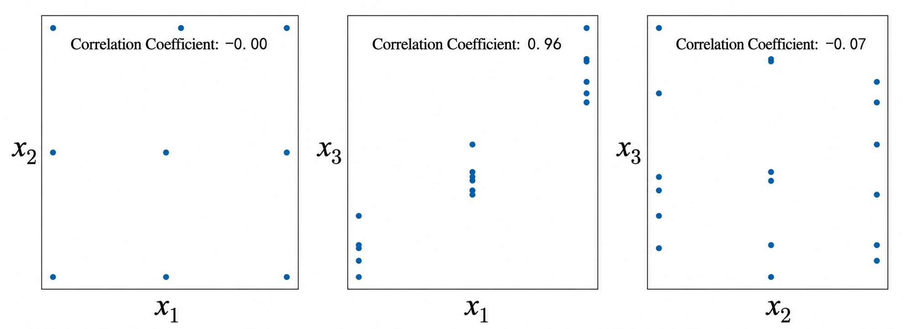
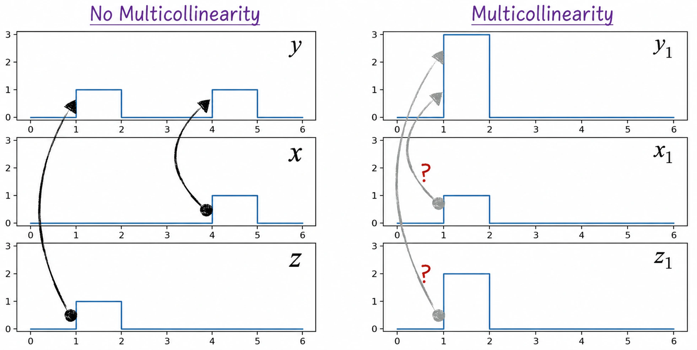
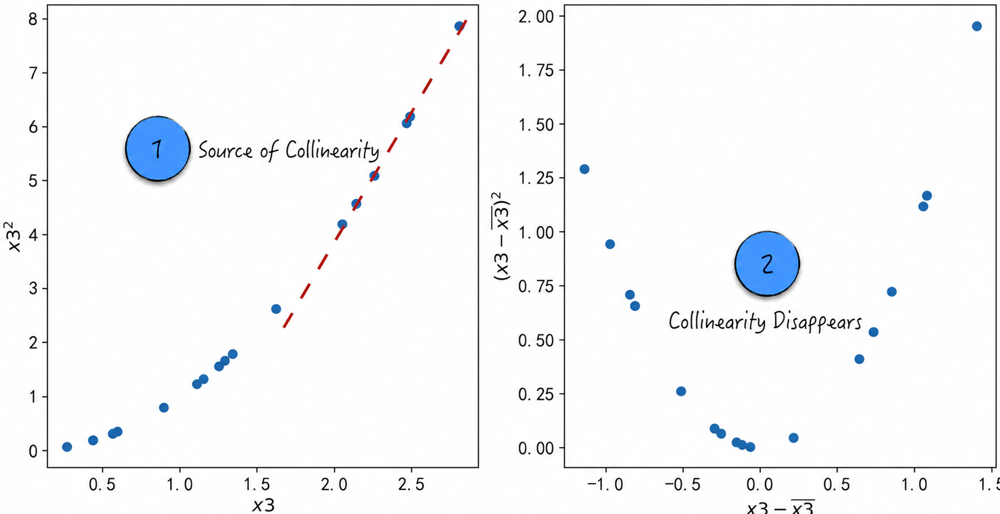

## 5.4 Multicollinearity: The Trouble with Multiple Variables

Multicollinearity, also called collinearity, emerged from the in-depth study of linear regression models. In a multivariable linear model, it refers to strong relationships among features that make coefficient estimates inaccurate. Although multicollinearity was originally studied in the context of linear models, it affects almost every model in practice; [Section 5.4.1](/books/deconstructing_LLM/chapter-5/5-4#section-5-4-1) explains why. Because the problem is so common, analytical tools from linear models are often used to detect and address multicollinearity among features even when other models are being built. This section focuses primarily on linear regression.

### 5.4.1 Effects of Multicollinearity

A synthetic example illustrates the effect of multicollinearity on parameter estimation. Suppose a dataset contains one target variable, $y$, and three feature variables, $x_1,x_2,x_3$. Equation (5-7) gives the relationship between the target and the features, where $\varepsilon$ is a random disturbance. This equation is, of course, unknown when the model is built.

$$
y=0.7x_1-1.1x_2+0.3x_3+\varepsilon
\tag{5-7}
$$

In this dataset, $x_1$ and $x_2$ are uncorrelated, with a correlation coefficient of 0. The variables $x_1$ and $x_3$ are highly correlated, with a correlation coefficient[^pearson] of 0.958, approximately 0.96, as shown in Figure 5-11.

First, use the uncorrelated variables $x_1$ and $x_2$ to build the following three linear regression models:

$$
\begin{aligned}
y&=a_1x_1+b+\varepsilon\\
y&=a_2x_2+b+\varepsilon\\
y&=a_1x_1+a_2x_2+b+\varepsilon
\end{aligned}
\tag{5-8}
$$

Table 5-1 lists the parameter estimates for these models ([Complete Code](https://github.com/GenTang/regression2chatgpt/blob/en/ch05_econometrics/multicollinearity.ipynb)).

Table 5-1

| Model | Estimate of $a_1$ | Standard Error of $a_1$ | Is $a_1$ Significant (5%)? | Estimate of $a_2$ | Standard Error of $a_2$ | Is $a_2$ Significant (5%)? |
|:--:|:--:|:--:|:--:|:--:|:--:|:--:|
| $x_1$ only | 0.972 | 0.279 | Yes | — | — | — |
| $x_2$ only | — | — | — | -1.113 | 0.244 | Yes |
| $x_1$ and $x_2$ | 0.972 | 0.021 | Yes | -1.113 | 0.021 | Yes |

Table 5-1 supports the following conclusions.

1. The estimate of model parameter $a_1$ remains unchanged regardless of whether the new variable $x_2$ is included. The same conclusion applies to model parameter $a_2$.
2. After $x_2$ is introduced, the standard error of the estimate of $a_1$—more precisely, the estimated standard deviation of the parameter estimator—decreases. The same is true for $a_2$. Put simply, introducing a new uncorrelated variable reduces the standard errors of the estimates for the existing variables.
   Note that although this conclusion holds in most cases, the standard error of an existing variable's estimate may increase in certain circumstances even when that variable is unrelated to the newly introduced variable. It can be proved mathematically, however, that any such increase is negligible. The details lie beyond the scope of this book.
3. The purpose of examining the standard errors of parameter estimates is to assess variable significance. By conclusion 2, introducing a new uncorrelated variable usually does not affect the significance of the existing variables, although exceptions may occur in extreme cases.

In summary, when multiple variables are mutually uncorrelated, using them together to build a model is “safe.” For any one of these variables, including or excluding it does not affect the parameter estimates of the others. This is the ideal situation for model construction. Indeed, one assumption of linear regression is that the independent variables do not exhibit multicollinearity.

When the variables are strongly correlated, however, the situation changes. To investigate, use the highly correlated variables $x_1$ and $x_3$ to build the models in Equation (5-9).

$$
\begin{aligned}
y&=a_1x_1+b+\varepsilon\\
y&=a_3x_3+b+\varepsilon\\
y&=a_1x_1+a_3x_3+b+\varepsilon
\end{aligned}
\tag{5-9}
$$

Table 5-2 presents the results.

Table 5-2

| Model | Estimate of $a_1$ | Standard Error of $a_1$ | Is $a_1$ Significant (5%)? | Estimate of $a_3$ | Standard Error of $a_3$ | Is $a_3$ Significant (5%)? |
|:--:|:--:|:--:|:--:|:--:|:--:|:--:|
| $x_1$ only | 0.972 | 0.279 | Yes | — | — | — |
| $x_3$ only | — | — | — | 1.090 | 0.282 | Yes |
| $x_1$ and $x_3$ | -0.168 | 0.959 | No | 1.260 | 1.017 | No |

The results in Table 5-2 differ substantially from the previous conclusions.

1. The estimate of model parameter $a_1$ depends not only on $x_1$ but also on whether $x_3$ is included in the model. After $x_3$ is added, the relatively accurate estimate of 0.972 changes to -0.168, which deviates substantially from the true value.
2. Adding $x_3$ also causes the estimated standard error of $a_1$ to increase sharply, from 0.279 to 0.959. In other words, introducing a new, highly correlated variable increases the standard error of an existing variable. This conclusion also has exceptions.
3. Parameter $a_1$ was originally significant, but becomes insignificant after $x_3$ is added. This conclusion largely follows from point 2.

The discussion so far has established the effect of multicollinearity on linear regression: it makes coefficient estimates inaccurate[^unbiased].

If we set aside the structure of any particular model, the effect of multicollinearity can be understood more intuitively, though less precisely. Regardless of model type, a variable's parameter represents its influence on the target. When the variables in a model are mutually uncorrelated or only weakly correlated, the model can readily infer which variable caused a change in the target. On the left side of Figure 5-12, for example, $x$ and $z$ vary independently, so their relationships with $y$ are relatively clear and their model parameters can be estimated accurately.

When a model contains two or more strongly correlated variables, however, those variables always change together, making it difficult for the model to distinguish which one caused a change in the target. On the right side of Figure 5-12, if $x_1$ and $z_1$ are correlated and vary together, their respective relationships with $y_1$ cannot be determined accurately. Multicollinearity therefore impairs the accuracy of parameter estimation in every type of model.

### 5.4.2 Detecting Multicollinearity

This section discusses how to detect collinearity among variables. For two variables, correlation measures are normally used. For multiple variables, collinearity is typically analyzed through hypothesis tests for linear models and the variance inflation factor.

Tests involving two variables fall into three categories, depending on the variable types.

1. **Two quantitative variables**: Use a correlation coefficient and its corresponding p-value. The Pearson product-moment correlation coefficient or Spearman's rank correlation coefficient[^spearman] is commonly used. These coefficients range from $-1$ to $1$. A value near 0 indicates that the variables are nearly independent, a value near 1 indicates positive correlation, and a value near -1 indicates negative correlation. If the coefficient differs significantly from 0, as determined with reference to its p-value, a collinearity problem exists.
2. **Two qualitative variables**: Use the chi-squared statistic and corresponding p-value from a chi-squared test. See [Section 5.3.2](/books/deconstructing_LLM/chapter-5/5-3#section-5-3-2) for details.
3. **A quantitative variable $A$ and a qualitative variable $B$**: Use $\eta^2$ from a one-way ANOVA[^anova-code]. One-way ANOVA is a hypothesis-testing technique commonly used to determine whether the means of multiple groups differ significantly. Specifically, treat quantitative variable $A$ as the response and qualitative variable $B$ as the feature, build a linear regression model, and conduct a one-way ANOVA.
   The measure $\eta^2$ represents the proportion of variation in $A$ that can be explained[^eta-square] by $B$. A value near 1 indicates collinearity between the two variables.

Two methods are commonly used to detect collinearity among multiple variables: hypothesis testing and the variance inflation factor.

The idea behind hypothesis testing is that when several variables are individually insignificant but jointly significant, multicollinearity exists among them. Earlier chapters discussed the technical details of hypothesis testing, so they are not repeated here.

We now focus on the variance inflation factor. Traditionally, this measure quantifies the inflation in the variance of coefficient estimates. Consider the following linear regression model:

$$
y=\beta_0+\beta_1x_1+\cdots+\beta_kx_k+\varepsilon
\tag{5-10}
$$

The variance of $\varepsilon$ is $\sigma^2$. For parameter $\beta_1$, with the other parameters treated similarly, mathematical derivation gives the estimated variance of its estimator, denoted $\widehat{\operatorname{Var}}(\hat\beta_1)$:

$$
\widehat{\operatorname{Var}}(\hat\beta_1)=\frac{\sigma^2}{\operatorname{Var}(x_1)}\frac{1}{1-R_1^2}
\tag{5-11}
$$

Here, $R_1^2$ is the coefficient of determination for the linear regression model in Equation (5-12).

$$
x_1=\alpha_0+\alpha_2x_2+\cdots+\alpha_kx_k+e
\tag{5-12}
$$

As [Chapter 3](/books/deconstructing_LLM/chapter-3) explains, the coefficient of determination for a linear model measures its explanatory power. The closer $R_1^2$ is to 1, the better the model fits. This also means that variation in $x_1$ can be explained almost completely by the other variables. In other words, the data exhibits severe multicollinearity, and $x_1$ is one of the variables responsible for it. Conversely, if $R_1^2$ is close to 0, adding $x_1$ to the model will not cause a collinearity problem.

The variance inflation factor $\operatorname{VIF}_i$ for $x_i$ is therefore defined by Equation (5-13). A value greater than 5 generally indicates clear collinearity involving the corresponding variable. The central idea of this test is to examine the extent to which one variable can be expressed as a linear combination of the others.

$$
\operatorname{VIF}_i=\frac{1}{1-R_i^2}
\tag{5-13}
$$

These are the methods commonly used to detect multicollinearity. Applying them to the data in [Section 5.4.1](/books/deconstructing_LLM/chapter-5/5-4#section-5-4-1) yields reasonable conclusions; see the book's companion code for the implementation ([Complete Code](https://github.com/GenTang/regression2chatgpt/blob/en/ch05_econometrics/multicollinearity.ipynb)). If the data is found to have this problem, how should it be addressed? The next section considers the available solutions.

### 5.4.3 Solutions

For convenience, this section continues to use the dataset from [Section 5.4.1](/books/deconstructing_LLM/chapter-5/5-4#section-5-4-1). Before examining specific solutions, first classify the causes of multicollinearity. They fall into two categories: data-driven collinearity and structural collinearity. The preceding discussion focused mainly on data-driven collinearity, the more common type. Structural collinearity is caused by feature extraction. For example, generating the new variable $x_3^2$ from $x_3$ can readily produce collinearity between $x_3$ and $x_3^2$. Each type has its own corresponding solutions.

Data-driven multicollinearity is complex and has no universal solution. It must be analyzed in the context of the particular setting. The following discussion briefly introduces five common approaches.

1. **Increase the amount of training data**

   Increasing the amount of training data is both the most effective and the least effective way to address multicollinearity. Multicollinearity affects a linear model by increasing the variance of its parameter estimates, thereby making those estimates unstable. More training data can stabilize parameter estimation, a conclusion that also holds for other models. In this sense, it is the most effective solution.

   In practice, however, increasing the amount of training data is constrained by factors such as data-collection costs. Sometimes obtaining more data is nearly impossible. Moreover, collecting additional training data lies outside model construction and is closer to a business or economic problem. From this perspective, it may be the least effective solution.

2. **Remove unimportant variables**

   If the dataset contains highly correlated variables such as $x_1$ and $x_3$, consider removing one of them—$x_3$, for example—from the model to eliminate the collinearity. This approach carries some risk because removing a variable causes information loss. It may also be difficult to determine which variable is more important, creating the possibility that an important variable will be removed by mistake.

3. **Reduce dimensionality**

   If the data exhibits collinearity, generate a smaller set of new features from the original variables and build the model with those features. For example, generate $x_4$ from $x_1$ and $x_3$, then use $x_4$ to build the model. The new features should preserve as much information from the original variables as possible. Dimensionality reduction can achieve this objective, and principal component analysis (PCA) is one of its most common algorithms.

4. **Add a penalty term**

   For linear regression specifically, a penalty term can be added to mitigate the effect of collinearity. In particular, adding an L2 penalty to a linear regression model—that is, using ridge regression—can address collinearity quite effectively. See [Section 4.3.2](/books/deconstructing_LLM/chapter-4/4-3#section-4-3-2) for the relevant code.

5. **Adopt the ostrich policy**[^ostrich]

   Put simply, the ostrich policy means ignoring the collinearity problem. Although this does not solve the problem, it is reasonable in some situations. For known data, for example, multicollinearity has almost no effect on model predictions. Ignoring it is therefore acceptable in that setting.

For structural collinearity, an additional engineering-oriented solution is available beyond the five methods above: variable normalization. Consider $x_3$ and $x_3^2$. As label 1 in Figure 5-13 shows, far from the origin, $x_3$ and $x_3^2$ almost form a straight line. This is the source of structural collinearity. The solution is to move the variable values as close to the origin as possible, as shown by label 2 in Figure 5-13.

Normalize the variables by replacing $x_3$ with $(x_3-\bar x_3)/\operatorname{std}(x_3)$ and $x_3^2$ with $(x_3-\bar x_3)^2/\operatorname{Var}(x_3)$. The variance of $(x_3-\bar x_3)/\operatorname{std}(x_3)$ is 1, which is why the method is called variable normalization. After normalization, the variables are more concentrated near the origin.

In addition, the variables have roughly comparable scales, which facilitates model fitting[^normalization]. In practical modeling, variables are therefore usually normalized regardless of whether multicollinearity is present.

### 5.4.4 The Dummy Variable Trap

This section returns to qualitative features and examines a form of multicollinearity that they can introduce. As [Section 5.2.1](/books/deconstructing_LLM/chapter-5/5-2#section-5-2-1) discussed, a qualitative feature with multiple categories must be converted into multiple dummy variables. If handled improperly, these dummy variables can readily become collinear, producing what is known as the dummy variable trap.

An earlier section examined a simple case. To review, if a qualitative feature with $n$ categories is converted into $n$ dummy variables, the sum of those variables is always 1. Using all of them together therefore inevitably creates severe collinearity and may make the model parameters impossible to estimate. The usual solution is to select one of the $n$ categories as the reference category and convert the $n$-category qualitative feature into $n-1$ dummy variables.

This method appears to solve the problem, but if the reference category is chosen poorly, the generated dummy variables may still exhibit severe collinearity. If the selected reference category has a small proportion, most observations do not belong to it, so the generated dummy variables sum to 1 in most cases. Although their sum is not always 1, having it equal 1 most of the time can still cause severe collinearity.

A simple and effective solution is to select the most frequent of the $n$ categories as the reference category and generate $n-1$ dummy variables for the remaining categories. This method is not always effective, however. If a feature has a very large number of categories with a relatively uniform distribution, as with characters or words in natural language processing, any reference category may produce severe collinearity. In that case, the only options are to reduce the number of categories or use a method such as a neural network to convert the qualitative feature into a quantitative one.

[^pearson]: Here, correlation coefficient refers to the Pearson product-moment correlation coefficient. It is commonly used to measure the linear relationship between two variables, $X$ and $Y$, and ranges from -1 to 1. A value of 1 indicates perfect positive correlation, while -1 indicates perfect negative correlation. It is defined as $\rho_{X,Y}=\operatorname{Cov}(X,Y)/(\sigma_X\sigma_Y)$.
[^unbiased]: Strictly speaking, this conclusion is not entirely rigorous. Under multicollinearity, the parameter estimates of a linear regression model are actually unbiased: their expected values still equal the true values. Their standard deviations increase, however, so a particular estimate will in most cases be far from the true value. On this basis, multicollinearity can be said to make parameter estimates inaccurate. In addition, multicollinearity does not affect model performance on known data—the training data.
[^spearman]: Spearman's rank correlation coefficient is a common measure of association in statistics. It assesses the relationship between two statistical variables using a monotonic relationship and ranges from -1 to 1. If the data contains no tied values and the two variables have a perfectly monotonic relationship, Spearman's correlation coefficient is 1 or -1.
[^anova-code]: Analysis of variance (ANOVA) is a common statistical model in data analysis, used primarily to examine the relationship between a continuous variable and a categorical variable. For an implementation, see [one_way_anova.ipynb](https://github.com/GenTang/regression2chatgpt/blob/en/ch05_econometrics/one_way_anova.ipynb).
[^eta-square]: Suppose qualitative variable $B$ has $k$ categories, so quantitative variable $A$ is divided into $k$ groups according to the value of $B$. The total sum of squares for $A$, $SS_{\mathrm{total}}$, can be decomposed into the between-group sum of squares $SS_{\mathrm{between}}$ and the within-group sum of squares $SS_{\mathrm{within}}$. Define $\eta^2=SS_{\mathrm{between}}/SS_{\mathrm{total}}$. The value of $\eta^2$ lies between 0 and 1. When it equals 1, $A$ has a single constant value within each group; that is, the value of $A$ is determined completely by the value of $B$.
[^ostrich]: According to Wikipedia, an ostrich faced with danger closes its eyes and buries its head in the ground. Unable to see the danger, it believes the danger does not exist, even though its body remains exposed. The ostrich policy therefore means taking a passive approach when facing danger.
[^normalization]: See [Section 6.2.1](/books/deconstructing_LLM/chapter-6/6-2#section-6-2-1) for details.
