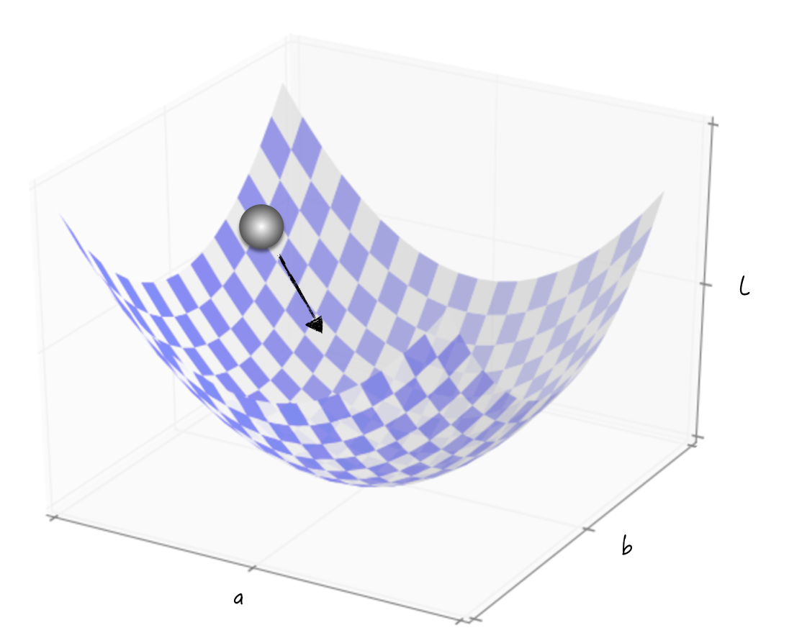

## 6.1 The Algorithmic Idea: Simulating Rolling

Stripped of their specific contexts and viewed mathematically, both supervised and unsupervised learning models have an associated loss function that contains several unknown model parameters. For a regression problem, for example, the loss function of linear regression is given by Equation (6-1). Here, $\boldsymbol{X}_i=(x_{i,1},x_{i,2},\cdots,x_{i,k},1)$ is the vector of independent variables, with 1 representing the constant term, and $\boldsymbol{\beta}=(a_1,a_2,\cdots,a_k,a_{k+1})^{\mathrm T}$ contains the unknown model parameters.

$$
L=\frac{1}{n}\sum_{i=1}^{n}\left(y_i-\boldsymbol{X}_i\boldsymbol{\beta}\right)^2
\tag{6-1}
$$

For a classification problem, the loss function of logistic regression is given by Equation (6-2), where $y_i\in\{0,1\}$ represents the class of an observation.

$$
\begin{aligned}
h(\boldsymbol{X}_i)&=\frac{1}{1+e^{-\boldsymbol{X}_i\boldsymbol{\beta}}}\\
L&=-\frac{1}{n}\sum_{i=1}^{n}\left[y_i\ln h(\boldsymbol{X}_i)+(1-y_i)\ln\left(1-h(\boldsymbol{X}_i)\right)\right]
\end{aligned}
\tag{6-2}
$$

Equation (6-1) is a Euclidean-distance-based loss function commonly used for regression. Equation (6-2) is defined from probability distributions and is commonly used for classification; in academic literature, it is called cross-entropy.

Regardless of its specific form, a loss function measures the model's prediction error, so smaller values are better. Closer examination shows that because the data used by the model is fixed, the value of the loss function depends entirely on the unknown model parameters. In Equations (6-1) and (6-2), for example, $\boldsymbol{X}_i$ and $y_i$ remain unchanged, while the value of $L$ depends entirely on $\boldsymbol{\beta}$. This gives the principle for estimating the unknown parameters: choose the values that minimize the loss function.

How can we find the minimum of a loss function? For convenience, suppose the loss is $L(a,b)=1/n\sum_{i=1}^{n}(y_i-ax_i-b)^2$. Readers with a strong mathematical background may notice that an analytical method quickly yields closed-form expressions for the parameter estimates[^least-squares], from which the estimates can be calculated directly. This is indeed possible in certain cases, but those cases are exceptions.

With real-world data and problems, loss functions usually have complex forms and structures, and analytical solutions for their parameter estimates cannot be obtained easily through algebra. Logistic regression is a typical example. We therefore need a broadly applicable method that works with many kinds of complex functions.

Consider the problem from another perspective. The graph of $L$, shown in Figure 6-1, can be imagined as a round-bottomed wok. Gently place an egg at its edge. Experience tells us that regardless of the wok's exact shape or the egg's initial position, the egg will eventually roll to the bottom. The same idea can be used to find a function's minimum: begin at a randomly chosen point and simulate the egg's motion, changing the point's position step by step until it reaches the lowest point on the graph. The location of that point gives the parameter estimates we seek.

Mathematically, derivatives make this simulation possible. A derivative reveals the local properties of a function's graph and thereby tells us which way the “egg” should roll[^other-optimizers].

This method is known academically as gradient descent. The next section examines its details.

[^least-squares]: For a function differentiable everywhere, a necessary condition for an extremum is that its derivatives equal 0: $\partial L/\partial a=0,\partial L/\partial b=0$. The corresponding system of linear equations yields closed-form expressions for the parameter estimates: $\hat a=\frac{\sum_i(x_i-\bar x)(y_i-\bar y)}{\sum_i(x_i-\bar x)^2}$ and $\hat b=\bar y-\hat a\bar x$. These formulas are also known as the method of least squares.
[^other-optimizers]: Figure 6-1 is adapted from *Neural Networks and Deep Learning*. Other methods for solving optimization problems exist, and most simulate some real-life process. Genetic algorithms, for example, simulate biological reproduction, while simulated annealing imitates the cooling process in steelmaking. These are engineering algorithms, distinct from the models discussed in the main text. A linear regression model, for instance, can be solved with traditional gradient descent or its parameters can be estimated with a genetic algorithm.
