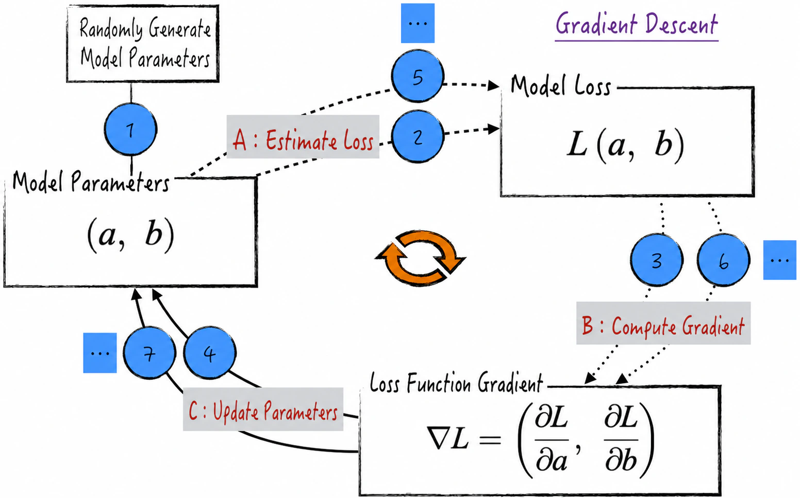
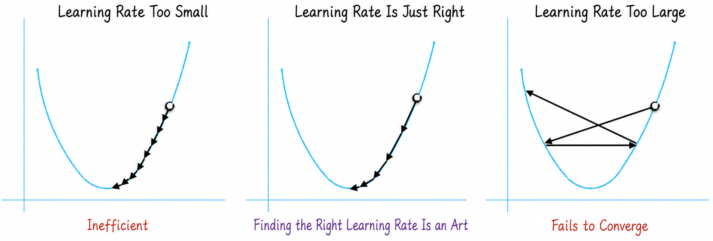
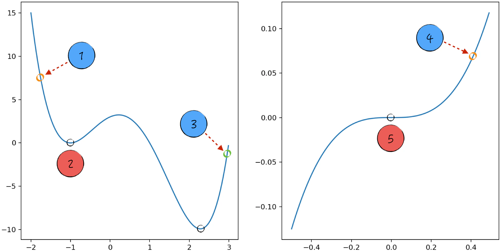

## 6.2 Gradient Descent

For the loss function $L$, suppose the initial point is $a_0,b_0$. Move these two coordinates slightly to obtain $a_1,b_1$. By the Taylor series[^taylor-series], temporarily retaining only the first-order derivatives[^higher-order], we obtain Equation (6-3), where $\Delta a=a_1-a_0$ and $\Delta b=b_1-b_0$.

$$
\Delta L=L(a_1,b_1)-L(a_0,b_0)\approx\frac{\partial L}{\partial a}\Delta a+\frac{\partial L}{\partial b}\Delta b
\tag{6-3}
$$

Now let

$$
(\Delta a,\Delta b)=-\eta\left(\frac{\partial L}{\partial a},\frac{\partial L}{\partial b}\right)
\tag{6-4}
$$

where $\eta>0$. It follows that $\Delta L\approx-\eta[(\partial L/\partial a)^2+(\partial L/\partial b)^2]\leq0$. Moving the parameters according to Equation (6-4) therefore always decreases the loss, exactly as desired. If this movement is repeated, it can be proved mathematically that the loss function eventually reaches its minimum, much as the egg rolls to the bottom of the wok. This gives the parameter-update equations in Equation (6-5).

$$
\begin{aligned}
a_{k+1}&=a_k-\eta\frac{\partial L}{\partial a}\\
b_{k+1}&=b_k-\eta\frac{\partial L}{\partial b}
\end{aligned}
\tag{6-5}
$$

Another analogy captures the central idea of gradient descent. Imagine standing on a mountainside and trying to find the lowest valley. Equation (6-5) acts like a navigation system that directs you downhill. If the terrain slopes downward—the partial derivative $\partial L/\partial a<0$—you take a step in that direction. If the terrain slopes upward—$\partial L/\partial a>0$—you step back to avoid moving higher.

Mathematically, the vector $\nabla L=(\partial L/\partial a,\partial L/\partial b)$ is called the gradient of the loss function $L$, which is why the algorithm in Equation (6-5) is called gradient descent. It can also be proved that the negative gradient points in the direction in which the function value decreases most rapidly, making gradient descent the most efficient way to “descend.”

In summary, gradient descent consists of three main steps: calculate the model loss from the current parameters and training data; calculate the current gradient of the loss function; and use the gradient to update the model parameters iteratively, as shown in Figure 6-2.

Strictly speaking, the gradient of a multivariable differentiable function $L$ at a point $P$ is a vector composed of the partial derivatives of $L$ with respect to each variable at $P$. In artificial intelligence, particularly neural networks, however, the term “gradient of a variable”[^variable-gradient] is commonly used for brevity to refer to that variable's partial derivative, or an estimate of it, under specific conditions.

### 6.2.1 Practical Tips for Using the Algorithm

The parameter $\eta>0$ in Equation (6-5) controls the magnitude of the parameter updates. In the literature, $\eta$ is called the learning rate. It is an important hyperparameter in model training and directly affects the algorithm's correctness and efficiency, as shown in Figure 6-3.

- On the one hand, $\eta$ must not be too large. Mathematically, Equation (6-3) is a first-order Taylor expansion and therefore an approximation. It holds only when the learning rate is small—that is, when $\Delta a$ and $\Delta b$ are small. Intuitively, taking steps that are too large can make the algorithm oscillate back and forth without reaching the lowest point, reducing its accuracy.
- On the other hand, $\eta$ should not be too small. If it is, the parameters barely change during each iteration, reducing efficiency and requiring a long time to reach the lowest point.

In artificial intelligence, choosing an appropriate learning rate[^learning-rate] is both an art and an active area of academic research. Many optimization algorithms and engineering techniques have emerged in this area. [Section 11.5.1](/books/deconstructing_LLM/chapter-11/11-5#section-11-5-1) revisits the issue in a specific context.

As Equation (6-5) shows, gradient descent uses the same learning rate to update different parameters. When the partial derivatives of the loss with respect to those parameters differ substantially, however, the parameters may converge at very different rates. Some may rapidly approach their optimal values while others move much more slowly, adversely affecting optimization.

As a simple example, consider the loss function $L(a,b)=1/n\sum_{i=1}^{n}(y_i-ax_i-b)^2$, whose gradient is

$$
\begin{aligned}
\frac{\partial L}{\partial a}&=-\frac{2}{n}\sum_{i=1}^{n}x_i(y_i-ax_i-b)\\
\frac{\partial L}{\partial b}&=-\frac{2}{n}\sum_{i=1}^{n}(y_i-ax_i-b)
\end{aligned}
\tag{6-6}
$$

If the absolute values of $x_i$ are large—that is, if $x_i$ varies over a large range—then the magnitude of $\partial L/\partial a$ will be far greater than that of $\partial L/\partial b$. The same learning rate will consequently be too large for parameter $a$ but too small for parameter $b$, impairing the algorithm's performance.

Variable normalization can address this problem and, to some extent, reduce differences in convergence rates. Normalization maps the ranges of different variables onto similar scales, making the loss function vary more uniformly along the directions of its parameters. This helps keep the update steps for different parameters relatively balanced and improves convergence efficiency.

### 6.2.2 Limitations: Local Optima and Saddle Points

Although gradient descent is highly useful for optimizing model parameters, it has an important limitation. In theory, it guarantees convergence only to a local minimum or a saddle point, not to the global minimum.

- On the left side of Figure 6-4, starting at position 1 makes the algorithm more likely to stop at position 2, a local minimum, rather than at the global minimum.
- On the right side of Figure 6-4, starting at position 4 may cause the algorithm to stop at position 5, a saddle point. Even if it does not stop there, it may linger near position 5 for a long time because the surrounding gradients are close to 0. Training can consequently become extremely prolonged, and the apparent lack of progress may lead us to terminate it prematurely by mistake.

If position 3 is selected as the starting point, the algorithm can reach the minimum successfully. This suggests that trying multiple starting points can help mitigate the limitations of gradient descent. For the loss function $L(a,b)$, for example, generate several random sets of initial parameters—that is, several pairs $a_0,b_0$—and apply gradient descent to each until its function value converges to a stable value. Select the smallest of these converged values as the function's minimum.

Although this approach partly addresses local optima and saddle points, it has an obvious drawback: the computational cost is extremely high because gradient descent must be run repeatedly from different starting points. The strategy may be acceptable for relatively simple models or small datasets. In artificial intelligence, however, models continue to grow. Large language models commonly contain billions or even tens of billions of parameters, and even a single training run requires enormous amounts of time and computational resources, making repeated runs impractical.

Gradient descent must therefore be improved to run more efficiently. Among the many optimization algorithms, the most fundamental is stochastic gradient descent. It introduces randomness into gradient calculation, making the model more likely to escape local minima and saddle points. [Section 6.4](/books/deconstructing_LLM/chapter-6/6-4) discusses stochastic gradient descent and its variants.

[^taylor-series]: Recall the first-order Taylor expansion. Suppose $f(x_1,x_2,\cdots,x_n)$ is once differentiable. When $\boldsymbol{x}$ is very close to $\boldsymbol{a}$, $f(\boldsymbol{x})\approx f(\boldsymbol{a})+\sum_{i=1}^{n}\frac{\partial f(\boldsymbol{a})}{\partial x_i}(x_i-a_i)$. When $\boldsymbol{x}$ is far from $\boldsymbol{a}$, however, the approximation error is large.
[^higher-order]: Retaining higher-order derivatives produces other algorithms for solving optimization problems, such as the conjugate gradient method, which uses second-order derivative information. Such algorithms may converge faster for particular problems, but they impose stricter requirements on the loss function and have greater computational complexity. They are unsuitable for neural networks and distributed machine learning and are therefore not examined in depth here.
[^variable-gradient]: This concept is important in practice because optimization algorithms must calculate or estimate the partial derivative of the loss with respect to a parameter in order to guide that parameter's update. Accurately describing the calculation of every partial derivative of a multivariable function would make the mathematical wording cumbersome. The term “gradient of a variable” keeps the expression concise and makes parameter updating and optimization more convenient in practice.
[^learning-rate]: In practice, an appropriate learning rate keeps the product of the learning rate and the gradient within a suitable range. Consequently, both the learning rate and the parameter gradients may need to be adjusted dynamically.
