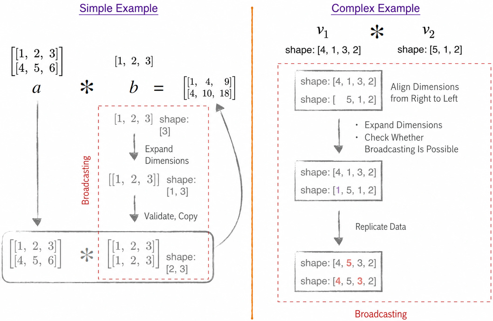
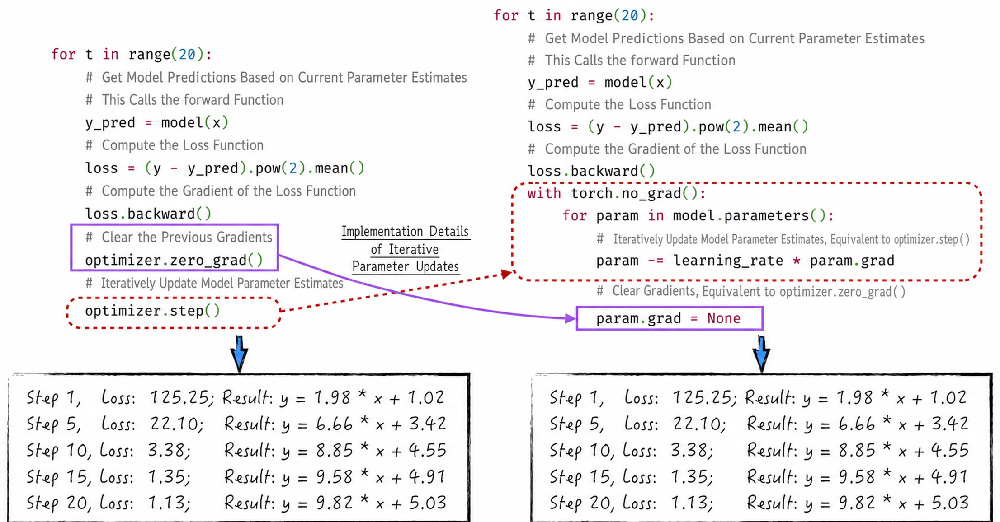

## 6.3 Implementing Gradient Descent in Code

Python is a high-level programming language widely appreciated for being easy to understand and write. Its execution speed is relatively slow, however, making it inefficient for large amounts of numerical computation. In production, efficient optimization algorithms are therefore rarely implemented from scratch directly in Python. Instead, another strategy combines Python's ease of use with efficient numerical computation.

Low-level languages such as C or C++ implement the high-performance numerical operations, and those low-level functions are then wrapped as Python objects so that users can interact with them easily through Python.

NumPy, introduced in [Section 3.2.1](/books/deconstructing_LLM/chapter-3/3-2#section-3-2-1), is a typical example of this strategy. PyTorch, introduced below, uses a similar architecture. Standing on the “shoulders” of these tools makes optimization algorithms much easier to implement. The following discussion shows how to implement gradient descent with PyTorch and use it to train a linear regression model.

### 6.3.1 PyTorch Fundamentals

A craftsperson must sharpen their tools before doing good work. Before implementing gradient descent, we first examine the powerful tool PyTorch. PyTorch is a popular open-source machine learning framework widely used to build, train, and deploy neural network models. Its flexibility, dynamic computation graphs, and excellent GPU support have made it a preferred framework in the field of neural networks.

The fundamental data structure in PyTorch is the tensor; see [Section 2.1](/books/deconstructing_LLM/chapter-2/2-1) for its mathematical foundation. Listing 6-1 shows several ways to create tensors.

#### Listing 6-1 Creating Tensors ([Complete Code](https://github.com/GenTang/regression2chatgpt/blob/en/ch06_optimizer/pytorch_tutorial.ipynb))

```python
# Create tensors with tensor factory functions
zeros = torch.zeros(2, 3)
tensor([[0., 0., 0.],
        [0., 0., 0.]])

ones = torch.ones(2, 3)
tensor([[1., 1., 1.],
        [1., 1., 1.]])

torch.manual_seed(1024)
random = torch.rand(3, 4)
tensor([[0.8090, 0.7935, 0.2099, 0.9279],
        [0.8136, 0.7422, 0.4769, 0.4955],
        [0.3602, 0.1178, 0.7852, 0.0228]])

# Create a tensor from a Python object
data = [[2, 3, 4], [1, 0, 1]]
t_data = torch.tensor(data)
tensor([[2, 3, 4],
        [1, 0, 1]])

## Create a tensor from a NumPy object
import numpy as np

n_data = np.array(data)
tn_data = torch.from_numpy(n_data)
tensor([[2, 3, 4],
        [1, 0, 1]])

## The NumPy bridge means that changes to the NumPy object propagate to the tensor
n_data += 1
torch.all(torch.from_numpy(n_data) == tn_data)
tensor(True)
```

As [Section 2.1.6](/books/deconstructing_LLM/chapter-2/2-1#section-2-1-6) explains, a tensor's shape is a crucial concept. It defines the tensor's number of dimensions and the size of each dimension. In practice, a series of functions can change a tensor's shape to meet the requirements of different operations, as shown in Listing 6-2.

#### Listing 6-2 Changing the Shape of a Tensor ([Complete Code](https://github.com/GenTang/regression2chatgpt/blob/en/ch06_optimizer/pytorch_tutorial.ipynb))

```python
# Add or remove tensor dimensions
a = torch.rand(3, 4)  # (3, 4)
## Add a dimension
b = a.unsqueeze(0)    # (1, 3, 4)
## Remove a dimension
c = b.squeeze(0)      # (3, 4)
## The data is the same, but the dimensions differ
print(torch.all(c.eq(b)))   # tensor(True)
print(c.shape == b.shape)   # False

# Change the tensor's shape
data = torch.tensor(range(0, 10))  # tensor([1, 2, 3, 4, 5, 6, 7, 8, 9])
view1 = data.view(2, 5)
tensor([[0, 1, 2, 3, 4],
        [5, 6, 7, 8, 9]])
transpose1 = view1.T
tensor([[0, 5],
        [1, 6],
        [2, 7],
        [3, 8],
        [4, 9]])
## Non-contiguous objects cannot be viewed with view
print(view1.is_contiguous(), transpose1.is_contiguous())
True False
## The following operation raises an error
view2 = transpose1.view(1, 10)
```

1. Lines 4–6 of Listing 6-2 use `unsqueeze` and `squeeze` to add or remove tensor dimensions. These operations do not change the data actually stored by the tensor, nor do they substantially alter its shape. They merely add an empty dimension to, or remove one from, the tensor's shape. Lines 8 and 9 show the resulting changes.
2. The `view` function changes a tensor's shape, as lines 12–15 demonstrate. It can be used only with tensors stored contiguously[^contiguous]. A non-contiguous tensor must instead use `reshape`. Although these functions have similar purposes, their computational costs differ substantially: `reshape` is far more expensive than `view`. In practice, `view` should therefore be preferred whenever possible.

Tensor operations fall into two categories: element-wise operations and matrix multiplication. Both are important when processing data and constructing neural network models. Listing 6-3 demonstrates these operations and introduces PyTorch's broadcasting semantics, which play an important role when tensors have different shapes.

#### Listing 6-3 Common Tensor Operations ([Complete Code](https://github.com/GenTang/regression2chatgpt/blob/en/ch06_optimizer/pytorch_tutorial.ipynb))

```python
# Element-wise operations
twos = torch.ones(2, 2) * 2
tensor([[2., 2.],
        [2., 2.]])
powers = twos ** torch.tensor([[1, 2], [3, 4]])
tensor([[ 2.,  4.],
        [ 8., 16.]])

## Tensor broadcasting
a = torch.tensor(range(1, 7)).view(2, 3)
tensor([[1, 2, 3],
        [4, 5, 6]])
b = torch.tensor(range(1, 4)).view(3)
tensor([1, 2, 3])
print(a * b)
tensor([[ 1,  4,  9],
        [ 4, 10, 18]])
## A more complex broadcasting example
a = torch.ones(4, 1, 3, 2)
b = a * torch.rand(5, 1, 2)
print(b.shape)
torch.Size([4, 5, 3, 2])

# Matrix operations
mat1 = torch.randn(3, 4)       # (3, 4)
mat2 = torch.randn(4, 5)       # (4, 5)
re = mat1 @ mat2               # (3, 5)
## Broadcasting for matrix operations
mat1 = torch.randn(5, 1, 3, 4) # (5, 1, 3, 4)
mat2 = torch.randn(8, 4, 5)    # (8, 4, 5)
re = mat1 @ mat2               # (5, 8, 3, 5)
```

1. Element-wise operations require the two tensors to have the same shape, as lines 2–7 of Listing 6-3 show. In practice, however, operations between tensors of different shapes are often necessary. PyTorch therefore provides broadcasting, which permits element-wise operations on differently shaped tensors under certain conditions, as lines 9–22 demonstrate.
2. Broadcasting follows a relatively complex procedure, shown in Figure 6-5. First, compare the dimensions of the two tensors from last to first. Next, add any missing dimensions, much as `unsqueeze` does. Then check the broadcasting rule: the corresponding dimensions must either be equal or one of them must equal 1. Finally, copy the data to perform the broadcast operation.
3. Broadcasting applies not only to element-wise operations but also to tensor matrix multiplication. The difference is that, during matrix multiplication, broadcasting acts only on the leading dimensions and does not involve the final two dimensions, as shown in lines 29–31.



### 6.3.2 Using PyTorch's High-Level Functions

This section explores how PyTorch's high-level functions can implement gradient descent. As [Section 6.2](/books/deconstructing_LLM/chapter-6/6-2) explains, implementation involves three key steps.

1. Calculate the model loss from the current parameters and training data.
2. Calculate the current gradient of the loss function. The calculation depends on the mathematical form of the model's loss function, the training data used to calculate the gradient, and the current parameter estimates. PyTorch's encapsulated backpropagation algorithm[^autograd] can perform this step.
3. Use the gradient to update the model parameters. After calculating the current gradient, use it to iteratively update the parameter estimates. An optimization function provided by PyTorch, such as `torch.optim.SGD`, can perform this step.

We begin with preparatory work: generating the training data and defining the model structure. Although the code is relatively simple, two points merit attention.

1. Lines 2–4 of Listing 6-4 normalize the variable `x` to ensure the stability of gradient descent. Readers can easily modify the code to omit this normalization, but doing so reduces the algorithm's stability and may prevent convergence. In practical modeling, almost every variable is normalized to help ensure that the model is robust and reliable.
2. Lines 9–28 define the linear regression model by subclassing `torch.nn.Module`. The implementation must override two core functions: `__init__` and `forward`. The `__init__` function defines the parameters required by the model and their initial values, while `forward` describes how those parameters produce the model's predictions[^forward].

#### Listing 6-4 Defining the Model and Generating Training Data ([Complete Code](https://github.com/GenTang/regression2chatgpt/blob/en/ch06_optimizer/gradient_descent.ipynb))

```python
# Generate training data
x_origin = torch.linspace(100, 300, 200)
# Normalize x; otherwise, gradient descent is prone to instability
x = (x_origin - torch.mean(x_origin)) / torch.std(x_origin)
epsilon = torch.randn(x.shape)
y = 10 * x + 5 + epsilon

# Define the function by subclassing Module so that PyTorch's high-level functions can be used
class Linear(torch.nn.Module):
    def __init__(self):
        """
        Define the parameters of the linear regression model: a and b.
        """
        super().__init__()
        self.a = torch.nn.Parameter(torch.zeros(()))
        self.b = torch.nn.Parameter(torch.zeros(()))

    def forward(self, x):
        """
        Use the current parameter estimates to obtain the model prediction.
        Parameters
        ----------
        x: torch.tensor, the variable x.
        Returns
        -------
        y_pred: torch.tensor, the model prediction.
        """
        return self.a * x + self.b

    def string(self):
        """
        Return the current model result.
        """
        return f'y = {self.a.item():.2f} * x + {self.b.item():.2f}'
```

We now turn to the core implementation in Listing 6-5: defining the loss function, calculating its gradient, and iteratively updating the parameter estimates. These steps are relatively fixed and apply to almost every model. The instruction on line 14 to “clear the previous gradient” may puzzle some readers. It is closely related to the mechanism of backpropagation, which [Chapter 7](/books/deconstructing_LLM/chapter-7) explains in detail.

#### Listing 6-5 Gradient Descent ([Complete Code](https://github.com/GenTang/regression2chatgpt/blob/en/ch06_optimizer/gradient_descent.ipynb))

```python
# Define the model
model = Linear()
# Select the optimization algorithm
learning_rate = 0.1
optimizer = torch.optim.SGD(model.parameters(), lr=learning_rate)

for t in range(20):
    # Use the current parameter estimates to obtain the model prediction
    # This calls the forward function
    y_pred = model(x)
    # Calculate the loss
    loss = (y - y_pred).pow(2).mean()
    # Clear the previous gradient
    optimizer.zero_grad()
    # Trigger backpropagation to calculate the loss-function gradient
    loss.backward()
    # Iteratively update the model-parameter estimates
    optimizer.step()
```

This section implemented gradient descent with PyTorch's high-level functions. Even so, those functions still conceal the algorithm's core challenges. Two functions play key roles. First, `optimizer.step()` performs the iterative parameter update. Its mechanics are relatively simple and can be implemented readily, as shown in Figure 6-6. Second, `loss.backward()` performs backpropagation. Its implementation is considerably more complex and will be discussed in detail in [Chapter 7](/books/deconstructing_LLM/chapter-7).



[^contiguous]: C-contiguous storage is a hardware-related concept. Put simply, it means that data is stored in adjacent memory locations, which can substantially improve reading and computation speed. The details of tensor storage in memory lie beyond the scope of this book. Interested readers can find more information in the official PyTorch documentation.
[^autograd]: In PyTorch, the algorithm's formal name is autograd, or automatic differentiation. Here, it refers to the same algorithm as backpropagation.
[^forward]: Some readers may wonder why the model's prediction function is called `forward`. In neural networks, calculating model predictions and evaluating the loss is commonly called forward propagation, while updating model parameters is called backward propagation. PyTorch, an open-source tool used primarily for neural networks, retains this naming convention. [Chapter 7](/books/deconstructing_LLM/chapter-7) examines forward and backward propagation in detail.
