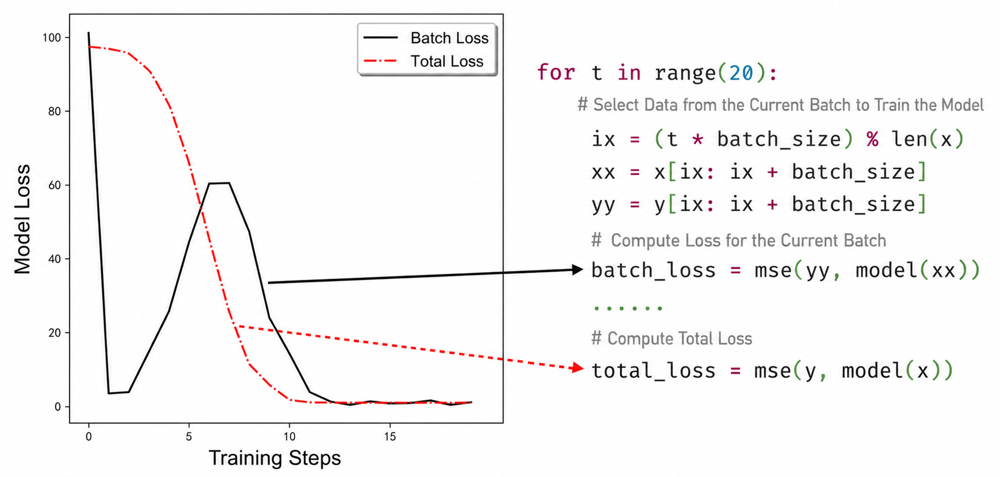
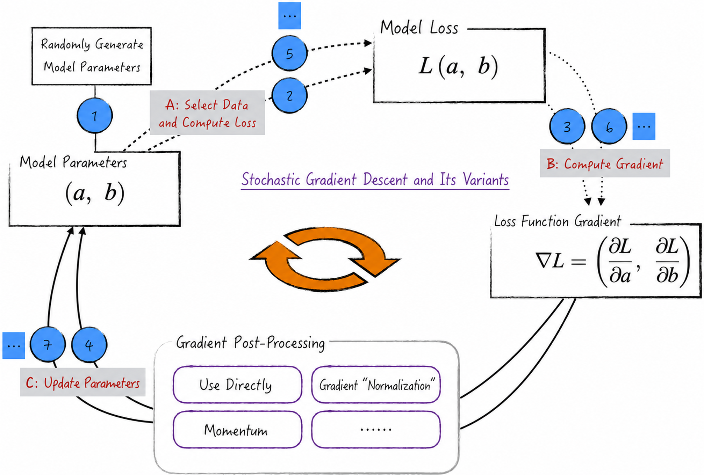
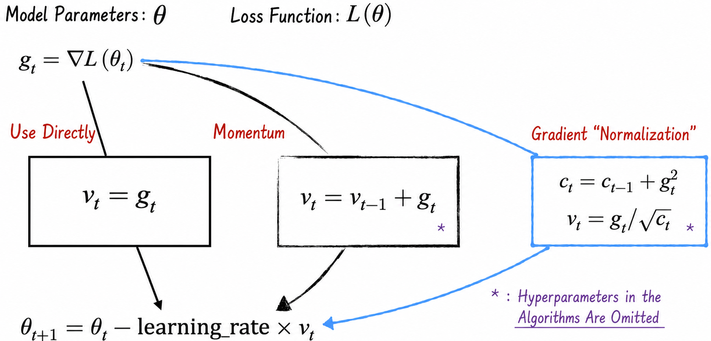

## 6.4 Stochastic Gradient Descent: A More Efficient Algorithm

Although gradient descent is elegant in theory, it often encounters bottlenecks in practice. To illustrate, let $L_i$ denote the model loss at point $i$: $L_i=(y_i-ax_i-b)^2$. Summing the losses over all data points gives the overall loss $L=1/n\sum_{i=1}^{n}L_i$. In other words, the model's loss function is the average loss over its data points, a view that applies to most models[^average-loss].

Calculating the gradient of the overall loss gives $\nabla L=1/n\sum_{i=1}^{n}\nabla L_i$. Thus, the loss-function gradient is the average of the gradients at all data points. With a large dataset, however, calculating this average takes considerable time. Stochastic gradient descent (SGD) can accelerate the process.

### 6.4.1 Algorithm Details

The central idea of stochastic gradient descent is to select a small batch of data points randomly at each iteration, calculate their gradients, and use the batch's average gradient in place of the gradient of the overall loss[^sample-gradient].

To describe the algorithm precisely, introduce a hyperparameter called the batch size, denoted $m$. At each iteration, randomly select $m$ observations, denoted $I_1,I_2,\cdots,I_m$.

Use their average gradient to approximate the gradient of the overall loss: $\nabla L=1/n\sum_{i=1}^{n}\nabla L_i\approx1/m\sum_{j=1}^{m}\nabla L_{I_j}$. This yields the new parameter-update equations:

$$
\begin{aligned}
a_{k+1}&=a_k-\frac{\eta}{m}\sum_{j=1}^{m}\frac{\partial L_{I_j}}{\partial a}\\
b_{k+1}&=b_k-\frac{\eta}{m}\sum_{j=1}^{m}\frac{\partial L_{I_j}}{\partial b}
\end{aligned}
\tag{6-7}
$$

Using every data point once in stochastic gradient descent is called one epoch of model training. Another common hyperparameter, the number of epochs, specifies how many times all the data will be used and thereby controls the number of cycles of stochastic gradient descent. In other words, it determines how many times the update in Equation (6-7) is repeated.

Some machine learning textbooks and academic literature further distinguish stochastic gradient descent, where $m=1$, from mini-batch gradient descent, where $m>1$. The two methods differ little in their central idea: both approximate the gradient through random sampling in order to update parameters and optimize the model efficiently.

In practice, an appropriate batch size is selected according to the nature of the problem and the scale of the data to achieve the best training results. For conceptual clarity and concision, this book uses stochastic gradient descent as an umbrella term for this class of methods.

Stochastic gradient descent is more efficient than gradient descent because calculating a mini-batch gradient is much faster than calculating the full gradient. Estimating the gradient from a mini-batch introduces noise, but experience shows that this noise benefits optimization by helping the model escape the “trap” of a local optimum and gradually approach globally optimal parameters.

### 6.4.2 Code Implementation

The implementation of stochastic gradient descent resembles that of gradient descent. The difference is that each gradient calculation must “randomly” select a subset of the data. Listing 6-6 shows the implementation.

1. Line 2 introduces the hyperparameter `batch_size`, which controls the amount of data in each batch. An appropriate value is crucial to efficiency and stability. A value that is too large may reduce execution efficiency, while one that is too small may make the algorithm excessively random and impair convergence stability. The choice must reflect the particular model, the application, and experience in the relevant field.
2. Lines 11–13 demonstrate one way to select batch data. This is also one of the principal differences between stochastic and ordinary gradient descent. Randomness can be introduced in many ways, including random-number generation. Here, only one classical approach is shown: divide the data sequentially into batches.

#### Listing 6-6 Stochastic Gradient Descent ([Complete Code](https://github.com/GenTang/regression2chatgpt/blob/en/ch06_optimizer/stochastic_gradient_descent.ipynb))

```python
# Define the amount of data used in each batch
batch_size = 20
# Define the model
model = Linear()
# Select the optimization algorithm
learning_rate = 0.1
optimizer = torch.optim.SGD(model.parameters(), lr=learning_rate)

for t in range(20):
    # Select the current batch of data for model training
    ix = (t * batch_size) % len(x)
    xx = x[ix: ix + batch_size]
    yy = y[ix: ix + batch_size]
    yy_pred = model(xx)
    # Calculate the loss on the current batch
    loss = (yy - yy_pred).pow(2).mean()
    # Clear the previous gradient
    optimizer.zero_grad()
    # Calculate the loss-function gradient
    loss.backward()
    # Iteratively update the model-parameter estimates
    optimizer.step()
    # Note: loss records the model loss on the current batch and therefore fluctuates substantially
    print(f'Step {t + 1}, Loss: {loss: .2f}; Result: {model.string()}')
```

During stochastic gradient descent, the model's overall loss is normally used to monitor the algorithm. Note, however, that `loss` on line 16 of Listing 6-6 is the model loss on a mini-batch. Because it depends on only a small amount of data, it is extremely unstable across iterations and is unsuitable as the primary indicator of the algorithm's progress.

To monitor progress more accurately, estimate the overall model loss on a larger dataset—for example, calculate it over the entire training set, as shown in Figure 6-7. This evaluation is more stable and reflects training progress more comprehensively.



### 6.4.3 Further Improvements

Recall the design of stochastic gradient descent. Although it relaxes strict mathematical rigor and uses the average gradient of a mini-batch to approximate the mathematically defined gradient, it performs remarkably well in practice. Academically, this algorithm is called vanilla SGD. The same idea can be extended: gradients can be processed more deeply on top of vanilla SGD to improve the algorithm further, as shown in Figure 6-8.



Figure 6-8 presents three approaches to processing gradients: direct use, momentum, and gradient “normalization.”

1. **Direct use**: This is the basic form of vanilla stochastic gradient descent, which directly uses the average gradient of a mini-batch to update the model parameters.
2. **Momentum**: In the physical world, momentum describes an object's tendency to continue moving in its current direction. By analogy, SGD with momentum introduces a momentum term that allows parameter updates to accumulate information from previous gradients; Figure 6-9 gives the specific formulas. This helps the algorithm escape local minima and converge more quickly toward the global minimum. Representative algorithms include Momentum SGD and Nesterov momentum.



3. **Gradient “normalization”**: The preceding methods use the same learning rate globally; see [Section 6.2.1](/books/deconstructing_LLM/chapter-6/6-2#section-6-2-1). This may cause different parameters to converge at inconsistent rates. To address the problem, an algorithm can perform a normalization-like transformation directly on the gradients, balancing the update efficiency of the parameters more effectively. Representative algorithms include Adagrad and RMSprop.

Combining momentum with gradient normalization yields a powerful optimization algorithm: Adam, or adaptive moment estimation. Adam is very common in practice, particularly in deep learning. It combines the ideas of momentum and gradient normalization while adaptively adjusting the learning rate and momentum parameters, allowing model parameters to be updated more efficiently during training.

The algorithm's details are quite involved and lie beyond the scope of this book, so they are not discussed further here.

[^average-loss]: For regression models, this conclusion follows directly. For classification models such as logistic regression, a simple mathematical transformation of the likelihood function—first taking its logarithm, then negating the result—produces the same conclusion.
[^sample-gradient]: This is entirely reasonable mathematically. From a statistical perspective, averaging all data points is not substantially superior to random sampling. As with linear regression parameter estimates, both results are random variables whose expected value is the true gradient; the former simply has a narrower confidence interval.
