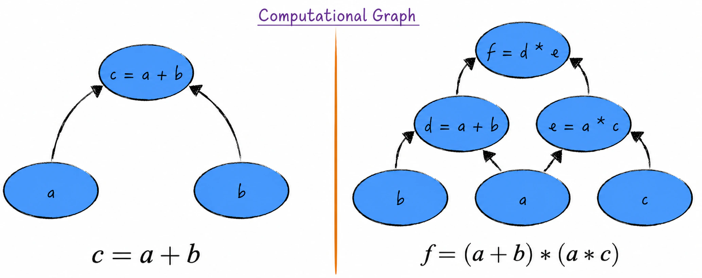
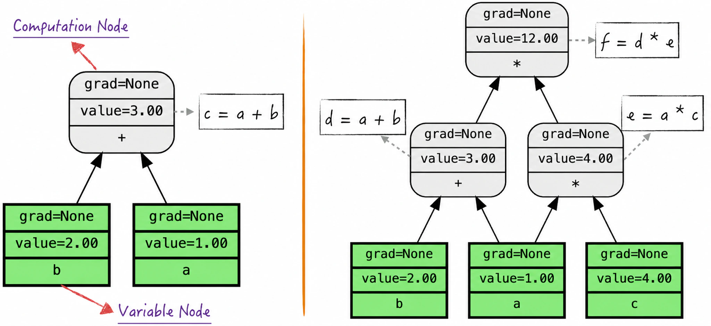

## 7.1 Computational Graphs and Forward Pass

Backpropagation, also known as automatic differentiation—called autograd in PyTorch—is one of the core technologies of neural networks. At heart, it is a technique for calculating function gradients quickly, making deep learning computationally feasible. For large-scale neural networks in particular, backpropagation can accelerate training with gradient descent by as much as ten million times compared with other naive implementations.

Although PyTorch implements backpropagation extremely well, real-world complexity requires its code to address many engineering details beyond the algorithm's core steps, including fault tolerance, generality, and complex matrix operations.

This complete implementation is a double-edged sword. On the one hand, it is easy to use and calculates gradients efficiently. On the other, the many details can obscure the algorithm's central idea for beginners reading the code, leaving them lost in a dense forest of complexity.

To make the idea easier to understand, this chapter implements a simple backpropagation algorithm in Python. The implementation is based on a computational graph. Before examining backpropagation in depth, we therefore introduce computational graphs and construct a simple one. Building the system step by step will clarify the algorithm's principles and implementation and establish a solid foundation for the chapters that follow.

### 7.1.1 What Is a Computational Graph?

A computational graph is a highly useful representation of mathematical operations: it expresses a calculation as a directed acyclic graph (DAG). A computational graph consists of three parts.

1. **Basic operations**: The graph defines simple mathematical operations[^basic-operations], such as addition, subtraction, multiplication, division, and exponentiation. These form the building blocks for complex calculations. If the set of basic operations is sufficiently complete, their combinations can express any complex mathematical operation.
2. **Nodes**: Each node represents a variable participating in the calculation. In practice, these variables may be scalars, vectors, matrices, and so on. For concision, the code examples in this chapter implement a computational graph that supports scalars only.
3. **Directed edges**: If a basic operation produces variable $y$ from variable $x$, the graph contains a directed edge from $x$ to $y$, and conversely. The definition of directed edges is therefore closely related to the basic operations supported by the graph.

Consider the simple expression $c=a+b$. Its computational graph contains three nodes: $a$, $b$, and $c$. As shown on the left side of Figure 7-2, one edge points from $a$ to $c$ and another from $b$ to $c$. Now consider the more complex expression $f=(a+b)*(a*c)$. A combination of basic operations can express the calculation, and its graph can be constructed in the same way, as shown on the right side of Figure 7-2. The graph introduces two intermediate variables, $d$ and $e$, to combine the basic operations.



Combining basic operations makes computational graphs a flexible and powerful representation of mathematical calculations. They can clearly express anything from simple operations to complex mathematical models, and a forward pass through the graph produces the final result.

### 7.1.2 Code Implementation

To construct a computational graph, define a class called `Scalar` to represent its nodes, as shown in Listing 7-1. The following attributes are central to graph construction.

- `value`: Records the numerical value of a node.
- `prevs`: Records the starting nodes of the directed edges pointing to the current node. To facilitate the later implementation of backpropagation, the code records these starting nodes rather than the edges themselves.

Next, define class methods for the basic operations supported by the graph, including addition, subtraction, multiplication, and division. For addition, lines 13–22 of Listing 7-1 create a new `Scalar` object to store the result and record the starting nodes of the directed edges in `prevs`, indicating that the result was obtained by adding two nodes.

#### Listing 7-1 Defining the Scalar Class ([Complete Code](https://github.com/GenTang/regression2chatgpt/blob/en/ch07_autograd/utils.py))

```python
# Define Scalar to demonstrate the implementation details of computational graphs and autograd
class Scalar:
    def __init__(self, value, prevs=[], op=None, label='', requires_grad=True):
        # The value of the node
        self.value = value
        # The node label and corresponding operation, used for visualization
        self.label = label
        self.op = op
        # The node's predecessors
        self.prevs = prevs
        ......

    def __add__(self, other):
        """
        Define addition; self + other triggers this function.
        """
        if not isinstance(other, Scalar):
            other = Scalar(other, requires_grad=False)
        # output = self + other
        output = Scalar(self.value + other.value, [self, other], '+')
        ......
        return output
```

With `Scalar` in place, computational graphs can be defined and visualized freely, as shown in Listing 7-2. A defined graph supports a forward pass: calculating the result of a mathematical expression. Lines 16–27 construct a graph similar to Figure 7-2, assign specific values to the variables, and calculate forward through the graph until the final result is obtained.

#### Listing 7-2 Defining a Computational Graph and Performing Forward Pass ([Complete Code](https://github.com/GenTang/regression2chatgpt/blob/en/ch07_autograd/autograd.ipynb))

```python
# Define a function for drawing a computational graph
def draw_graph(root, direction='forward'):
    """
    Visualize the computational graph whose root is root.
    Parameters
    ----------
    root: Scalar, the root of the computational graph
    direction: str, either forward or backward
    Returns
    -------
    re: Digraph, the computational graph
    """
    ......

# A simple computational graph
a = Scalar(1.0, label='a')
b = Scalar(2.0, label='b')
c = a + b
draw_graph(c)
# A slightly more complex computational graph
a = Scalar(1.0, label='a')
b = Scalar(2.0, label='b')
c = Scalar(4.0, label='c')
d = a + b
e = a * c
f = d * e
draw_graph(f)
```

Figure 7-3 visualizes the forward pass. Its nodes fall into two categories: operation nodes and variable nodes. An operation node represents a mathematical operation; on the left side of Figure 7-3, operation node $c$ is produced by adding nodes $a$ and $b$. Variable nodes are the leaf nodes of the computational graph and usually represent model parameters in practice. Directed edges indicate the direction in which values propagate, much like the flow from input to output in a neural network.



[^basic-operations]: Different computational graphs support different basic operations. Some also define special functions as basic operations. PyTorch, for example, treats commonly used loss functions such as mean squared error and cross-entropy as basic operations.
